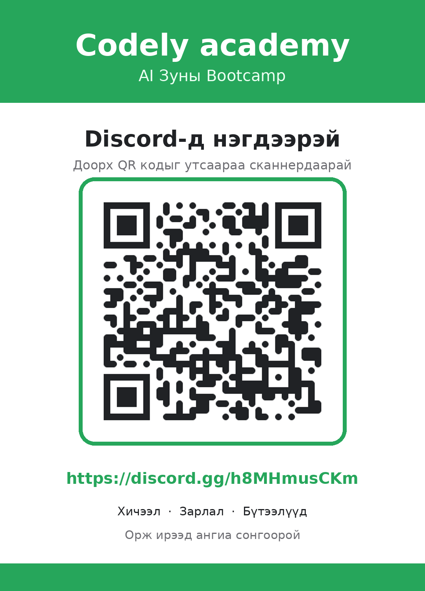

# 🚀 Lab 1 — Танилцъя & Эхний вэбээ интернэтэд тавья

> 🎯 **Today's promise:** Lab дуусахад таны гарт **live вэбсайтын линк (URL)** байх ба та **structured prompt** бичиж сурсан байна.

|                    |                                                        |
| ------------------ | ------------------------------------------------------ |
| 🎓 **Track**       | Adults (бүтээмж + бизнес)                              |
| ⏱️ **Duration**    | 4 цаг (240 мин)                                        |
| 🧩 **Build today** | Portfolio website → deploy → QR                        |
| 📱 **Discord**     | [discord.gg/h8MHmusCKm](https://discord.gg/h8MHmusCKm) |

---

## ✅ Outcomes — Өнөөдөр юу хийж үзэх вэ?

- Гараараа энгийн **HTML** хуудас бичиж танилцъя (`h1`, `p`, `img`).
- **Google AI Studio**-д prompt бичээд бүтэн **portfolio website** үүсгэнэ.
- Сайтаа **deploy** хийж, **QR**-аар share хийнэ.
- AI-д / олон нийтэд тавьж **болохгүй 3 зүйлийг** нэрлэнэ (AI Reality Check).

---

## 🧭 Хичээлийн задаргаа

> Доорх сэдвүүд дээр дарж **шууд шилжинэ.**

| Цаг         | Сэдэв                                                                                                            |
| ----------- | ---------------------------------------------------------------------------------------------------------------- |
| 00:00–00:20 | [🎬 Intro](https://docs.google.com/presentation/d/1MZa9MbeeZ4we3Kulk5tbjqmMftkk9MaqCpXOlCkZzeI/edit?usp=sharing) |
| 00:30–00:50 | [🗺️ Roadmap](#sec-roadmap)                                                                                       |
| 00:50–01:00 | [📱 Discord-д нэгдэх](#sec-discord)                                                                              |
| 01:00–01:05 | ☕ Break (5 мин)                                                                                                 |
| 01:05–01:40 | [👩‍💻 First code: HTML](#sec-html)                                                                                 |
| 01:40–02:10 | [🎨 Exercise: HTML intro + зорилго](#sec-exercise)                                                               |
| 02:10–02:20 | ☕ Break (10 мин)                                                                                                |
|             |

</details>

---

<details open id="sec-roadmap">
<summary><strong>🗺️ Хичээлийн - Roadmap</strong></summary>

> 📅 **3 долоо хоног · долоо хоног бүр 3 хичээл** (2 online ~1.5–2 цаг + 1 lab 4 цаг). Дасгал бүрийг **өөрийн жинхэнэ санаа / бизнес** дээр хийнэ — хийсвэр жишээ биш.

| Week   | Сэдэв             | Юу сурах вэ                                                                                                 | 🏁 Долоо хоногийн үр дүн                                                     |
| ------ | ----------------- | ----------------------------------------------------------------------------------------------------------- | ---------------------------------------------------------------------------- |
| **W1** | AI Foundations    | AI юу вэ & хэрхэн ажилладаг (LLM, model, training data) · Анхны HTML код · structured prompt · agentic эрин | Интернэтэд **live portfolio website** + structured prompt бичиж чаддаг       |
| **W2** | Deep-dive Claude  | Claude desktop, global instructions, connectors, **skills**, automations (Cowork), өөрийн дата дээр visual  | Цаг хэмнэх **1 ажиллаж буй automation** + өөрийн дата дээрх **1 visual**     |
| **W3** | MVP + first users | Scoping → idea/design (Figma · Claude Design · Stitch) → vibe coding (.claude) → deploy → анхны хэрэглэгчид | Ажиллах **prototype** + анхны хэрэглэгчид + **Demo Day** (2–3 мин live demo) |

> 🎯 **MVP гэж юу вэ?** Эцсийн app биш — **Гол функцууд, Эхний дизайн хувилбар, deploy хийсэн** жижиг ажиллах prototype. Зорилго нь эхний жинхэнэ хэрэглэгчид дээр бизнес ээ турших.

**🔁 Хичээл бүр дээр:**

- 🛡️ **AI Reality Check:** AI-д 100% итгэж болохгүй, нягтлах (hallucination), хувийн/customer дата бүү оруулах
- 🗂️ **Prompt Library:** хичээл бүрийн шилдэг prompt-уудаа хувийн санд хадгалж дахин ашиглах.

</details>

---

<details open id="sec-discord">
<summary><strong>📱 Discord-д нэгдэх</strong></summary>

- **Discord**-д ор: [discord.gg/h8MHmusCKm](https://discord.gg/h8MHmusCKm)



- Богино танилцуулга бич, асуулт/ажлаа энд хуваалцана.

</details>

---

<details open id="sec-html">
<summary><strong>👩‍💻 First code: HTML (кодын амт)</strong></summary>

> 💡 HTML = вэб хуудасны **араг яс**. Айх юм байхгүй — хамт бичнэ.

VSCode-д `intro.html` нээ → доорхийг **гараараа** бич → **Live Server**-ээр хар:

```html
<!DOCTYPE html>
<html>
  <head>
    <style>
      body {
        background: #f5f5f4;
        color: #1f2937;
        text-align: center;
        font-family: sans-serif;
      }
      h1 {
        color: #7c3aed;
      }
      img {
        border-radius: 16px;
      }
    </style>
  </head>
  <body>
    <h1>Сайн байна уу, намайг ___ гэдэг 👋</h1>
    
    <p>Ажил мэргэжил: ___</p>
    <p>Сонирхол, хобби: ___</p>
    <h2>🎯 Энэ сургалтаас хүрэх зорилго</h2>
    <p>Юу сурахыг хүсэж байна: ___</p>
    <p>Төгсөхдөө бүтээсэн байхыг хүсэж буй зүйл: ___</p>
  </body>
</html>
```

> 🔁 `<h1>` текстээ соль → **save** → browser шууд шинэчлэгдэнэ. Энэ бол таны хүч.

<details>
<summary>📖 Tags & CSS — тайлбар</summary>

| Tag / CSS        | Юу хийдэг             |
| ---------------- | --------------------- |
| `<html>`         | Үндсэн хүрээ          |
| `<body>`         | Харагдах бүх агуулга  |
| `<h1>`           | Том гарчиг (heading)  |
| `<h2>`           | Дэд гарчиг            |
| `<p>`            | Догол мөр (paragraph) |
| ``          | Зураг                 |
| `background:`    | Арын өнгө             |
| `color:`         | Текстийн өнгө         |
| `border-radius:` | Булан мөлгөр          |

</details>

</details>

---

<details open id="sec-exercise">
<summary><strong>🎨 Exercise: Өөрийнхөө тухай HTML intro</strong></summary>

Дээрх кодыг ашиглан **өөрийнхөө тухай** товч танилцуулга бич:

- 🔠 **Нэр** (`<h1>`)
- 📝 **Ажил мэргэжил · сонирхол** (`<p>`)
- 🖼️ **Зураг** (``) — өөрийн зургаа `my-photo.png` нэрээр хадгалаад оруул
- 🎯 **Зорилгоо нэм** (`<h2>` + `<p>`): энэ сургалтаас юу сурахыг хүсэж байгаа, төгсөхдөө яг юу **бүтээсэн** байхыг хүсэж буйгаа бич
  _(жишээ: landing page · automation · MVP app · AI-тай ажлын процесс)_

> 💡 Багш эдгээр зорилгод тулгуурлан дасгал ажлуудыг тааруулна.

</details>

---

<details open id="sec-tools">
<summary><strong>🧰 Tools</strong></summary>

| Tool                 | Линк                                                   | Юунд             | Үнэ  |
| -------------------- | ------------------------------------------------------ | ---------------- | ---- |
| VSCode + Live Server | [code.visualstudio.com](https://code.visualstudio.com) | HTML бичих/харах | Free |
| Discord              | [discord.gg/h8MHmusCKm](https://discord.gg/h8MHmusCKm) | Анги + share     | Free |

</details>

---

<details open id="sec-homework">
<summary><strong>📦 Homework</strong></summary>

```
1️⃣ Portfolio сайтаа AI Studio-д prompt-оо сайжруулж дахин үүсгэн ГҮЙЦЭЭ
   → дуусгаад deploy хийж, шинэ линкээ Discord-д тавь
2️⃣ Google Keep-д "Prompt Library" label үүсгээд өнөөдрийн prompt-уудаа хадгал
3️⃣ Google NotebookLM-тэй танилц → notebooklm.google.com
4️⃣ Бодоод ир: «AI энэ сайтыг хэрхэн хэдхэн минутад үүсгэв?»
```

> 📱 **Утаснаасаа ч хийж болно:** [aistudio.google.com](https://aistudio.google.com)-д утсаараа нэвтрээд prompt-оо сайжруулаад үргэлжлүүлээрэй — гэртээ, замдаа ч бай ажиллана.
>
> 🔜 **Next:** AI-н үндэс — _«What is AI? How does it work?»_

</details>
