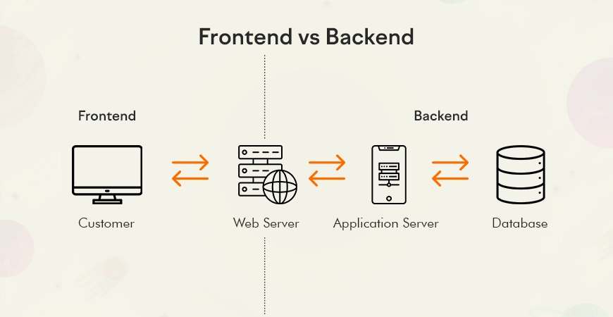

# 🚀 Lab 2 (online) — Бизнес / брэндийнхээ сайтыг AI-аар бүтээж интернэтэд тавья

> 🎯 **Today's promise:** Сешн дуусахад таны гарт **live бизнес / брэндийн landing page-ийн линк (URL)** байх ба та AI-аар сайт бүтээх **3 аргыг** эзэмшсэн байна.

|                    |                                                         |
| ------------------ | ------------------------------------------------------- |
| 🎓 **Track**       | Adults (бүтээмж + бизнес)                               |
| 🌐 **Format**      | Online · 1.5–2 цаг                                      |
| 🧩 **Build today** | Lab 1-ийн сайтаа → бизнес / brand landing → deploy → QR |
| 📱 **Discord**     | [discord.gg/h8MHmusCKm](https://discord.gg/h8MHmusCKm)  |

---

## ✅ Outcomes — Өнөөдөр юу хийж үзэх вэ?

- Lab 1-д хийсэн сайтаа AI-аар **сайжруулж**, бодит **бизнес / брэндийн landing page** болгоно.
- AI Studio-д сайт бүтээх **3 аргыг** туршина: ① structured prompt ② screenshot-оор дуурайх ③ бэлэн загвар.
- Сайтаа **deploy** хийж, **QR**-аар share хийнэ — линкээ хэрэглэгч / харилцагчдадаа явуулна.
- AI-д / олон нийтэд тавьж **болохгүй зүйлсийг** нэрлэнэ (AI Reality Check).

> 💡 **Хоёр төрлийн зорилго — нэг дасгал:**
> 🏢 **Бизнес эзэн** → бүтээгдэхүүн / үйлчилгээгээ зарах **бизнес landing page**.
> 🚀 **Бүтээмж хайгч (бизнесгүй)** → ажил, мэргэжлээ харуулах **personal brand** нэрийн хуудас.

---

## 🧭 Хичээлийн задаргаа

> Доорх сэдвүүд дээр дарж **шууд шилжинэ.**

| Цаг    | Сэдэв                                                                                                                                             |
| ------ | ------------------------------------------------------------------------------------------------------------------------------------------------- |
| 15 мин | [✨ Kahoot — Lab 1 давталт (PIN: 02607784)](https://kahoot.it/challenge/02607784?challenge-id=52e8dc11-25fb-4f0e-bbb7-bfe2b8499817_1782053153131) |
| 15 мин | [🎬 Google AI Studio танилцуулга](https://www.youtube.com/watch?v=meUr8fjy8lQ)                                                                    |
| 35 мин | [🌐 Сайт бүтээх 3 арга (AI Studio)](#sec-aistudio)                                                                                                |
| 25 мин | [🚀 Deploy + QR + Share](#sec-deploy)                                                                                                             |
| 10 мин | [🧩 Энэ бол зөвхөн Frontend (backend + төлбөр)](#sec-fullstack)                                                                                   |
| 10 мин | [🛡️ AI Reality Check](#sec-reality)                                                                                                               |
| 10 мин | [🗂️ Prompt Library + 📦 Homework](#sec-promptlib)                                                                                                 |

---

<details open id="sec-aistudio">
<summary><strong>🌐 Сайт бүтээх 3 арга — Google AI Studio</strong></summary>

HTML гараар бичихгүйгээр **AI-аар бүтэн website** үүсгэе. Өнөөдөр Lab 1-ийн сайтаа авч **бизнес / брэндийн landing page** болгон сайжруулна.

**1. Setup**

- [aistudio.google.com](https://aistudio.google.com) нээ → товч tour
- **Үндсэн заавар (instructions)** тохируул:

<details>
<summary>📋 Жишээ System instructions <em>(хуулж тавь — copy)</em></summary>

```text
- Монгол хэлээр харилц.
- Цэвэр, ойлгомжтой, мэргэжлийн код бич.
- Бүх кодыг нэг файлд бөөгнөрүүлэхгүй. Тохиромжтой бүтэц, файл, модуль болгон хуваа.
- Код бүрийг maintainable, reusable байдлаар бич.
- Шаардлага тодорхойгүй бол таамаглахгүй, эхлээд асуулт асуу.
- Том өөрчлөлт хийхээс өмнө төлөвлөгөөгөө товч тайлбарла.
- Илүүдэл код, шаардлагагүй dependency, overengineering-ээс зайлсхий.
- Шилдэг практик (best practices)-ийг баримтал.
- Алдаа гарвал шалтгааныг тайлбарлаж, засах аргыг санал болго.
- Эхлэгч хэрэглэгч гэж үзээд энгийн, ойлгомжтой тайлбар өг.
- Кодын өөрчлөлтийг алхам алхмаар тайлбарла.
- Боломжтой бол нэг дор бүх шийдлийг биш, хамгийн энгийн шийдлээс эхэл.
- Эргэлзээтэй үед баримтгүй зүйл зохиохгүй. Мэдэхгүй бол шууд хэл.
- Хариултыг товч боловч хангалттай дэлгэрэнгүй байлга.
```

</details>

**2. Юу бүтээх вэ — бизнес / брэндийнхээ контентоор бөглө**

| #   | Хэсэг           | Бизнес эзэн                              | Бүтээмж хайгч (personal brand)        |
| --- | --------------- | ---------------------------------------- | ------------------------------------- |
| 1   | 🦸 **Hero**     | Юу зардаг + хэнд + 1 хүчтэй CTA          | Хэн бэ + юу хийдэг + холбоо барих CTA |
| 2   | ℹ️ **About**    | Бизнесийн түүх, давуу тал                | Туршлага, ур чадвар, үнэт зүйл        |
| 3   | 🛍️ **Services** | Бүтээгдэхүүн / үйлчилгээ (үнэтэй нь)     | Үзүүлж чадах үйлчилгээ / ажлууд       |
| 4   | 📞 **Contact**  | Захиалга, утас, байршил, нийгмийн сүлжээ | Имэйл, LinkedIn, холбоо барих форм    |

> 👤 **Reuse:** Lab 1-д HTML intro-д бичсэн мэдээллээ дахин ашигла — нэрээ, мэргэжил / бизнесээ, value-аа AI-д өг.

---

### Сайт бүтээх 3 арга

<details>
<summary><strong>✍️ 1. Structured prompt</strong> — хамгийн уян хатан арга</summary>

👎 **Муу жишээ:**

```text
Надад веб сайт хийж өг
```

👍 **Сайн жишээ:**

```text
Role: Чи 10+ жилийн туршлагатай senior web designer бөгөөд frontend developer.
       Орчин үеийн, конверс өндөртэй (conversion-focused) сайт хийдэг.

Task: Доорх бизнес / хувийн брэндийг тусгасан, responsive landing page-ийг NEXT.js-ээр үүсгэ.

Who:
  - Нэр / бизнесийн нэр: [...]
  - Юу зардаг / юу хийдэг: [...]
  - Онцлог давуу тал (value): [...]
  - Зорилтот хэрэглэгч: [хэнд зориулсан]
  - Гол үйлдэл (CTA): [захиалах / холбоо барих / захиалга өгөх ...]

Structure:
  - Sticky navbar: нэр/лого + хэсгүүд рүү шилжих холбоос
  - Hero: гарчиг (1 хүчтэй өгүүлбэр) + дэд өгүүлбэр + үндсэн CTA товч
  - About: 2–3 өгүүлбэр танилцуулга + зураг
  - Services / Products: 3 card (icon + гарчиг + товч тайлбар)
  - Testimonials эсвэл онцлох тоо баримт (нэг хэсэг)
  - Contact: имэйл, утас, нийгмийн сүлжээ + энгийн холбоо барих форм
  - Footer: copyright + холбоосууд

Design:
  - Хэв маяг: цэвэрхэн, минимал, мэргэжлийн; уншихад амар
  - Өнгө: [брэндийн гол өнгө] + саармаг дэвсгэр; тогтвортой палитр (3–4 өнгө)
  - Typography: тод hierarchy (гарчиг/текст), монгол хэл дэмждэг уншигдахуйц фонт
  - Layout: сайхан зайтай (whitespace), grid дээр суурилсан
  - Микро-эффект: hover, зөөлөн scroll, энгийн appear animation
  - Responsive: mobile / tablet / desktop бүгдэд төгс харагдана

Constraints:
  - Бүх контент монгол хэл дээр, дүрэм зөв
  - Бэлэн дуусгасан, шууд ажиллахуйц нэг файл буцаа

Style reference: [таалагдсан сайтын screenshot хавсаргасан бол түүн шиг загвартай хий]
```

</details>

<details>
<summary><strong>📸 2. Screenshot-оор дуурайх</strong> — таалагдсан сайтыг загвар болгох</summary>

> Таалагдсан сайтынхаа **screenshot** зургийг хавсаргаад "ийм загвартай, гэхдээ миний бизнесийн контентоор хий" гэж зааж болно.

> [Screenshot авах сайт хайх (Dribbble landing pages)](https://dribbble.com/search/landing-page)


</details>

<details>
<summary><strong>🎨 3. Бэлэн загвараас санаа авах</strong> — motion.ai</summary>

Орчин үеийн веб загваруудаас санаа аваад, өнгө / бүтцийг нь өөрийн брэнддээ тааруулж prompt бич.

> [Бэлэн загвар үзэх (motionsites.ai)](https://motionsites.ai/)


</details>

> 💡 **Хослуул:** хамгийн сайн үр дүн = бэлэн загвараас санаа ав → screenshot хавсарга → structured prompt-оор контентоо нэг бүрчлэн зааж өг.

</details>

---

<details open id="sec-deploy">
<summary><strong>🚀 Deploy + QR + Share</strong></summary>

Deploy хийх **2 арга** — өөрт тохирохыг сонго:

---

#### ⚡ Option 1 — AI Studio-оос шууд Publish _(хамгийн хялбар)_

> 🟡 **Billing нээх шаардлагатай** (Google Cloud дээр төлбөрийн карт холбоно). Кодоо хаа нэгтээ зөөхгүйгээр AI Studio дотроосоо шууд интернэтэд тавина.

```
1️⃣ Billing  — AI Studio дотор Deploy / Publish дарахад Google Cloud
              project + billing нээхийг хүснэ → картаа холбоод идэвхжүүл

2️⃣ Publish  — "Deploy app" / "Publish" дар → AI Studio өөрөө build хийж
              live URL гаргана 🎉 (Cloud Run дээр байршина)

3️⃣ QR       — qr-code-generator.com-д URL → QR код

4️⃣ Share    — Discord-д URL + QR тавь → бусдынхыг үз → 👏
```

> 💡 Код засах болгондоо AI Studio-гоос дахин Publish дарахад л шинэчлэгдэнэ.

---

#### 🟢 Option 2 — GitHub + Vercel _(картгүй, мэргэжлийн хувилбар)_

> 🟢 **Кредит карт шаардахгүй.** Кодоо **GitHub**-д тавиад **Vercel**-ээр deploy хийнэ — дараа нь шинэчлэхэд хялбар.

```
1️⃣ Export   — AI Studio-гоос кодоо татаж ав (Download / Copy code)
              → файлуудаа нэг folder-т хий (index.html гэх мэт)

2️⃣ GitHub    — github.com-д үнэгүй бүртгэл үүсгэ (картгүй)
              → шинэ repository үүсгэ → файлуудаа upload/чирээд тавь → Commit

3️⃣ Vercel    — vercel.com-д "Continue with GitHub"-ээр нэвтэр
              → Add New → Project → дээрх repo-гоо Import
              → Deploy дар → хэдхэн секундэд live URL гарна 🎉

4️⃣ QR        — qr-code-generator.com-д URL → QR код

5️⃣ Share     — Discord-д URL + QR тавь → бусдынхыг үз → 👏
```

> 🔁 Кодоо GitHub дээр шинэчлэхэд Vercel **автоматаар** дахин deploy хийнэ — нэг л холбосон бол цаашид амар.

---

> 🎉 **Аль ч аргаар бол таны бизнес / брэндийн интернэтэд тавьсан live сайт!** Линкийг харилцагч, хэрэглэгчид рүүгээ шууд явуулж болно.

</details>

---

<details open id="sec-fullstack">
<summary><strong>🧩 Энэ бол зөвхөн "харагдах байдал" (Frontend)</strong></summary>

> Таны сайт = Зөвхөн харагдах байдал. Гоё харагдаж байгаа ч ард нь бодит бизнесийн ажиллагаа явахын тулд Backend хэрэгтэй.



> ### [Figma diagram](https://www.figma.com/board/aWUZEAsmVJeS4KyiYyQQJw/%D0%92%D0%B5%D0%B1-%D1%81%D0%B0%D0%B9%D1%82%D1%8B%D0%BD-%D0%B1%D2%AF%D1%80%D1%8D%D0%BD-%D0%B0%D1%80%D1%85%D0%B8%D1%82%D0%B5%D0%BA%D1%82%D1%83%D1%80--%D1%85%D1%8D%D0%B2%D1%82%D1%8D%D1%8D--%E2%80%94-Frontend-%D0%BE%D0%B4%D0%BE%D0%BE--%D0%B1%D1%83%D1%81%D0%B0%D0%B4-%D0%BD%D1%8C-%D0%B4%D0%B0%D1%80%D0%B0%D0%B0?node-id=0-1&t=YJ4Kw7BriTV39ZJT-1)

#### 🧠 3 давхар — юу нь байгаа, юу нь дутуу вэ

| Давхар          | Юу хийдэг                                         | Жишээ                            | Төлөв        |
| --------------- | ------------------------------------------------- | -------------------------------- | ------------ |
| 🖥️ **Frontend** | Харагдах нүүр царай — дарж, бөглөж болно          | товч, зураг, форм, текст         | ✅ **Бэлэн** |
| ⚙️ **Backend**  | Дата хадгалах, нэвтрэлт, бараа / захиалга удирдах | сервер, өгөгдлийн сан (database) | ❌ Хэрэгтэй  |
| 💳 **Payment**  | Бодит мөнгө хүлээж авах                           | **QPAY**, **SocialPay**          | ❌ Хэрэгтэй  |

> ✅ **Өнөөдрийн сайт юу хийж чадах вэ:** өөрийгөө / бизнесээ үзүүлэх, линк / QR-аар хуваалцах, холбоо барих мэдээлэл харуулах.
> ❌ **Юу хийж чадахгүй вэ:** захиалга хадгалах, хэрэглэгч бүртгэх, **онлайн төлбөр авах** — эдгээрт backend + payment хэрэгтэй.

#### 🔌 Дараа нь хэрхэн холбох вэ _(товч ойлголт)_

| Хэрэгтэй зүйл             | Юунд                            | Түгээмэл хэрэгсэл                                             |
| ------------------------- | ------------------------------- | ------------------------------------------------------------- |
| 🗄️ **Backend / Database** | дата, захиалга, нэвтрэлт        | Supabase · Firebase (AI-д "Supabase холбоё" гэж зааж болно)   |
| 💳 **Payment gateway**    | QPAY / SocialPay-аар мөнгө авах | QPAY merchant + API · SocialPay merchant (банкаар бүртгүүлнэ) |
| 🔗 **Холболт**            | frontend → backend → payment    | API key-ээр холбоно (backend дотроос дуудна)                  |

> 💡 **Чухал:** API key, нууц түлхүүрийг **frontend-д бүү тавь** — backend дотор нуух ёстой. (→ AI Reality Check)
>
> 🔜 **MVP долоо хоногт** (W3) бид backend + бодит хэрэглэгчид рүү алхана. Өнөөдрийн сайт чинь түүний бат бөх **суурь** нь.

</details>

---

<details open id="sec-reality">
<summary><strong>🛡️ AI Reality Check</strong></summary>

> AI бол **co-pilot** — шийдвэр гаргагч биш. Эцсийн хариуцлага **танд**.

| Дүрэм                | Тайлбар                                                                      |
| -------------------- | ---------------------------------------------------------------------------- |
| ⚠️ **Hallucination** | AI итгэлтэйгээр буруу хэлдэг → үнэ, тоо баримт, мэдээллээ **шалга**          |
| 🔒 **Privacy**       | Хэрэглэгч / харилцагчийн хувийн дата AI-д **бүү оруул**                      |
| 🌐 **Public**        | ✅ бизнесийн нэр, үйлчилгээ, ил утас · ❌ нууц үг, customer data, дотоод тоо |

</details>

---

<details open id="sec-promptlib">
<summary><strong>🗂️ Prompt Library + 📦 Homework</strong></summary>

**🗂️ Prompt Library** — өнөөдрийн шилдэг prompt-уудаа [Google Keep](https://keep.google.com)-д «Prompt Library» label-аар хадгал: ① landing page-ийн final prompt ② таалагдсан design prompt.

**📦 Homework**

```
1️⃣ Landing page-ээ AI Studio-д prompt-оо сайжруулж ГҮЙЦЭЭ
   → deploy хийж, шинэ линкээ Discord-д тавь
2️⃣ Бизнестэй бол: бодит бүтээгдэхүүн / үйлчилгээ + үнээ сайтад тавь
   Бизнесгүй бол: 3 жинхэнэ ажил / ур чадвараа Services хэсэгт нэм
3️⃣ Google NotebookLM-тэй танилц → notebooklm.google.com
4️⃣ Бодоод ир: «AI энэ сайтыг хэрхэн хэдхэн минутад үүсгэв?»
```

> 📱 **Утаснаасаа ч хийж болно:** [aistudio.google.com](https://aistudio.google.com)-д утсаараа нэвтрээд prompt-оо сайжруулаад үргэлжлүүлээрэй.
>
> 🔜 **Next (Lab 3):** AI-н үндэс — _«AI юу вэ? Энэ сайтыг хэрхэн хэдхэн минутад үүсгэв?»_

</details>
