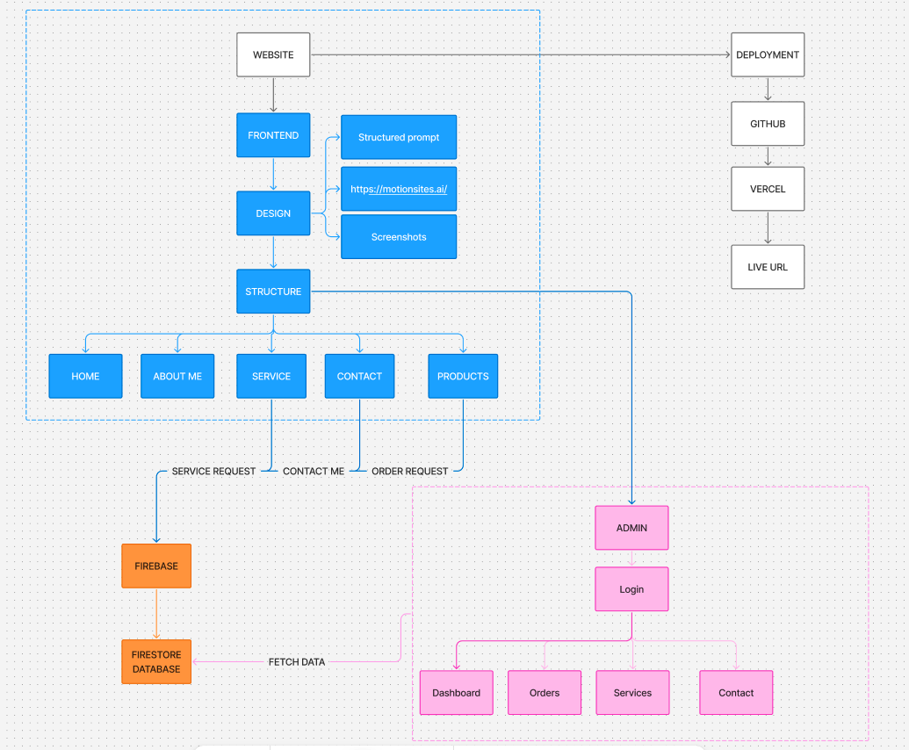

# 🔌 Хичээл 3 + 4 (Lab) — Сайтаа дуусгаж, **бодит дата хадгалдаг** болгоё

> 🎯 **Today's promise:** Сешн дуусахад таны live сайт зөвхөн харагдаад зогсохгүй, **хэрэглэгчийн бодит мэдээллийг хадгалдаг** (захиалга / холбоо барих / бүртгэл) болж, интернэтэд байршсан байна.

---

## 🧭 Хичээлийн задаргаа

> Доорх сэдвүүд дээр дарж **шууд шилжинэ.**

| Цаг    | Сэдэв                                                                |
| ------ | -------------------------------------------------------------------- |
| 20 мин | [🎨 Сайтын загвар + контент эцэслэх](#sec-finalize)                  |
| 20 мин | [🗺️ Веб апп том зургаар (Figma)](#sec-bigpicture)                    |
| 15 мин | [🔥 Backend гэж юу вэ — Firestore танилцуулга](#sec-firestore-intro) |
| 50 мин | [🔌 Сайтаа баазтай холбох (AI Studio)](#sec-connect)                 |
| 25 мин | [🚀 Deploy + QR + Share](#sec-deploy)                                |
| 10 мин | [🗂️ Prompt Library](#sec-promptlib)                                  |

---

<details open id="sec-finalize">
<summary><strong>🎨 Сайтын загвар + контент эцэслэх</strong></summary>

Сайтаа баазтай холбохоос өмнө **гадаад төрхийг нь дуусгая.** AI Studio-д prompt-оор засна.

**Шалгах жагсаалт (checklist):**

| ✓   | Хэсэг                                                                       |
| --- | --------------------------------------------------------------------------- |
| ☐   | **Контент бодит уу?** — жинхэнэ нэр, үйлчилгээ, үнэ, холбоо барих мэдээлэл  |
| ☐   | **Hero** — 1 хүчтэй өгүүлбэр + тодорхой CTA товч                            |
| ☐   | **Mobile** — утсан дээр төгс харагдаж байна уу                              |
| ☐   | **Өнгө / фонт** — тогтвортой палитр, уншигдахуйц                            |
| ☐   | **Форм байна уу?** — захиалга / холбоо барих форм (маргааш баазтай холбоно) |

</details>

---

<details open id="sec-bigpicture">
<summary><strong>🗺️ Веб апп том зургаар хэрхэн ажилладаг вэ?</strong></summary>

Сайт яагаад **дата хадгалж чаддаг** болохыг ойлгоё. 3 хэсгээс бүрдэнэ:

```text
👤 Хэрэглэгч
   │  (форм бөглөнө)
   ▼
🖥️  FRONTEND  — таны харж буй сайт (HTML/CSS/JS)
   │  (датаг илгээнэ / татна)
   ▼
🔥 BACKEND / DATABASE  — Firebase Firestore (датаг хадгална)
```

| Хэсэг       | Юу хийдэг вэ                            | Жишээ                            |
| ----------- | --------------------------------------- | -------------------------------- |
| 🖥️ Frontend | Хэрэглэгчид харагдах, харьцах хэсэг     | Landing page, форм, товч         |
| 🔥 Database | Датаг **байнга хадгалах** агуулах       | Захиалгууд, мессежүүд, имэйлүүд  |
| 🔌 Холболт  | Frontend ↔ Database хооронд дата дамжих | "Захиалах" дарахад бааз руу очно |



</details>

---

<details open id="sec-firestore-intro">
<summary><strong>🔥 Backend гэж юу вэ — Firebase Firestore танилцуулга</strong></summary>

- **Firebase** — Google-ийн backend платформ. Сервер бичихгүйгээр бааз, нэвтрэлт, hosting өгдөг.
- **Firestore** — Firebase доторх **database** (NoSQL). Дата **collection → document** хэлбэрээр хадгална.

```text
📦 Collection: "orders"  (захиалгууд)
   ├── 📄 Document 1 → { нэр: "Бат", утас: "9911...", мессеж: "..." }
   ├── 📄 Document 2 → { нэр: "Сараа", утас: "8800...", мессеж: "..." }
   └── ...
```

| Яагаад Firestore?      | Тайлбар                                 |
| ---------------------- | --------------------------------------- |
| 🆓 **Үнэгүй эхлэх**    | Spark plan — карт шаардахгүй            |
| ⚡ **Хурдан**          | Хэдхэн товшилтоор бааз бэлэн            |
| 🔗 **Шууд холбогддог** | AI Studio-ийн кодоос шууд ашиглаж болно |
| 📈 **Бодит цагийн**    | Дата орж ирэхэд шууд харагдана          |

> 🔜 Дараагийн хэсэгт бид энэ Firestore-оо **үүсгээд**, сайтынхаа форм-той **холбоно.**

</details>

---

<details open id="sec-connect">
<summary><strong>🔌 Сайтаа баазтай холбох — AI Studio prompt-оор</strong></summary>

> ✨ **Хамгийн амар нь:** Firestore-оо Firebase Console дээр гараар үүсгэх **шаардлагагүй.** AI Studio-д зөв prompt өгөхөд бааз (Firestore)-аа **өөрөө үүсгээд**, формтой чинь **холбоно.**

**Алхам:**

```text
1️⃣ AI Studio-д сайтаа нээ
2️⃣ Доорх prompt-ыг хуулж тавь → AI бааз үүсгэж, кодоо холбоно
3️⃣ Форм бөглөж тест хий
4️⃣ Firebase Console → дата орж ирсэн эсэхийг шалга ✅
```

<details>
<summary>📋 Холбох prompt жишээ <em>(хуулж тавь — copy)</em></summary>

```text
Миний сайтын "Захиалга / холбоо барих" форм-ыг Firebase Firestore-той холбоно уу.

Шаардлага:
- Firebase / Firestore baaz-ыг шаардлагатай бол өөрөө тохируулж холбо.
- Форм submit хийхэд талбаруудыг (нэр, утас, мессеж) "orders" нэртэй
  Firestore collection-д document болгож хадгал.
- Хадгалсны дараа хэрэглэгчид "Баярлалаа, захиалга хүлээн авлаа ✅" гэж харуул.
- Алдаа гарвал ойлгомжтой мессеж үзүүл.
- Нэг файлд ажиллахуйц, цэвэрхэн код бич.
- Код өөрчлөлтийг алхам алхмаар тайлбарла.
```

</details>

> 🔗 **Баазаа харах:** [Firebase Console](https://console.firebase.google.com) · [Firestore Database](https://console.firebase.google.com/project/_/firestore) — орж ирсэн датаг эндээс хянана.
>
> 🧪 **Тест:** өөрөө формоо бөглөөд илгээ → Firebase Console → Firestore-д `orders` collection дотор document гарч ирвэл **амжилттай!** 🎉
>
> 🐞 **Ажиллахгүй бол:** алдааны мессежийг хуулж AI-д буцааж өг → "энэ алдааг зас" гэж хэл.

</details>

---

<details open id="sec-deploy">
<summary><strong>🚀 Deploy + QR + Share</strong></summary>

Баазтай холбосон сайтаа дахин deploy хийнэ. **2 арга** — өөрт тохирохыг сонго:

---

#### ⚡ Option 1 — AI Studio-оос шууд Publish _(хамгийн хялбар)_

> 🟡 **Billing нээх шаардлагатай** (Google Cloud дээр төлбөрийн карт холбоно). Кодоо хаа нэгтээ зөөхгүйгээр AI Studio дотроосоо шууд интернэтэд тавина.

```
1️⃣ Billing  — AI Studio дотор Deploy / Publish дарахад Google Cloud
              project + billing нээхийг хүснэ → картаа холбоод идэвхжүүл

2️⃣ Publish  — "Deploy app" / "Publish" дар → AI Studio өөрөө build хийж
              live URL гаргана 🎉 (Cloud Run дээр байршина)

3️⃣ QR       — qr-code-generator.com-д URL → QR код

4️⃣ Share    — Discord-д URL + QR тавь → бусдынхыг үз → 👏
```

> 💡 Код засах болгондоо AI Studio-гоос дахин Publish дарахад л шинэчлэгдэнэ.

---

#### 🟢 Option 2 — GitHub + Vercel _(картгүй, мэргэжлийн хувилбар)_

> 🟢 **Кредит карт шаардахгүй.** Кодоо **GitHub**-д тавиад **Vercel**-ээр deploy хийнэ — дараа нь шинэчлэхэд хялбар. [Энд дарж дэлгэрэнгүй зааварчилгааг үз](./vercel_deployment/readme.md)

```
1️⃣ Export   — AI Studio-гоос кодоо татаж ав (Download / Copy code)
              → файлуудаа нэг folder-т хий (index.html гэх мэт)

2️⃣ GitHub    — github.com-д үнэгүй бүртгэл үүсгэ (картгүй)
              → шинэ repository үүсгэ → файлуудаа upload/чирээд тавь → Commit

3️⃣ Vercel    — vercel.com-д "Continue with GitHub"-ээр нэвтэр
              → Add New → Project → дээрх repo-гоо Import
              → Deploy дар → хэдхэн секундэд live URL гарна 🎉

4️⃣ QR        — qr-code-generator.com-д URL → QR код

5️⃣ Share     — Discord-д URL + QR тавь → бусдынхыг үз → 👏
```

> 🔁 Кодоо GitHub дээр шинэчлэхэд Vercel **автоматаар** дахин deploy хийнэ — нэг л холбосон бол цаашид амар.

---

> 🎉 **Одоо таны сайт бодит дата хадгалдаг live апп боллоо!** Хэн нэгэн форм бөглөхөд мэдээлэл нь Firestore-д хадгалагдана.

</details>

---

<details open id="sec-promptlib">
<summary><strong>🗂️ Prompt Library</strong></summary>

**🗂️ Prompt Library** — өнөөдрийн шилдэг prompt-уудаа [Google Keep](https://keep.google.com)-д «Prompt Library» label-аар хадгал: ① загвар эцэслэх prompt ② Firestore холбох prompt.

> 📱 **Утаснаасаа ч хийж болно:** [aistudio.google.com](https://aistudio.google.com)-д утсаараа нэвтрээд prompt-оо үргэлжлүүл.
>
> 🔜 **Next (Week 2):** цугласан датаг ашиглах + автоматжуулалт (automation).

</details>
