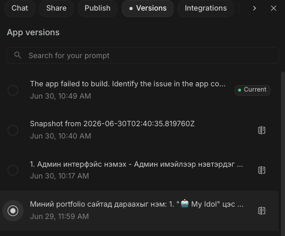

# Хичээл 05 (онлайн): Админ хэсэг + Github + Vercel + Байршуулалт

- Хичээлийн видео: https://youtu.be/XLr7P0zXEb8

## Хичээлийн агуулга

1. **Алдаа гарвал өмнөх хувилбар руу буцах** — Google AI Studio дээр Versions хэсгээс буцах хувилбараа сонгон Restore version даран өмнөх хувилбар руу буцаж болно.

   

2. **Админ хэсэг нэмэх** — Prompt ашиглан Админ дэлгэц үүсгэх

```text
Админ удирдлагын систем (Admin Panel) нэмэх

Системд зөвхөн админ хэрэглэгч нэвтрэх боломжтой хамгаалалттай админ интерфэйс хөгжүүлнэ.
1. Authentication (Нэвтрэлт)
- Админ зөвхөн имэйл болон нууц үгээр нэвтрэх.
- Зөвхөн admin эрхтэй хэрэглэгч админ хэсэгт хандах боломжтой.
- Session/JWT authentication ашиглах.
- Logout хийх боломжтой.
- Захиалгын удирдлага (Orders)
- Харилцагчдын үүсгэсэн бүх захиалгыг хүснэгтээр харах.
- Дараах мэдээллийг харуулах:
- Захиалгын №
- Харилцагчийн нэр
- Имэйл
- Утас
- Захиалсан үйлчилгээ/аялал
- Огноо
- Одоогийн статус
- Захиалгыг хайх, эрэмбэлэх, шүүх боломжтой.
- Захиалгын дэлгэрэнгүй мэдээллийг харах.
- Статус өөрчлөх боломжтой (New, In Progress, Confirmed, Completed, Cancelled).
- Захиалга бүр дээр дотоод тэмдэглэл (Internal Notes) үлдээх бөгөөд тэмдэглэлүүдийн түүх - хадгалагдана.
2. Холбоо барих хүсэлтүүд (Contact Requests)
- Вэбсайтаар ирсэн бүх холбоо барих хүсэлтийг жагсаалтаар харах.
- Дараах мэдээллийг харуулах:
- Нэр
- Имэйл
- Утас
- Гарчиг
- Мессеж
- Илгээсэн огноо
- Статус
- Статус өөрчлөх боломжтой (Unread, Contacted, Resolved, Closed).
- Админ дотоод тэмдэглэл үлдээх боломжтой.
- Хайлт болон шүүлтүүртэй байх.
3. Dashboard
Нийт захиалгын тоо.
Шинэ захиалгын тоо.
Нээлттэй холбоо барих хүсэлтүүд.
Сүүлийн үеийн захиалга болон хүсэлтүүдийг хурдан харах.
```

3. **Github + Vercel ашиглан интернетэд байршуулах** — [Энд дар](./vercel_deployment/readme.md)
