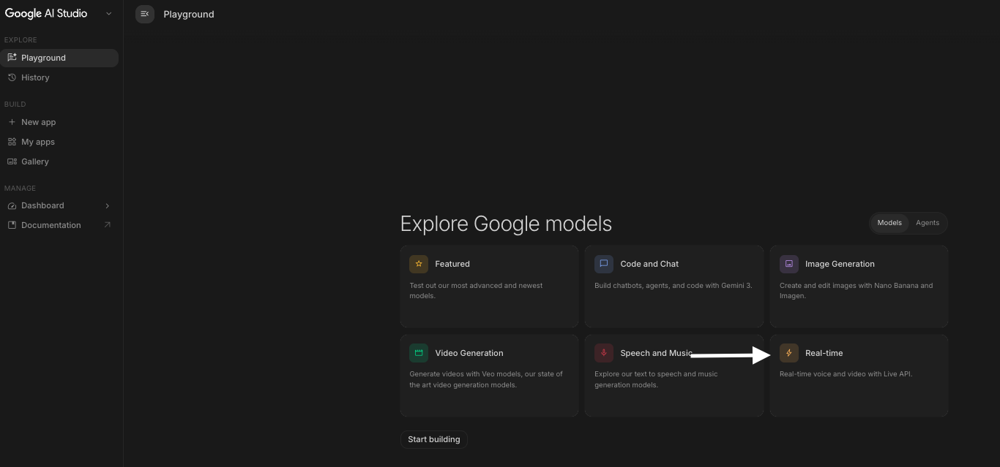
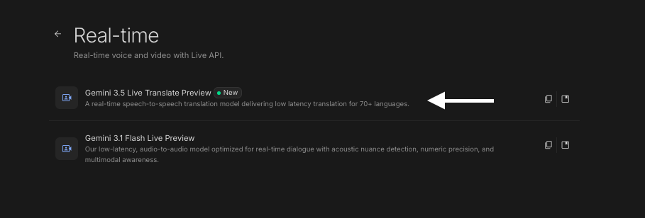
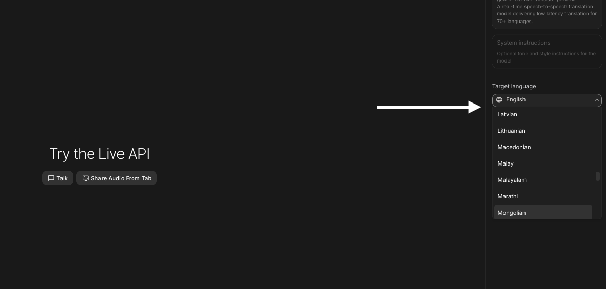

# 🎙️ Gemini Live Translate — Бодит цагийн ярианы орчуулга (Алхам алхмаар)

Gemini Live Translate бол таны яриаг **бодит цагт (real-time)** сонсож, өөр хэл рүү орчуулж, дуугаар буцааж уншиж өгдөг хэрэгсэл юм. Энэ нь англи хэл сурахад — жинхэнэ хүнтэй ярьж байгаа мэт дадлага хийх, дуудлагаа шалгах, гадаадад аялах үед харилцахад маш тохиромжтой.

> **Хэрэгтэй зүйл:** Google account, микрофонтой компьютер эсвэл гар утас.

---

## 🎯 Эцсийн зорилго

Англиар ярих айдсаа даван туулж, бодит цагт орчуулгатай **харилцан яриа** хийж, дуудлага, сонсголоо сайжруулах.

---

## 💻 А хувилбар: Компьютер дээр (AI Studio)

Илүү дэлгэрэнгүй тохиргоо, туршилт хийхэд тохиромжтой.

### 🪜 Алхам 1: AI Studio руу орох

1. [aistudio.google.com](https://aistudio.google.com) руу орж Google account-оороо нэвтэрнэ.
2. Зүүн талын цэснээс **"Playground"** (Stream / Live) хэсгийг сонгоно.

### 🪜 Алхам 2: Live translate горимыг идэвхжүүлэх

1. **"Real-time"** сонголтыг сонгоно.
2. Орчуулах хэлээ тохируулна: жишээ нь **Mongolian → English** (эсвэл эсрэгээр).
3. Микрофоноо зөвшөөрнө (browser-ийн зөвшөөрөл өгнө).
   

### 🪜 Алхам 3: Ярьж эхлэх

- Target language -> Mongolian -> Gemini таны яриаг бодит цагт орчуулж, дэлгэц дээр текст + дуугаар уншиж өгнө.
- Talk: Мик-р ярьсан яриаг орчуулна
- Share Audio from tab: Шууд Browser дээр явж буй аудио-г орчуулна
- Англиар ярьж, өөрийгөө шалгах; эсвэл монголоор ярьж, англи хувилбарыг нь сурах.

---

## 📱 Б хувилбар: Гар утсан дээр (Google Translate)

Хамгийн хялбар, хаана ч ашиглаж болох арга. Аялал, бодит харилцаанд тохиромжтой.

### 🪜 Алхам 1: Апп бэлдэх

1. **Google Translate** аппыг App Store / Play Store-оос суулгана.
2. Апп-аа нээж, Live Translate -г сонгоно.
3. Орчуулах хэлээ сонгоно (жишээ: English ⇄ Mongolian).

### 🪜 Алхам 2: Горимоо сонгох

Google Translate дотор хоёр үндсэн горим байна:

| Горим               | Юунд тохиромжтой вэ                                              |
| :------------------ | :--------------------------------------------------------------- |
| **🎧 Listening**    | Нэг талын яриа (лекц, зарлал) сонсож, тасралтгүй орчуулах        |
| **💬 Conversation** | Хоёр хүний харилцан яриа — хэл солигдох бүрд автоматаар орчуулна |

### 🪜 Алхам 3: Дадлага хийх

- **Conversation** горимд гар утсаа хоёр хүний дунд тавьж, ээлжлэн ярина → апп хоёр тал руу орчуулна.
- **Listening** горимд англи хэл дээрх подкаст/видео тоглуулж, бодит цагийн орчуулгыг нь дага.

---

## 💡 Англи хэл сурахад хэрхэн ашиглах вэ

- **Ярих дадлага:** Өдөр бүр 5–10 минут англиар ярьж, орчуулга/текстээр өөрийгөө шалга.
- **Дуудлага засах:** Хэлсэн үг чинь буруу текст болж хувирвал дуудлагаа сайжруулах хэрэгтэй гэсэн үг.
- **Шинэ үг сурах:** Монголоор бодсон санаагаа хэлээд, англи хувилбарыг нь тэмдэглэ.
- **NotebookLM-тэй хослуулах:** [google-notebook-lm.md](google-notebook-lm.md) дээрх багшаас өдрийн ярианы сэдэв аваад, Live Translate дээр дадлага хий.

---

_🎯 Хамгийн чухал нь — төгс байхыг хүлээхгүйгээр ярьж эхлэх. Алдаа бол сурах хамгийн хурдан зам._
