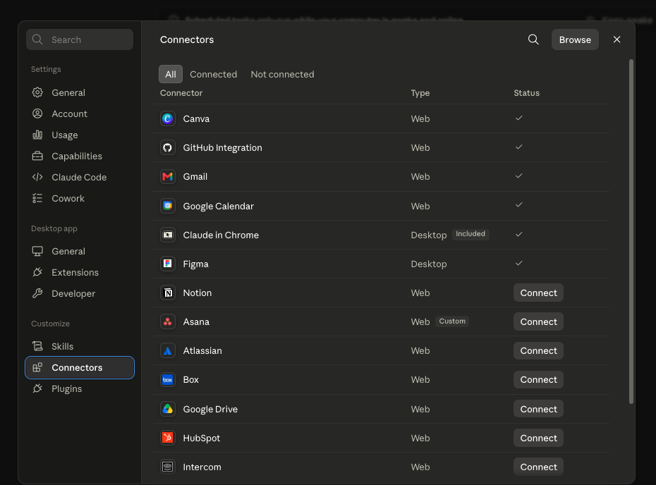
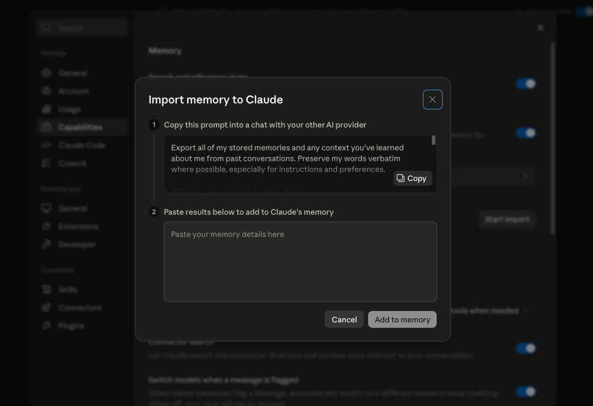
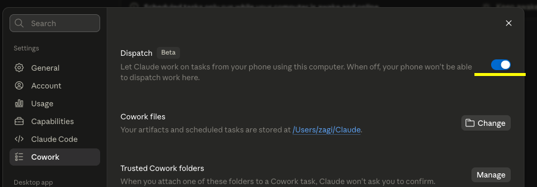

# Claude Cowork: Автоматжуулалтаас AI Экосистем хүртэл

## 1. Удиртгал (Introduction)

- [Slide](https://notebooklm.google.com/notebook/0fc71156-38ac-42a9-bb21-8869ed9e01a9/artifact/87a8be43-ed74-4a02-8cbc-c484820d950a?utm_source=nlm_web_share&utm_medium=google_oo&utm_campaign=art_share_1&utm_content=&utm_smc=nlm_web_share_google_oo_art_share_1_)

### 1.1 Claude Cowork-ийн тухай

- **Local AI Agent:** Таны компьютер дээр шууд байрлаж, файл, аппликейшн болон хэрэгслүүдтэй бие даан ажиллах чадвартай AI агент юм [1].
- **Ялгаа:** Вэб чатботоос ялгаатай нь таны локаль файлуудыг өөрчлөх, удирдах чадвартай (жишээ нь: компьютерын дэлгэц дээрх файлыг устгах, шилжүүлэх) [2].
- **Бүтэц:** Гурван үндсэн табтай: Chat (энгийн чат), Cowork (локаль агент), Claude Code (кодын агент) [3].

### 1.2 Тохиргоо (Setup)

- [**Download**](https://claude.com/download)
- **Capabilities:** Artifacts болон Inline Visualizations-ийг идэвхжүүлэх [3].
- **Global Instructions:** Claude-д хэн болох, хэрхэн ажиллах талаарх үндсэн зааварчилгааг өгөх [4].

```text
- Монгол хэлээр харилцах (Англи нэршил)
- Эргэлзээтэй зүйл дээр таахын оронд асууж байх
- Нэг гаргасан алдаагаа дахин гаргахгүйн тулд тэмдэглэж байх
- Нуршсан текстын оронд богино, тодорхой хариулт өгөх

```

- **Dispatch:** Гар утаснаасаа компьютер дээрх Claude-г удирдаж, даалгавар өгөх боломж [3].
- **Chrome Integration:** Claude Chrome Extension-ийг суулгаж, Chrome-той холбон Browser integration-ийг идэвхжүүлэх. Ингэснээр Claude нь нээлттэй tab болон веб хуудсуудтай ажиллах боломжтой.
- connectors: Бусад аппуудтай холбогдож ажиллах. Settings -> Connectors
  Жишээ нь: Gmail, Google Calendar...
  
- Bring your memory to Claude: Settings -> Capabilities -> Import memory From Other AI Providers:
  

- Enable dispatch and capabilities: Гар утаснаас удирдах (Settings -> Cowork -> Dispatch)
  

> 💡 **Зөвлөгөө:** Монгол хэлний voice-to-text апп суулгавал prompt-оо бичихийн оронд ярьж өгч, ажлын хурдаа нэмэгдүүлж болно.

---

## 2. Үндсэн ойлголтууд (Key Concepts)

### 2.1 Skills & Connectors

- **Skills (Ур чадвар):** Дахин ашиглагдах зааварчилгааны багц. Жишээ нь: "Брэнд стилийг бүх дизайнд хэрэглэх" ур чадвар [5, 6].
- **Connectors (Холболтууд):** Gmail, Google Calendar, Drive зэрэг гуравдагч талын програмуудтай Claude-г холбоно [7, 8].
- **MCP (Model Context Protocol):** Хэрэв бэлэн холболт байхгүй бол өөрөө холболт үүсгэх стандарт [8].

**Skill хэрхэн үүсгэх вэ? (Step by step)**

1. **Мэдлэгээ бэлдэх** — ном, заавар, брэнд дүрэм г.м. эх сурвалжаа цуглуулна (PDF, текст).
2. **Claude-д зорилгоо хэлэх** — "Энэ мэдлэг дээр үндэслэн дахин ашиглагдах Skill үүсгэ" гэж хүснэ.
3. **Skill-ийн зааврыг тодорхойлуулах** — хэзээ идэвхжих, ямар дүрэм мөрдөх, ямар формат гаргахыг багтаана.
4. **Хадгалах** — Skill болгон хадгалснаар дараагийн бүх харилцаанд дуудаж ашиглана.
5. **Туршиж сайжруулах** — бодит даалгавар өгч үзээд, зааврыг нарийсгана.

> 💡 Skill = "нэг удаа заагаад, олон удаа ашиглах". Доорх Дасгал 3, 4-т бодит жишээгээр туршина.

### 2.2 Projects & Memory

- **Projects (Төслүүд):** Контекст болон санах ойг хадгалдаг бие даасан ажлын талбар [9].
- **Productivity Plugin:** `task.md` болон `memory.md` файлуудыг үүсгэж, Claude-ийн санах ойг удирдах систем [10, 11]. `/update` командаар санах ойг шинэчилнэ [11].

**Жишээ: Memory хэрхэн ажилладаг вэ?**

Та ажлын явцад тохиргоо, шийдвэрээ хэлэхэд Claude түүнийг `memory.md` дотор
тэмдэглэж, дараагийн харилцаанд өөрөө сануулдаг. Ингэснээр нэг зүйлээ дахин
дахин тайлбарлах шаардлагагүй болно.

```markdown
# memory.md (жишээ агуулга)

## Хэрэглэгчийн тухай

- Нэр: Бат, вэб хөгжүүлэгч
- Монгол хэлээр харилцахыг илүүд үзнэ (Англи нэршилтэй)

## Төслийн шийдвэрүүд

- Dashboard-ыг single HTML artifact хэлбэрээр гаргана
- Огноог YYYY-MM-DD форматаар харуулна
- Валют: MNT (₮)

## Тэмдэглэсэн алдаанууд

- CSV дотор таслал бүхий тоог буруу задалж байсан → тусгайлан шалгах
```

**Урсгал (workflow):**

1. Шинэ **Project** нээх → холбогдох файлууд, контекст энд хадгалагдана.
2. Ажлын явцад чухал шийдвэр гарах бүрд Claude `memory.md`-д тэмдэглэнэ.
3. Session дуусахад `/update` командаар санах ойг шинэчилнэ.
4. Дараагийн удаа Claude `memory.md`-г уншиж, өмнөх контекстээ сэргээнэ.

---

## 3. Ахисан шатны тактикууд (Advanced Tactics)

### 3.1 PRD (Product Requirement Document) First

- Аливаа зүйлийг барьж эхлэхээс өмнө **PRD** бичих нь амжилтын үндэс юм. Үүнд: Асуудал, амжилтын шалгуур, хамрах хүрээ (scope), хязгаарлалт болон бүтээх төлөвлөгөө багтана [12, 13].
- **Pushback:** Claude-оос таны төлөвлөгөөг шүүмжлэх, асуулт асуухыг шаардах нь алдаа гарахаас сэргийлнэ [13].

#### PRD хэрхэн үүсгэх вэ? (Step by step)

1. **Шинэ Project үүсгэх** — тухайн бүтээх зүйлдээ зориулж тусдаа ажлын талбар нээнэ.
2. **Асуудлаа Claude-д тайлбарлах** — юуг, хэний тулд, яагаад хийж байгаагаа энгийн үгээр бичнэ.
3. **PRD үүсгэхийг хүсэх** — Claude-аар анхны хувилбарыг гаргуулна (доорх prompt-ыг ашиглаж болно).
4. **Pushback хийлгэх** — "Энэ төлөвлөгөөнд ямар эрсдэл, дутуу зүйл байна?" гэж асууж, сул талыг олуулна.
5. **Тодруулах асуултад хариулах** — Claude-ийн асуусан асуултад хариулж, scope-оо нарийсгана.
6. **`prd.md` файлаар хадгалах** — эцсийн хувилбарыг Project дотор хадгалж, дараагийн бүх ажлын суурь болгоно.

**Жишээ Prompt:**

```text
Би 24 сарын банкны хуулга (CSV) дээр үндэслэсэн интерактив зардлын
хяналтын самбар (dashboard) хийхийг хүсэж байна.

Кодоо бичихээс өмнө дараах бүтэцтэй PRD-г үүсгэ:
1. Problem — ямар асуудлыг шийдэж байгаа
2. Success criteria — амжилтыг юугаар хэмжих
3. Scope — юу багтах / юу багтахгүй (out of scope)
4. Constraints — техник, өгөгдлийн хязгаарлалт
5. Build plan — алхам алхмаар барих төлөвлөгөө

Дараа нь энэ төлөвлөгөөний сул тал, эрсдэлийг шүүмжилж,
надаас тодруулах ёстой 3-5 асуултыг асуу.
```

**Гаргах үр дүн (жишээ PRD-ийн хэсэг):**

```markdown
# PRD: Spending Dashboard

## Problem

Хэрэглэгч 24 сарын зардлаа Excel дээр гараар шинжлэхэд их цаг зарцуулж,
чиг хандлагаа хардаггүй.

## Success criteria

- CSV оруулаад 10 секундэд самбар үүснэ
- Зардлыг ангиллаар (хоол, түрээс, тээвэр...) автоматаар ялгана
- Сар бүрийн trend-ийг график дээр харуулна

## Scope

- Багтах: CSV parse, ангилал, график, шүүлтүүр
- Багтахгүй: банктай шууд холболт, олон валют

## Constraints

- Зөвхөн локаль файл, интернэт шаардахгүй
- Single HTML artifact

## Build plan

1. CSV бүтцийг тодорхойлох
2. Ангиллын логик
3. График + UI
4. Шүүлтүүр нэмэх
```

### 3.2 Autonomous Builder Workflow

- Даалгавруудыг `Pending`, `In Progress`, `Done` хавтасны бүтэц ашиглан бие даан гүйцэтгүүлэх. Claude 30 минут тутамд `Pending` хавтсыг шалгаж, төслүүдийг барьдаг [14, 15].

### 3.3 Persistence & Dashboards

- **Persistence:** Компьютер унтсан ч 24/7 ажиллахын тулд VPS (Virtual Private Server) ашиглах [16].
- **Mission Control Dashboards:** Өөрийн хөрөнгө оруулалт, төслийн явц, өдөр тутмын мэдээллийг харах интерактив HTML самбарууд [17, 18].

---

## 4. Дасгал ажил (Exercises)

### Дасгал 1: Self-Assistant (Хувийн туслах)

- **Даалгавар:** Өглөө бүр 07:00 цагт календарь, имэйл болон чухал мэдээллийг нэгтгэн Apple Notes руу "Daily Digest" илгээдэг автоматжуулалт үүсгэх [19-21].
- **Хэрэглэгдэх багаж:** Google Calendar & Gmail Connectors, Scheduled Tasks.

**Алхам алхмаар:**

1. **Connectors холбох** — Settings → Connectors → Google Calendar болон Gmail-ийг холбоно.
2. **Даалгавраа тодорхойлох** — Claude-д юу нэгтгэхээ хэлнэ (өнөөдрийн уулзалт, шинэ/чухал имэйл, цаг агаар г.м).
3. **Гаралтын форматаа тохирох** — "Daily Digest"-ийг богино, тэмдэглэлт хэлбэрээр Apple Notes руу бичихийг хүснэ.
4. **Scheduled Task үүсгэх** — өдөр бүр 07:00 цагт автоматаар ажиллахаар товлоно.
5. **Гараар нэг удаа туршиж** үзээд, гарах үр дүнг шалгаж тохируулна.

**Жишээ Prompt:**

```text
Өдөр бүр 07:00 цагт дараах ажлыг хийж, үр дүнг Apple Notes дээр
"Daily Digest — {огноо}" нэртэй тэмдэглэл болгон үүсгэ:
- Google Calendar-аас өнөөдрийн уулзалтуудыг цагаар нь жагсаа
- Gmail-аас сүүлийн 24 цагийн чухал, хариу шаардсан имэйлийг дүгнэ
- Өдрийн бэлтгэлд анхаарах 3 зүйлийг санал болго
Богино, тодорхой бичээрэй.
```

### Дасгал 2: Interactive Spending Dashboard

- **Даалгавар:** 24 сарын банкны хуулга (CSV) дээр үндэслэн зардлын төрөл, чиг хандлагыг харуулсан интерактив HTML хяналтын самбар байгуулах [22, 23].
- **Хэрэглэгдэх багаж:** Local file access, Visual artifacts.

**Алхам алхмаар:**

1. **CSV файлаа бэлдэх** — банкны хуулгаа Claude-ийн ажлын хавтсанд байрлуулна.
2. **PRD үүсгэх** — дээрх 3.1 хэсгийн дагуу эхлээд юу барихаа тодорхойлно.
3. **Өгөгдлийг задлуулах** — CSV-ийн баганын бүтцийг (огноо, дүн, тайлбар) Claude-д таниулна.
4. **Ангилал үүсгэх** — зардлыг ангиллаар (хоол, түрээс, тээвэр...) автоматаар ялгуулна.
5. **Interactive artifact гаргуулах** — график, шүүлтүүр бүхий нэг HTML самбар үүсгэнэ.
6. **Сайжруулах** — сар бүрийн trend, ангиллаар шүүх зэрэг функцийг нэмүүлнэ.
7. **Санхүүгийн зөвлөгөө нэмүүлэх (persona)** — Claude-д туршлагатай санхүүгийн шинжээчийн дүр өгч, зөвхөн график биш, орлого-зарлагаа хэрхэн зохицуулах, хадгаламж/хөрөнгө оруулалт, ашиг орлогоо нэмэх стратеги төлөвлөгөө гаргуулж дашбордод нэмүүлнэ.

**Жишээ Prompt (үндсэн):**

```text
Хавсаргасан transactions.csv (24 сарын банкны хуулга) дээр үндэслэн
интерактив HTML dashboard үүсгэ:
- Зардлыг ангиллаар автоматаар бүлэглэ
- Сар бүрийн нийт зардлын trend график
- Ангиллаар болон огноогоор шүүх шүүлтүүр
Нэг self-contained HTML artifact болгож гаргаарай.
```

**Жишээ Prompt (сайжруулсан — persona + стратеги):**

> 💡 Дашборд гарсны дараа дараах prompt-оор Claude-д санхүүгийн шинжээчийн дүр өгч, зөвлөгөө, төлөвлөгөө нэмүүлнэ. Дүр (persona) өгснөөр хариулт нь илүү тодорхой, үйлдэлд чиглэсэн болдог.

```text
Одоо чи Уоррен Баффет, Роберт Кийосаки хоёрын мэдлэгийг хослуулсан,
20 жилийн туршлагатай хувийн санхүүгийн зөвлөх (financial advisor)
болж дүрд ор. Миний transactions.csv (сүүлийн 12–24 сарын гүйлгээ)-г
шинжлээд, дашбордод дараах "Санхүүгийн зөвлөгөө" таб/хэсгийг нэм:

1. ЭРҮҮЛ МЭНДИЙН ҮНЭЛГЭЭ — орлого/зарлагын харьцаа, хадгаламжийн түвшин
   (savings rate %), 50/30/20 дүрэмтэй харьцуулсан үнэлгээ.
2. АСУУДЛЫГ ИЛРҮҮЛЭХ — хамгийн их "алдагдуулж" буй 3 ангилал, дэмий
   зардлыг тодорхойлж, тоогоор баримжаалсан хэмнэлт санал болго.
3. 3 ШАТЛАЛТ ТӨЛӨВЛӨГӨӨ:
   - Богино хугацаа (1–3 сар): яаралтай зассан зардал, тодорхой дүн.
   - Дунд хугацаа (6–12 сар): яаралтай сангийн зорилт, зээл барагдуулах.
   - Урт хугацаа (1–5 жил): хөрөнгө оруулалт, идэвхгүй орлого (passive
     income)-ын санаанууд.
4. ОРЛОГО НЭМЭГДҮҮЛЭХ СТРАТЕГИ — миний зарлагын хэв маягт тохирсон
   3–5 бодит санал (side income, ур чадвар, хөрөнгө оруулалт).

Тоо баримтад тулгуурлаж, Монголын нөхцөлд (₮, зээлийн хүү, инфляц)
нийцүүлэн бич. Дашбордыг нэг self-contained HTML artifact хэвээр
хадгалаарай.
```

### Дасгал 3: Brand Skill & Custom Builder

- **Даалгавар:** Жижиг бизнесийн (кофе шоп, хувцасны брэнд, ретейл дэлгүүр г.м) брэнд стилийг дахин ашиглагдах **Skill** болгон үүсгэж, дараа нь тэр Skill-ийг ашиглан маркетингийн материалыг автоматаар гаргадаг **Custom Builder** бүтээх [5, 6].
- **Хэрэглэгдэх багаж:** Skills, Visual artifacts, Local file access.
- **Гол сурах зүйл:** Брэнд стилийг _нэг удаа_ тодорхойлоод, өөр өөр төрлийн (landing page, сошиал пост, имэйл) гаралт дээр _автоматаар, тууштай_ мөрдөгдөж буйг нүдээр батлах.

> 📎 **Skill-ийг техникээр хэрхэн үүсгэх, дуудах, хуваалцах** (Customize Claude → Skills → Skill Creator, `/` slash-аар дуудах, `.skill` файлаар татах/upload хийх) талаарх дэлгэрэнгүй алхмуудыг [claude-cowork-skill.md](claude-cowork-skill.md) файлаас үзнэ. Доорх дасгалд эдгээр алхмыг брэндийн бодит жишээн дээр хэрэглэнэ.

**Жишээ кейс:** "Amar Coffee" нэртэй жижиг кофе шоп. (Та үүнийг өөрийн санаагаар хувцасны брэнд, ретейл дэлгүүр эсвэл хувийн брэндээр солиод хийж болно — доор хувцасны брэндийн бүрэн хувилбарыг мөн өгсөн.)

---

#### A хэсэг: Brand Skill үүсгэх

1. **Skill Creator нээх** — Customize Claude → **Skills** → **"+" → Create Skill** → **Create** товчоор "Skill Creator"-той яриа эхлүүлнэ (дэлгэрэнгүйг [claude-cowork-skill.md](claude-cowork-skill.md)-аас).
2. **Брэндээ тайлбарлах** — нэр, өнгө (palette + hex), фонт, лого санаа, өнгө аяс (tone), зорилтот хэрэглэгчийг доорх prompt-оор Skill Creator-т хэлнэ.
3. **Тодруулах асуултад хариулах** — Skill Creator "Өнгийг хаана хэрэглэх вэ?", "Ямар хэл дээр гаргах вэ?" зэрэг асуулт асууна. Хариулснаар заавар (instruction) нарийсна.
4. **Туршиж хадгалах** — Skill Creator markdown зааврыг гаргаж өгнө. Шууд "нэг banner хий" гэж туршаад, таарвал баруун дээд булангийн **"Save Skill"** товчоор хадгална. Нэр: `amar-coffee-brand`.
5. **Дуудаж шалгах** — шинэ чат нээж, `/` дараад `amar-coffee-brand` Skill-ээ сонгоно. "Нэг зар (banner) хий" гэхэд өнгө/фонт/tone автоматаар мөрдөгдөж байгааг ажиглана.

**A хэсгийн жишээ Prompt (Skill Creator-т өгөх):**

```text
"Amar Coffee" нэртэй жижиг кофе шопны брэнд стилийг дахин ашиглагдах Skill болгож үүсгэ.
Дараах мэдээлэлд тулгуурла:
- Өнгө: үндсэн #6F4E37 (кофе бор), accent #E8B04B (шар), суурь #FAF6F0 (цайвар)
- Фонт: Poppins (гарчиг), Inter (текст)
- Өнгө аяс (tone): дулаахан, найрсаг, эгэл дорао — хэт албан бус
- Зорилтот хэрэглэгч: залуучууд, оюутнууд
- Лого санаа: кофены аяга + уулын оргил

Skill дотор дараахыг тодорхой заа:
1. Өнгө бүрийг ХААНА хэрэглэхийг (background, button, гарчиг)
2. Товч болон урт текстийн tone-ийн жишээ
3. Юуг ЗАЙЛСХИЙХ (жишээ: хэт хүйтэн өнгө, албан ёсны хэллэг)
Дараа нь энэ Skill-ийг цаашид ижил брэндийн бүх материалд автоматаар хэрэглэ.
```

---

#### B хэсэг: Custom Builder бүтээх

Брэнд Skill бэлэн болсны дараа түүнд тулгуурласан **жижиг багаж (builder)** үүсгэнэ. Энэ нь ямар нэг кампанит ажлын мэдээллийг өгөхөд **гурван төрлийн гаралтыг** нэг дор, ижил брэндээр гаргаж өгдөг:

1. **Kампанит ажлаа тодорхойлох** — жишээ: "Өвлийн улирлын promo — бүх латте 20% хямдрал".
2. **Builder-ээр гаргуулах** — шинэ чатад `/` дараад `amar-coffee-brand` Skill-ээ идэвхжүүлж, доорх prompt-оор landing page хэсэг + Instagram пост + имэйл гурвыг ижил брэндээр гаргуулна.
3. **Тууштай байдлыг батлах** — гурван гаралт дээр ижил өнгө, фонт, tone мөрдөгдсөнийг нүдээр шалгана. Энэ л Skill-ийн үнэ цэнийг харуулна.
4. **Дахин ашиглах** — өөр кампанит ажил (жишээ: "шинэ улаан буудайн талх") өгөхөд адилхан тууштай гаралт гарч байгааг шалгана.

**B хэсгийн жишээ Prompt:**

```text
Amar Coffee-ийн брэнд Skill-ийг ашиглан маркетингийн материал гаргадаг "builder" болж ажилла.
Кампанит ажил: "Өвлийн promo — бүх латте 20% хямдрал, 12-р сарын турш".

Дараах 3 гаралтыг нэг self-contained HTML artifact дотор, ижил брэндээр гаргаж өг:
1. Landing page-ийн hero хэсэг (гарчиг, дэд текст, CTA товч)
2. Instagram постын зураг (1080x1080 харьцаа, богино caption-тай)
3. Захиалагчдад явуулах имэйлийн эхний хэсэг (subject + мэндчилгээ + санал)

Гурвуулан дээр брэндийн өнгө, фонт, дулаахан tone тууштай мөрдөгдсөн байх ёстой.
```

> 💡 **Сайжруулах алхам:** Builder-ээ "template" болгож, зөвхөн кампанит ажлын нэр, хямдралын хувь, огноог сольж өгөхөд шинэ материал гаргадаг болгож нарийсгаж болно. Энэ нь Skill + Custom Builder-ийг бодит ажлын хэрэгсэл болгоно.

---

#### Нэмэлт хувилбар: Хувцасны брэнд ("NOND Studio")

Ижил урсгалыг өөр салбар дээр туршихыг хүсвэл кофе шопыг **хувцасны брэндээр** солино. Ялгаа нь зөвхөн брэндийн орц болон гаралтын төрөлд байна — Skill → Builder логик яг адилхан.

**A хэсэг — Brand Skill (хувцас):**

```text
"NOND Studio" нэртэй залуучуудын streetwear хувцасны брэндийн стилийг
дахин ашиглагдах Skill болгож үүсгэ. Дараах мэдээлэлд тулгуурла:
- Өнгө: үндсэн #111111 (хар), accent #D6FF3F (неон ногоон), суурь #FFFFFF
- Фонт: Space Grotesk (гарчиг), Inter (текст)
- Өнгө аяс (tone): зоригтой, шулуухан, залуу — бага үгээр их зүйл хэлэх
- Зорилтот хэрэглэгч: 18–28 насны хотын залуус
- Лого санаа: минимал монограм "N"

Skill дотор дараахыг тодорхой заа:
1. Хар/неон өнгийг ХААНА хэрэглэхийг (background, товч, тодотгол)
2. Богино слоган болон бүтээгдэхүүний тайлбарын tone-ийн жишээ
3. Юуг ЗАЙЛСХИЙХ (жишээ: зөөлөн пастель өнгө, урт албан текст)
Дараа нь энэ Skill-ийг ижил брэндийн бүх материалд автоматаар хэрэглэ.
```

**B хэсэг — Custom Builder (хувцас):**

```text
NOND Studio-ийн брэнд Skill-ийг ашиглан "product drop" зарладаг builder
болж ажилла. Кампанит ажил: "Өвлийн hoodie цуглуулга — Drop 02".

Дараах 3 гаралтыг нэг self-contained HTML artifact дотор, ижил брэндээр гаргаж өг:
1. Landing page-ийн hero (гарчиг, тоолуур/countdown санаа, "Shop now" CTA)
2. Бүтээгдэхүүний карт (нэр, үнэ ₮, богино тайлбар, размер сонголт)
3. Instagram story зар (1080x1920, богино слоган + огноо)

Гурвуулан дээр брэндийн хар/неон өнгө, фонт, зоригтой tone тууштай байх ёстой.
```

> 💡 **Скриншот аваарай:** A болон B хэсгийн үр дүнг гаргасны дараа artifact бүрийн дэлгэцийн зургийг авч хадгал. Дараа нь хоёр брэнд (Amar Coffee vs NOND Studio)-ийн гаралтыг зэрэгцүүлж харвал ижил Skill → Builder логик өөр өөр брэнд дээр хэрхэн тууштай ажилладгийг тод харуулна.

---

#### C хэсэг: Skill-ээ хуваалцах (хамтын дасгал)

Брэнд Skill-ийн бодит давуу тал нь **багаараа ижил стиль мөрдөх** боломж юм. Тиймээс Skill-ээ файл болгож найзтайгаа солилцоно:

1. **Экспортлох** — Skill-ийн тохиргоо доторх **"Download"** товчоор `amar-coffee-brand.skill` файл болгож татна.
2. **Дамжуулах** — ангийнхаа өөр нэг оюутанд файлаа илгээнэ.
3. **Суулгах** — хүлээж авсан оюутан Create Skill → **"Upload Skill"**-ээр файлыг уншуулна.
4. **Батлах** — хоёр өөр аккаунт дээр B хэсгийн Builder prompt-ыг ажиллуулж, **яг ижил брэнд стильтэй** гаралт гарч байгааг харьцуулна. Skill = "нэг удаа заагаад, хэн ч, хаана ч ижлээр ашиглах".

---

## 5. Дүгнэлт

Claude Cowork нь зөвхөн чатлах хэрэгсэл биш, харин таны өмнөөс ажилладаг **дижитал ажилтан** юм. PRD-г зөв ашиглаж, санах ойн системийг тохируулснаар та өөрийн гэсэн AI экосистемийг бүрдүүлэх боломжтой [24, 25].

<!--
References:

- https://www.youtube.com/watch?v=uGwDuvSqgYI
- https://www.youtube.com/watch?v=gdrPkpXuNks -->
