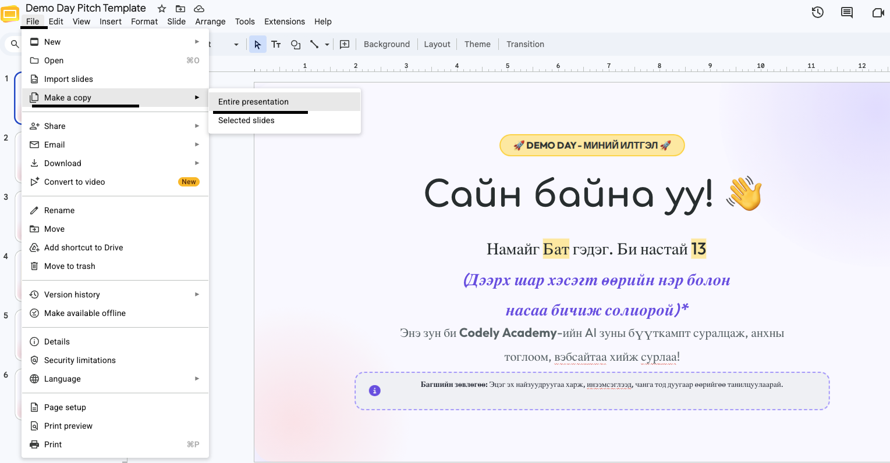
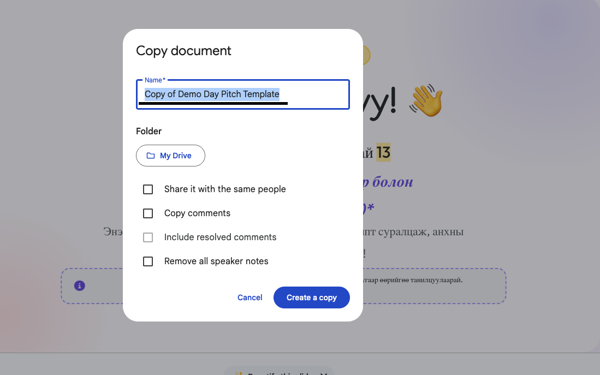

# Хичээл 9 — 🏁 Бүтээлээ дуусгах + 🎤 Танилцуулгын бэлтгэл

- 🎯 Өнөөдөр хийсэн бүх зүйлээ **бүрэн дуусгаж**, дараагийн хичээл дээр танилцуулах **pitch**-ээ бэлдэнэ! 🚀

- 🗓 Дараагийн хичээл = **DEMO DAY** — найзууд, эцэг эхийнхээ өмнө хийсэн зүйлсээ танилцуулна!

- ⏱ Нэг хүүхэд: **3 – 5 минут танилцуулна**

---

## 📋 Өнөөдрийн даалгавар

<details open>
<summary>1️⃣ <b>Хийсэн зүйлсээ ДУУСГАХ — хамгийн чухал!</b> ⏱ 60 мин</summary>

Demo Day-д бэлэн байх ёстой зүйлс — чеклистээ шалга:

- [ ] 🌐 **Танилцуулга (Portfolio) веб** — нэр, зураг, өөрийн мэдээлэлтэй
- [ ] 🎮 **Өөрийн тоглоом** (Typeracer г.м.) — ажилладаг, Publish хийсэн
- [ ] 🔗 Тоглоом бүр Portfolio дээрээ **tab болж нээгддэг**
- [ ] 🏆 Leaderboard ажилладаг (нэр + оноо хадгалагддаг)

> Дутуу зүйл байвал **эхлээд түүнийгээ дуусга**:

✅ Дээрхи бүгд ✔ болсон бол — Танилцуулгаа бэлдэнэ!

</details>

<details>
<summary>2️⃣ <b>Танилцуулгаа слайдаа бэлдэх</b> ⏱ 30 мин</summary>

1. 👉 **[Слайдын загвар (Demo Day Танилцуулгаа загвар)](https://docs.google.com/presentation/d/1BmCQIZCi-UTiC38hXwejo3yFqukCrb9f4juOB0BXsLs/edit?usp=sharing)** нээ
2. **File → Make a copy → Entire presentation** гэж хуулбарла
   
3. Өөрийн нэрээ өгөөд **Create a copy** дар
   
4. Слайд бүрийн ногоон зааврыг уншаад, өөрийн нэр, тоглоом, вэбсайтынхаа мэдээллээр соль

✅ 5 слайд бүгд өөрийн мэдээлэлтэй болсон

</details>

<details>
<summary>3️⃣ <b>Pitch дадлага</b> ⏱ 20 мин</summary>

Доорх загварын хоосон зайг өөрийнхөөрөө бөглөөд, **хосоороо** бие биедээ хэлж дадлага хий:

```
Сайн байна уу.

Намайг ______ гэдэг. Би ______ настай.

Би энэ зун AI ашиглаад өөрийн вэбсайт, тоглоом хийж сурсан.

Миний хийсэн хамгийн дуртай зүйл бол ______ (тоглоомын нэр).

Энэ тоглоомд ______ (юу хийдэг вэ? яаж тоглодог вэ?).

Хийхэд хамгийн хэцүү байсан нь ______ байсан ч би чадсан!

Одоо та бүхэнд тоглоомоо үзүүлье!

Баярлалаа.
```

> 💡 Зөвлөгөө: Ярианы дараа тоглоомоо тоглож үзүүлнэ — бүгд нийлээд 3-5 минутад багтаа. Тоглоомоо эхнээс нь дуустал нэг удаа өөрөө туршиж үз!

✅ Pitch-ээ харалгүйгээр хэлж чадаж байна

</details>

<details>
<summary>⭐ <b>Нэмэлт (заавал биш) — Өөрийн санаагаар шинэ тоглоом</b></summary>

> Зөвхөн 1️⃣, 2️⃣, 3️⃣-аа **бүрэн дуусгасан** хүүхдүүдэд! Амжихгүй байсан ч зүгээр 💪

Энэ удаад **өөрийн санаагаар** шинэ тоглоом эсвэл хэрэгтэй веб зохио. Жишээ:

- 📚 Англи үг цээжлэх тоглоом
- 🧮 Тооны бодлогын уралдаан
- ⏰ Гэрийн ажлаа бүртгэдэг апп
- 🐶 Тэжээвэр амьтнаа хариулах сануулагч

AI Studio → **шинэ app** → санаагаа промпт болгож бич:

```text
Надад [санаагаа бич] тоглоом хийж өгөөч.
- [Юу хийдэг байх 1]
- [Юу хийдэг байх 2]
- Өнгөлөг, хөгжилтэй дизайнтай
```

Дуусвал Publish хийгээд Portfolio-доо шинэ tab болгож нэм!

</details>

---

## 🏠 Гэрийн даалгавар

- 🎤 Танилцуулгаа гэрийнхэндээ хэлж дадлага хий
- 🖥 Тоглоомоо эхнээс нь дуустал нэг удаа туршиж үз (гацдаг газар байвал засуул)
- ✨ Дараагийн хичээл: **DEMO DAY** — слайд + тоглоом + яриагаа бэлэн байлгаад ир! 🏆
