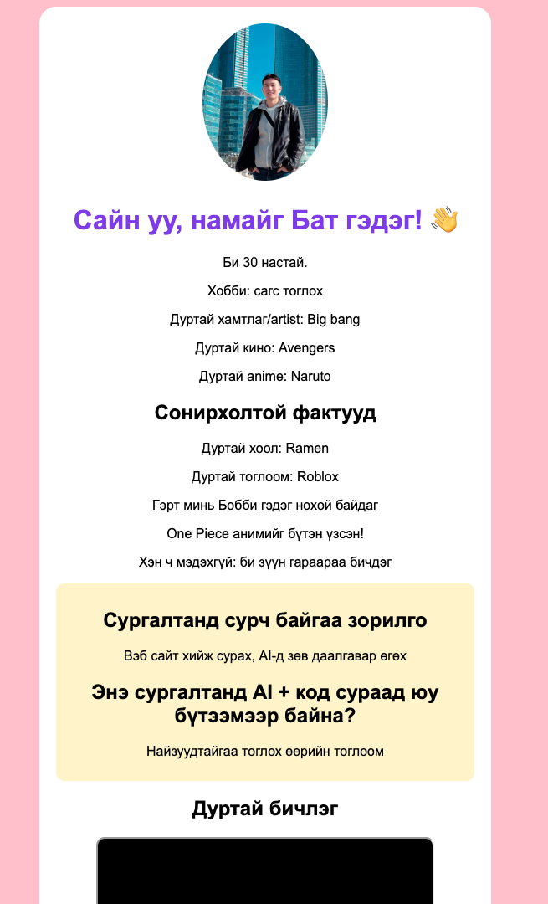
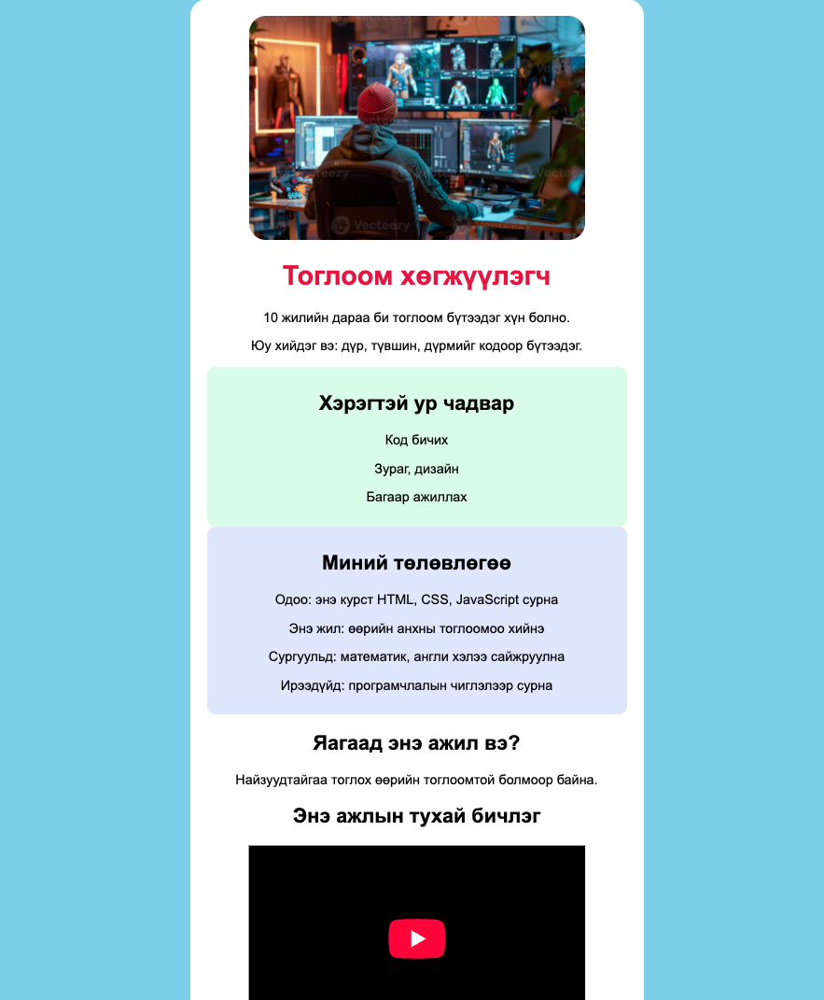

# Хичээл 2

### Өнөөдөр танилцуулга хуудсаа **хайрцаг, өнгө**-өөр сайжруулж, хоорондоо танилцана.

> **Агуулга:** HTML, CSS-ийг үргэлжлүүлэн сурч, 1-р хичээлийн танилцуулга хуудсаа сайжруулсан. VSCode-ийн товчлолууд, `div` (хайрцаг), хайрцагт өнгө нэмэх, `class` болон `id`-аар сонгож авахыг сурсан. YouTube бичлэгийг `iframe`-аар, видео файлыг `<video>` тагаар оруулсан. Хуудсаа үзүүлж, хоорондоо танилцсан.

---

> Алхам бүр дээр **дарж нээнэ**.

---

<details>
<summary><b>1. Өмнөх хуудсаа нээх</b></summary>

<br>

VSCode → **File** → **Open Folder...** → 1-р хичээлд хийсэн хавтсаа сонго → `my-first-page.html`-ээ нээ.

</details>

---

<details>
<summary><b>2. VSCode товчлол</b></summary>

<br>

| Товч                                     | Юу хийх                                       |
| ---------------------------------------- | --------------------------------------------- |
| **Ctrl + S**                             | Хадгалах                                      |
| **Ctrl + Enter**                         | Доор шинэ мөр нээх                            |
| **Win + ←** / **Win + →**                | Цонхыг хагаслах — VSCode, браузер зэрэгцүүлэх |
| **Ctrl + Shift + P** → `Format Document` | Кодыг цэгцлэх (догол мөр засах)               |
| **Ctrl + Z**                             | Буцаах                                        |
| **Ctrl + /**                             | Мөрийг тайлбар (comment) болгох               |

<details>
<summary>Mac дээр</summary>

<br>

**Ctrl** → **Cmd**. Цонх хагаслах: цонхны ногоон товч дээр хулганаа барина.

</details>

</details>

---

<details>
<summary><b>3. div — хайрцаг</b></summary>

<br>

`<div>` нь хэд хэдэн тагийг **нэг хайрцагт** хийнэ.

```html
<div>
  <h2>Сургалтанд сурч байгаа зорилго</h2>
  <p>Вэб сайт хийж сурах, AI-д зөв даалгавар өгөх</p>
</div>
```

Одоохондоо юу ч өөрчлөгдөхгүй — хайрцаг харагдахгүй байна. Дараагийн алхамд өнгө өгнө.

</details>

---

<details>
<summary><b>4. class — хайрцагт нэр өгөх</b></summary>

<br>

Хайрцагт **нэр** өг → CSS-ээр тэр нэрийг сонгож өнгө нэм.

| HTML дээр      | CSS дээр |
| -------------- | -------- |
| `class="goal"` | `.goal`  |

```html
<div class="goal">
  <h2>Сургалтанд сурч байгаа зорилго</h2>
  <p>Вэб сайт хийж сурах, AI-д зөв даалгавар өгөх</p>

  <h2>AI + код сураад юу бүтээмээр байна?</h2>
  <p>Найзуудтайгаа тоглох өөрийн тоглоом</p>
</div>
```

`<style>` дотор нэм:

```css
.goal {
  background: #fef3c7; /* шар хайрцаг */
  padding: 10px; /* дотор зай */
  border-radius: 10px; /* булан мөлгөр */
}
```

</details>

---

<details>
<summary><b>5. Үндсэн карт</b></summary>

<br>

`<body>` доторх **бүх агуулгаа** нэг том хайрцагт хий.

```html
<body>
  <div class="card">
    <!-- зураг, нэр, мэдээлэл, зорилго, бичлэг... -->
  </div>
</body>
```

```css
body {
  background: pink;
}
.card {
  background: white; /* цагаан карт */
  max-width: 500px; /* хамгийн их өргөн */
  margin: auto; /* голлуулах */
  padding: 20px;
  border-radius: 20px;
}
img {
  width: 150px;
  border-radius: 50%; /* дугуй зураг */
}
```



</details>

---

<details>
<summary><b>6. id — ганцхан зүйлийг сонгох</b></summary>

<br>

`class` — олон элементэд давтаж болно. `id` — хуудсанд **ганц** л байна.

| HTML дээр   | CSS дээр |
| ----------- | -------- |
| `id="name"` | `#name`  |

```html
<h1 id="name">Сайн уу, намайг Бат гэдэг! 👋</h1>
```

```css
#name {
  color: #7c3aed;
}
```

<details>
<summary>class уу, id уу?</summary>

<br>

|            | `class`          | `id`    |
| ---------- | ---------------- | ------- |
| CSS-д      | `.нэр`           | `#нэр`  |
| Хэдэн удаа | Олон             | Ганц    |
| Жишээ      | `.goal`, `.card` | `#name` |

</details>

</details>

---

<details>
<summary><b>7. Бичлэг оруулах — YouTube, видео файл</b></summary>

<br>

**YouTube:** бичлэгээ ол → **Share** → **Embed** → **Copy** → карт дотроо paste.

```html
<h2>Дуртай бичлэг</h2>
<iframe
  width="400"
  height="220"
  src="https://www.youtube.com/embed/xxxxx"
></iframe>
```

**Видео файл:** `.mp4` файлаа HTML-тэйгээ **нэг хавтсанд** хий.

```html
<video src="my-video.mp4" width="400" controls></video>
```

<details>
<summary>iframe уу, video уу?</summary>

<br>

| Таг        | Хэзээ                      |
| ---------- | -------------------------- |
| `<iframe>` | YouTube, өөр сайтын бичлэг |
| `<video>`  | Өөрийн `.mp4` файл         |

`controls` — тоглуулах, зогсоох товч гаргана.

</details>

</details>

---

<details>
<summary><b>8. Үзүүлж танилцах</b></summary>

<br>

Хуудсаа ангийнхандаа үзүүл → хоорондоо танилц. Бүрэн жишээ: **[index.html](index.html)**

</details>

---

<details>
<summary><b>Гэрийн даалгавар</b></summary>

<br>

Шинэ файл **`dream-job.html`** → **"Миний мөрөөдлийн ажил"** хуудас хий. Доорх зураг шиг болго.



| #   | Юу хийх                                                                               | ✔️  |
| --- | ------------------------------------------------------------------------------------- | --- |
| 1   | Ажлын зураг                                                                           | ⬜  |
| 2   | `div class="card"` — үндсэн карт                                                      | ⬜  |
| 3   | `id` — ажлын нэр өөр өнгөтэй                                                          | ⬜  |
| 4   | Өнгөтэй хайрцаг — хэрэгтэй ур чадвар                                                  | ⬜  |
| 5   | Өөр өнгөтэй хайрцаг — **миний төлөвлөгөө**: мөрөөдлийн ажилдаа орохын тулд юу хийх вэ | ⬜  |
| 6   | Энэ ажлын тухай YouTube бичлэг эсвэл видео                                            | ⬜  |

<details>
<summary>Төлөвлөгөөнд юу бичих вэ?</summary>

<br>

| Хэзээ     | Жишээ                                 |
| --------- | ------------------------------------- |
| Одоо      | Энэ курст HTML, CSS, JavaScript сурна |
| Энэ жил   | Анхны тоглоомоо хийнэ                 |
| Сургуульд | Математик, англи хэлээ сайжруулна     |
| Ирээдүйд  | Програмчлалын чиглэлээр сурна         |

</details>

Өөр сэдэв сонгож болно: миний анги, миний гэр бүл, миний хобби, миний тэжээвэр амьтан.

> Сургуулийн нэр, хаяг, утсаа **бүү** бич.

<details>
<summary>Гацвал</summary>

<br>

Өнөөдрийн хуудсаа хар — бүтэц нь яг адилхан, зөвхөн агуулга, өнгө нь өөр. Бүрэн код: [homework-example.html](homework-example.html)

</details>

</details>
