# Хичээл 4

### Өнөөдөр **Flexbox**-ыг 3 хайрцгаар ойлгож, тоглоомоор дасгалжуулж, бүтэн хуудсыг flex-ээр цэгцэлнэ. HTML, CSS хэсгийн сүүлийн хичээл.

> **Агуулга:** Flexbox — эцэг/хүүхэд хайрцаг, `justify-content`, `align-items`, `flex-direction`, `gap`, `flex-wrap`. 3 хайрцгийн жишээ, "Малаа хашаандаа" тоглоом (14 түвшин), тоглоомын сайтын хуудас. Гэрийн даалгавар: YouTube нүүр хуудас.

---

> Алхам бүр дээр **дарж нээнэ**.

---

<details>
<summary><b>1. 3 хайрцаг — flex-ийг ЭЦЭГТ бичнэ</b></summary>

<br>

**[hairtsag.html](hairtsag.html)**-ийг VSCode-д нээ. Нэг **эцэг** хайрцаг (тасархай хүрээ), дотор нь 3 **хүүхэд**.

```html
<div class="parent">          <!-- эцэг: flex энд -->
  <div class="box">1</div>    <!-- хүүхэд -->
  <div class="box">2</div>
  <div class="box">3</div>
</div>
```

`.parent { }` дотор мөр нэмээд хадгал → браузерт хар.

| flex-гүй — дээрээс доош              | `display: flex` — хажуу хажууд        |
| ------------------------------------ | ------------------------------------- |
| 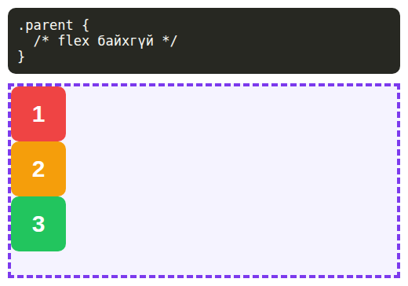 | 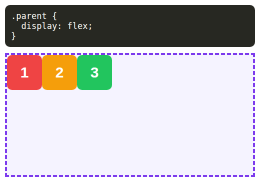 |

| ✅ Зөв                         | ❌ Буруу                         |
| ------------------------------ | -------------------------------- |
| `.parent { display: flex; }`   | `.box { display: flex; }`        |

</details>

---

<details>
<summary><b>2. → Хэвтээ: justify-content</b></summary>

<br>

`display: flex;`-ийн доор нэмж, утгыг нь сольж үз:

| `center`                              | `flex-end`                             |
| ------------------------------------- | -------------------------------------- |
| 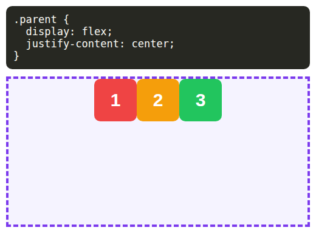 | 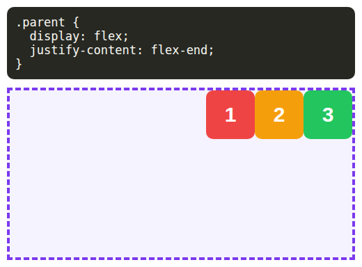 |
| **`space-between`**                   | **`space-around`**                     |
| 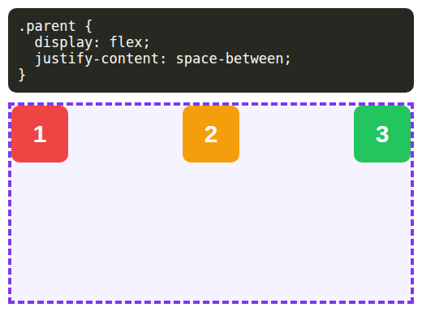 | 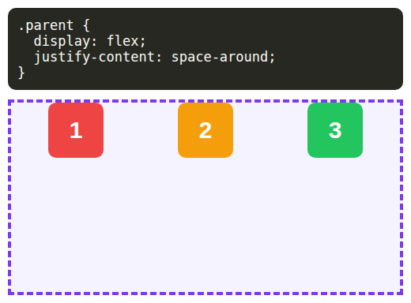 |

Хоорондоо зай: `gap`

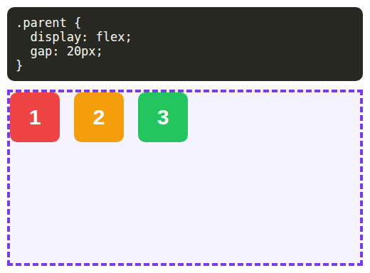

</details>

---

<details>
<summary><b>3. ↓ Босоо: align-items</b></summary>

<br>

Эцэг хайрцаг **өндөртэй** байх ёстой (`height`) — тэгэхгүй бол доош явах зай алга.

| `align-items: center`                 | `align-items: flex-end`                |
| ------------------------------------- | -------------------------------------- |
| 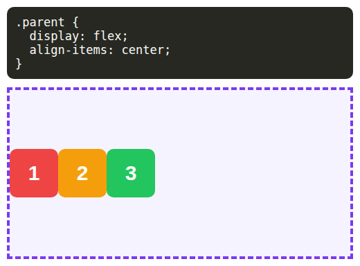 | 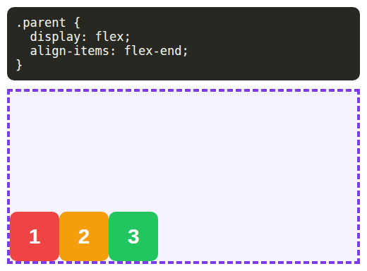 |

**Яг голд нь** — хоёуланг нь:

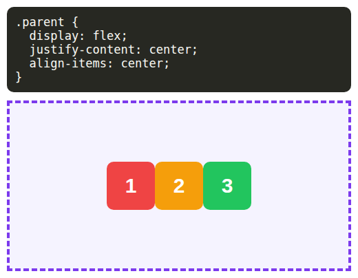

<details>
<summary>Цээжлэх</summary>

<br>

| Сум          | Хэн удирдах        |
| ------------ | ------------------ |
| **→** хэвтээ | `justify-content`  |
| **↓** босоо  | `align-items`      |

</details>

</details>

---

<details>
<summary><b>4. column ба wrap</b></summary>

<br>

`flex-direction: column` → дахиад дээрээс доош, гэхдээ одоо flex удирдана.

| `column`                              | `column` + `align-items: center`       |
| ------------------------------------- | -------------------------------------- |
| 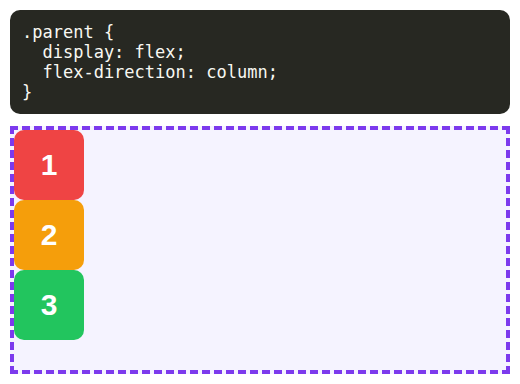 | 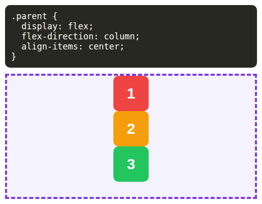 |

**Анхаар:** column үед сум **эргэнэ** — `align-items` хэвтээ, `justify-content` босоо болно.

`flex-wrap: wrap` → багтахгүй бол доод мөр рүү:

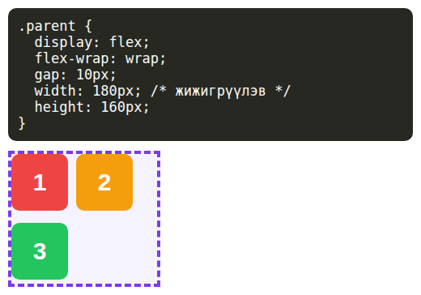

</details>

---

<details>
<summary><b>5. Дасгал — Малаа хашаандаа оруул 🐑</b></summary>

<br>

**[togloom.html](togloom.html)**-ийг браузерт нээ.

1. Даалгавраа унш.
2. CSS-ээ бич → мал шууд хөдөлнө.
3. Тасархай дугуйнд орвол **Зөв!** → дараагийн түвшин.

14 түвшин. Сүүлийн 2 нь **Босс**.

<details>
<summary>Гацвал</summary>

<br>

- **Сануулга** товч дар
- Улаан бичиг гарвал: үсэг, `:` ба `;` зөв эсэх
- 2–4-р алхмын зургуудыг хар

</details>

</details>

---

<details>
<summary><b>6. Жинхэнэ хуудас — Тоглоомын сайт</b></summary>

<br>

**[tusul.html](tusul.html)**-ийг VSCode-д нээ. HTML бэлэн, flex-ийн мөрүүд дутуу.

| Эхлэл                      | Зорилго                        |
| -------------------------- | ------------------------------ |
| 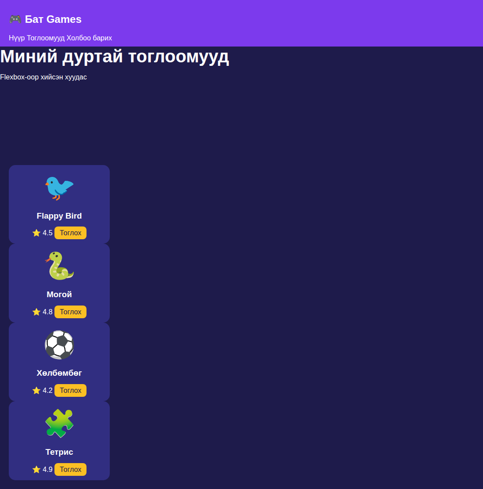 | 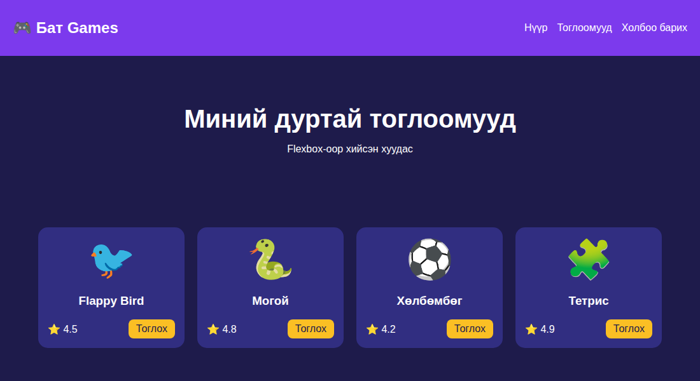 |

CSS дотор `/* ← энд ... мөр */` гэсэн **5** газрыг бөглө:

| #   | Хэсэг     | Хүсэлт                                          |
| --- | --------- | ----------------------------------------------- |
| 1   | `.header` | Лого зүүн, цэс баруун, босоо голдоо             |
| 2   | `.nav`    | Холбоосууд хажуу хажууд, 15px зай               |
| 3   | `.hero`   | Доош цуваа, бүгд голдоо                         |
| 4   | `.cards`  | Хажуу хажууд, 20px зай, багтахгүй бол доош, голдоо |
| 5   | `.bottom` | Оноо зүүн, товч баруун, босоо голдоо            |

<details>
<summary>Зөвлөгөө</summary>

<br>

- Бүгд `display: flex;`-ээр эхэлнэ.
- №1 ба №5 — тоглоомын **Босс 1**-тэй адилхан.
- Утсан дээр шалга: **F12** → утасны дүрс. Картууд доош бууж байна уу?

</details>

</details>

---

<details>
<summary><b>7. ✨ Бонус</b></summary>

<br>

| Тоглоом                                                     | Юу                         |
| ----------------------------------------------------------- | -------------------------- |
| [Flexbox Froggy](https://flexboxfroggy.com)                 | Мэлхийг навчинд — 24 түвшин |
| [Flexbox Defense](http://www.flexboxdefense.com)            | Цамхгаа flex-ээр байрлуул  |

</details>

---

<details>
<summary><b>Гэрийн даалгавар — YouTube нүүр хуудас</b></summary>

<br>

**[youtube.html](youtube.html)**-ийг нээ. HTML бэлэн — flex-ээр YouTube шиг болго.

| Эхлэл                                    | Зорилго                                    |
| ---------------------------------------- | ------------------------------------------ |
| 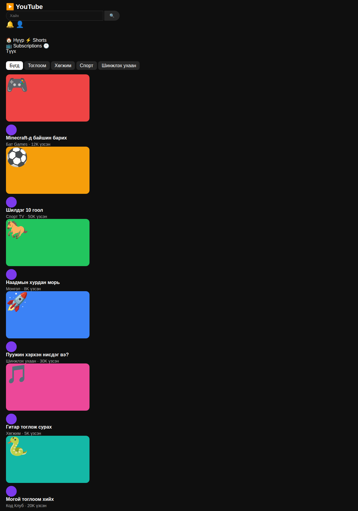 | 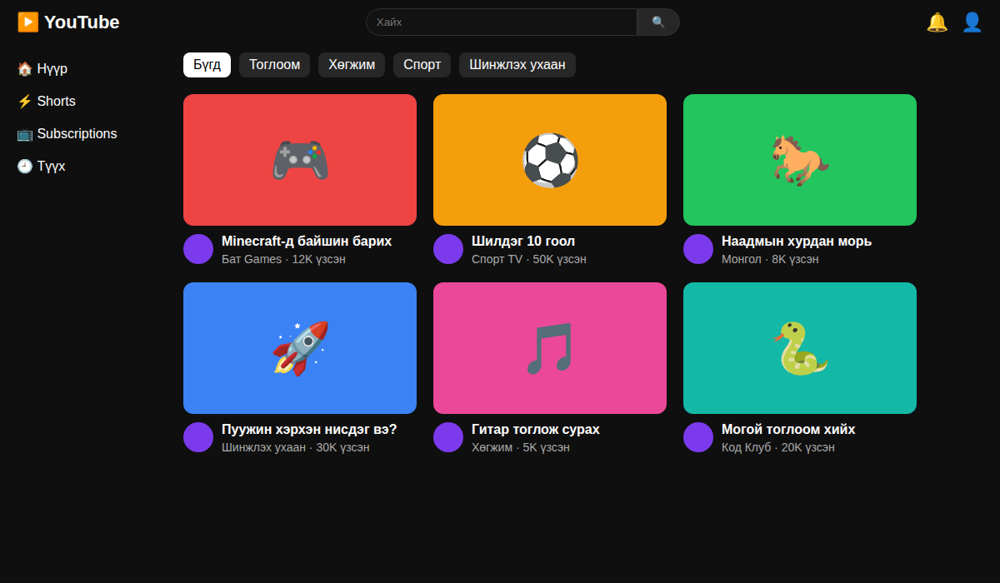 |

CSS дотор `/* ← энд ... мөр */` гэсэн **9** газрыг бөглө:

| #   | Хэсэг       | Хүсэлт                                         |
| --- | ----------- | ---------------------------------------------- |
| 1   | `.header`   | Лого зүүн, хайлт голд, дүрс баруун, босоо голдоо |
| 2   | `.search`   | input ба товч хажуу хажууд                     |
| 3   | `.icons`    | Хажуу хажууд, 15px зай                         |
| 4   | `.page`     | Зүүн цэс ба видеонууд хажуу хажууд             |
| 5   | `.sidebar`  | Дээрээс доош, 20px зай                         |
| 6   | `.chips`    | Хажуу хажууд, 10px зай                         |
| 7   | `.videos`   | Хажуу хажууд, 20px зай, багтахгүй бол доош      |
| 8   | `.thumb`    | Emoji яг голд нь                               |
| 9   | `.info`     | Дугуй зураг ба текст хажуу хажууд, 10px зай     |

| #   | Юу хийх                                                      | ✔️  |
| --- | ------------------------------------------------------------ | --- |
| 1   | `youtube.html`-ийн 9 газрыг бөглө                            | ⬜  |
| 2   | Өөрийн дуртай 3 видео нэм (нэр, өнгө, emoji)                 | ⬜  |
| 3   | Screenshot-оо Discord-д тавь                                 | ⬜  |

Дараагийн хичээлд: ийм сайтыг **хайрцгуудад хувааж** сурна.

</details>
