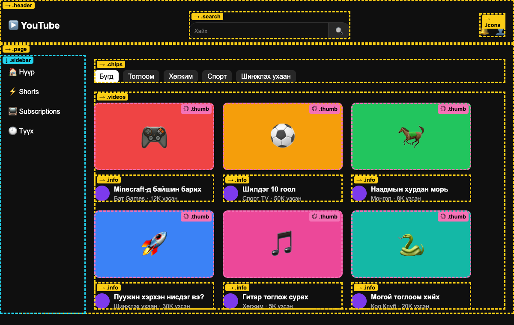
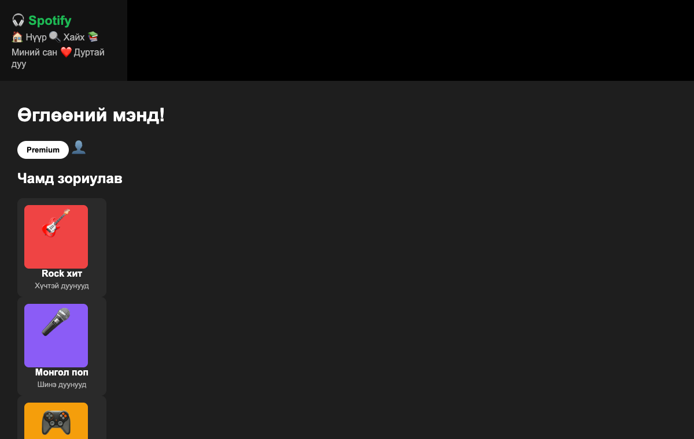
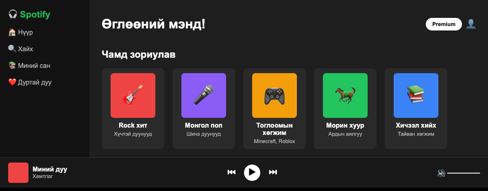
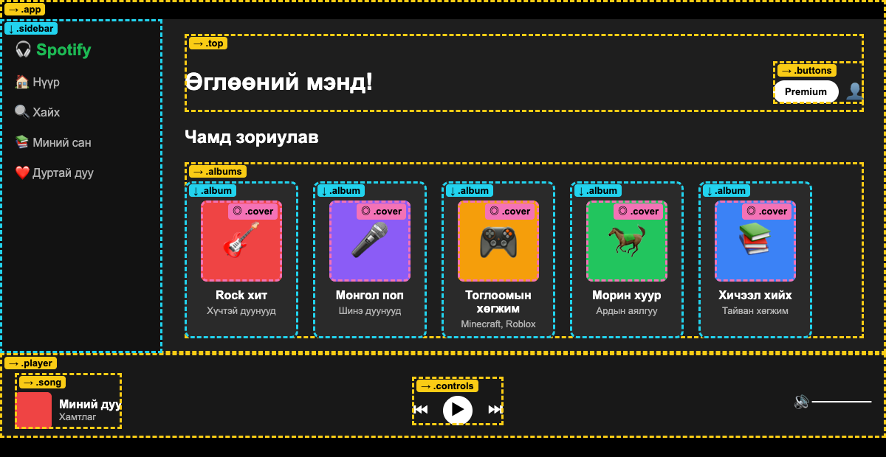

# Хичээл 5

### Өнөөдөр алдартай сайтыг **хайрцгуудад хувааж**, flex-ээр дахин бүтээнэ. Эцэст нь өөрийн portfolio-гийн зургийг зурна.

> **Агуулга:** _(төлөвлөсөн)_ Сайтыг хайрцагт хуваах арга (3 асуулт), YouTube хуваалт, `spotify.html` — flex-ийг зааваргүй бөглөх, өөрийн portfolio-гийн ноорог зураг.

---

> Алхам бүр дээр **дарж нээнэ**.

---

<details>
<summary><b>1. Гэрийн даалгавар — YouTube</b></summary>

<br>

`youtube.html`-ээ ангийнхандаа үзүүл. Доорх зураг дээр хайрцаг бүр **хаана** байгааг хар:



| Тэмдэг | Утга                                   | CSS                                    |
| ------ | -------------------------------------- | -------------------------------------- |
| **→**  | Доторх хайрцгууд хажуу хажууд          | `display: flex;`                       |
| **↓**  | Доторх хайрцгууд дээрээс доош          | `display: flex; flex-direction: column;` |
| **◎**  | Доторх зүйл яг голдоо                  | `justify-content` + `align-items: center` |

</details>

---

<details>
<summary><b>2. Арга — 3 асуулт</b></summary>

<br>

Ямар ч сайтыг харахдаа хайрцаг бүрээс:

| #   | Асуулт                                     | Хариу → CSS                                      |
| --- | ------------------------------------------ | ------------------------------------------------ |
| 1   | **Хүрээлж буй хайрцаг** аль вэ?            | Дөрвөлжин зур, нэр (`class`) өг                  |
| 2   | **Доторх хайрцгууд** → эсвэл ↓ ?            | → `display: flex` · ↓ `flex-direction: column`  |
| 3   | **Хаана** байрлах вэ? Зай байна уу?          | `justify-content`, `align-items`, `gap`, `flex-wrap` |

<details>
<summary>Жишээ — YouTube толгой</summary>

<br>

1. `.header` — дээд талын урт хайрцаг.
2. Лого, хайлт, дүрс → **хажуу хажууд** → `display: flex;`
3. Хоёр захад тарсан, босоо голдоо → `justify-content: space-between; align-items: center;`

</details>

</details>

---

<details>
<summary><b>3. Дасгал — Spotify</b></summary>

<br>

**[spotify.html](spotify.html)**-ийг VSCode-д нээ. HTML бэлэн. CSS дотор `/* ? */` гэсэн **10** газар бий — **юу бичихийг өөрөө шийднэ**.

| Эхлэл                                       | Зорилго                                       |
| ------------------------------------------- | --------------------------------------------- |
|  |  |

**Эхлээд цаасан дээр** — хайрцаг бүрт 3 асуултаа хариул:

| #   | Хайрцаг     | → эсвэл ↓ | Хаана, зай |
| --- | ----------- | --------- | ---------- |
| 1   | `.app`      |           |            |
| 2   | `.sidebar`  |           |            |
| 3   | `.top`      |           |            |
| 4   | `.buttons`  |           |            |
| 5   | `.albums`   |           |            |
| 6   | `.album`    |           |            |
| 7   | `.cover`    |           |            |
| 8   | `.player`   |           |            |
| 9   | `.song`     |           |            |
| 10  | `.controls` |           |            |

Дараа нь кодоо бич → хадгал → браузерт хар.

<details>
<summary>Гацвал — хуваалтын зураг</summary>

<br>



- `.player` — YouTube-ийн `.header`-тэй адилхан.
- `.cover` — YouTube-ийн `.thumb`-тэй адилхан.
- Утсан дээр шалга: **F12** → утасны дүрс. Альбомууд доош бууж байна уу?

</details>

</details>

---

<details>
<summary><b>4. Өөрөө хуваа</b></summary>

<br>

1. Дуртай сайтаа нээ (Netflix, Roblox, Instagram, сургуулийн сайт …).
2. Screenshot ав: **Win + Shift + S**.
3. **Paint**-д нээж хайрцгуудаа зур, хажууд нь **→** эсвэл **↓** гэж бич.
4. Хөрштэйгөө солиод шалгуул.

</details>

---

<details>
<summary><b>5. Миний portfolio — ноорог зураг</b></summary>

<br>

Дараагийн хичээлд AI-аар **өөрийн сайтаа** орчин үеийн болгоно. AI-д өгөх **зургийг** өнөөдөр зурна.

Цаасан дээр сайтаа хайрцгаар зур:

| Хэсэг            | Юу байх                                        |
| ---------------- | ---------------------------------------------- |
| Цэс              | Нүүр · Миний тухай · Бүтээлүүд …               |
| Миний тухай      | Зураг, нэр, хобби                              |
| **Миний бүтээлүүд** | Карт бүр = 1 бүтээл (YouTube, Spotify, …)  |

Хайрцаг бүрт **→** эсвэл **↓** гэж бич. Утсаараа зургийг нь ав.

</details>

---

<details>
<summary><b>Гэрийн даалгавар — portfolio хавтас</b></summary>

<br>

Бүх бүтээлээ **нэг хавтсанд** цуглуул:

```text
portfolio/
  index.html        ← Хичээл 1–3 (миний хуудас)
  dream-job.html    ← Хичээл 2
  my-photo.png
  youtube.html      ← Хичээл 4
  spotify.html      ← Хичээл 5
  noorog.jpg        ← ноорог зураг
```

| #   | Юу хийх                                                        | ✔️  |
| --- | -------------------------------------------------------------- | --- |
| 1   | `spotify.html`-ийн 10 газрыг бөглө                             | ⬜  |
| 2   | `portfolio` хавтас үүсгэж, дээрх файлуудаа хуул                 | ⬜  |
| 3   | `index.html`-ээ нээ → цэсний холбоосууд ажиллаж байна уу?      | ⬜  |
| 4   | Ноорог зургаа `noorog.jpg` нэрээр хавтсандаа хий               | ⬜  |

Дараагийн хичээлд: энэ хавтсаа AI-д өгөөд **хэдхэн минутад** гоё сайт болгоно.

</details>
