# Хичээл 5

### Өнөөдөр **YouTube**-ийн нүүр хуудсыг хоосон файлаас алхам алхмаар бүтээж, бүх хуудсаа холбоод **интернэтэд гаргана**. HTML, CSS хэсгийн төгсгөл.

> **Агуулга:** _(төлөвлөсөн)_ Хуудсыг эхлээд хайрцгуудад хуваах (`border`-оор харах), дараа нь элементүүдээ хийх — `my-youtube.html`: интернэтийн лого, icon, зураг, `<a>`-аар YouTube руу үсрэх, `:hover`. Бүх хуудсаа `my-first-web` хавтсанд холбож Netlify Drop-оор байршуулах.

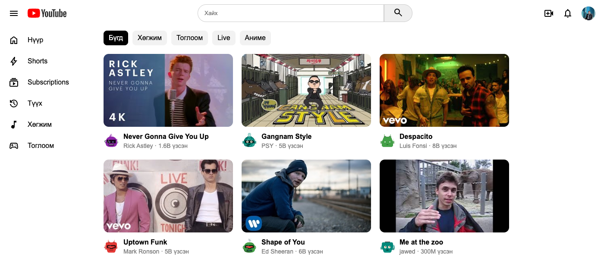

---

> Алхам бүр дээр **дарж нээнэ**.

---

<details>
<summary><b>0. Эхлээд зур — хайрцгуудад хуваах</b></summary>

<br>

Кодоос өмнө **хуваалтаа** олно. Эхлээд 3 том хайрцаг:

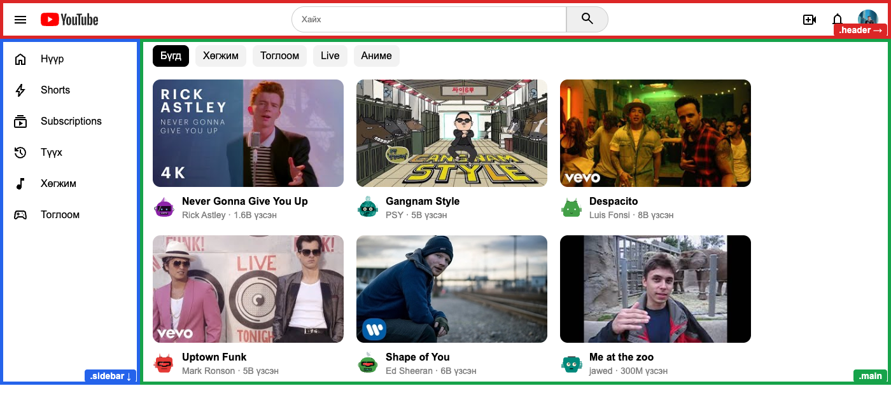

Дараа нь том хайрцаг бүрийн **дотор** дахин хуваана:

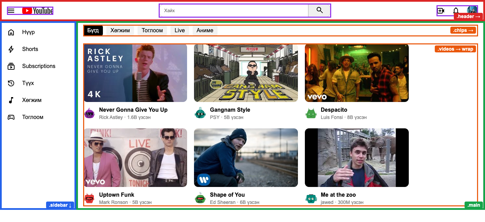

</details>

---

<details>
<summary><b>1. Үндсэн хуваалт — 3 хайрцаг, улаан хүрээтэй</b></summary>

<br>

Хичээл 1-ээс хойш ашиглаж буй хавтсаа **`my-first-web`** гэж нэрлэ. Дотор нь `my-youtube.html` үүсгэ → `!` + **Tab**.

```html
<div class="header">header</div>

<div class="page">
  <div class="sidebar">sidebar</div>
  <div class="main">main</div>
</div>
```

```css
body {
  margin: 0;
  font-family: Arial, sans-serif;
}

div {
  border: 2px solid red; /* түр хугацаанд — хуваалтаа харах */
}
```

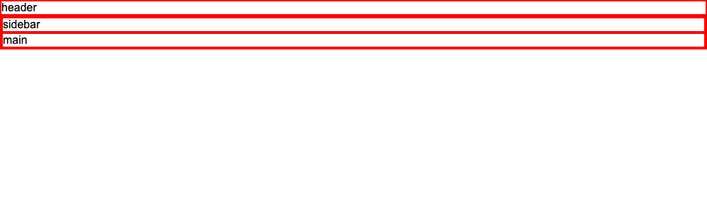

<details>
<summary>Яагаад хүрээ?</summary>

<br>

`div` өөрөө харагддаггүй. Улаан хүрээ хайрцаг бүр **хаана, ямар том** байгааг харуулна. Төгсгөлд нь нэг мөрөөр арилгана.

</details>

</details>

---

<details>
<summary><b>2. Том хуваалт — sidebar зүүн, main баруун</b></summary>

<br>

```css
.page {
  display: flex;
}

.sidebar {
  width: 200px;
}

.main {
  flex: 1; /* үлдсэн зайг бүгдийг эзэлнэ */
}
```

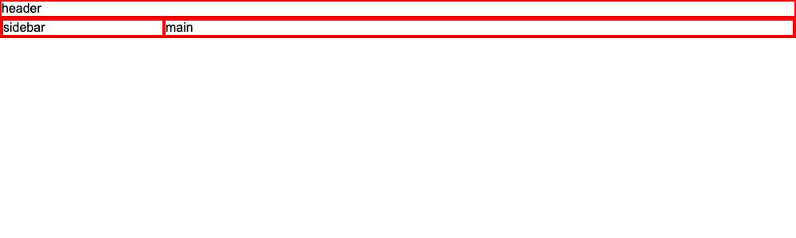

</details>

---

<details>
<summary><b>3. Толгой — лого, хайлт, дүрс</b></summary>

<br>

`header` гэсэн үгийг устгаад 3 хайрцаг хий. Лого, icon-ууд нь **интернэтийн зураг**:

```html
<div class="header">
  <div class="logo">
    
    
  </div>
  <div class="search">
    <input placeholder="Хайх" />
    <button>
      
    </button>
  </div>
  <div class="icons">
    
    
    
  </div>
</div>
```

```css
.header {
  display: flex;
  justify-content: space-between; /* 3 хайрцаг: зүүн, голд, баруун */
  align-items: center;
  padding: 10px 20px;
}

.logo {
  display: flex;
  align-items: center;
  gap: 20px;
}

.logo-img {
  width: 90px;
}

.icon {
  width: 24px;
}

.search {
  display: flex;
}

.search input {
  width: 400px;
  padding: 10px 15px;
  border: 1px solid #ccc;
  border-radius: 20px 0 0 20px;
}

.search button {
  padding: 6px 20px;
  border: 1px solid #ccc;
  border-radius: 0 20px 20px 0;
}

.icons {
  display: flex;
  align-items: center;
  gap: 20px;
}

.profile {
  width: 32px;
  height: 32px;
  border-radius: 50%; /* дугуй — өөрийн зураг */
}
```

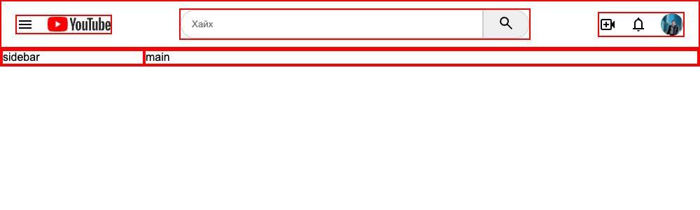

<details>
<summary>Icon-ыг яаж солих вэ?</summary>

<br>

Хаягийн дундах **нэрийг** л соль:

```text
.../materialsymbolsoutlined/notifications/default/24px.svg
.../materialsymbolsoutlined/home/default/24px.svg
```

Нэрсийг [fonts.google.com/icons](https://fonts.google.com/icons)-оос хай: icon дээр дарахад доор нь нэр гарна (`sports_esports`, `music_note` …).

</details>

<details>
<summary>Шинэ таг: input, button</summary>

<br>

| Таг        | Юу                                            |
| ---------- | --------------------------------------------- |
| `<input>`  | Бичих нүд. `placeholder` — саарал жишээ бичиг |
| `<button>` | Товч                                          |

`border-radius: 20px 0 0 20px` — зөвхөн **зүүн** талын 2 булан дугуй.

</details>

</details>

---

<details>
<summary><b>4. Зүүн цэс — a, hover</b></summary>

<br>

Цэс бүр = `<a>` (icon + бичиг). Доор нь `history`, `music_note`, `sports_esports` icon-оор 3-ыг өөрөө нэм.

```html
<div class="sidebar">
  <a href="index.html">
    
    Нүүр
  </a>
  <a href="#">
    
    Shorts
  </a>
  <a href="#">
    
    Subscriptions
  </a>
</div>
```

```css
.sidebar {
  display: flex;
  flex-direction: column; /* ↓ */
  gap: 5px;
  padding: 10px;
}

.sidebar a {
  display: flex; /* icon → бичиг */
  align-items: center;
  gap: 20px;
  padding: 10px;
  border-radius: 10px;
  color: black;
  text-decoration: none;
}

.sidebar a:hover {
  background: #f2f2f2; /* хулгана очиход саарал */
}
```

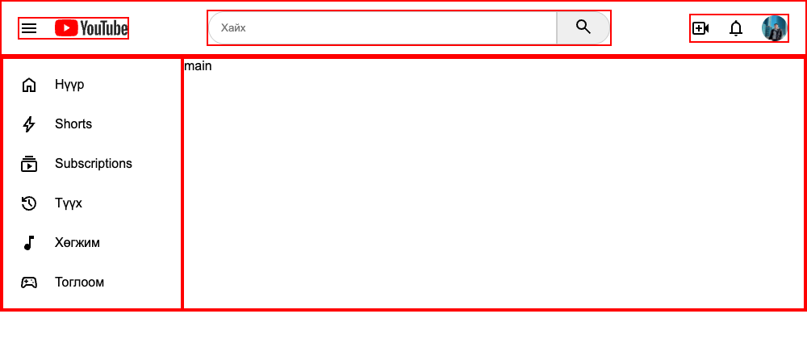

**Нүүр** → `index.html` — өөрийн хуудас руу буцна.

</details>

---

<details>
<summary><b>5. Ангилал (chips)</b></summary>

<br>

`main` гэсэн үгийг устгаад:

```html
<div class="main">
  <div class="chips">
    <span class="on">Бүгд</span>
    <span>Хөгжим</span>
    <span>Тоглоом</span>
    <span>Live</span>
    <span>Аниме</span>
  </div>
</div>
```

```css
.main {
  padding: 10px 20px;
}

.chips {
  display: flex;
  flex-wrap: wrap;
  gap: 10px;
  margin-bottom: 20px;
}

.chips span {
  background: #f2f2f2;
  padding: 8px 12px;
  border-radius: 8px;
}

.chips span:hover {
  background: #e5e5e5;
}

.chips .on {
  background: black;
  color: white;
}
```

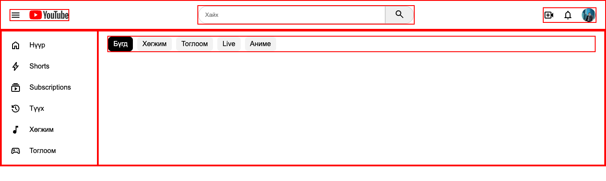

</details>

---

<details>
<summary><b>6. Нэг видео — дарахад YouTube руу</b></summary>

<br>

`.chips`-ийн **доор**, `.main` дотор. Видео бүтнээрээ `<a>` → дарахад YouTube шинэ цонхонд нээгдэнэ.

```html
<div class="videos">
  <a class="video" href="ВИДЕОНЫ ХАЯГ" target="_blank">
    
    <div class="info">
      
      <div>
        <b>Видеоны нэр</b>
        <p>Суваг · 1M үзсэн</p>
      </div>
    </div>
  </a>
</div>
```

```css
.videos {
  display: flex;
  flex-wrap: wrap; /* багтахгүй бол доош */
  gap: 20px;
}

.video {
  width: 300px;
  color: black;
  text-decoration: none;
}

.thumb {
  width: 100%;
  border-radius: 12px;
}

.video:hover .thumb {
  border-radius: 0; /* YouTube дээр яг ингэдэг */
}

.info {
  display: flex; /* дугуй зураг → текст */
  gap: 10px;
  margin-top: 10px;
}

.avatar {
  width: 36px;
  height: 36px;
  border-radius: 50%;
}

.info p {
  margin: 4px 0;
  color: gray;
  font-size: 14px;
}
```

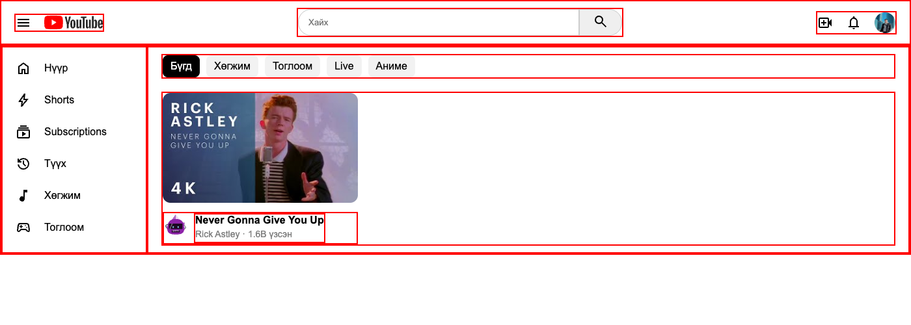

| Юу            | Хаанаас                                                              |
| ------------- | -------------------------------------------------------------------- |
| Видеоны хаяг  | YouTube-д видеогоо нээ → дээд талын хаягийг хуул                     |
| Зургийн хаяг  | Видеоны зураг дээр **баруун товч → Copy image address**             |
| Сувгийн зураг | Сувгийн дугуй зураг дээр **баруун товч → Copy image address**       |

<details>
<summary>Зураг гарахгүй бол</summary>

<br>

Видеоны хаягаас `v=`-ийн араас байгаа кодыг ав: `youtube.com/watch?v=`**`dQw4w9WgXcQ`**

```text
https://i.ytimg.com/vi/dQw4w9WgXcQ/mqdefault.jpg
```

Сувгийн зураг: `https://api.dicebear.com/9.x/bottts/svg?seed=Бат` — `seed=`-ийн араас дурын нэр бич → робот зураг.

</details>

</details>

---

<details>
<summary><b>7. Олон видео</b></summary>

<br>

1. `<a class="video" ...>` … `</a>`-ийг бүтнээр нь хуулж **5** удаа тавь.
2. Хаяг, зураг, нэрийг дуртай видеогоороо соль.
3. Хадгал → хулганаа видео дээр аваач, дараад үз.

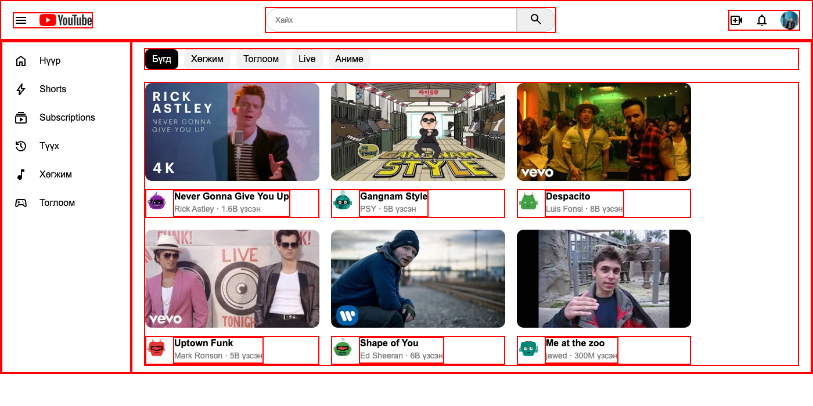

</details>

---

<details>
<summary><b>8. Хүрээгээ арилга</b></summary>

<br>

`div { border: 2px solid red; }`-ийг устга → бэлэн!


Хулгана очиход (`:hover`):

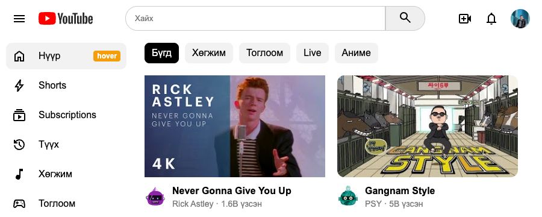

<details>
<summary>✨ Бонус</summary>

<br>

| Санаа                  | Хэрхэн                                                          |
| ---------------------- | --------------------------------------------------------------- |
| Бараан горим           | `body { background: #0f0f0f; color: white; }` + `.video`, `.sidebar a`-ийн `color: white` |
| Ангилал дээр хулгана   | `.chips span:hover { background: black; color: white; }`        |
| Видеоны нэр улаан болох | `.video:hover b { color: red; }`                               |

</details>

</details>

---

<details>
<summary><b>9. Бүх хуудсаа холбох</b></summary>

<br>

Бүгд **`my-first-web`** хавтсанд — жишээ: [my-first-web/](my-first-web)

```text
my-first-web/
  index.html        ← my-first-page.html-ийн нэрийг соль (заавал!)
  dream-job.html
  my-youtube.html
  hairtsag.html     ← Хичээл 4-ийн дасгалууд
  tusul.html
  togloom.html
  my-photo.png
  job.jpg
```

> **Нэг сайт, нэг линк.** Өнгөрсөн дасгалуудаа (Хичээл 4: `hairtsag.html`, `tusul.html`, `togloom.html`) энэ хавтсанд хуулна. `index.html`-ийн доор "Миний дасгалууд" хэсэгт холбоос болгоно. Netlify-д **нэг** линк гарна, бүх хуудас түүнээс нээгдэнэ.

1. `my-first-page.html` → **`index.html`** болгож нэрийг соль (интернэтэд нүүр хуудас заавал ийм нэртэй).
2. Бүх хуудасны цэсийг ижил болго:

```html
<a href="index.html">Нүүр</a>
<a href="dream-job.html">Мөрөөдлийн ажил</a>
<a href="my-youtube.html">Миний YouTube</a>
```

3. `index.html`-ийн доор нэм (цэсний `<div class="nav">`-ийг хуулж болно):

```html
<h2>Миний дасгалууд</h2>
<div class="nav">
  <a href="hairtsag.html">3 хайрцаг</a>
  <a href="tusul.html">Тоглоомын сайт</a>
  <a href="togloom.html">Малаа хашаандаа</a>
</div>
```

4. Браузерт нээгээд **бүх холбоосыг** дар: Нүүр → Мөрөөдлийн ажил → Миний YouTube → Нүүр → дасгалууд.

<details>
<summary>Зураг, холбоос ажиллахгүй бол</summary>

<br>

| ❌ Буруу                              | ✅ Зөв                          |
| ------------------------------------ | ------------------------------ |
| `href="my-first-page.html"`          | `href="index.html"`            |
| `src="C:\Users\Bat\Desktop\job.jpg"` | `src="job.jpg"`                |
| Зураг өөр хавтсанд                   | Зургаа `my-first-web`-д хуул   |
| `My Photo.png` (зай, том үсэг)        | `my-photo.png`                 |

</details>

</details>

---

<details>
<summary><b>10. Интернэтэд гаргах — Netlify Drop 🚀</b></summary>

<br>

1. [app.netlify.com/drop](https://app.netlify.com/drop) → **Sign up** (18+ Gmail-ээр).
2. `my-first-web` хавтсаа (**бүх** хуудастай нь) хуудас руу **чирж** оруул.
3. `....netlify.app` гэсэн **нэг** линк гарна → нээгээд шалга: `/dream-job.html`, `/my-youtube.html`, `/tusul.html` … бүгд ажиллах ёстой.
4. **Site configuration → Change site name** → `bat-web` гэх мэт нэр өг.
5. Линкээ утсаараа нээ — дэлхийн хаанаас ч харагдана!

<details>
<summary>Дараа нь өөрчлөх бол</summary>

<br>

VSCode-д засаад хадгал → Netlify → **Deploys** → `my-first-web` хавтсаа дахин чирж оруул. Линк нь өөрчлөгдөхгүй.

</details>

</details>

---

<details>
<summary><b>Гэрийн даалгавар</b></summary>

<br>

| #   | Юу хийх                                                                                                                                                     | ✔️  |
| --- | ----------------------------------------------------------------------------------------------------------------------------------------------------------- | --- |
| 1   | `my-youtube.html`-д дуртай **6** видеогоо тавь                                                                                                              | ⬜  |
| 2   | Сайтынхаа линкийг Discord-д тавь, гэрийнхэндээ үзүүл                                                                                                        | ⬜  |
| 3   | **Ноорог:** portfolio сайтаа хэрхэн гоё болгохыг цаасан дээр хайрцгаар зур (→ / ↓ тэмдэгтэй). Утсаар зургийг нь аваад `noorog.jpg` нэрээр `my-first-web`-д хий | ⬜  |

Дараагийн хичээлд: энэ сайтаа AI-аар **хэдхэн минутад** орчин үеийн болгоно.

</details>
