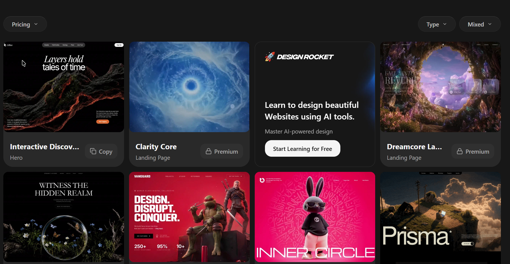

# Хичээл 5

### Өнөөдөр гараар бичсэн хуудсаа **Google AI Studio**-оор орчин үеийн гоё сайт болгоно.

> **Агуулга:** Google AI Studio-тэй танилцаж, prompt бичин portfolio сайт үүсгэсэн. AI-г зөв хэрэглэх дүрэмтэй танилцсан.


---

> Алхам бүр дээр **дарж нээнэ**.

---

<details>
<summary><b>1. AI Studio нээх</b></summary>

<br>

1. [aistudio.google.com](https://aistudio.google.com) → **18+ Gmail**-ээрээ нэвтэр (1-р хичээлийн даалгавар).
2. Зүүн цэс → **Build** сонго.

</details>

---

<details>
<summary><b>2. Үндсэн заавар (System instructions)</b></summary>

<br>

AI-д **ямар байдлаар** ажиллахыг нэг удаа хэл. Хуулж тавь:

```text
- Монгол хэлээр харилц.
- Би анхлан суралцагч — энгийн тайлбарла.
- Тодорхойгүй бол эхлээд асуулт асуу.
- Мэдэхгүй зүйлээ зохиохгүй, шууд хэл.
```

</details>

---

<details>
<summary><b>3. Prompt бичих</b></summary>

<br>

| Муу                        | Сайн                                             |
| -------------------------- | ------------------------------------------------ |
| `Надад вэб сайт хийж өг`   | **Хэн** · **Юу** · **Ямар бүтэц** · **Ямар загвар** |

1–4-р хичээлд бичсэн мэдээллээ ашигла:

```text
Надад нэг хуудастай portfolio сайт хий.

Миний тухай:
- Нэр: Бат, 13 настай
- Хобби: сагс тоглох
- Мөрөөдлийн ажил: тоглоом хөгжүүлэгч
- Зорилго: өөрийн тоглоом бүтээх

Цэс: Нүүр · Миний тухай · Мөрөөдлийн ажил · Тоглоомууд
Загвар: бараан өнгө, том гарчиг, хөдөлгөөнтэй
Бүх текст монгол хэлээр.
```

<details>
<summary>Prompt-ын 4 хэсэг</summary>

<br>

| Хэсэг      | Жишээ                                  |
| ---------- | -------------------------------------- |
| Хэн        | Нэр, нас, хобби                         |
| Юу         | Portfolio сайт, нэг хуудас             |
| Бүтэц      | Цэс, хэсгүүд (3-р хичээлийн nav шиг)   |
| Загвар     | Өнгө, фонт, хөдөлгөөн                  |

</details>

</details>

---

<details>
<summary><b>4. Загвараас санаа авах</b></summary>

<br>

| Арга        | Хэрхэн                                                         |
| ----------- | -------------------------------------------------------------- |
| Screenshot  | Таалагдсан сайтын зургийг prompt-доо хавсарга: "Ийм загвартай" |
| Бэлэн загвар | [motionsites.ai](https://motionsites.ai/) → **Copy** → prompt-доо тавь |



<details>
<summary>Бэлэн загварын prompt жишээ</summary>

<br>

[portfolio-prompt.md](portfolio-prompt.md) — эхний мөрүүдийг өөрийнхөөрөө соль.

</details>

</details>

---

<details>
<summary><b>5. Сайжруулах</b></summary>

<br>

Нэг дор биш — **жижиг алхмаар** хэл:

```text
Гарчгийн өнгийг ягаан болго.
Тоглоомууд хэсэгт 3 карт нэм.
Утсан дээр цэс нь багтахгүй байна, зас.
```

Кодыг **Code** таб дээр хар — `div`, `class`, `a`, `display: flex` таньж байна уу?

</details>

---

<details>
<summary><b>6. AI-г зөв хэрэглэх</b></summary>

<br>

| Дүрэм             | Тайлбар                                          |
| ----------------- | ------------------------------------------------ |
| Hallucination     | AI итгэлтэйгээр буруу хэлдэг → баримтаа **шалга**   |
| Хувийн мэдээлэл   | Хаяг, утас, сургууль, нууц үг **бүү оруул**       |

AI бол туслагч — зааварчилагч нь **чи**.

</details>

---

<details>
<summary><b>7. Хуваалцах</b></summary>

<br>

**Share** → линкээ хуулж Discord-д тавь.

</details>

---

<details>
<summary><b>Гэрийн даалгавар</b></summary>

<br>

| #   | Юу хийх                                                 | ✔️  |
| --- | ------------------------------------------------------- | --- |
| 1   | Сайтаа prompt-оор дор хаяж **3** удаа сайжруул           | ⬜  |
| 2   | Сайн ажилласан prompt-оо Google Keep-д хадгал           | ⬜  |
| 3   | Линкээ Discord-д тавь                                   | ⬜  |

</details>
