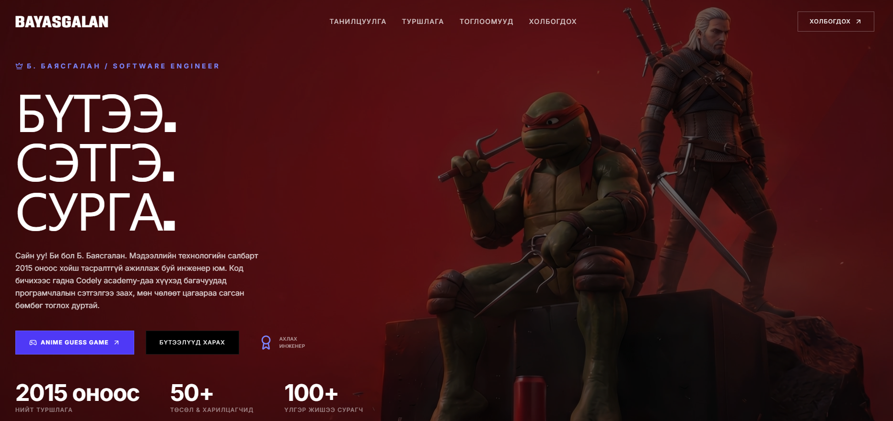

# Хичээл 6

### Өнөөдөр гараар бичсэн сайтаа **Google AI Studio**-оор хэдхэн минутад орчин үеийн portfolio болгоно.

> **Агуулга:** _(төлөвлөсөн)_ Өөрийн `index.html` + ноорог зургаа AI Studio-д өгч portfolio болгох, "Миний бүтээлүүд" хэсэг, кодоо VSCode-д хадгалах, бүтээлээ гараараа нэмэх. AI-г зөв хэрэглэх.



---

> Алхам бүр дээр **дарж нээнэ**.

---

<details>
<summary><b>1. Бэлтгэл — my-first-web хавтас</b></summary>

<br>

VSCode → **Open Folder** → `my-first-web`. Дотор нь байх ёстой:

| Файл             | Хаанаас        |
| ---------------- | -------------- |
| `index.html`     | Хичээл 1–3     |
| `dream-job.html` | Хичээл 2       |
| `my-photo.png`   | Хичээл 1       |
| `my-youtube.html` | Хичээл 5      |
| `noorog.jpg`     | Хичээл 5 гэрийн даалгавар |

**Хуучнаа хадгал:** `index.html`-ийг хуулж `index-old.html` гэж нэрлэ. Алдаа гарвал буцаана.

</details>

---

<details>
<summary><b>2. AI Studio нээх</b></summary>

<br>

1. [aistudio.google.com](https://aistudio.google.com) → **18+ Gmail**-ээрээ нэвтэр (1-р хичээлийн даалгавар).
2. **Chat** (шинэ чат) нээ.

</details>

---

<details>
<summary><b>3. Prompt — өөрийн сайтаа өг</b></summary>

<br>

1. **+** → `noorog.jpg` зургаа хавсарга.
2. Доорх prompt-ыг хуулж, `[...]`-ийг өөрийнхөөрөө соль.
3. Төгсгөлд нь `index.html`-ийнхээ **бүх кодыг** тавь (VSCode → **Ctrl+A**, **Ctrl+C**).

```text
Би [13] настай, вэб хийж сурч байгаа.
Доорх код бол миний portfolio сайт. Зураг бол миний хүссэн бүтэц.

Үүнийг орчин үеийн, гоё сайт болго:
- Миний текст, зургийг (my-photo.png) хэвээр үлдээ.
- Бүтэц: хавсаргасан зураг шиг.
- Загвар: [бараан] өнгө, [ногоон] тодотгол, том гарчиг, хөдөлгөөнтэй.
- "Миний бүтээлүүд" хэсэг нэм. Карт бүр холбоос:
  - dream-job.html — Мөрөөдлийн ажил
  - my-youtube.html — Миний YouTube
- Зөвхөн HTML, CSS. Нэг index.html файл, CSS нь <style> дотор.
- React, Tailwind бүү ашигла. Энгийн class нэр өг.
- Бүх текст монгол хэлээр.

Миний код:
[энд index.html-ийн кодоо тавь]
```

<details>
<summary>Яагаад ингэж бичив?</summary>

<br>

| Хэсэг           | Яагаад                                                  |
| --------------- | ------------------------------------------------------- |
| Өөрийн код      | AI хоосноос биш, **миний** сайтаас эхэлнэ               |
| Ноорог зураг    | Бүтцийг үгээр биш, зургаар хэлнэ (Хичээл 5)             |
| Файлын нэрс     | Холбоос, зураг зөв ажиллана                             |
| Зөвхөн HTML, CSS | VSCode-д нээж, цаашид **өөрөө** засна                  |

</details>

</details>

---

<details>
<summary><b>4. Кодоо хадгалах</b></summary>

<br>

1. AI-ийн хариултын код дээр **Copy** товч дар.
2. VSCode → `index.html` → **Ctrl+A** → **Ctrl+V** → **Ctrl+S**.
3. Браузерт нээ. Шалга:

| Шалгах                                   | Ажиллахгүй бол                          |
| ---------------------------------------- | --------------------------------------- |
| Миний зураг харагдаж байна уу?            | AI-д: "my-photo.png зураг харагдахгүй байна" |
| Бүтээлүүдийн картыг дарахад нээгдэж байна уу? | Файлын нэр зөв эсэхийг хар           |
| Утсан дээр (**F12** → утасны дүрс) зүгээр үү? | AI-д: "Утсан дээр эвдэрч байна, зас"  |

</details>

---

<details>
<summary><b>5. Сайжруулах</b></summary>

<br>

Нэг дор биш — **жижиг алхмаар** хэл. Төгсгөлд нь үргэлж: _"Бүтэн кодоо дахин өг."_

```text
Гарчгийн өнгийг ягаан болго.
Бүтээлүүдийн картууд дээр хулгана очиход томордог болго.
Цэсийг дээд талд нь наалддаг болго.
```

Кодоо **уншаад** ноорогтойгоо харьцуул:

- `display: flex` хаана байна? Ноорог дээрх **→**-тэй таарч байна уу?
- `flex-direction: column` хаана байна? **↓**-тэй таарч байна уу?

</details>

---

<details>
<summary><b>6. Бүтээл нэмэх — гараараа</b></summary>

<br>

Цаашид хичээл бүрийн бүтээлээ энд нэмнэ. **AI-гүй**, өөрөө:

1. `index.html` дотор **Ctrl+F** → `my-youtube.html` гэж хай.
2. Тэр картын `<a ...>` … `</a>` хэсгийг бүтнээр нь хуул, доор нь тавь.
3. `href` болон нэрийг шинэ бүтээлээрээ соль.

```html
<a href="my-youtube.html" class="card">   <!-- AI-ийн class нэр өөр байж болно -->
  <h3>Миний YouTube</h3>
</a>
```

</details>

---

<details>
<summary><b>7. Интернэтэд шинэчлэх</b></summary>

<br>

Хичээл 5-д гаргасан линк чинь хуучин загвартай хэвээр. Шинэчил:

1. [app.netlify.com](https://app.netlify.com) → сайтаа сонго → **Deploys**.
2. `my-first-web` хавтсаа дахин **чирж** оруул.
3. Линкээ нээ — шинэ загвар гарч ирнэ. Линк өөрчлөгдөхгүй.

</details>

---

<details>
<summary><b>8. AI-г зөв хэрэглэх</b></summary>

<br>

| Дүрэм           | Тайлбар                                            |
| --------------- | -------------------------------------------------- |
| Hallucination   | AI итгэлтэйгээр буруу хэлдэг → **шалга**             |
| Хувийн мэдээлэл | Гэрийн хаяг, утас, сургууль, нууц үг **бүү оруул**  |
| Хуучнаа хадгал  | AI бүгдийг эвдэж болно → `index-old.html`           |

AI бол туслагч — шийдэгч нь **чи**.

</details>

---

<details>
<summary><b>✨ Бонус — таалагдсан загвар</b></summary>

<br>

Таалагдсан сайтынхаа screenshot-ыг хавсаргаад:

```text
Миний сайтын өнгө, фонтыг энэ зураг шиг болго. Бүтэц хэвээрээ. Бүтэн кодоо дахин өг.
```

</details>

---

<details>
<summary><b>Гэрийн даалгавар</b></summary>

<br>

| #   | Юу хийх                                                  | ✔️  |
| --- | -------------------------------------------------------- | --- |
| 1   | Сайтаа prompt-оор дор хаяж **3** удаа сайжруул            | ⬜  |
| 2   | 6-р алхмаар **гараараа** нэг карт нэм (жишээ нь Малаа хашаандаа тоглоом) | ⬜  |
| 3   | Сайн ажилласан prompt-оо Google Keep-д хадгал            | ⬜  |
| 4   | Netlify-д дахин байршуулж, линкээ Discord-д тавь          | ⬜  |

</details>
