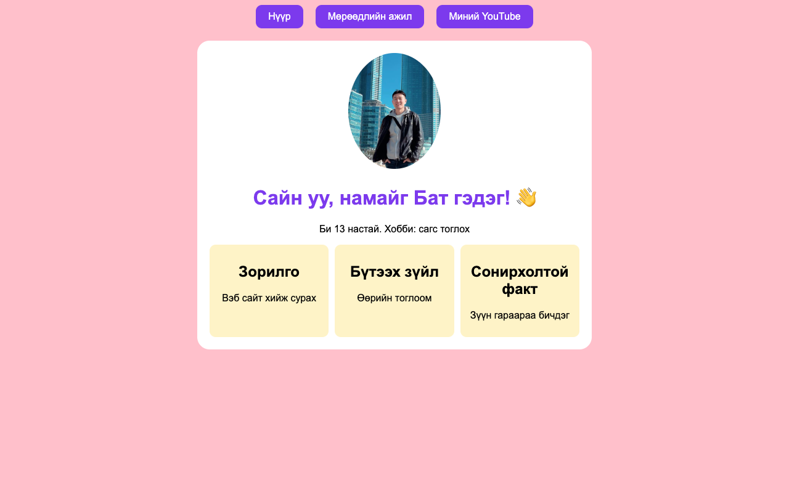
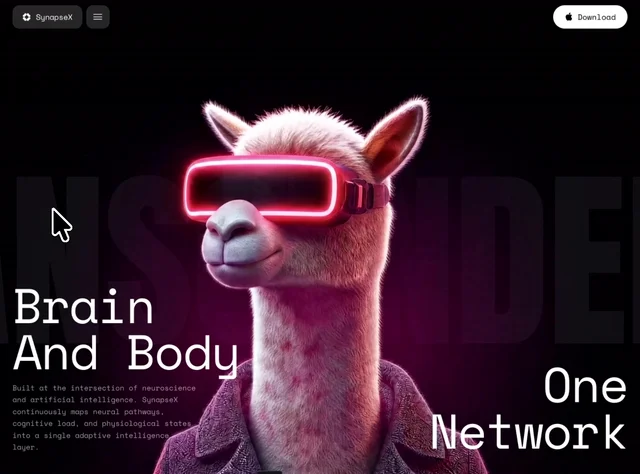
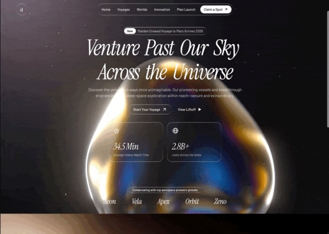
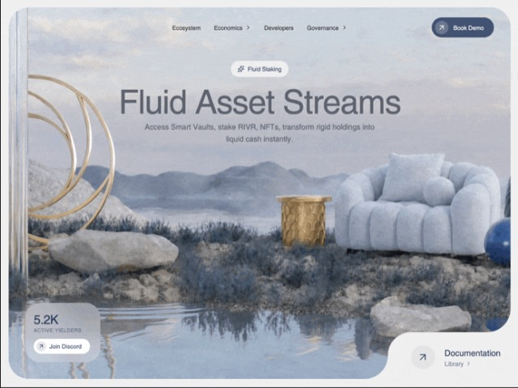
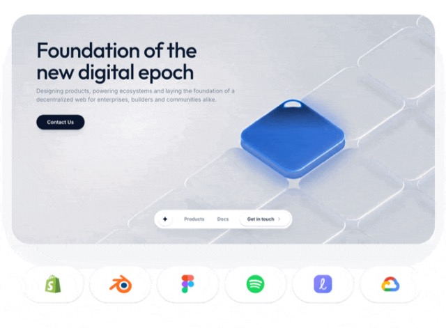
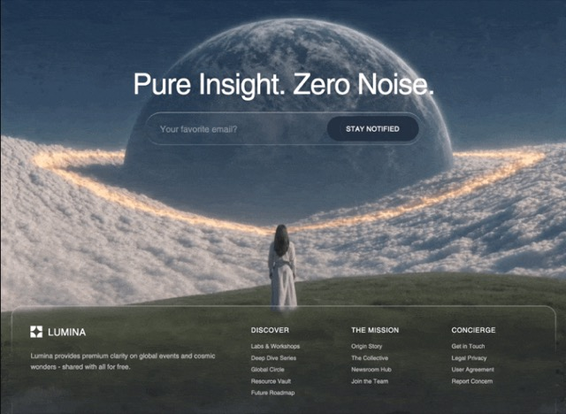
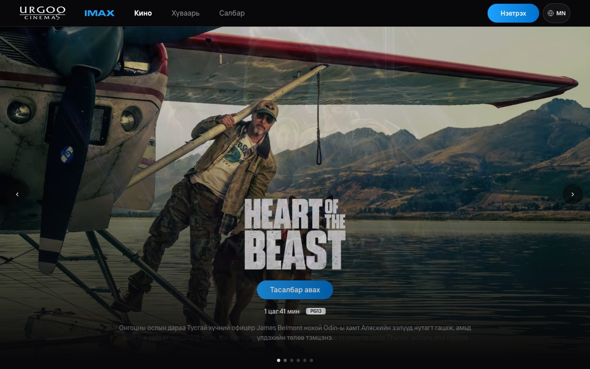

# Хичээл 6

### AI-аар **хэдхэн минутад** хөдөлгөөнтэй, орчин үеийн portfolio сайт хийнэ.

> **Агуулга:** _(төлөвлөсөн)_ Гараар хийсэн сайт vs мэргэжлийн загвар (wow), AI Studio танилцуулга + System instructions, загвар олох 2 арга (motionsites.ai, screenshot), Хичээл 5-ын `index.html`-ийн мэдээллээр AI Studio **Build**-д portfolio хийж vibe coding-оор сайжруулах, бүтээлээ гараараа нэмэх, AI-г зөв хэрэглэх. GitHub, Vercel — Хичээл 7.

| Миний сайт — 5 хичээл гараар | Мэргэжлийн загвар — AI, 5 минут |
| ---------------------------- | ------------------------------- |
|      |    |

---

> [AI сайт жишээ](https://ai.studio/apps/17fd60f1-6e6a-43ec-b78e-319257c0b330?fullscreenApplet=true)

---

<details>
<summary><b>0. Гараар яагаад хэцүү вэ?</b></summary>

<br>

Баруун талын сайтад байгаа зүйлс — бид нэг ч удаа заагаагүй:

| Юу                                  | Гараар сурахад         |
| ----------------------------------- | ---------------------- |
| Хөдөлгөөн, видео дэвсгэр            | хэдэн долоо хоног      |
| Гүйлгэхэд гарч ирэх, хулганыг дагах | JavaScript — хэдэн сар |
| Өнгө, фонт, зай — "гоё" харагдуулах | дизайнерын олон жил    |

Мэргэжлийн вэб хөгжүүлэгч ийм сайтыг **1–2 долоо хоногт** хийнэ. Бид AI-аар **5 минутад** хийнэ.

<details>
<summary>Тэгвэл HTML/CSS сурсан маань дэмий юу?</summary>

<br>

Үгүй. AI-д юу хүсэхээ хэлэх, кодыг **уншиж** засах, бүтээлээ нэмэх (6-р алхам) — чиний мэдлэг.

</details>

</details>

---

<details>
<summary><b>1. Бэлтгэл</b></summary>

<br>

| Хэрэгтэй                                    | Хаанаас    |
| ------------------------------------------- | ---------- |
| `my-first-web/index.html`                   | Хичээл 1–5 |
| Netlify **үндсэн** линк (`....netlify.app`) | Хичээл 5   |
| 18+ Gmail                                   | Хичээл 1   |

Хичээл 5-д бүх хуудсаа **нэг сайт, нэг линк** болгосон. Үндсэн линкээ нээгээд хуудас бүр ажиллаж байгааг шалга — 4-р алхамд хэрэгтэй:

```text
https://bat-site.netlify.app            ← үндсэн линк
https://bat-site.netlify.app/my-photo.png
https://bat-site.netlify.app/dream-job.html
https://bat-site.netlify.app/my-youtube.html
https://bat-site.netlify.app/tusul.html
```

</details>

---

<details>
<summary><b>2. Google AI Studio танилцуулга</b></summary>

<br>

1. Видео үз: [Google AI Studio танилцуулга](https://www.youtube.com/watch?v=meUr8fjy8lQ)
2. [aistudio.google.com](https://aistudio.google.com) нээ → 18+ Gmail → товч tour: **Chat**, **Build**, файл хавсаргах **+**.
3. **System instructions** (үндсэн заавар) тохируул — AI бүх хариултдаа үүнийг дагана. Хуулж тавь:

<details>
<summary>Жишээ System instructions (хуулж тавь)</summary>

```text
- Монгол хэлээр харилц.
- Цэвэр, ойлгомжтой, мэргэжлийн код бич.
- Бүх кодыг нэг файлд бөөгнөрүүлэхгүй. Тохиромжтой бүтэц, файл, модуль болгон хуваа.
- Код бүрийг maintainable, reusable байдлаар бич.
- Шаардлага тодорхойгүй бол таамаглахгүй, эхлээд асуулт асуу.
- Том өөрчлөлт хийхээс өмнө төлөвлөгөөгөө товч тайлбарла.
- Илүүдэл код, шаардлагагүй dependency, overengineering-ээс зайлсхий.
- Шилдэг практик (best practices)-ийг баримтал.
- Алдаа гарвал шалтгааныг тайлбарлаж, засах аргыг санал болго.
- Анхлан суралцагч гэж үзээд энгийн, ойлгомжтой тайлбар өг.
- Кодын өөрчлөлтийг алхам алхмаар тайлбарла.
- Боломжтой бол нэг дор бүх шийдлийг биш, хамгийн энгийн шийдлээс эхэл.
- Эргэлзээтэй үед баримтгүй зүйл зохиохгүй. Мэдэхгүй бол шууд хэл.
```

</details>

</details>

---

<details>
<summary><b>3. Загвар олох — 2 арга</b></summary>

<br>

Нэгийг нь сонго.

<details>
<summary><b>Арга 1 — Portfolio-д зориулсан бэлэн загвар (motionsites.ai)</b></summary>

<br>

1. [motionsites.ai](https://motionsites.ai/) нээ. Карт дээр хулгана аваачихад хөдөлнө.
2. **Copy prompt** товчтой картыг сонго. **Unlock** (цоож) — төлбөртэй, бүү сонго.
3. **Copy prompt** дар → prompt хуулагдана.

Үнэгүй загварууд (2026.10):

| Загвар              | Төрөл        | Харагдах байдал                        |
| ------------------- | ------------ | -------------------------------------- |
| **Aetheris Voyage** | Нүүр (Hero)  |  |
| **RIVR**            | Нүүр (Hero)  |             |
| **Digital Epoch**   | Нүүр (Hero)  |    |
| **Lumina**          | Хөл (Footer) |         |

Бусад үнэгүй хөл: **HAUL!**, **Vize Footer**, **Kresna Footer**.

> Hero = сайтын хамгийн дээд, анх харагдах хэсэг. Нэг Hero сонгоход хангалттай.

</details>

<details>
<summary><b>Арга 2 — Screenshot (таалагдсан сайтын зураг)</b></summary>

<br>

**Санаа:** өөрийгөө **киноны од** болго! Кино сайтын screenshot → нүүр хэсэгт чиний зураг том постер шиг, "Тасалбар авах" оронд "Бүтээлүүд үзэх", бүтээлүүд чинь киноны постерууд шиг.



1. Өөрийн өдөр бүр үздэг сайтаас сонго — **таалагдсан загвар** нь л чухал:

| Сайт                                   | Юу байдаг                                    |
| -------------------------------------- | -------------------------------------------- |
| [urgoo.mn](https://urgoo.mn)           | Өргөө кино театр — том постер, бараан загвар |
| [tengis.mn](https://tengis.mn)         | Кино театр — кино, тасалбар                  |
| [kinosan.mn](https://kinosan.mn)       | Кино театр — киноны постер                   |
| [netflix.com](https://www.netflix.com) | Кино, цуврал — бараан загвар                 |
| [roblox.com](https://www.roblox.com)   | Тоглоомын нүүр хуудас                        |
| [spotify.com](https://www.spotify.com) | Хөгжим — өнгө, том гарчиг                    |
| [youtube.com](https://www.youtube.com) | Хичээл 5-д хийсэн бол мэднэ                  |

Бусад гоё сайт хайх бол: [godly.website](https://godly.website), [awwwards.com](https://www.awwwards.com).

> Зөвхөн **хууль ёсны**, насанд тохирсон сайтыг сонго. Зөвшөөрөлгүй кино үзүүлдэг сайт ашиглахгүй.

2. Screenshot ав: **Win+Shift+S** → хэсгээ тэмдэглэ → **Ctrl+V**-ээр AI Studio-д шууд буулгана.
3. Зөвхөн **загварыг** хэрэглэнэ — тэдний лого, нэр, киног бүү хуул. Текст нь **чиний** мэдээлэл.
4. 4-р алхмын prompt-ын `[ЗАГВАР]`-т кино сайт бол:

```text
Хавсаргасан кино сайт шиг. Нүүрт миний зураг киноны том постер шиг,
"Тасалбар авах" оронд "Бүтээлүүд үзэх" товч.
Миний бүтээлүүдийг киноны постерууд шиг эгнүүлж харуул.
```

<details>
<summary>Өөр жишээ — багшийн сайт</summary>

<br>


</details>

</details>

</details>

---

<details>
<summary><b>4. AI Studio Build — сайтаа үүсгэх</b></summary>

<br>

1. AI Studio → зүүн цэс **Build**.
2. Арга 2 бол screenshot-оо **Ctrl+V** (эсвэл **+**) хавсарга.
3. Доорх prompt-ыг хуул. `[...]`-ийг соль → **Build** (эсвэл Enter):
   - `[НЕТЛИФАЙ]` — өөрийн Netlify хаяг
   - `[ЗАГВАР]` — Арга 1: motionsites-оос хуулсан prompt. Арга 2: `Хавсаргасан зураг шиг`
   - `[МИНИЙ КОД]` — VSCode → `my-first-web/index.html` → **Ctrl+A**, **Ctrl+C**

```text
Би [13] настай, вэб хийж сурч байгаа. Миний portfolio сайтыг хий.
Харагдах байдал, хөдөлгөөн нь ЗАГВАР шиг.
Миний мэдээллийг (нэр, нас, хобби, зорилго …) МИНИЙ КОД-оос ав.
Бүтцийг нь дагах хэрэггүй — зөвхөн мэдээллийг.

Дүрэм:
- Бүх текст монгол хэлээр. Загварын англи текстийг миний мэдээллээр соль.
- Gemini API, AI функц бүү нэм. Энгийн сайт.
- Миний зураг: https://[НЕТЛИФАЙ].netlify.app/my-photo.png
- Миний үндсэн сайт: https://[НЕТЛИФАЙ].netlify.app
- "Миний бүтээлүүд" хэсэг. Бүтээлүүдийг нэг жагсаалт (array) болго,
  карт бүр шинэ цонхонд нээгдэнэ:
  - Мөрөөдлийн ажил — https://[НЕТЛИФАЙ].netlify.app/dream-job.html
  - Миний YouTube — https://[НЕТЛИФАЙ].netlify.app/my-youtube.html
  - Тоглоомын сайт — https://[НЕТЛИФАЙ].netlify.app/tusul.html
  - Малаа хашаандаа — https://[НЕТЛИФАЙ].netlify.app/togloom.html

ЗАГВАР:
[ЗАГВАР]

МИНИЙ КОД:
[МИНИЙ КОД]
```

4. Баруун талд сайт гарч ирнэ (**Preview**). 1–2 минут хүлээ.

<details>
<summary>Яагаад ингэж бичив?</summary>

<br>

| Хэсэг               | Яагаад                                                        |
| ------------------- | ------------------------------------------------------------- |
| Загвар / screenshot | Мэргэжлийн дизайн — гоё харагдах нууц нь энд                  |
| Миний код           | Мэдээллээ дахин бичихгүй — AI өөрөө уншиж авна                |
| Netlify хаяг        | Хичээл 5-ын хуудсууд, зураг минь аль хэдийн интернэтэд байгаа |
| Gemini API-гүй      | Хичээл 7-д Vercel-д байршуулахад түлхүүр (API key) хэрэггүй   |
| Жагсаалт (array)    | 6-р алхамд бүтээл нэмэхэд хялбар                              |

</details>

</details>

---

<details>
<summary><b>5. Vibe coding — сайжруулах</b></summary>

<br>

Код бичихгүй — **хүссэнээ хэлнэ**, AI кодыг нь өөрчилнө. Нэг удаад **нэг** өөрчлөлт.

```text
Тодотгол өнгийг ягаан болго.
Нэрийг бичигдэж байгаа мэт гаргадаг болго.
Бүтээлүүдийн карт дээр хулгана очиход томордог болго.
```

Өөрчлөлт бүрийн дараа **Preview**-д шалга:

| Шалгах                                         | Ажиллахгүй бол AI-д                    |
| ---------------------------------------------- | -------------------------------------- |
| Миний мэдээлэл зөв үү? (англи текст үлдсэн үү) | "Англи текстийг миний мэдээллээр соль" |
| Миний зураг харагдаж байна уу?                 | "Миний зураг харагдахгүй байна"        |
| Бүтээлүүдийн карт дарахад нээгдэж байна уу?    | Netlify хаяг зөв эсэхийг хар           |
| Утсан дээр зүгээр үү? (Preview → утасны дүрс)  | "Утсан дээр эвдэрч байна, зас"         |
| Алдаа (улаан) гарсан уу?                       | **Fix** / "Энэ алдааг зас" гэж хэл     |

AI Studio сайтыг чинь **өөрөө хадгална**. Дараа нь: **Build** → өөрийн апп.

</details>

---

<details>
<summary><b>6. Бүтээл нэмэх — гараараа</b></summary>

<br>

Цаашид хичээл бүрийн бүтээлээ энд нэмнэ. **AI-гүй**, AI Studio-гийн **Code** хэсэгт өөрөө:

1. **Code** → **Ctrl+F** → `my-youtube` гэж хай.
2. Тэр мөрийг `{` … `}` бүтнээр нь хуул, доор нь тавь.
3. Нэр, хаягийг шинэ бүтээлээрээ соль → Preview-д шалга.

```js
{ title: "Миний YouTube", link: "https://bat-site.netlify.app/my-youtube.html" },
{ title: "Малаа хашаандаа", link: "https://..." },
```

> AI-ийн нэр (`title`, `name`, `url` …) өөр байж болно. Мөрийн төгсгөлийн **таслал**-ыг бүү март.

</details>

---

<details>
<summary><b>7. AI-г зөв хэрэглэх</b></summary>

<br>

| Дүрэм           | Тайлбар                                                |
| --------------- | ------------------------------------------------------ |
| Hallucination   | AI итгэлтэйгээр буруу хэлдэг → Preview-д **шалга**     |
| Хувийн мэдээлэл | Гэрийн хаяг, утас, сургууль, нууц үг **бүү оруул**     |
| Нэг удаад нэг   | Олон зүйл зэрэг хүсвэл AI эвдэнэ                       |
| Загвар ≠ минийх | Загвар бусдын бүтээл. Агуулга нь **минийх** байх ёстой |

AI бол туслагч — шийдэгч нь **чи**.

</details>

---

<details>
<summary><b>✨ Бонус — хоёр загвар нийлүүлэх</b></summary>

<br>

Hero-оос гадна үнэгүй **хөл** (Lumina, HAUL!, Vize, Kresna)-ийн prompt-ыг хуулаад:

```text
Сайтын доод хэсгийг энэ загвар шиг болго. Бусдыг нь хэвээр үлдээ.
[ХӨЛИЙН PROMPT]
```

</details>

---

<details>
<summary><b>Гэрийн даалгавар</b></summary>

<br>

| #   | Юу хийх                                                                               | ✔️  |
| --- | ------------------------------------------------------------------------------------- | --- |
| 1   | Сайтаа vibe coding-оор дор хаяж **3** удаа сайжруул                                   | ⬜  |
| 2   | 6-р алхмаар **гараараа** нэг карт нэм (жишээ нь Малаа хашаандаа тоглоом)              | ⬜  |
| 3   | Сайтынхаа screenshot-ыг Discord-д тавь                                                | ⬜  |
| 4   | [github.com](https://github.com) → **Sign up** — 18+ Gmail-ээрээ. Хичээл 7-д хэрэгтэй | ⬜  |

Дараагийн хичээлд: сайтаа GitHub-д хадгалж, компьютер дээрээ ажиллуулаад, интернэтэд гаргана.

</details>
