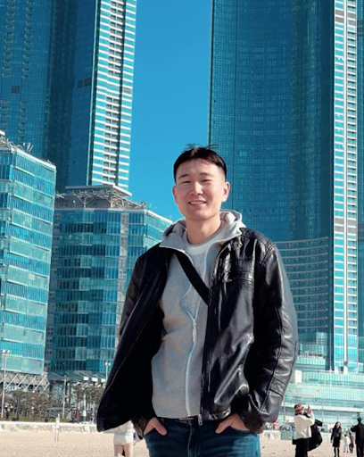

# 🎒 Хичээл 1

### ✨ Өнөөдөр **өөрийнхөө тухай вэб хуудас** үүсгэж, ангийхантайгаа танилцана!

### [🎮 Хичээлийн танилцуулга слайд](https://docs.google.com/presentation/d/1CN9uhCejRB8ouXW7FF_JXq0rSZEA5ud48B8FAhyxqwg/edit?usp=sharing)

### 📱 [Хичээлийн Discord чат групп линк](`https://discord.gg/h8MHmusCKm`)

<image src="image.png" width="300" height="400"/>

---

### 🛠️ Өнөөдрийн хийх зүйлс

```
1️⃣ 👯 Ширээний найзтайгаа танилц + Discord группдээ ор
2️⃣ 💻 VSCode нээх
3️⃣ ✍️ Анхны кодоо бичин Веб хуудас үүсгэх
4️⃣ 🌈 Бага зэрэг **CSS** өнгө нэм
5️⃣ 🎨 Зураг (**Gemini**) + дуу (**Suno**) нэм
```

---

### ✍️ HTML Веб хуудсаа үүсгэж өөрийнхөө тухай бичээрэй: Нэр, Нас, Хобби, Сонсох дуртай дуу/хамтлаг, Үзэх дуртай кино, аниме

```html
<!DOCTYPE html>
<html>
  <head>
    <style>
      body {
        background: beige; /* 🎨 арын өнгө */
        color: black; /* ✏️ текстийн өнгө */
        text-align: center;
      }
      h1 {
        color: #7c3aed;
      } /* 🟣 гарчгийн өнгө */
      img {
        border-radius: 20px;
      } /* 🖼️ булан мөлгөр */
    </style>
  </head>
  <body>
    <h1>Сайн уу, намайг Бат гэдэг! 👋</h1>
    
    <p>Би 13 настай.</p>
    <p>Хобби: сагс 🏀.</p>
    <p>Дуртай хамтлаг: BTS 🎵</p>
    <p>Дуртай кино: Spider man</p>

    <audio src="my-song.mp3" controls></audio>
  </body>
</html>
```

### HTML туслах 👀

| Юу                        | Тайлбар                                                                                                  |
| ------------------------- | -------------------------------------------------------------------------------------------------------- |
| 🎨 my-first-page.html     | .html -р төгссөн файл нээх                                                                               |
| ✏️ Html код үүсгэх тэмдэг | !                                                                                                        |
| ✏️ Tag                    | HTML-ийн бүтцийг тодорхойлдог, < > хаалтан дотор бичигддэг тушаал эсвэл код (Жишээ нь: `<html>, <body>`) |
| ✏️ Body                   | Вэб хуудасны хэрэглэгчдэд харагдах бүх үндсэн агуулгыг (текст, зураг, видео г.м) агуулдаг гол хэсэг      |
| ✏️ h1                     | Вэб хуудасны хамгийн том, хамгийн чухал 1-р зэргийн гарчиг (Heading 1) үүсгэхэд ашиглагддаг таг          |
| ✏️ p                      | Жирийн текст буюу догол мөр (Paragraph) үүсгэхэд ашиглагддаг таг                                         |
| ✏️ img                    | Вэб хуудас руу зураг оруулах, дүрслэхэд ашиглагддаг таг (Image)                                          |

---

<!--
1. Meet teachers
2. Meet buddy, Your teammate: Front and back desk
3. Teacher presentation:
   1. Roadmap
      1. (What we learn): Web + AI + Web based game development
      - Week 1: First website + how AI works
      - Week 2: Game development in AI Studio.
      - Week 3: Custom game development & Demo Day (Team up)
      2. Team game contest: best game + best gamer with prize
   2. Show prototype of websites and game idea
   3. Job market and Ai engineer salary
   4. How website works: Html, css, js
4. Time break
5. First code
   1. Vs code
   2. Html?
6. What is next: show modern website
7. Homework
   1. Gmail
   2. Google LM -->
