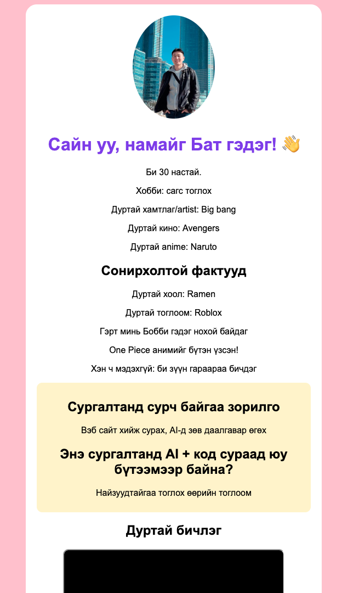

# Хичээл 1

### Өнөөдөр өөрийнхөө тухай **вэб хуудас** хийж, ангийхантайгаа танилцана.

[Хичээлийн слайд](https://docs.google.com/presentation/d/1CN9uhCejRB8ouXW7FF_JXq0rSZEA5ud48B8FAhyxqwg/edit?usp=sharing)

---

## Том зураг — 2 сар, 16 хичээл

| Хичээл     | Юу хийнэ                   | Эцэст нь                              |
| ---------- | -------------------------- | ------------------------------------- |
| **1–3** 📍 | Вэб хуудас + AI            | Өөрийн вэб **интернэтэд**             |
| **4–9**    | JavaScript + алгоритм      | **Code Cup** тэмцээн 🏆               |
| **10–16**  | AI-аар апп, тоглоом бүтээх | Street fighter тоглоом + **Demo Day** |

---

> Алхам бүр дээр **дарж нээнэ**.

---

<details>
<summary><b>1. Найзтайгаа танилц + Discord</b></summary>

<br>

Ширээний найзтайгаа танилц → [Discord](https://discord.gg/h8MHmusCKm) группдээ ор.


</details>

---

<details>
<summary><b>2. VSCode нээх</b></summary>

<br>

1. Шинэ файл үүсгэ: **`my-first-page.html`**
2. Файл дотор **`!`** бичээд **Enter** дар → HTML суурь код автоматаар гарна.
3. `<title>` доторх бичгийг **Миний хуудас** болго.

<details>
<summary><code>!</code> дарахад юу гарах вэ?</summary>

<br>

```html
<!DOCTYPE html>
<html lang="en">
  <head>
    <meta charset="UTF-8" />
    <meta name="viewport" content="width=device-width, initial-scale=1.0" />
    <title>Document</title>
  </head>
  <body></body>
</html>
```

Агуулгаа `<body>` дотор бичнэ. Юу ч гарахгүй бол файлын нэр `.html`-ээр төгссөн эсэхийг шалга.

</details>

</details>

---

<details>
<summary><b>3. HTML — өөрийнхөө тухай бич</b></summary>

<br>

Кодыг бичээд **өөрийн** мэдээллээр соль:

```html
<!DOCTYPE html>
<html>
  <head>
    <title>Миний хуудас</title>
  </head>
  <body>
    <h1>Сайн уу, намайг Бат гэдэг! 👋</h1>
    
    <p>Би 13 настай.</p>
    <p>Хобби: сагс тоглох</p>
    <p>Дуртай хамтлаг: BTS</p>
    <p>Дуртай кино: Spider-Man</p>

    <h2>AI + кодоор юу хиймээр байна?</h2>
    <p>Найзуудтайгаа тоглох өөрийн тоглоом</p>

    <h2>Ямар ур чадвар сурмаар байна?</h2>
    <p>Вэб сайт хийх, AI-д зөв даалгавар өгөх</p>

    <h2>Сонирхолтой фактууд</h2>
    <p>Дуртай хоол: пицца</p>
    <p>Дуртай тоглоом: Roblox</p>
    <p>Гэрт минь Бобби гэдэг нохой байдаг</p>
    <p>One Piece анимийг бүтэн үзсэн!</p>
    <p>Хэн ч мэдэхгүй: би зүүн гараараа бичдэг</p>
  </body>
</html>
```

**Хоёр асуулт** — хамгийн чухал хэсэг. **Фактууд** дээр найзаа гайхшруулах зүйлээ бич.

<details>
<summary>Таг гэж юу вэ?</summary>

<br>

| Таг      | Тайлбар              |
| -------- | -------------------- |
| `body`   | Харагдах бүх агуулга |
| `h1`     | Том гарчиг           |
| `h2`     | Жижиг гарчиг         |
| `p`      | Текст                |
| `img`    | Зураг                |
| `iframe` | YouTube бичлэг       |

</details>

</details>

---

<details>
<summary><b>4. CSS — өнгө нэмэх</b></summary>

<br>

`<head>` дотор нэм → **save** → өнгө солигдохыг хар.

```html
<style>
  body {
    background: beige; /* арын өнгө */
    color: black; /* текстийн өнгө */
    text-align: center;
    font-family: Arial, sans-serif;
  }
  h1 {
    color: #7c3aed; /* гарчгийн өнгө */
  }
  img {
    border-radius: 20px; /* булан мөлгөр */
  }
  p {
    font-size: 18px; /* текстийн хэмжээ */
  }
</style>
```

Өнгө, хэмжээг сольж туршаарай.

</details>

---

<details>
<summary><b>5. Зураг нэмэх (Gemini)</b></summary>

<br>

[Gemini](https://gemini.google.com)-д бич (өөрийнхөөрөө соль):

```
Надад профайл зураг зурж өгөөч.
13 настай, сагс тоглох дуртай хүү. Богино хар үстэй, инээмсэглэсэн.
Аниме стиль, тод өнгөтэй, арын дэвсгэр нь цэнхэр. Дөрвөлжин хэмжээтэй.
```

Зураг гарсны дараа **Download** → **`my-photo.png`** нэрээр HTML файлтайгаа **нэг хавтсанд** хадгал.

<details>
<summary>Өөр санаа</summary>

<br>

| Юуг солих | Жишээ                                    |
| --------- | ---------------------------------------- |
| Стиль     | cartoon, pixel art, 3D, Pixar            |
| Хобби     | гитар тоглож буй, ном уншиж буй          |
| Дэвсгэр   | сансар, далай, сагсны талбай             |

Өөрийн жинхэнэ зургаа бүү оруул — зохиомол дүр үүсгэ.

</details>

```html

```

</details>

---

<details>
<summary><b>6. Дуртай бичлэг (YouTube)</b></summary>

<br>

[YouTube](https://www.youtube.com) → дуртай бичлэгээ ол → **Share** → **Embed** → **Copy** → `</body>`-ын дээр paste.

```html
<h2>Дуртай бичлэг</h2>
<iframe
  width="400"
  height="220"
  src="https://www.youtube.com/embed/xxxxx"
></iframe>
```

<details>
<summary>Яагаад <code>video</code> таг болохгүй вэ?</summary>

<br>

`<video>` нь `.mp4` файл шаарддаг. YouTube-д `<iframe>` хэрэглэнэ.

</details>

</details>

---

<details>
<summary><b>7. ✨ Бонус — гоё болгох</b></summary>

<br>

Ийм болгож чадах уу? → **[index.html](index.html)**

Цагаан карт · дугуй зураг · шар хайрцаг



</details>

---

**[Гэртээ хийх даалгавар →](homework.md)**

<!--
1. Meet teachers
2. Meet buddy, Your teammate: Front and back desk
3. Teacher presentation:
   1. Roadmap
      1. (What we learn): Web + AI + Web based game development
      - Week 1: First website + how AI works
      - Week 2: Game development in AI Studio.
      - Week 3: Custom game development & Demo Day (Team up)
      2. Team game contest: best game + best gamer with prize
   2. Show prototype of websites and game idea
   3. Job market and Ai engineer salary
   4. How website works: Html, css, js
4. Time break
5. First code
   1. Vs code
   2. Html?
   3. Introduce yourself: Gemini image, YouTube
6. What is next: show modern website
7. Homework
   1. Gmail
   2. Google LM -->
