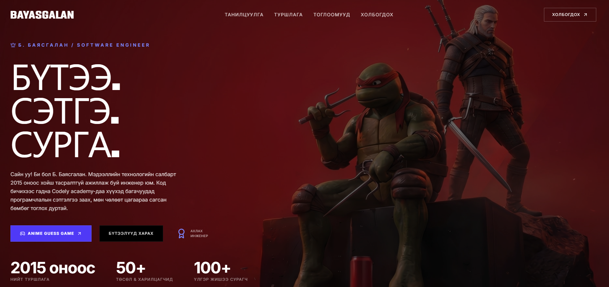
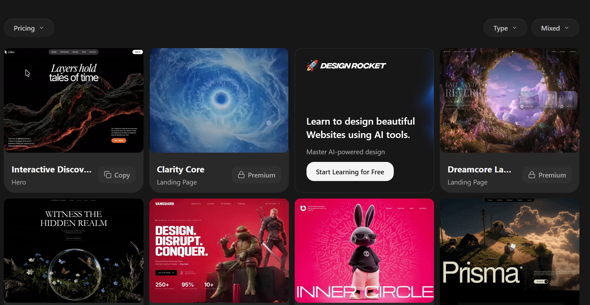

# 🚀 Хичээл 2 — Эхний вэбээ интернэтэд тавья

### ✨ Өнөөдөр **өмнө нь хийсэн вэб хуудас**-аа AI ашиглан сайжруулж орчин үеийн гоё загвартай болгож интернет-д байршуулна!



## ✅ Outcomes — Өнөөдөр юу хийж үзэх вэ?

- **Google AI Studio**-д prompt бичээд бүтэн **portfolio website** үүсгэнэ.
- Сайтаа **deploy** хийж, **QR**-аар share хийнэ.
- AI-д хэлж **болохгүй 3 зүйлийг** нэрлэнэ.

---

## 🧭 Хичээлийн задаргаа

> Доорх сэдвүүд дээр дарж **шууд шилжинэ.**

| Цаг    | Сэдэв                                                                                                                                 |
| ------ | ------------------------------------------------------------------------------------------------------------------------------------- |
| 15 мин | [✨Kahoot тест (PIN: 02607784)](https://kahoot.it/challenge/02607784?challenge-id=52e8dc11-25fb-4f0e-bbb7-bfe2b8499817_1782053153131) |
| 15 мин | [✨Type racer](https://typer.io/)                                                                                                     |
| 20 мин | [🎬 Google AI Studio танилцуулга](https://www.youtube.com/watch?v=meUr8fjy8lQ)                                                        |
| 30 мин | [🌐 Portfolio site (AI Studio)](#sec-aistudio)                                                                                        |
| 30 мин | [🚀 Deploy + QR + Share](#sec-deploy)                                                                                                 |
| 30 мин | [📦 Wrap + homework](#sec-homework)                                                                                                   |

</details>

<details open id="sec-aistudio">
<summary><strong>🌐 Portfolio website — Google AI Studio</strong></summary>

HTML гараар бичихгүйгээр **AI-аар бүтэн website** үүсгэе.

**1. Setup**

- [aistudio.google.com](https://aistudio.google.com) нээ → товч tour
- **Үндсэн заавар (instructions)** тохируул:

<details>
<summary>📋 Жишээ System instructions <em>(хуулж тавь — copy)</em></summary>

```text
- Монгол хэлээр харилц.
- Цэвэр, ойлгомжтой, мэргэжлийн код бич.
- Бүх кодыг нэг файлд бөөгнөрүүлэхгүй. Тохиромжтой бүтэц, файл, модуль болгон хуваа.
- Код бүрийг maintainable, reusable байдлаар бич.
- Шаардлага тодорхойгүй бол таамаглахгүй, эхлээд асуулт асуу.
- Том өөрчлөлт хийхээс өмнө төлөвлөгөөгөө товч тайлбарла.
- Илүүдэл код, шаардлагагүй dependency, overengineering-ээс зайлсхий.
- Шилдэг практик (best practices)-ийг баримтал.
- Алдаа гарвал шалтгааныг тайлбарлаж, засах аргыг санал болго.
- Анхлан суралцагч гэж үзээд энгийн, ойлгомжтой тайлбар өг.
- Кодын өөрчлөлтийг алхам алхмаар тайлбарла.
- Боломжтой бол нэг дор бүх шийдлийг биш, хамгийн энгийн шийдлээс эхэл.
- Эргэлзээтэй үед баримтгүй зүйл зохиохгүй. Мэдэхгүй бол шууд хэл.
```

</details>

**2. Build — 4 алхам**

| #   | Алхам                | Тайлбар                                                                                                                                                         |
| --- | -------------------- | --------------------------------------------------------------------------------------------------------------------------------------------------------------- |
| 1   | 🎨 **Design prompt** | Орчин үеийн веб загваруудаас санаа ав ([motion.ai](https://motionsites.ai/)) — таалагдсан сайтынхаа **screenshot** зургийг хавсаргаж "дууриалган" хийлгэж болно |
| 2   | 🧱 **Structure**     | Hero · About · Services/Products · Contact                                                                                                                      |
| 3   | 👤 **Reuse info**    | HTML intro-д бичсэн мэдээллээ дахин ашигла                                                                                                                      |
| 4   | ✍️ **Final prompt**  | Бүгдийг нэгтгэсэн structured prompt → Generate                                                                                                                  |

## Google AI studio Веб үүсгэх 3 арга

1. Structured Prompt

2. Screenshot

3. Бэлэн загвар жишээ (https://motionsites.ai/)

<details>
<summary>✍️1. Structured prompt жишээ</em></summary>

👎Муу жишээ:

```text
Надад веб сайт хийж өг
```

👎Сайн жишээ:

```text
Role: Чи 10+ жилийн туршлагатай senior web designer бөгөөд frontend developer.
       Орчин үеийн, конверс өндөртэй (conversion-focused) сайт хийдэг.

Task: Доорх хүний хувийн брэндийг тусгасан, нэг хуудастай (single-page),
      responsive portfolio/landing website-ийг бүтэн HTML/CSS/JS-ээр үүсгэ.

Who:
  - Нэр: [...]
  - Нас: [...]
  - Хобби: [...]
  - Сонсох дуртай дуу/хамтлаг: [...]
  - Үзэх дуртай кино, аниме: [...]

Structure:
  - Sticky navbar: нэр/лого + хэсгүүд рүү шилжих холбоос
  - Hero: гарчиг (1 хүчтэй өгүүлбэр) + дэд өгүүлбэр + үндсэн CTA товч
  - About: 2–3 өгүүлбэр танилцуулга + зураг
  - Services / Products: 3 card (icon + гарчиг + товч тайлбар)
  - Testimonials эсвэл онцлох тоо баримт (нэг хэсэг)
  - Contact: имэйл, утас, нийгмийн сүлжээ + энгийн холбоо барих форм
  - Footer: copyright + холбоосууд

Design:
  - Хэв маяг: цэвэрхэн, минимал, мэргэжлийн; уншихад амар
  - Өнгө: [гол өнгө] + саармаг дэвсгэр; тогтвортой палитр (3–4 өнгө)
  - Typography: тод hierarchy (гарчиг/текст), уншигдахуйц монгол хэл дэмждэг фонт
  - Layout: сайхан зайтай (whitespace), grid дээр суурилсан
  - Микро-эффект: hover, зөөлөн scroll, энгийн appear animation
  - Responsive: mobile / tablet / desktop бүгдэд төгс харагдана

Constraints:
  - Гадны framework ашиглахгүй — цэвэр HTML + CSS (хэрэгтэй бол бага зэрэг JS)
  - Бүх контент монгол хэл дээр, дүрэм зөв
  - Бэлэн дуусгасан, шууд ажиллахуйц нэг файл буцаа

Style reference: [таалагдсан сайтын screenshot хавсаргасан бол түүн шиг загвартай хий]
```

</details>

<details>
<summary>✍️ 2. Screenshot жишээ </summary>


</details>

<details>
<summary>✍️ 3. Бэлэн загвар жишээ  [motion.ai](https://motionsites.ai/) </em></summary>

</details>

</details>

---

> AI бол зөвхөн чадварлаг **туслагч** — та бол зааварчилагч.ы

| Дүрэм                | Тайлбар                                                 |
| -------------------- | ------------------------------------------------------- |
| ⚠️ **Hallucination** | AI итгэлтэйгээр буруу хэлдэг → чухал баримтыг **шалга** |
| 🔒 **Privacy**       | Хувийн дата AI-д **бүү оруул**                          |

| 🌐 **Public** | ✅ нэр, бизнес, дуртай зүйл · ❌ хаяг, утас, нууц үг, customer data |

</details>

<details open id="sec-exercise">
<summary><strong>📦 Өнөөдрийн дасгал</strong></summary>

> Өөрийн танилцуулга сайт үүсгэх. Жишээ [prompt](./portfolio-prompt.md)

---

<details open id="sec-homework">
<summary><strong>📦 Homework</strong></summary>

```
1️⃣ Portfolio сайтаа AI Studio-д prompt-оо сайжруулж дахин үүсгэн ГҮЙЦЭЭ
   → дуусгаад deploy хийж, шинэ линкээ Discord-д тавь
2️⃣ Google Keep-д "Prompt Library" label үүсгээд өнөөдрийн prompt-уудаа хадгал
3️⃣ Google NotebookLM-тэй танилц → notebooklm.google.com
4️⃣ Бодоод ир: «AI энэ сайтыг хэрхэн хэдхэн минутад үүсгэв?»
```

> 📱 **Утаснаасаа ч хийж болно:** [aistudio.google.com](https://aistudio.google.com)-д утсаараа нэвтрээд prompt-оо сайжруулаад үргэлжлүүлээрэй — гэртээ, замдаа ч бай ажиллана.
>
> 🔜 **Next:** AI-н үндэс — _«What is AI? How does it work?»_

</details>
