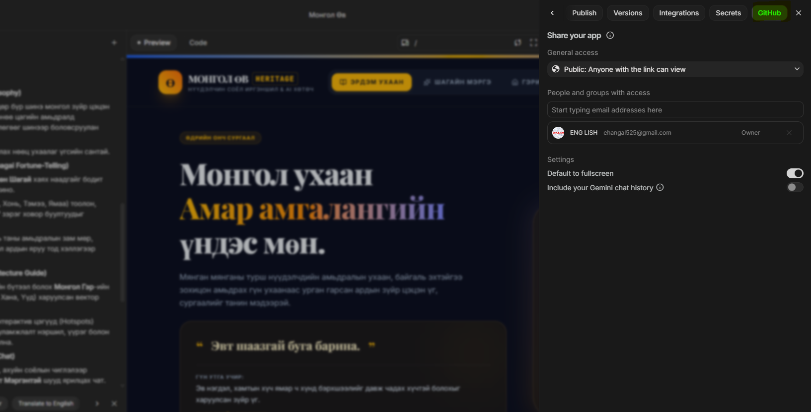
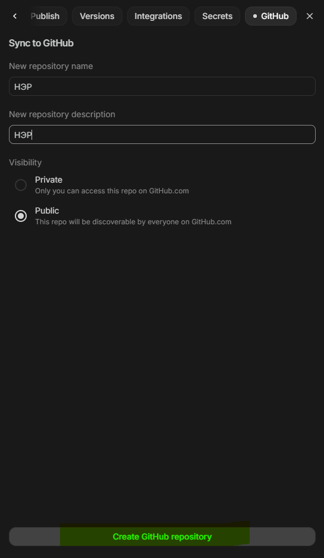
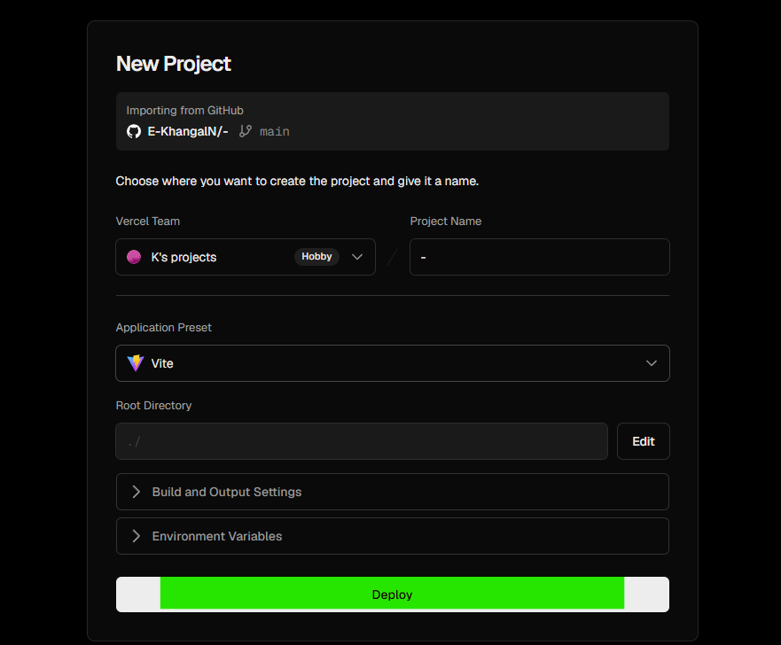

| 1-р долоо хоног бататгах | [🎮 Kahoot ](https://play.kahoot.it/v2/?quizId=e23d2909-7ceb-43f6-b6c0-7a1e94d6f80a&hostId=683fb2da-0012-40c6-9a66-cd7954ce4560) |


# Хийсэн веб сайтаа GitHub болон Vercel ашиглан deploy хийж интернэтэд байршуулцгаая.


## 1. Ашиглах технологиуд

- AI Studio
- GitHub
- Vercel


## 2. GitHub гэж юу вэ?

GitHub нь програм хангамжийн код хадгалах, хувилбар удирдах болон хөгжүүлэгчид хамтран ажиллах боломж олгодог үүлэн платформ юм. GitHub нь Git технологид суурилдаг бөгөөд кодын өөрчлөлтийн түүхийг хадгалах, өмнөх хувилбарууд руу буцах, багийн гишүүдтэй хамтран ажиллах боломжийг олгодог.

### GitHub-ийн давуу талууд

- Кодыг онлайнаар аюулгүй хадгална.
- Өөрчлөлтийн түүхийг бүртгэнэ.
- Багийн ажиллагааг дэмжинэ.
- Vercel зэрэг олон платформтой холбогддог.


## 3. Vercel гэж юу вэ?

Vercel нь веб сайт болон веб аппликейшнийг интернетэд байршуулах (deploy) зориулалттай үүлэн платформ юм. Ялангуяа React, Next.js, Vite зэрэг орчин үеийн веб технологитой маш сайн ажилладаг.

GitHub дээр хадгалагдсан төслийг Vercel автоматаар уншиж, хэдхэн секундын дотор интернетэд байршуулдаг.

### Vercel-ийн давуу талууд

- Үнэгүй ашиглах боломжтой.
- Хурдан deploy хийдэг.
- GitHub-той шууд холбогддог.
- Автомат шинэчлэлттэй.


### Сайтаа шинэчлэх

1. AI Studio дээр коддоо өөрчлөлт оруулна.
2. GitHub руу дахин Publish хийнэ.
3. Vercel автоматаар шинэ Deploy үүсгэнэ.
4. Гараар дахин байрлуулах шаардлагагүй.
---

# 1. GitHub бүртгэл үүсгэх

1. GitHub веб сайт руу орно. (https://github.com/)
2. **Sign Up** товчийг дарж бүртгэл үүсгээрэй.


---

# 2. AI Studio-г GitHub-тай холбох

1. AI Studio дээр төслөө нээнэ.
2. Share товчийг дараад сонголтуудыг хойш нь гүйлгэснээр github сонголт гарч ирсэнээр түүндээр дарна. Зураг дээр public тохиргоонуудаа хийхээ мартаж болохгүй шүү. 

3. Github - аараа нэвтрэх


4. Github руу чиний веб ямар нэртэй орохыг бичиж өгөөд, public тохиргоог идэвхжүүлээд create github repository гэх товчлуурыг дарна.



Жишээ:

```text
my-ai-website
```

**Create Repository** эсвэл **Push to GitHub** товчийг дарна.

Ингэснээр AI Studio дахь код GitHub руу автоматаар хадгалагдана.

---

# 3. Vercel ашиглан веб сайт байршуулах

1. Vercel веб сайт руу орно. (https://vercel.com/new)
2. **Continue with GitHub** товчийг дарна.
3. Веб сайтынхаа ард байрлах import товчыг дарж шууд deploy товчыг дарсанаар сайт байршина. 



Тусдаа Vercel бүртгэл үүсгэх шаардлагагүй.

GitHub аккаунтаар автоматаар бүртгэгдэнэ.

4. Байршуулсаныхаа дараа visit товч нь дээр дарж вебийнхээ линкийг хуулж аваад DISCORD руугаа хуулж тавиарай. 

---


---


# Дүгнэлт

AI Studio → GitHub → Vercel → Internet

гэсэн дарааллаар веб сайтыг маш хурдан бөгөөд үнэгүйгээр интернетэд байршуулж болно.