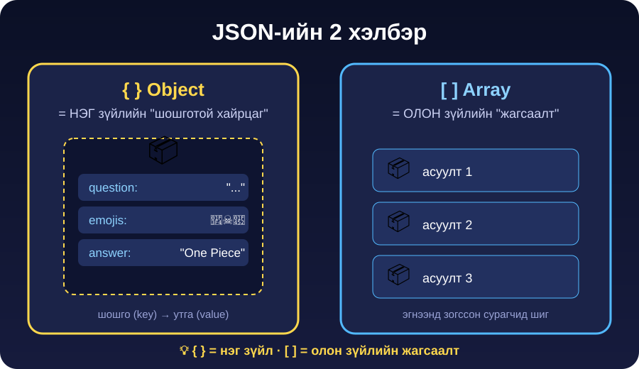
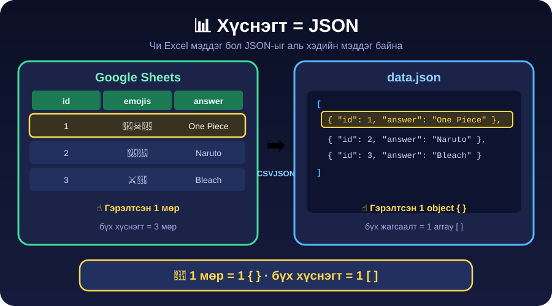

← **[Хичээл 5 руу буцах](../readme.md)**

# 🧩 ХЭСЭГ 1 — JSON суурь + дасгалууд · ⏱️ ~25 мин

> 🎯 **Зорилго:** `{ }` ба `[ ]`-ийг ойлгож, алдаатай JSON-ыг **өөрөө засаж**, өөрөө JSON бүтээж чаддаг болох.

🛠️ Хэрэгсэл: **[JSONLint](https://jsonlint.com)** — JSON шалгагч (үнэгүй, бүртгэлгүй)

---

<details open>
<summary>🎴 <b>Дасгал 1.1 — JSON бол зүгээр л карт</b> · ⏱️ ~5 мин</summary>



| Хэлбэр           | Гэдэг нь                  | Зүйрлэл                           |
| ---------------- | ------------------------- | --------------------------------- |
| `{ }` **object** | **НЭГ** зүйл, талбартай   | 🎴 Pokémon карт — нэр, хүч, төрөл |
| `[ ]` **array**  | **ОЛОН** зүйлийн жагсаалт | 🎵 Playlist — дуу 1, дуу 2, дуу 3 |

Нэг аниме асуулт JSON-оор:

```json
{
  "id": 1,
  "emojis": "🏴‍☠️🍖👒",
  "answer": "One Piece",
  "options": ["One Piece", "Naruto", "Bleach", "Dragon Ball"]
}
```

> 💡 **Ажигла:** `options` бол `[ ]` **array** — object **дотор** array байж болно. 🪆 Матрёшка шиг.

**✍️ Хосоороо 30 секунд:** Дуртай нэг аниме сонгоод дээрх хэлбэрээр **цаасан дээр** бич. `id`, `emojis`, `answer`, `options`.

</details>

---

<details>
<summary>📊 <b>Дасгал 1.2 — Хамгийн чухал ойлголт: хүснэгт = JSON</b> · ⏱️ ~4 мин</summary>



> # 🔑 **1 мөр = 1 `{ }`** · **бүх хүснэгт = 1 `[ ]`**

Чи Excel эсвэл Google Sheets хэрэглэж үзсэн үү? **Тэгвэл чи JSON-ыг аль хэдийн мэддэг байна** — зөвхөн хэлбэр нь өөр.

Тиймээс өнөөдөр асуултаа **гараар JSON бичихгүй**. Хүснэгтээр бичээд нэг товч дараад хувиргана. 😎 (→ ХЭСЭГ 2)

**✅ Шалгая:** "Хүснэгтийн 1 мөр JSON-д юу болох вэ?" гэсэн асуултад **шууд** хариулж чадаж байна уу?

</details>

---

<details>
<summary>🐛 <b>Дасгал 1.3 — "Алдаатай JSON" засах тэмцээн</b> · ⏱️ ~8 мин · 🏆 тэмцээн</summary>

> 🏁 Доорх **4 JSON бүгд эвдэрсэн.** Компьютер уншиж чадахгүй. Чиний ажил бол **эмч болж эмчлэх**.
>
> **Яаж:** [JSONLint](https://jsonlint.com) руу нэг нэгээр буулга → **Validate JSON** дар → алдаа хаана байгааг **мөрийн дугаараар** заана → зас → дахин Validate. 🟢 **"Valid JSON"** гарвал тэр үе давсан!
>
> ⏱️ Багш үе тутам ~1.5 минут цаг барина. Хос бүр давсан үеийнхээ тоог хашгирна!

### 🥊 Үе 1 — Хамгийн түгээмэл алдаа

```text
{
  "id": 1
  "answer": "One Piece"
}
```

<details>
<summary>💬 Хариу (эхлээд өөрөө турш!)</summary>

`"id": 1`-ийн дараа **таслал `,`** алга.

✅ Дүрэм: талбар хоорондоо **таслалаар** салдаг — гэхдээ **хамгийн сүүлчийнх** таслалгүй.

</details>

### 🥊 Үе 2 — Хашилтын дүрэм

```text
{
  id: 2,
  'answer': 'Naruto'
}
```

<details>
<summary>💬 Хариу</summary>

**2 алдаа:** `id` хашилтгүй байна, `'answer'` ба `'Naruto'` бол **дан** хашилт.

✅ Дүрэм: JSON-д **бүх key ба бүх текст ЗААВАЛ хос хашилт `" "`** дотор. Зөв нь:

```text
{ "id": 2, "answer": "Naruto" }
```

</details>

### 🥊 Үе 3 — Хаалт хаах

```text
{
  "id": 3,
  "options": ["Bleach", "Goku", "Luffy"
}
```

<details>
<summary>💬 Хариу</summary>

`[` нээгээд **`]` хаагаагүй**.

✅ Дүрэм: нээсэн хаалт бүр хаагдана — `{` → `}`, `[` → `]`.

</details>

### 🥊 Үе 4 — Нуугдмал алдаа (хүнд!)

```text
{
  "id": 4,
  "answers": ["ван пийс", "one piece",],
}
```

<details>
<summary>💬 Хариу</summary>

**2 илүү таслал:** `"one piece"`-ийн дараа болон `]`-ийн дараа.

✅ Дүрэм: **сүүлчийн** элемент/талбарын дараа таслал тавьдаггүй (_trailing comma_).

> 💡 JSONLint эхлээд зөвхөн **1 алдаа** заана. Заасныг зассаны дараа **дахин Validate** дар — 2 дахь нь гарч ирнэ. Жинхэнэ програмчлагч ингэж ажилладаг: зас → шалга → зас → шалга.

</details>

---

> 🏆 **4/4 давсан хос → 🧩 JSON Detective цол!**

</details>

---

<details>
<summary>🏅 <b>Дасгал 1.4 — JSON Boss Battle: 5 үе</b> · ⏱️ ~8 мин · өөрийн хэмнэлээр</summary>

> Одоо **уншихаа болиод бүтээ.** [JSONLint](https://jsonlint.com) дээр өөрөө бичээд 🟢 Valid болго. Валид болсон screenshot-оо **Discord** руу тавь → XP! ⚡

| Үе       | Даалгавар                                                                  | Түлхүүр               |
| -------- | -------------------------------------------------------------------------- | --------------------- |
| 🥊 **1** | 1 object, 3 талбартай (`id`, `emojis`, `answer`)                           | `{ }`                 |
| 🥊 **2** | 3 object-той **array** — 3 асуулт                                          | `[ { }, { }, { } ]`   |
| 🥊 **3** | Object дотор **array** — `options` 4 сонголттой                            | array **дотор** array |
| 🥊 **4** | Object дотор **object** — `"meta": { "difficulty": "easy", "points": 10 }` | 🪆 матрёшка           |
| 🥊 **5** | **Array дотор array** — `hintSteps`                                        | ⬇️ доор хар           |

<details>
<summary>🥊 <b>Үе 5-ын хэлбэр</b> — хамгийн хүнд, гэхдээ SLOW REVEAL механикт ЯГ хэрэгтэй!</summary>

```json
{
  "id": 1,
  "answer": "One Piece",
  "hintSteps": [["🏴‍☠️"], ["🏴‍☠️", "🍖"], ["🏴‍☠️", "🍖", "👒"]]
}
```

Эхлээд 1 emoji, дараа 2, дараа 3 → аажмаар тодруулна. **Array дотор array** — сая юу үзсэн бэ? 😏

(→ ХЭСЭГ 6-ын 🌫️ **SLOW REVEAL** механикт үүнийг шууд хэрэглэнэ.)

</details>

<details>
<summary>💡 Үе 2-ын хэлбэр (гацвал)</summary>

```json
[
  { "id": 1, "answer": "One Piece" },
  { "id": 2, "answer": "Naruto" },
  { "id": 3, "answer": "Bleach" }
]
```

Бүх жагсаалт `[ ]` дотор, элемент бүр `{ }`, хооронд таслал. Яг **хүснэгтийн 3 мөр** шүү дээ!

</details>

</details>

---

## ✅ ХЭСЭГ 1 дуусахад

- [ ] `{ }` = нэг зүйл, `[ ]` = жагсаалт гэдгийг **өөрийн үгээр** тайлбарлаж чадна
- [ ] "1 мөр = 1 `{ }`" зүйрлэлийг хэлж чадна
- [ ] Алдаатай JSON-оос **дор хаяж 3 үе** засаж 🟢 гаргасан
- [ ] JSON Boss Battle-аас **дор хаяж 3 үе** дуусгасан

### ➡️ Дараагийнх: <a href="2-anime-data.md" target="_blank">📦 ХЭСЭГ 2 — Аниме датагаа бэлдэх 🔗</a>
