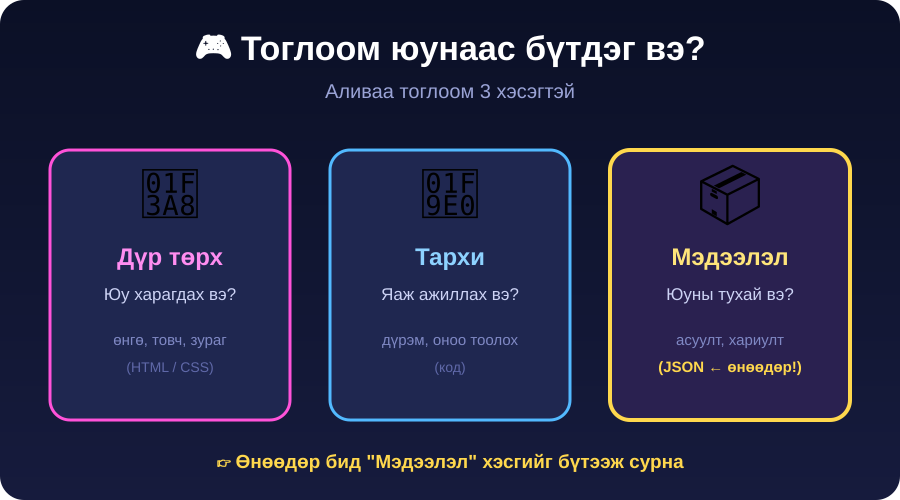
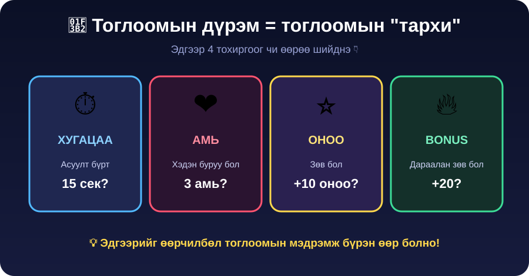

← **[Хичээл 5 руу буцах](../readme.md)**

# 🎮 ХЭСЭГ 3 — Тоглоомоо үүсгэх · ⏱️ ~15 мин

> 🎯 **Зорилго:** ХЭСЭГ 2-д бэлдсэн датагаа **хавсаргаж**, сайтдаа **тоглогддог** тоглоом гаргах.

> ⚠️ **Гоё биш ч зүгээр.** Одоохондоо гол нь **ТОГЛОГДОХ**. Гоо сайхныг ХЭСЭГ 6-д нэмнэ.

---

<details open>
<summary>🧠 <b>Дасгал 3.1 — Тоглоом юунаас бүтдэг вэ?</b> · ⏱️ ~2 мин</summary>



| Хэсэг               | Юу вэ                  | Хаанаас гарч ирсэн     |
| ------------------- | ---------------------- | ---------------------- |
| 🎨 **Дүр төрх**     | Товч, өнгө, animation  | AI бичнэ               |
| 🧠 **Тархи (дүрэм)** | Хугацаа, амь, оноо     | **Чи** шийднэ (3.2)    |
| 📦 **Дата**         | Асуулт, хариулт        | **Чи** бэлдсэн (ХЭСЭГ 2) |

> 💡 Датагаа аль хэдийн бэлдсэн шүү дээ. Одоо дүрмээ шийдээд бүгдийг нийлүүлнэ.

</details>

---

<details>
<summary>🎲 <b>Дасгал 3.2 — Дүрмээ зохио</b> · ⏱️ ~3 мин</summary>



Одоо чи **тоглоом зохиогч**. Эдгээр тоог **чи** шийднэ — өөрчилбөл тоглоом шал өөр мэдрэмжтэй болно.

```
⏱️ ХУГАЦАА — асуулт бүрт хэдэн секунд?    ______
❤️ АМЬ      — хэдэн удаа буруу бол дуусах?  ______
⭐ ОНОО     — зөв бол хэдэн оноо?           ______
```

<details>
<summary>💡 Санаа авах — ямар тоо ямар мэдрэмж өгөх вэ?</summary>

| Тохиргоо                  | Мэдрэмж                          |
| ------------------------- | -------------------------------- |
| 20 сек · 5 амь · +10 оноо | 😌 Тайван, эхлэгчид тохирно      |
| 15 сек · 3 амь · +10 оноо | 🙂 Тэнцвэртэй (**зөвлөж байна**) |
| 7 сек · 2 амь · +20 оноо  | 😰 Мэдрэл хурцдана               |
| 5 сек · 1 амь · +50 оноо  | 💀 Зөвхөн эрхмүүдэд              |

</details>

</details>

---

<details>
<summary>🚀 <b>Дасгал 3.3 — Тоглоомоо гарга (дата хавсаргах)</b> · ⏱️ ~8 мин · 🔑 гол дасгал</summary>

**Хичээл 3-т deploy хийсэн portfolio сайтаа** AI Studio-д нээ. Дараа нь доорх промптыг **бөглөж** (2 зүйл) чатад буулга:

1. `[__]` тоонуудыг **3.2-т шийдсэн** дүрмээрээ
2. Хамгийн доор **ХЭСЭГ 2-т бэлдсэн JSON**-оо буулга

```text
Миний portfolio сайтад "🎮 Миний тоглоомууд" гэсэн шинэ цэс нэмээч.
Тэр цэс дотор "Anime Guesser" гэсэн emoji таавар тоглоом байна.

ТОГЛООМЫН ЯВЦ:
- Emoji-г харуулж, 4 сонголтоос зөв анимийг таалгана.
- Асуулт бүрт [__] секундын хугацаа. Хугацаа дуусвал буруу гэж тооцно.
- Тоглогч [__] амьтай — тэр тоо удаа буруу бол тоглоом дуусна.
- Зөв хариулбал +[__] оноо. Оноо, амь, хугацааг дэлгэц дээр байнга харуул.
- Тоглоом дуусахад авсан оноог харуулаад "Дахин тоглох" товч гарга.

ДАТА:
- Асуултуудыг тусдаа "data.json" файлаас уншина.
- data.json-ий агуулга бол доорх JSON. options талбарын "|"-ээр
  салгасан текстийг 4 элементтэй array болго.

ЗУРАГ:
- Асуултын "image" талбарт зургийн хаяг байвал зөв хариулсны дараа тэр
  зургийг харуул (өндөр нь 200px орчим, дэлгэцээс гарахгүй байг).
- Талбар хоосон эсвэл зураг ачаалагдахгүй бол автоматаар нуугдаж,
  зөвхөн emoji харуул — хоосон, эвдэрсэн зургийн хүрээ бүү үлдээ.
- Хуудасны доод талд жижиг үсгээр "Зургийн эх сурвалж: Wikipedia" гэж бич.

[ЭНД ХЭСЭГ 2-Т БЭЛДСЭН JSON-ОО БУУЛГА]
```

> 💡 `answers` талбар нэмсэн бол промптод нэмж бич: _"answers array-тай асуултад тоглогч гараар бичсэн хариултыг том/жижиг үсэг, зайг үл харгалзан тааруулж шалга."_

</details>

---

<details>
<summary>✅ <b>Дасгал 3.4 — ЗААВАЛ шалгах (checkpoint)</b> · ⏱️ ~2 мин</summary>

> 🛑 **Энэ 5 зүйл бүгд ✅ болтол ХЭСЭГ 4 руу БҮҮ ЯВ.** Эвдэрсэн тоглоом дээр шинэ зүйл нэмбэл бүх зүйл дордоно.

- [ ] "🎮 Миний тоглоомууд" цэс сайтад **харагдана**
- [ ] Тоглоом нээгдэж, **асуулт гарна**
- [ ] Зөв хариулахад **оноо нэмэгдэнэ**
- [ ] Буруу хариулах / хугацаа дуусахад **амь хасагдана**
- [ ] Амь дуусахад тоглоом **дуусаж, оноо харагдана**
- [ ] 🖼️ `image`-тай асуултад зөв хариулахад **зураг гарна** (зураггүй асуулт зүгээр л алгасна)

<details>
<summary>🆘 <b>Ажиллахгүй бол</b></summary>

Ямар зүйл ажиллаагүйг **тодорхой** хэлж AI-д асуу:

```text
Тоглоом [юу болохгүй байгааг тодорхой бич — ж: "асуулт гарахгүй,
дэлгэц хоосон"] байна. Шалгаад засаач.
```

Браузерын Console дээр улаан алдаа байвал **хуулж AI-д өг** — тэр л хамгийн хурдан зам.

**data.json ачаалахгүй бол** → агуулгыг [JSONLint](https://jsonlint.com) руу буулгаж Validate дар. 🟢 биш бол алдаагаа зас.

</details>

</details>

---

## ✅ ХЭСЭГ 3 дуусахад

- [ ] Дүрмээ **өөрөө** шийдэж AI-д хэлсэн
- [ ] Бэлдсэн датагаа промптод **хавсаргасан**
- [ ] Дасгал 3.4-ийн **5 шалгуур бүгд ✅**

### ➡️ Дараагийнх: <a href="4-shine-gorim.md" target="_blank">🕹️ ХЭСЭГ 4 — Шинэ горим + шинэ дата 🔗</a>
