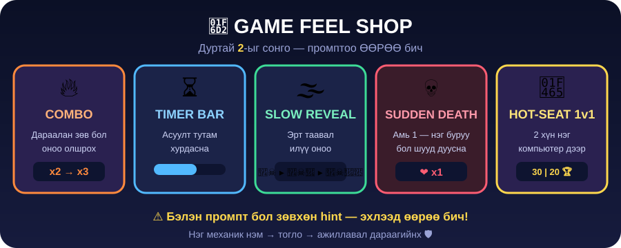

← **[Хичээл 5 руу буцах](../readme.md)**

# 🛒 ХЭСЭГ 6 — GAME FEEL SHOP · ⏱️ ~12 мин

> 🎯 **Зорилго:** Тоглоомоо **тоглоом шиг** мэдрэгдүүлэх. Subway Surfers, Roblox сонирхолтой байдгийн шалтгаан бол яг эдгээр жижиг зүйлс.



> ## ⚠️ ЭНД ДҮРЭМ ӨӨР — промптоо **ӨӨРӨӨ** бич!
>
> Доорх карт бүрт зөвхөн **🎯 зорилго** ба **✅ шалгуур** байна. AI-д яаж хэлэхээ **өөрөө** шийд.
>
> Бэлэн промпт бол зөвхөн **hint** — эхлээд **2 удаа өөрөө** туршаад л нээ. Жинхэнэ ур чадвар бол код бичих биш, **AI-д хүсэлтээ тодорхой хэлж чадах**. 💪

**🛒 Дэлгүүрээс 2 механик сонго** (хүсвэл 3):

---

<details>
<summary>🔥 <b>COMBO</b> — дараалан зөв бол оноо олшрох</summary>

**🎯 Зорилго:** Дараалан зөв хариулах тусам оноо олшрох. 2 дараалан → x2, 3 ба дээш → x3. Дэлгэц дээр `🔥 COMBO x3!` том, өнгөтэй гарч ирнэ. Буруу хариулбал combo 0 болж тасарна.

**✅ Шалгуур:** 3 удаа дараалан зөв хариулахад оноо 3 дахин ихсэж, COMBO текст харагдана.

<details>
<summary>💬 Hint — гацвал (эхлээд 2 удаа өөрөө турш!)</summary>

```text
Тоглоомд combo систем нэмээч. Дараалан зөв хариулах тусам оноо
олшрох: 2 дараалан бол x2, 3 ба дээш бол x3. Дэлгэцийн дээд хэсэгт
"🔥 COMBO x3!" гэж том, өнгөтэй харуулаад бага зэрэг том жижиг болж
цохилоод бай. Буруу хариулбал combo 0 болж тасарна.
```

</details>
</details>

---

<details>
<summary>⏳ <b>TIMER BAR</b> — цагийн зурвас, асуулт тутам хурдасна</summary>

**🎯 Зорилго:** Асуулт бүрийн дээр зурвас багасна. Асуулт тутам **бага зэрэг хурдасна** — сүүлдээ мэдрэл хурцдана. Үлдсэн 3 секундээс бага бол зурвас улаан болж дэлсэнэ.

**✅ Шалгуур:** Зурвас багасаж, дуусахад автоматаар дараагийн асуулт руу орно. 3 сек-ээс бага үед улаан болно.

<details>
<summary>💬 Hint — гацвал</summary>

```text
Асуулт бүрийн дээр цагийн зурвас (progress bar) нэмээч. Зурвас
зүүнээс баруун тийш багасна. Эхний асуулт 15 секунд, дараа нь асуулт
тутам 1 секундээр багасна (доод хязгаар 6 секунд). Үлдсэн 3 секундээс
бага үед зурвас улаан болж дэлсэг. Цаг дуусвал буруу гэж тооцоод
дараагийн асуулт руу шилжинэ.
```

</details>
</details>

---

<details>
<summary>🌫️ <b>SLOW REVEAL</b> — emoji аажмаар тодрох (JSON Boss Battle Үе 5-тай хамт!)</summary>

**🎯 Зорилго:** Emoji бүгд зэрэг гарахгүй — эхлээд 1, дараа 2, дараа 3. **Эрт таасан хүн их оноо** авна (1 emoji-гоор +30, 2-оор +20, 3-аар +10).

**✅ Шалгуур:** Асуулт эхлэхэд зөвхөн 1 emoji гарна, 3 секунд тутамд нэг нэмэгдэнэ, эрт таасан бол оноо илүү.

> 🧩 Энэ механикт `hintSteps` гэсэн **array дотор array** хэрэгтэй — ХЭСЭГ 1-ийн Boss Battle **Үе 5** яг үүн тухай байсан!

<details>
<summary>💬 Hint — гацвал</summary>

```text
Emoji таавраа аажмаар тодруулах болгооч. data.json-д асуулт бүрт
"hintSteps" гэсэн array дотор array нэмнэ — жишээ:
"hintSteps": [["🏴‍☠️"], ["🏴‍☠️","🍖"], ["🏴‍☠️","🍖","👒"]]
Асуулт эхлэхэд 1-р шат харуулаад, 3 секунд тутамд дараагийн шат руу
ор. Аль шатанд таасныг харгалзаж оноо өг: 1-р шат +30, 2-р шат +20,
3-р шат +10.
```

</details>
</details>

---

<details>
<summary>💀 <b>SUDDEN DEATH</b> — амь 1, нэг буруу бол шууд дуусна</summary>

**🎯 Зорилго:** Цэсэнд шинэ горим — **амь 1**. Нэг буруу бол шууд дуусна. "Хэдэн асуулт даасан бэ?" гэж тоолж, хамгийн сайн үзүүлэлтээ хадгална.

**✅ Шалгуур:** Sudden Death горимд 1 буруу хариулахад шууд дуусаж, даасан асуултын тоо харагдана.

<details>
<summary>💬 Hint — гацвал</summary>

```text
Тоглоомын цэсэнд "💀 Sudden Death" гэсэн шинэ горим нэмээч. Энэ
горимд тоглогч 1 амьтай — нэг буруу хариулбал шууд тоглоом дуусна.
Дэлгэц дээр "Даасан асуулт: 7" гэж тоолж харуулаад, дуусахад хамгийн
сайн үзүүлэлтийг (best streak) браузерт хадгалж дараа нь харуул.
```

</details>
</details>

---

<details>
<summary>👥 <b>HOT-SEAT 1v1</b> — 2 хүн нэг компьютер дээр</summary>

**🎯 Зорилго:** 2 тоглогч ээлжлэн хариулна. Хоёулангийн оноог зэрэг харуулж, төгсгөлд `🏆 Сараа ялсан!` гэж мэдээлнэ.

**✅ Шалгуур:** 2 нэр оруулж, ээлж солигдож, төгсгөлд ялагч гарна.

<details>
<summary>💬 Hint — гацвал</summary>

```text
"👥 1v1" гэсэн горим нэмээч. Эхлэхэд 2 тоглогчийн нэрийг асууна.
Асуулт ээлжлэн гарна — 1-р асуулт Тоглогч 1-д, 2-р асуулт Тоглогч 2-д.
Дэлгэцийн дээд талд хоёуланг нь "Бат: 30 | Сараа: 20" гэж зэрэг
харуулаад, ээлжтэй тоглогчийг гэрэлтүүл. Төгсгөлд ялагчийг том
харуул.
```

</details>
</details>

---

<details>
<summary>✨ <b>Нэмэлт — жижиг ч том эффект өгдөг зүйлс</b> (цаг байвал)</summary>


Эдгээр нь дан дангаараа 1 мөрийн хүсэлт — гэхдээ мэдрэмжийг маш их сайжруулна:

- 🖱️ Товч дээр хулгана аваачихад **томорч гэрэлтэх** (hover)
- ✅ Зөв бол **ногоон**, ❌ буруу бол **улаан** + бага зэрэг **сэгсрэх**
- 🔊 Зөв бол **"ding"**, буруу бол **"buzz"** дуу
- 🎉 Тоглоом сайн дуусвал **confetti**
- ➡️ Дараагийн асуулт **зөөлөн шилжиж** гарах

> 💡 **Нэг дор бүгдийг биш** — нэг нэгээр нэмж туршаад яв. 🛡️

</details>

---

## ✅ ХЭСЭГ 6 дуусахад

- [ ] Дор хаяж **2 механик** сонгож нэмсэн
- [ ] Дор хаяж **1 механикийн промптыг ӨӨРӨӨ бичсэн** (hint нээгээгүй) ⭐
- [ ] Сонгосон механик бүр **үнэхээр ажиллаж** байна
- [ ] Тоглоомын хоёр горим **хэвээр ажиллаж** байна (эвдрээгүй!)

### ➡️ Дараагийнх: <a href="7-duusgah.md" target="_blank">🏆 ХЭСЭГ 7 — Publish + Quest board + тэмцээн 🔗</a>
