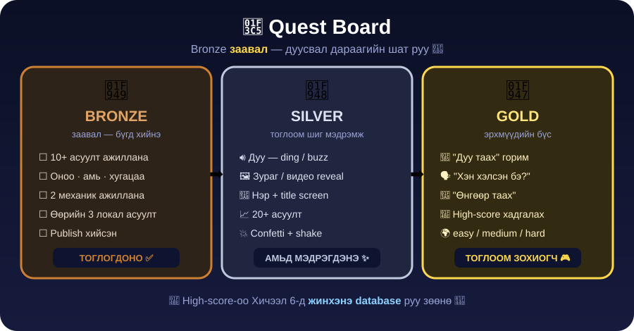
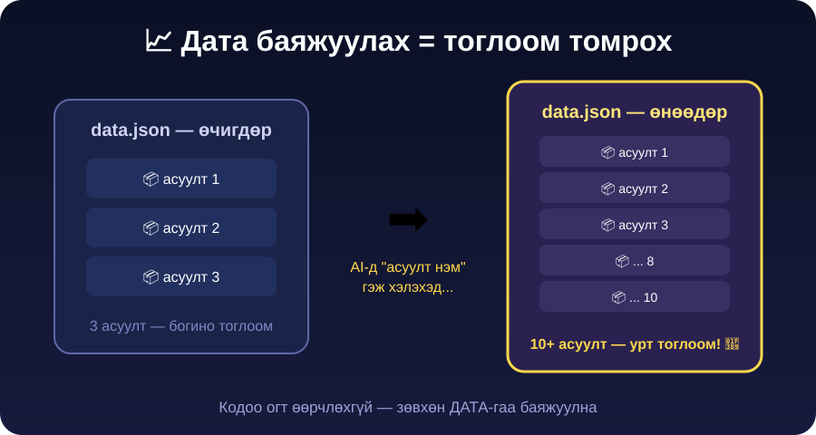

← **[Хичээл 5 руу буцах](../readme.md)**

# 🏆 ХЭСЭГ 7 — Publish + Quest board + тэмцээн · ⏱️ ~14 мин

---

<details open>
<summary>🏅 <b>Дасгал 7.1 — Quest board</b> · ⏱️ ~5 мин</summary>



> 🥉 **Bronze заавал.** Дүүрсэн бол 🥈 Silver, дараа 🥇 Gold. Хэр хол явж чадах вэ? 🚀

<details open>
<summary>🥉 <b>BRONZE — заавал (бүгд хийнэ)</b></summary>

- [ ] 🍥 Аниме горим **10+ асуулттай** ажиллана
- [ ] 🕹️ 2 дахь горим ажиллана, горим сонгох цэс байна
- [ ] Оноо, амь, хугацаа зөв тоологдоно
- [ ] Өөрийн **3 локал асуулт** нэмсэн
- [ ] Сонгосон **2 механик** ажиллана
- [ ] 🚀 Publish хийсэн

</details>

<details>
<summary>🥈 <b>SILVER</b> — тоглоом шиг мэдрэмж</summary>

- 🔊 **Дуу чимээ** — зөв бол "ding", буруу бол "buzz" _(хамгийн хялбар, хамгийн их эффект)_
- 🖼️ **Бүх асуултад зураг** — ХЭСЭГ 2.4-т 3–5 асуултад л зураг нэмсэн бол одоо **бүгдэд** нэм ([Wikipedia](https://www.wikipedia.org)!)
- ▶️ **Видео** — зөв хариулсны дараа YouTube хэсэг тоглуулах:

  ```text
  Асуулт бүрт "video" талбар нэмье. Зөв хариулсны дараа зургийн доор
  YouTube видеог iframe-ээр тоглуул. Талбар байхгүй асуултыг алгас.
  ```

- 🎨 **Brand** — тоглоомдоо **нэр** өг, title screen + cover зураг нэм (AI-аар зураг үүсгэ)
- 📈 Горим тутамд **20+ асуулт** болго
- 💥 Зөв бол confetti, буруу бол улаан + screen shake

</details>

<details>
<summary>🥇 <b>GOLD</b> — эрхмүүдийн бүс</summary>



- 🖼️ **"Зургаар таах"** горим — emoji-г нуугаад **зургийг** харуулж таалгах. Датагаа аль хэдийн бэлдсэн — `image` талбар л хэрэгтэй! _(хамгийн хялбар Gold quest)_
- 🌫️ **"Бүдэг зураг"** — зураг эхлээд бүдэг (blur), 3 секунд тутамд тодорч, эрт таасан хүн их оноо
- 🎵 **"Дуу таах"** горим — opening дууны хэсэг тоглуулж таалгах
- 🗣️ **"Хэн хэлсэн бэ?"** — алдартай хэллэгийг харуулж баатрыг таалгах
- 🌍 **Хүндрэлийн шат** — `"difficulty": "easy" / "medium" / "hard"` талбар нэмж тоглогч сонгодог болго
- 💾 **High-score** — хамгийн өндөр оноог браузерт хадгалж дараа орход харуул
  _(Хичээл 6-д үүнийг **жинхэнэ database** руу зөөнө 👀)_
- 🕹️ **3 дахь горим** — дахин шинэ дата пак! (Одоо чи 10 минутад хийж чадна 😎)

</details>

</details>

---

<details>
<summary>🚀 <b>Дасгал 7.2 — Publish</b> · ⏱️ ~4 мин</summary>

1. AI Studio-с GitHub руу **Publish** дар.
2. **Vercel** автоматаар шинэ хувилбар байршуулна (Хичээл 3-ын тохиргоо).
3. Линкээ өөрийн утаснаас нэг нээж шалга — ажиллаж байна уу? 📱
4. Линкээ **Discord** болон **гэр** лүүгээ тавь. 🏠

> ⚠️ **Сана:** Тоглоом чинь одоо интернэтэд **ил**. Локал асуултууд чинь хэн нэгнийг гомдоохоор биш эсэхийг дахин нэг хар.

<details>
<summary>🆘 <b>Vercel шинэчлэгдэхгүй бол?</b></summary>

- GitHub дээр өөрчлөлт орсон эсэхийг шалга (repo-г нээж хар).
- Vercel dashboard → **Deployments** → сүүлийн deploy ямар статустай байна?
- Алдаа байвал текстийг **хуулж AI-д өг**.

</details>

</details>

---

<details>
<summary>🏆 <b>Дасгал 7.3 — ТЭМЦЭЭН + 3 шагнал</b> · ⏱️ ~5 мин</summary>

> 🎮 Хос бүр **3 өөр хосын** тоглоомыг Discord линкээр нээж тоглоно.

Тоглох тутам оноогоо тэмдэглэ, дараа нь санал хураалт:

| 🏅 Шагнал                     | Асуулт                                                   |
| ----------------------------- | -------------------------------------------------------- |
| 🧠 **Хамгийн хатуу асуулт**   | Хэний асуулт хамгийн олон хүнийг гацуулав?                |
| ✨ **Хамгийн гоё мэдрэмж**    | Хэний тоглоом жинхэнэ тоглоом шиг мэдрэгдэв?              |
| 😂 **Хамгийн инээдтэй**       | Хэний **локал** асуулт ангийг инээлгэв?                   |

> 💡 Өөр хүн тоглоход нуугдсан алдаа шууд илэрдэг. Энэ бол хамгийн хүчтэй тест — бас хамгийн хөгжилтэй. 😎

**Тоглосны дараа эзэндээ 2 зүйл хэл:**

- 😍 "Хамгийн гоё нь: ______"
- 🤔 "Ингэвэл дээр: ______"

</details>

---

## ✅ ХЭСЭГ 7 дуусахад

- [ ] 🥉 **Bronze quest бүрэн дүүрсэн**
- [ ] Publish хийж, линкээ утаснаас нээж шалгасан
- [ ] Discord-д линкээ тавьсан
- [ ] 3 хосын тоглоомыг тоглосон

---

## 🎉 Өнөөдөр чи юу сурав?

| Ур чадвар                            | Хаана хэрэглэв                    |
| ------------------------------------ | --------------------------------- |
| 🧩 JSON уншиж, бичиж, **засаж**      | ХЭСЭГ 1 — Алдаатай JSON, Boss Battle |
| 📊 Хүснэгтээс JSON гаргах            | ХЭСЭГ 2, 4 — Sheets → CSVJSON     |
| 🪆 Nested бүтэц (object дотор array) | ХЭСЭГ 4 — 2 горимын дата          |
| 🎯 AI-д промптоо **өөрөө** бичих     | ХЭСЭГ 6 — Game Feel Shop          |
| 🧠 **Код = дүрэм · Дата = агуулга**  | ХЭСЭГ 5 — 2 горим, 1 код          |

> 🚀 **Дараагийн хичээлд:** оноогоо **жинхэнэ database (Firestore)**-д хадгалж, ангийн **Leaderboard** гаргана. Гэрийн даалгавраар "Баатар таах" горимоо эхлүүлээд ир!

### ← <a href="../readme.md">Хичээл 5 руу буцах</a>
