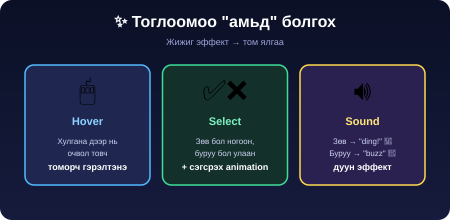
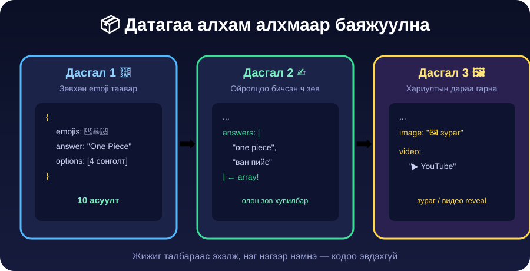

| Өмнөх хичээл бататгах | [🎮 Kahoot](https://create.kahoot.it/details/15fb063c-8ce6-43be-af96-8ee3db828093/) |
| --------------------- | ----------------------------------------------------------------------------------- |

# Хичээл 6 — 🎮 Anime Guesser тоглоомоо бүтээх + JSON-той танилцах

> 🎯 **Өнөөдөр:** Эхлээд тоглоомынхоо **дүрэм**, **мэдрэмжийг** зохиоод, дараа нь **дата (JSON)**-гаа алхам алхмаар бэлдэнэ.

👉 **[Жишээ тоглоом үзэх](https://ai.studio/apps/c075aff4-289c-45c8-a050-9207f9afe5ac)** — чи иймэрхүүг хийнэ.

👉 **[Слайд үзэх](https://docs.google.com/presentation/d/1Xu-jnS15SjZXO6QSQS04RBZPNlw5gtN18Asrtgxhv58/edit?usp=sharing)**

> 👯 **Хосоороо хий!** Нэг нь "жолооч" (бичнэ), нэг нь "навигатор" (хянана, санал өгнө). 15 минут тутамд үүрэг сольж бай — хамтран хийвэл хурдан, хөгжилтэй.

---

## 🧠 Эхлээд ойлгоё (багштай хамт, 10 мин)

**Тоглоом 3 хэсэгтэй:**


**JSON-ийн 2 хэлбэр** (дата ийш хадгална):


> 💡 `{ }` = **нэг** зүйл (Pokémon карт шиг) · `[ ]` = **жагсаалт** (playlist шиг)

---

## 🎲 Алхам 1 — Тоглоомынхоо дүрмийг зохио (эхлээд!)

Дата руу орохоосоо өмнө тоглоом **хэрхэн ажиллахыг** шийднэ.


**📋 Хосоороо бөглө:**

```
⏱️ ХУГАЦАА — асуулт бүрт хэдэн секунд? ______
❤️ АМЬ     — хэдэн удаа буруу бол дуусах?  ______
⭐ ОНОО    — зөв бол хэдэн оноо?           ______
🔥 BONUS   — нэг онцгой дүрэм:             ______________
```

**Жишээ — суурь дүрэм (промпт болгож хуул):**

```text
Миний Anime Guesser тоглоомын дүрэм ийм байг:
- Асуулт бүрт 4 сонголттой, зөв хариулбал +10 оноо.
- Асуулт бүрт 15 секундын хугацаатай, хугацаа дуусвал буруу гэж тооцно.
- Тоглогч 3 амьтай — 3 удаа буруу бол тоглоом дуусна.
- Дараалан 3 удаа зөв бол bonus +20 оноо.
Энэ дүрмийн дагуу тоглоомоо ажиллуулаач.
```

> 💡 Тоонуудаа (15 сек, 3 амь, +10) өөрчилбөл тоглоом шал өөр мэдрэмжтэй болно.

---

## 🎨 Алхам 2 — Тоглоомоо "амьд" болго

Subway Surfers, Roblox шиг тоглоом нь **хариу үйлдэл** өгдөг учраас сонирхолтой. Бид ч мөн адил.



**Промпт (хуул):**

```text
Тоглоомоо илүү амьд, тоглоом шиг мэдрэмжтэй болгоё:
- Хариултын товч дээр хулгана аваачихад (hover) товч томорч, бага зэрэг гэрэлтэг.
- Зөв хариулахад товч НОГООН болж, буруу бол УЛААН болоод бага зэрэг сэгсрэг (animation).
- Зөв хариулахад "ding" дуу, буруу бол "buzz" дуу гарга (sound effect).
- Хариултын дараа дараагийн асуулт зөөлөн шилжиж гарч ирэг.
```

> 💡 Нэг дор бүгдийг биш — нэг нэгээр нь нэмж туршаад яв.

---

## 📦 Алхам 3 — Датагаа алхам алхмаар бэлдэх



### 🎯 Дасгал 1 — Зөвхөн Emoji таавар (энгийн)

Эхлээд **зөвхөн нэг төрлийн** асуулт. Илүү талбар хэрэггүй — энгийн байх тусам тодорхой.

```json
{
  "id": 1,
  "emojis": "🏴‍☠️🍖👒",
  "answer": "One Piece",
  "options": ["One Piece", "Naruto", "Bleach", "Dragon Ball"]
}
```

**Дата үүсгэх жижиг промпт:**

```text
Anime emoji таавар тоглоомд 10 асуулт JSON-аар бэлдээч. Бүтэц: id, emojis,
answer, options (4 сонголт). Зөвхөн алдартай аниме (One Piece, Naruto,
Demon Slayer гэх мэт). Тоглоом "data.json" файлаасаа уншдаг болго.
```

### ✍️ Дасгал 2 — "Ойролцоо буруу" хариултыг хүлээж авах

Хүүхэд "one piece" эсвэл "ван пийс" гэж бичвэл яах вэ? → **`answers`** гэсэн **JSON array** нэмж, олон зөв хувилбарыг хүлээж авна.

```json
{
  "id": 1,
  "emojis": "🏴‍☠️🍖👒",
  "answer": "One Piece",
  "answers": ["one piece", "onepiece", "ван пийс"],
  "options": ["One Piece", "Naruto", "Bleach", "Dragon Ball"]
}
```

```text
Асуулт бүрт "answers" гэсэн array нэмье. Тоглогчийн хариултыг энэ жагсаалтын
аль нэгтэй (том/жижиг үсэг, зайг үл харгалзан) таарвал ЗӨВ гэж тоолоорой.
```

> 💡 Энд `answers` нь дахиад л **array `[ ]`** — олон зүйлийн жагсаалт.

### 🖼️ Дасгал 3 — Хариултын дараа зураг / видео гаргах

Зөв хариулсны дараа тухайн анимийн **зураг** эсвэл **YouTube видео** гарвал илүү гоё.

```json
{
  "id": 1,
  "emojis": "🏴‍☠️🍖👒",
  "answer": "One Piece",
  "image": "https://.../onepiece.jpg",
  "video": "https://www.youtube.com/embed/XXXX"
}
```

```text
Асуулт бүрт "image" болон "video" талбар нэмье. Тоглогч зөв хариулсны дараа
тухайн анимийн зургийг харуулаад, доор нь YouTube видеог iframe-ээр тоглуулдаг
болгооч.
```

> 💡 Зураг/видео заавал биш — байхгүй асуулт зүгээр л алгасна.

---

## 🚀 Алхам 4 — Турших → Publish → Хуваалцах

1. **2 горимоо** тогло, хостойгоо туршиж үз. 🎉
2. GitHub руу дахин **Publish** → Vercel автоматаар шинэчилнэ.
3. Линкээ **Discord** болон **гэр** лүүгээ тавь. 🏆

<details>
<summary>🌐 <b>Зураг ажиллахгүй бол?</b></summary>

Pinterest/Google-оос зураг хай → баруун товч → **Copy image address** → AI-д: _"One Piece асуултын зургийн холбоосыг [энд тавь] болгож солиоч."_

</details>

<details>
<summary>🔧 <b>data.json-оо өөрөө засах бол?</b></summary>

Зүүн талын файлаас `data.json`-ыг нээ. `,` таслал, `{ }` `[ ]` хаалт, `" "` хашилтаа алдалгүй үлдээ. Эвдэрвэл AI-д _"data.json-д алдаа гарлаа, засаач"_ гэхэд л болно.

</details>

---

## 🛡️ AI Smart & Safe (10 мин)

- **Кредит өг** — бусдын зураг, видеог өөрийнх мэт бүү харуул.
- **Нууцаа хадгал** — нэр, хаяг, утас, сургуулиа бүү бич.
- **AI эндүүрдэг** — гарсан хариултыг шалга.

---

## 🏠 Гэрийн даалгавар — "Дүр таах" горимыг эхлүүл

Дараагийн хичээлд бид **3 дахь горим** болох "Баатрын дүр таах"-ийг дуусгаж, оноог хадгална. Урьдчилж эхлүүлээд ир:

```text
Тоглоомдоо "Баатрын дүр таах" гэсэн шинэ горим нэмье. Энэ горимд аниме
баатрын (Luffy, Naruto, Tanjiro, Goku) зургийг харуулж, нэрийг нь 4
сонголтоос таалгана. Шинэ асуултуудыг data.json дотор тусдаа жагсаалтаар
үүсгээч.
```

### 💡 Баяжуулж болох бусад тоглоомын төрлийн санаанууд


Хүсвэл эдгээрийн нэгийг туршаад үз (бүгд яг л шинэ дата нэмэх замаар):

- 🎵 **"Аниме дуу таах"** — opening дууны хэсгийг тоглуулж, аль аниме болохыг таалгах.
- 🗣️ **"Хэн хэлсэн бэ?"** — алдартай хэллэгийг харуулж, ямар баатар хэлснийг таах.
- 🖼️ **"Тодрох зураг"** — бүдэг зураг аажмаар тодорч, хэн түрүүлж таахыг үзэх.
- 🎨 **"Өнгөөр таах"** — баатрын өнгөний хослолыг харуулж нэрийг таах.

> 💡 Алдаа гарвал AI-аас _"Энэ алдааг яаж засах вэ?"_ гэж шууд асуу. 😉
