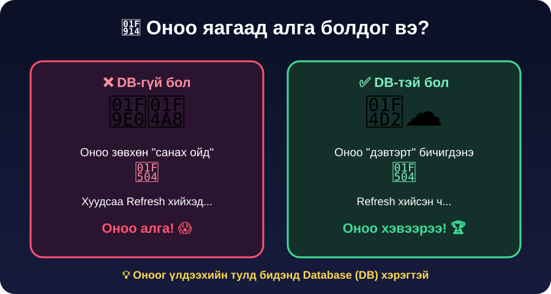
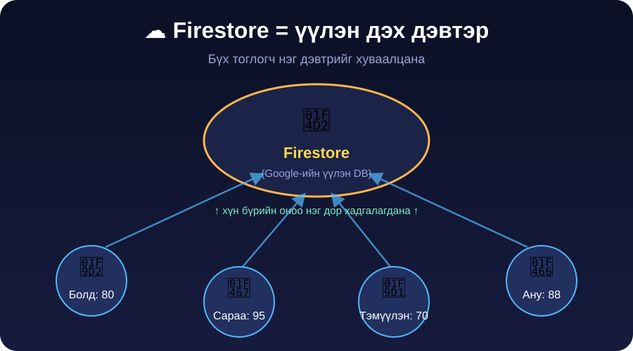
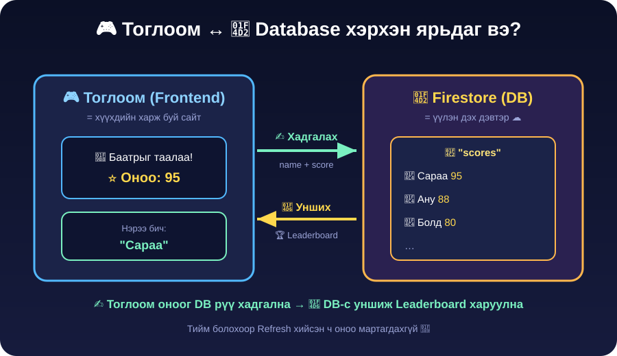
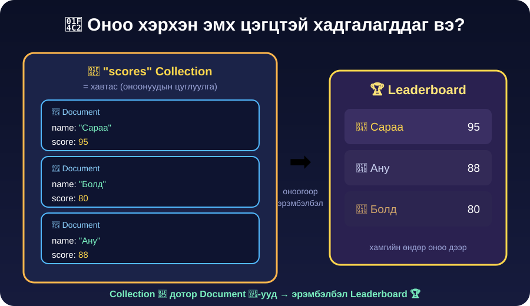

<!-- https://create.kahoot.it/share/lesson-07-kids/dbecbd33-19b3-4553-bef4-57c0125b98ce -->

| Өмнөх хичээл бататгах | [🎮 Kahoot — JSON, data.json, Vibe Coding](https://play.kahoot.it/) |
| --------------------- | ------------------------------------------------------------------- |

👉 **[Жишээ тоглоом](https://ai.studio/apps/c075aff4-289c-45c8-a050-9207f9afe5ac)**
👉 **[Слайд](https://docs.google.com/presentation/d/1gkr-FtMoqvbcnMxoqXikT_y95mFhnsXFOmQnL9j33DM/edit?usp=sharing)**

# Хичээл 7 — 🦸 Баатар таах горим + 🏆 Оноогоо хадгалах (Firestore)

> 🎯 **Өнөөдөр:** "Баатар таах" горимоо дуусгаад, тоглогчдын оноог **Firestore DB**-д хадгалж, **Leaderboard** гаргана.

---

## 🧠 Гол ойлголт (багштай хамт, 10 мин)

> Доорх хайрцгуудыг **нэг нэгээр** дараад нээ. Багш хамт тайлбарла. 👇

<details open>
<summary>😱 <b>Асуудал — оноо яагаад алга болдог вэ?</b></summary>

Хуудсаа **Refresh** хийхэд оноо алга болдог 😱



Оноог үлдээхийн тулд **Database (DB)** хэрэгтэй.

</details>

<details>
<summary>☁️ <b>Шийдэл — Firestore гэж юу вэ?</b></summary>

Бид **Firestore** — Google-ийн **үүлэн дэвтэр** ашиглана. Хэзээ ч мартдаггүй.



</details>

<details>
<summary>🔁 <b>Тоглоом ↔ DB хэрхэн ярьдаг вэ?</b></summary>

Тоглоом оноог DB рүү **хадгална** (✍️), дараа нь DB-с **уншиж** Leaderboard харуулна (📖):



</details>

<details>
<summary>📂 <b>DB дотор оноо хэрхэн цэгцэлдэг вэ?</b></summary>

📂 Collection дотор 📄 Document-ууд байрлана:



> 💡 Нэг тоглогчийн Document-д **name** (нэр) ба **score** (оноо) хадгалагдана.

</details>

---

## 🎯 Алхамууд (нэг нэгээр нь дараад нээ 👇)

<details open>
<summary>🦸 <b>Алхам 1 — "Баатар таах" горимоо дуусгах (хурдан)</b></summary>

Баатруудын **зураг** гарч ирээд нэрийг 4 сонголтоос таалгана.

- **Хичээл 6-н гэрийн даалгавраар эхлүүлсэн бол** → горимоо ажиллуулж, баатар нэмж сайжруул.
- **Эхлүүлээгүй бол** → доорх промптыг AI-д өг:

```text
Аниме таавар тоглоомдоо "Баатрын дүр таах" горим нэмээч. Luffy, Naruto,
Tanjiro, Goku зэрэг баатрын зургийг харуулж нэрийг 4 сонголтоос таалгана.
Шинэ асуултуудыг data.json дотор үүсгээд тоглоомын цэсэнд нэм.
```

> 💡 Алхам алхмаар: эхлээд горимоо ажиллуул, дараа нь баатар нэмж сайжруул.

</details>

<details>
<summary>🛠️ <b>Алхам 2 — Firestore холбож оноо хадгалах</b></summary>

Портфолио төслөө AI Studio дээр нээгээд чатад:

```text
Тоглоомд минь оноо хадгалах нэмэлт хийе. Тоглоом дуусахад тоглогчоос нэрийг
нь асууж, нэр + оноог Firestore-ийн "scores" collection-д хадгалаач.
Firestore холбоход хэрэгтэй алхмуудыг надад зааварлаж өг.
```

> 💡 AI Firestore тохируулах алхмуудыг (Firebase төсөл үүсгэх, тохиргоог хуулах) дараалан хэлж өгнө. Алгасахгүй дагаж яв.

</details>

<details>
<summary>🏆 <b>Алхам 3 — Leaderboard гаргах</b></summary>

```text
"scores" collection дахь оноог өндрөөс нь бага руу эрэмбэлж, ТОП 10
тоглогчийг харуулдаг Leaderboard хуудас нэмж өгөөч.
```

> 🔧 **Оноо хадгалагдахгүй бол?** AI-д: _"Тоглоом дуусахад оноо Firestore-д хадгалагдахгүй байна, шалгаад засаач."_ Console дээр алдаа байвал хуулж AI-д өг.

</details>

<details>
<summary>🚀 <b>Алхам 4 — Шинэчлэх → Хуваалцах</b></summary>

1. GitHub руу дахин **Publish** → Vercel автоматаар шинэчилнэ.
2. Найзтайгаа тоглож, **Leaderboard** дээр хэн түрүүлснийг хар. 🏆
3. Линкээ **Discord** болон **гэр** лүүгээ тавь.

</details>

---

## 🏠 Гэрийн даалгавар / Stretch

- Leaderboard-д 🥇🥈🥉 медаль эсвэл өнгө нэм.
- Зөв/буруу хариулахад **дуу чимээ** нэм.
- "Хамгийн өндөр оноо" (high-score) тэмдэглэгээ нэм.

> 💡 Алдаа гарвал AI-аас _"Энэ алдааг яаж засах вэ?"_ гэж шууд асуу. Амжилт хүсье! 😉
