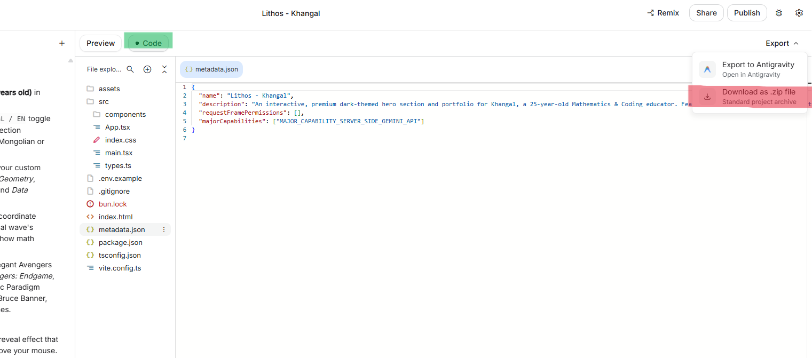
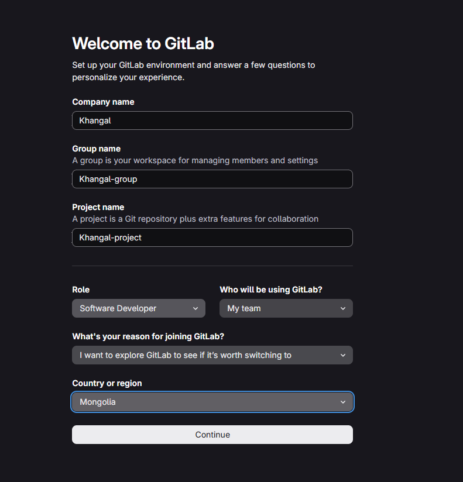
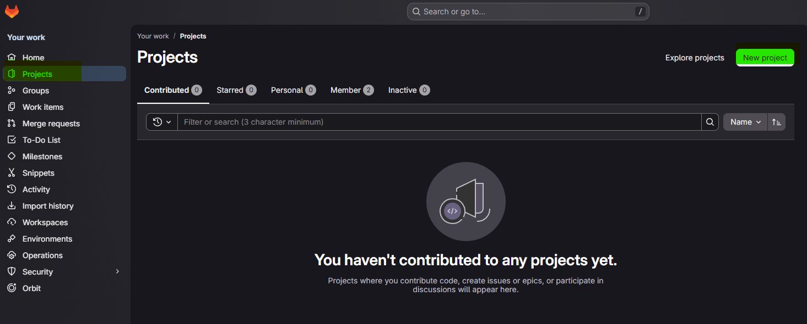
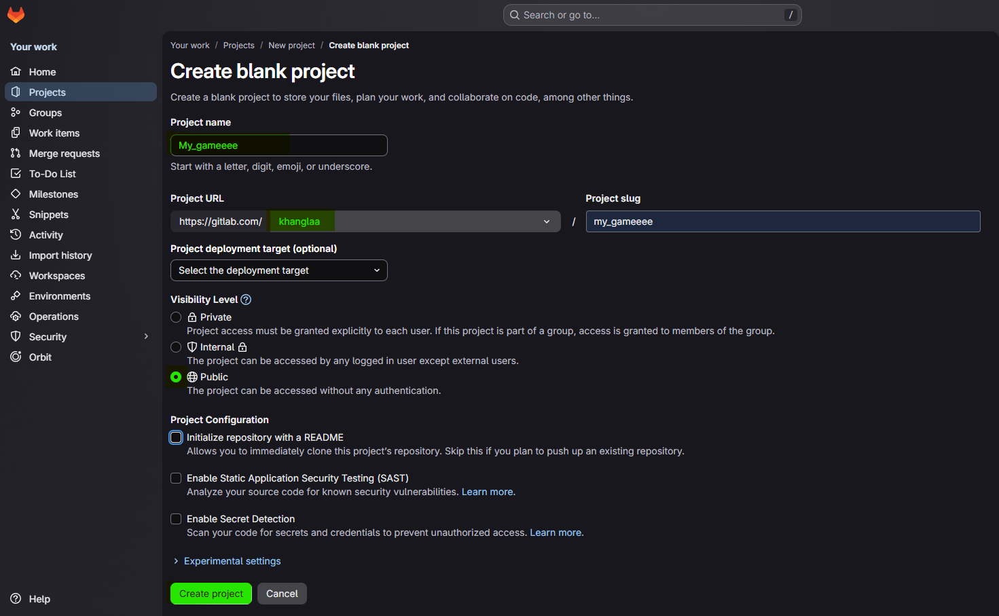
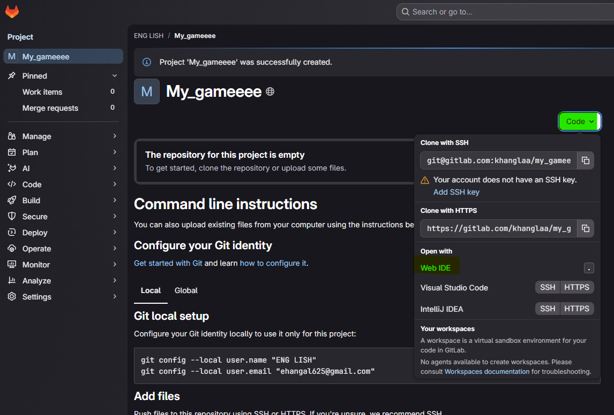
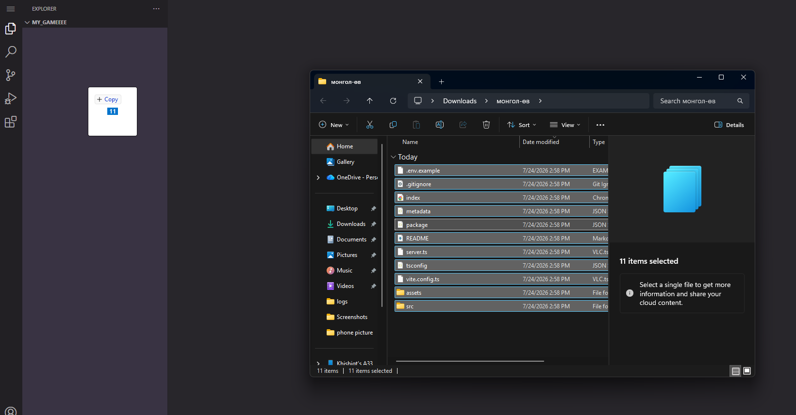
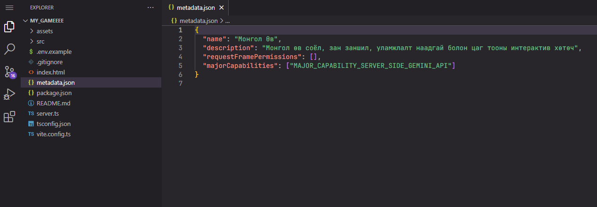
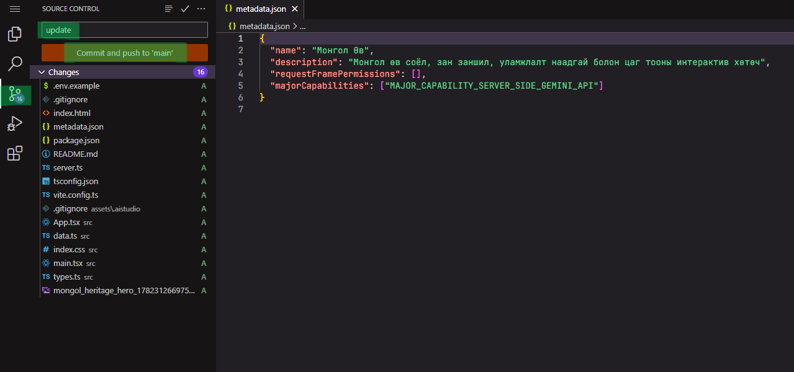

#  Gitlab болон Vercel ашиглан өөрийн төслөө байршуулцгаая. 

AI Studio дээр хийсэн төслөө GitLab руу оруулахын өмнө эхлээд компьютер дээрээ **ZIP файл** болгон татаж авна.

### 📍 1. Төслөө ZIP файл болгон татаж авах 📍

1. AI Studio дээр төслөө нээнэ.
2. Дээд хэсэгт байрлах **Code** таб дээр дарна.
3. Баруун дээд буланд байрлах **Export** товчийг дарна.
4. Гарч ирэх цэснээс **Download as .zip file** сонголтыг дарна.



5. Ингэснээр таны төслийн бүх файл нэг **ZIP файл** болж компьютерт татагдана.
---

### 📍 2. ZIP файлаа задлах 📍

⚠️ GitLab руу ZIP файлыг өөрийг нь биш, **задалсан файлуудыг** оруулах шаардлагатай.

1. ZIP файл дээр хулганын **баруун товч** дарна.
2. **Extract All...** (эсвэл Extract Here) сонгоно.
3. Шинээр хавтас үүсэх бөгөөд төслийн бүх файлууд дотор нь байна.

Жишээ:

```text
my-ai-website/
│
├── index.html
├── package.json
├── src/
├── public/
└── ...
```

Одоо ZIP файлаа задалсан тул дараагийн алхам болох **GitLab дээр Repository үүсгэж файлуудаа Upload хийх** хэсэг рүү шилжинэ.

---
### 📍 3. AI Studio дээрээс татаж авсан ZIP файлаа GitLab руу оруулцгаая 📍
 1. GitLab гэж юу вэ?
```text
GitLab нь програмын код хадгалах, хувилбар удирдах болон хамтран ажиллах боломжтой онлайн платформ юм.
```
AI Studio дээр хийсэн веб сайтаа GitLab дээр хадгалснаар дараа нь Vercel ашиглан маш амархан интернетэд байршуулж болно.

2. GitLab-ийн давуу талууд
```text
- Кодоо онлайнаар аюулгүй хадгална.
- Өөрчлөлтийн түүх хадгалагдана.
- Багийн ажиллагаанд тохиромжтой.
- Vercel-тэй шууд холбогддог.
```

<details>
<summary>➡️ GitLab бүртгэл үүсгэх</summary>

1. https://gitlab.com/users/sign_up сайт руу орно.
2. **Sign up** товчийг дарна.
3. И-мэйл болон нууц үгээ ашиглан бүртгэлээ үүсгэнэ.

4. Бүртгэлээ баталгаажуулж **Sign in** хийнэ.

</details>

<details>
<summary><strong>➡️ GitLab дээр шинэ Repository үүсгэх</strong></summary>

1. GitLab руу орно.
2. **New project** товчийг дарна.




3. **Create blank project** сонгоно. Зураг дээр ногооноор тодруулсан хэсгийг анхаараарай. 


4. Repository-ийн нэрээ оруулна.

5. **Visibility** хэсгээс **Public**-ийг сонгоно.

6. **Create project** товчийг дарна.



</details>
<details>
<summary><strong>➡️ Компьютер дээрээс файлуудаа GitLab руу оруулах</strong></summary>

1. Шинээр үүсгэсэн **Repository** (Төслийн үндсэн хавтас) дотроо орно. Code товчны Web IDB - ийг дарна. 


GitLab Web IDE нь GitLab-ийн вэб хөтөч дээр ажилладаг код засварлах орчин  бөгөөд Repository доторх файл үүсгэх, засварлах, устгах, шинэчлэх зэрэг үйлдлийг компьютерт нэмэлт програм суулгахгүйгээр хийх боломжийг олгодог.


2. Задалсан zip файл дотроо орж байгаад бүгдийг нь идэвхжүүлж чирээд хавтас руугаа оруулна. 


Үр дүн дараахаар харагдана. Чиний төслийн бүх код орсон гэсэн үг. 


</details>

<details>
<summary><strong>➡️ Commit хийх</strong></summary>


Файлууд бүгд орсны дараа Source control дээр дарж тухайн шинэчлэлтэд тохирох нэрийг өгч Commit and push товчийг дарна.

Ингэснээр таны веб GitLab дээр хадгалагдана.


</details>


### 📍4. Одоо GitLab дээр байгаа төслөө Vercel ашиглан интернетэд байршуулна📍

# 3. Vercel ашиглан веб сайт байршуулах

1. Vercel веб сайт руу орно. (https://vercel.com/new)
2. **Continue with Gitlab** товчийг дарна.
3. Веб сайтынхаа ард байрлах import товчыг дарж шууд deploy товчыг дарсанаар төсөл байршина. 


Тусдаа Vercel бүртгэл үүсгэх шаардлагагүй.


4. Байршуулсаныхаа дараа visit товч нь дээр дарж төслийнхөө линкийг хуулж аваад DISCORD руугаа хуулж тавиарай. 

---


---
