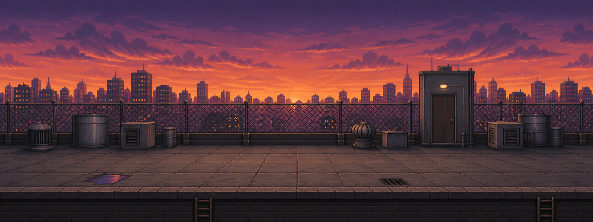
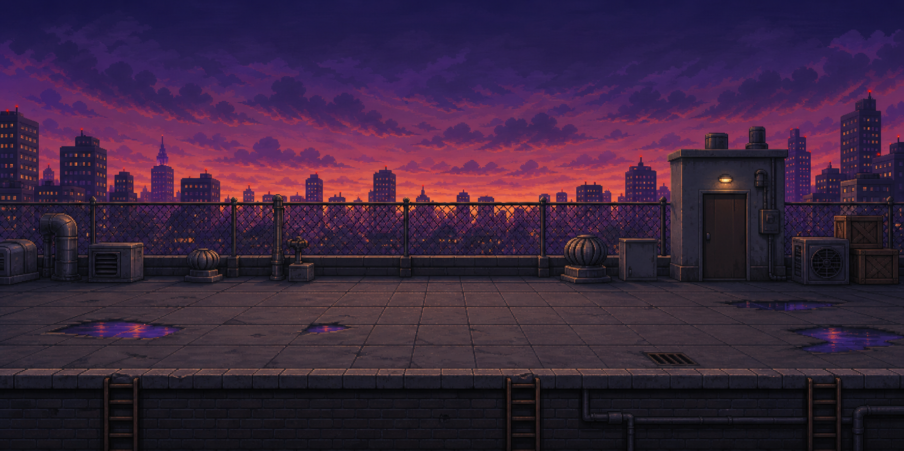

# Жишээ багц (assets)

Хичээл 7, 8-д **жишээ болгон** харуулах бэлэн тоглоомын арт. Өөрийн зураг бүтэхгүй байвал, эсвэл цаг хүрэхгүй бол эндээс шууд авч хэрэглэ.

> Эдгээр нь **зорилтот түвшин** — өөрийн sprite яг ийм байх албагүй. Гэхдээ хэмжээ, бүтэц нь Хичээл 8-ын дүрмүүдтэй яг таарна.

---

## Дүрүүд

| | red-brawler | green-boxer | jiujitsu-fighter |
| --- | --- | --- | --- |
| Portrait |  |  |  |
| Дүрслэл | Улаан хүрэм, хар өмд — гудамжны тулаанч | Ногоон бээлий, бүс — боксчин | Номин ногоон + алт, дреад үс — jiu-jitsu |
| Онцлог цохилт | heavy-kick | heavy-**punch** | heavy-kick + special |

Дүр бүрийн фолдерт:

| Файл | Юу | frames | cols |
| --- | --- | --- | --- |
| `idle.png` | Бэлэн зогсоо | 12 | 5 |
| `walk-forward.png` / `walk-backward.png` | Урагш / хойш алхаа | 8 | 5 |
| `light-punch.png` | Хөнгөн цохилт | 6 | 5 |
| `heavy-kick.png` (эсвэл `heavy-punch.png`) | Хүнд цохилт | 8–10 | 5 |
| `block-high.png` / `block-low.png` | Дээд / доод хамгаалалт | 4 | 5 |
| `crouch.png` | Суулт | 5 | 5 |
| `jump.png` | Үсрэлт | 8 | 5 |
| `hit-high.png` | Цохиулах | 6 | 5 |
| `knockdown.png` | Унах (K.O.) | 10 | 5 |
| `special.png` / `special-charge.png` | Тусгай цохилт (red-brawler, jiujitsu) | 12 / 5 | 5 |
| `portrait.png` | Дүрийн том зураг — цэс, health bar-ын хажууд | — | — |
| `anchor-w.png` | Ногоон дэвсгэртэй эх зураг (1024×1024) | — | — |
| `*-preview.gif` | Тэр анимаци хөдөлж байгаа нь | — | — |

### Техникийн үзүүлэлт

| Юу | Утга |
| --- | --- |
| Нүдний хэмжээ | **256 × 256 px** |
| Багана | **5** (sheet бүр 1280 px өргөн) |
| Мөр | 1–3 (frame тооноос хамаарна) |
| Зай (padding / spacing) | 0 |
| Anchor | x 0.5, y 0.996 — **хэвтээгээр дунд, хөл доод захад** |
| Харах зүг | **зүүн (west)** — P1 болгоход `scaleX(-1)` хэрэгтэй |
| Дэвсгэр | Transparent PNG (`anchor-w.png`-ээс бусад нь) |

Бүрэн метадата: [`index.json`](index.json) — Хичээл 8-ын Алхам 3-т энэ бүтцийг өөрсдөө бичнэ.

---

## Арена

| | |
| --- | --- |
|  | **rooftop-sunset-stage.png** — 2048×768. Өргөн, доод талд тэгш шал, гол дүргүй. Хичээл 7-ын арены 3 шалгуурыг бүрэн хангасан жишээ. |
|  | **rooftop-twilight-stage.png** — 1774×887. Ижил газар, өөр цаг. |

## Бусад

| Фолдер | Юу |
| --- | --- |
| `ui/fighting/` | Health bar, таймер, тулааны HUD-ын атлас |
| `ui/quest/`, `tiles/quest/` | Өөр төрлийн тоглоомын UI, тайл — Хичээл 8-д хэрэглэхгүй |
| `mode-cards/` | "1 vs 1", "1 vs CPU" цэсний карт |
| `stages/rooftop-twilight/` | Арены нэмэлт эд зүйлс (props) |
| `audio/sfx/` | `ui-confirm.mp3` — цэсний товшилтын дуу |
| `config/` | Тоглоомын тохиргооны JSON-ы **загвар** (жишээ утгатай) |

---

## Хэрэглэх дүрэм

- Ангийн ажилд, portfolio-д чөлөөтэй хэрэглэ.
- Тоглоомынхоо доод талд эх сурвалжийг бич — жишээ: _"Sprites: bootcamp жишээ багц"_.
- **Гэхдээ:** зөвхөн бэлэн багцаар хийсэн тоглоом бол Хичээл 7, 8-ын гол ур чадварыг (дүрээ өөрөө гаргах, frame засах) алгасаж байна гэсэн үг. Аль болох **өөрийн дүрээ** гарга — багцыг P2 болгож, эсвэл жишээ болгож хар.
