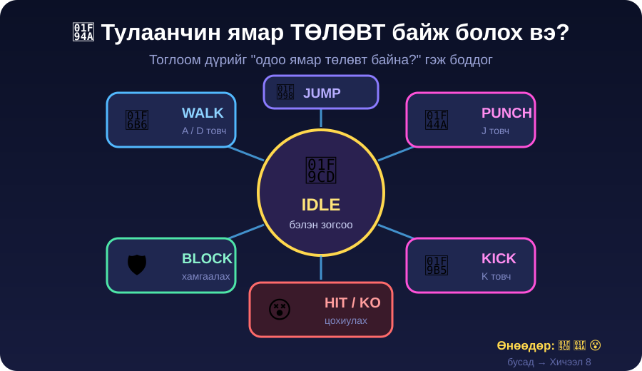

← **[Хичээл 7 руу буцах](../readme.md)**

# 🥊 ХЭСЭГ 1 — Тулааны тоглоомын анатоми · ⏱️ ~15 мин

> 🎯 **Зорилго:** Тулааны тоглоом яг ЮУНААС бүтдэгийг тайлж, өнөөдөр юу хийхээ шийдэх.

> ⚠️ Код бичихгүй. **Гараа компьютероос авч**, багштай хамт ярилц. Энэ 15 минут дараагийн 2 хичээлийг бүхэлд шийднэ.

---

<details open>
<summary>👀 <b>Дасгал 1.1 — Тоглоомыг "ажигла", тогло биш</b> · ⏱️ ~4 мин</summary>

Багш дэлгэц дээр тулааны тоглоом гаргана. Чиний ажил бол **тоглох биш — АЖИГЛАХ**.

Ажиглаад дараах 4 асуултад хариул (дэвтэртээ бич):

```
1. Дүр юу ч дарахгүй байхад ямар байна?      ______________
2. Цохих үед дүр хэдэн зурагтай юм шиг байна? ______________
3. Цохиулсан дүрд ЮУ болдог вэ? (3 зүйл)      ______________
4. Дэлгэцийн дээд талд ЮУ байна? (3 зүйл)     ______________
```

<details>
<summary>💡 Хариулт харах (эхлээд ӨӨРӨӨ бич!)</summary>

1. **Зогсоод байдаггүй** — жаахан хөдөлж, "амьсгалж" байна. Үүнийг **idle** гэдэг.
2. Ихэвчлэн **2–3 зураг**: гар бэлдэх → гар сунгах → эргэж буцах.
3. Цохиулахад: (а) **өнгө улаан болж цайрна** (flash), (б) **хойш түлхэгдэнэ** (knockback), (в) **health bar буурна**.
4. Дээд талд: **зүүн P1 health bar**, **баруун P2 health bar**, **дунд таймер (90)**.

> 🔑 Ажигласан уу — тоглоомын "мэдрэмж" бол ихэнхдээ **жижиг зүйлс**. Health bar буурах, жаахан хойш түлхэгдэх — эдгээр байхгүй бол цохилт "хүрсэн" мэт мэдрэгддэггүй.

</details>

</details>

---

<details>
<summary>🧍 <b>Дасгал 1.2 — Дүр бол "ТӨЛӨВ"-үүдийн жагсаалт</b> · ⏱️ ~5 мин · 🔑 гол ойлголт</summary>



Тоглоом дүрийг **"одоо ямар төлөвт байна?"** гэж боддог. Нэг үед **зөвхөн НЭГ** төлөвт байна.

| Төлөв (state)  | Хэзээ           | Хэдэн зураг    |
| -------------- | --------------- | -------------- |
| 🧍 **idle**    | юу ч дараагүй   | 2 (давтагдана) |
| 🚶 **walk**    | A / D дарсан    | 2              |
| 👊 **punch**   | J дарсан        | 1–2            |
| 🦵 **kick**    | K дарсан        | 1–2            |
| 🛡️ **block**   | L дарж байхад   | 1              |
| 😵 **hit**     | цохиулсан       | 1              |
| 💀 **ko**      | health = 0      | 1              |

🎭 **Ангиар тогло (2 мин):** Багш төлөвийн нэрийг хашгирна — бүгд **биеэрээ** тэр төлөвийг үзүүл. `IDLE!` → `PUNCH!` → `HIT!` → `KO!`

> 🔑 **Гол ойлголт:** Дүр "хөдөлдөггүй". Дүр зөвхөн **төлөвөө сольдог**, төлөв бүр өөрийн зурагтай. Ердөө тэр л байна.

---

### ⚡ Өнөөдөр бид зөвхөн 3 төлөв хийнэ

| Өнөөдөр ✅          | Хичээл 8-д 🔜               |
| ------------------- | --------------------------- |
| 🧍 idle · 🚶 walk   | 🦵 kick · 🛡️ block · 💀 ko  |
| 👊 punch · 😵 hit   | 🔥 combo · ⭐ special хөдөлгөөн |

> ❓ **Яагаад бүгдийг өнөөдөр хийхгүй вэ?** Учир нь төлөв тутамд **зураг үүсгэх** цаг шаардана. 7 төлөв × 2 дүр = 14+ зураг — 1 хичээлд амжихгүй. 3 төлөв **ажилладаг** тоглоом > 7 төлөв **эвдэрсэн** тоглоом.

</details>

---

<details>
<summary>🧩 <b>Дасгал 1.3 — Тоглоомын 3 хэсэг (танил зүйл!)</b> · ⏱️ ~3 мин</summary>

Хичээл 5-д сурсныг сана — тоглоом **3 хэсгээс** бүтдэг:

| Хэсэг                | Тулааны тоглоомд юу вэ                     | Хэн хийх вэ            |
| -------------------- | ------------------------------------------ | ---------------------- |
| 🎨 **Дүр төрх**      | sprite зураг, арена, health bar            | **Чи** (ХЭСЭГ 3–4) 🔥  |
| 🧠 **Тархи (дүрэм)** | цохилт хэдэн damage, таймер, KO            | **Чи** шийднэ          |
| 📦 **Дата**          | `sprites.json` — зургийн хаягууд           | **Чи** бэлднэ (ХЭСЭГ 5) |

> 💡 Хичээл 5-д дата бол **асуулт-хариулт** байсан. Одоо дата бол **зургийн хаягууд**. JSON нь ижил — агуулга л өөр!

🚨 **Мэдэж авах чухал зүйл:** Тулааны тоглоомд хамгийн их ажил бол **код биш — АРТ**. Тиймээс өнөөдрийн хичээлийн 60% нь зураг үүсгэхэд зарцуулагдана. Энэ хэвийн зүйл — жинхэнэ тоглоомын студид ч ингэж байдаг.

</details>

---

<details>
<summary>🗺️ <b>Дасгал 1.4 — 3 хичээлийн зам</b> · ⏱️ ~3 мин</summary>


| Хичээл          | Гол зүйл                                  | Дуусахад чи...                        |
| --------------- | ----------------------------------------- | ------------------------------------- |
| **7 (өнөөдөр)** | 🎨 Дүр, арт, анимаци, арена                | idle хөдөлж, 1 цохилт ажиллана        |
| **8**           | 🥊 Жинхэнэ тулаан — combo, block, дуу      | Хоёулаа тулалдаж KO болно             |
| **9**           | 🏆 Дүр сонгох, best-of-3, leaderboard      | **Ангийн чемпионат** болно            |

> 🛡️ **3 хичээлийн гол дүрэм:** _"Ажиллаж байгааг бүү эвд."_ Нэг зүйл нэм → турш → дараагийнх. Хичээл 5-д сурсан дүрэм — одоо бүр чухал, учир нь одоо зураг, анимаци, дүрэм гэсэн 3 зүйл зэрэг байна.

### ✅ ХЭСЭГ 1-ийн checkpoint

- [ ] "Дүр төлөвөө сольдог" гэдгийг **өөрийн үгээр** хэлж чадна
- [ ] Өнөөдөр 3 төлөв (idle, punch, hit) хийхээ мэдэж байна
- [ ] `sprites.json` бол Хичээл 5-ын JSON-ий шинэ хэлбэр гэдгийг ойлгосон

</details>

---

➡️ **Дараагийн хэсэг:** <a href="2-baatraa-zohioh.md" target="_blank">🧝 ХЭСЭГ 2 — Баатраа зохиох 🔗</a>
