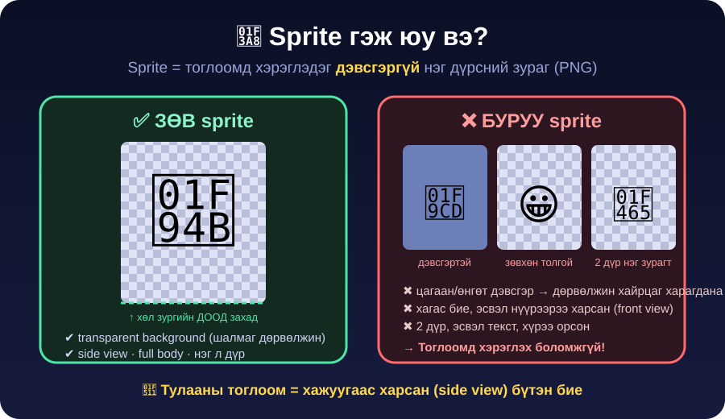
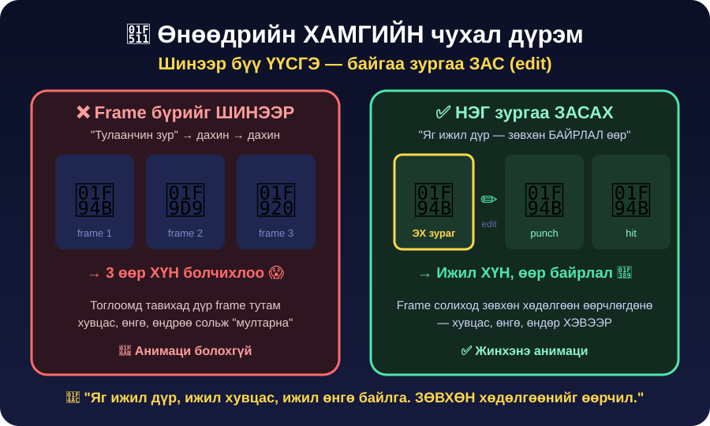

← **[Хичээл 7 руу буцах](../readme.md)**

# 🎨 ХЭСЭГ 3 — Sprite зураг AI-гаар үүсгэх · ⏱️ ~28 мин

> 🎯 **Зорилго:** Дүрийн картаа **жинхэнэ тоглоомын зураг** болгох. P1-ийн `idle` эх зураг + арена дэвсгэр.

> 🔑 **Өнөөдрийн хамгийн чухал ур чадвар яг ЭНД байна.** Промптын нэг үг өөрчлөхөд зураг тоглоомд хэрэглэгдэх/хэрэглэгдэхгүй болно.

---

<details open>
<summary>🖼️ <b>Дасгал 3.1 — Sprite гэж юу вэ?</b> · ⏱️ ~3 мин</summary>



**Sprite** = тоглоомд хэрэглэдэг **дэвсгэргүй** (transparent) нэг дүрсний зураг.

Тоглоомын sprite 4 шалгуур давах ёстой:

| #   | Шалгуур                         | Яагаад                                                  |
| --- | ------------------------------- | ------------------------------------------------------- |
| 1️⃣  | **Transparent дэвсгэр** (PNG)   | Дэвсгэртэй бол арена дээр **цагаан дөрвөлжин** харагдана |
| 2️⃣  | **Side view** (хажуугаас)       | Тулааны тоглоом хажуугаас харагддаг                      |
| 3️⃣  | **Full body** (толгойноос хөл)  | Хагас бие бол газар дээр зогсох боломжгүй                 |
| 4️⃣  | **Зөвхөн 1 дүр**, текстгүй      | 2 дүр эсвэл текст орвол тоглоомд хэрэглэх аргагүй        |

> 🚨 **Хамгийн түгээмэл алдаа:** AI-д "тулаанчин зур" гэхэд гоё **зурган зураг** (illustration) гаргаж өгдөг — дэвсгэртэй, нүүрээрээ харсан, хагас бие. Гоё ч гэсэн **тоглоомд хэрэглэх боломжгүй**. Тиймээс промптод 4 шалгуурыг **тод бичих** ёстой.

</details>

---

<details>
<summary>🛠️ <b>Дасгал 3.2 — Зургийн хэрэгслээ нээх</b> · ⏱️ ~2 мин</summary>

Зураг үүсгэх 2 арга — **аль нь ажиллаж байвал тэрийг** хэрэглэ:

| Арга                                                       | Хаана                                     | Тэмдэглэл                                   |
| ---------------------------------------------------------- | ----------------------------------------- | ------------------------------------------- |
| **А. Google AI Studio** — [aistudio.google.com](https://aistudio.google.com) | Chat → зураг үүсгэдэг загвар сонго         | Код бичдэг тэр л хэрэгсэл                    |
| **Б. Gemini app** — [gemini.google.com](https://gemini.google.com)           | Шууд "зур" гэж бич → зураг гарна           | Илүү хялбар, **зураг засахад сайн** ✅        |

> 💡 **Зөвлөмж:** Зураг үүсгэхэд **Б (Gemini app)**-ыг хэрэглэ, код бичихэд **А (AI Studio)**. Хоёуланг нь 2 өөр tab-д нээж, хооронд нь сэлгэ.

> ⚠️ **UI өөрчлөгддөг.** Товчны нэр өөр байвал сандрах шаардлагагүй — "зураг үүсгэх / image" гэсэн үг хайж ол, эсвэл багшаас асуу.

🚦 **Limit-ээ хэмнэ!** (Хичээл 4-ийг сана) Зураг үүсгэх нь текстээс **хамаагүй их** зарцуулдаг. Тиймээс:

- ✅ **Нэг мессежид бүх шаардлагаа нэгтгэж** бич — 5 удаа жижиг зүйл нэмж гуйхгүй
- ✅ Гарсан зургаа **тэр даруй хадгал** (дахин үүсгэх шаардлагагүй болно)
- ❌ "Дахин үзье" гэж 10 удаа дарахгүй

</details>

---

<details>
<summary>🥋 <b>Дасгал 3.3 — P1-ийн ЭХ зураг (idle) үүсгэх</b> · ⏱️ ~10 мин · 🔑 гол дасгал</summary>

**ЭХ зураг (base sprite)** = бүх бусад frame эндээс гарна. Тиймээс эндээ **цаг зарцуул**.

ХЭСЭГ 2-ын картаа хажуудаа тавь. Доорх промптын `[ ]`-ийг **картаараа** бөглөж, зургийн чат руу буулга:

```text
2D тулааны тоглоомын дүрийн sprite зураг үүсгэ.

ДҮР:
- Нэр: [ГАЙА]
- Хэн: [Говь цөлийн залуу бөхчин]
- Хувцас: [хөх зодог, шуудаг, урт монгол гутал]
- Гол өнгө: [хөх + алт]
- Гартаа/биедээ: [буржгар бүс, гарын боолт]

СТИЛЬ:
- pixel art, 16-bit arcade fighting game sprite
- Street Fighter II-ийн үеийн retro arcade стиль
- тод контур, өнгө бага (limited palette)

ЗААВАЛ БАЙХ 4 ЗҮЙЛ:
1. transparent background — ямар ч дэвсгэргүй, PNG
2. side view — дүр хажуу тийш харсан, профиль
3. full body — толгойноос хөл хүртэл БҮТЭН, юу ч тайрагдаагүй
4. зөвхөн НЭГ дүр, текст, хүрээ, тайлбар байхгүй

БАЙРЛАЛ (pose):
- fighting stance / idle — хоёр гараа өргөж бэлдсэн байдал
- бага зэрэг бөхийсөн, тулаанд бэлэн

БҮТЭЦ:
- дүр зургийн 90%-ийг эзэлнэ
- хөл нь зургийн ЯГ ДООД захад байрлана (газар дээр зогсож байгаа шиг)
- дүрийн харц ЗӨВ ТАЛ руу (баруун тийш)
```

### 🔍 Зураг гарсны дараа — 4 шалгуураар шалга

```
[ ] Дэвсгэр шалмаг дөрвөлжин (эсвэл ямар ч дэвсгэргүй) байна уу?
[ ] Хажуугаас харсан байна уу? (нүүрээрээ харсан бол ❌)
[ ] Толгойноос хөл хүртэл бүтэн байна уу?
[ ] Зөвхөн 1 дүр, текст байхгүй үү?
```

**Дор хаяж 1 ✖ байвал → шинээр биш, ЗАСУУЛ:**

```text
Сайн байна, гэхдээ 3 зүйл засмаар байна:
1. дэвсгэрийг бүрэн transparent болго (цагаан дэвсгэр байж болохгүй)
2. дүрийг хажуугаас харсан байдалд (side view) болго
3. хөлийг зургийн доод захад тавь, бүтэн биеийг харуул
Дүрийн хувцас, өнгө, стилийг ХЭВЭЭР байлга.
```

✅ 4/4 болсны дараа зургаа **хадгал**: `p1-idle-1.png` гэсэн нэрээр.

> 💾 **Хадгалах нэрийн дүрэм:** англи жижиг үсэг, **зайгүй**, зураасаар — `p1-idle-1.png`. Кирилл эсвэл зай орвол ХЭСЭГ 5-д линк ажиллахгүй болно. (Эндээс хамгийн олон хос гацдаг!)

</details>

---

<details>
<summary>🔑 <b>Дасгал 3.4 — АЛТАН ДҮРЭМ: "шинээр биш — ЗАС"</b> · ⏱️ ~3 мин · ⭐ ЗААВАЛ УНШИХ</summary>



AI-аар зураг үүсгэх ур чадварын **90%** нь энэ нэг дүрэм:

> ## 🚫 Frame бүрийг ШИНЭЭР бүү үүсгэ.
>
> ## ✅ ЭХ зургаа ЗАС (edit).

**Яагаад?** AI ижил промптоор ч гэсэн **тэр дуртай** дүр гаргадаг. "Тулаанчин зур" гэж 3 удаа гуйвал 3 **өөр хүн** гарна — хувцас, өнгө, өндөр бүгд өөр. Тэднийг frame болгож сольвол дүр "мултарч" харагдана.

**Яаж засах вэ:** Зургийн чатад **тэр л ярианд** (шинэ chat БИШ) дараагийн мессежээ бич. AI өмнөх зургаа "хараад" зөвхөн хүссэн зүйлээ өөрчилнө.

### 📜 Засах промптын хэв маяг (үүнийг сана!)

```text
Яг ИЖИЛ дүр байлга — ижил хувцас, ижил өнгө, ижил стиль,
ижил өндөр, ижил transparent дэвсгэр.

ЗӨВХӨН биеийн байрлалыг өөрчил: [ЭНД шинэ байрлалыг бич]
```

> 💡 **"Яг ижил ... ЗӨВХӨН ...":** Энэ 2 үг бол чиний хамгийн хүчтэй хэрэгсэл. Хичээл 8, 9-д ч, ерөөсөө AI-аар зураг хийх бүрдээ хэрэглэнэ.

🧪 **1 минутын сорил:** Багш 2 зураг харуулна — аль нь "шинээр үүсгэсэн", аль нь "засаж гаргасан"? Яаж мэдэв?

</details>

---

<details>
<summary>🏟️ <b>Дасгал 3.5 — Арена дэвсгэр үүсгэх</b> · ⏱️ ~7 мин</summary>

Арена бол **ЦОРЫН ГАНЦ** зураг дээр дэвсгэртэй байх ёстой зураг 😄 (Sprite-ууд дэвсгэргүй, арена дэвсгэртэй.)

ХЭСЭГ 2.4-т сонгосон арена, цагаараа бөглө:

```text
2D тулааны тоглоомын арены дэвсгэр зураг (background) үүсгэ.

ГАЗАР: [Наадмын талбай — 9 цагаан туг, харагчид]
ЦАГ: [нар шингэх үе, алтан гэрэл]

СТИЛЬ:
- pixel art, 16-bit arcade fighting game background
- retro arcade стиль, тод өнгө

ЗААВАЛ:
- хэвтээ (landscape), 16:9 хэлбэр
- ХҮН БАЙХГҮЙ — тулаанчин, дүр зурахгүй (зөвхөн ХОЛЫН харагчид болно)
- доод 1/4 нь ТЭГШ ШАЛ (газар) — тулаанчид тэр дээр зогсоно
- шалны шугам тод харагдана
- текст, лого, хүрээ байхгүй
```

### 🔍 Шалга

```
[ ] Хэвтээ (landscape) байна уу?
[ ] Доод талд тэгш шал байна уу? (бартаатай, налуу бол ❌)
[ ] Гол дүр байхгүй үү? (тулаанчин орсон бол ❌ — засуул)
```

✅ Болсон бол **хадгал**: `arena-1.png`

<details>
<summary>🆘 Арена дээр тулаанчин орж ирвэл</summary>

```text
Арена дээрх дүрүүдийг ав. Зөвхөн хоосон арена, шал, дэвсгэр
байг. Холын харагчид болно, гэхдээ гол дүр байж болохгүй.
```

</details>

</details>

---

<details>
<summary>🧼 <b>Дасгал 3.6 — Дэвсгэр арилахгүй бол (нөөц арга)</b> · ⏱️ ~3 мин</summary>

AI "transparent" гэж хэлсэн ч цагаан дэвсгэртэй гаргах тохиолдол бий. Тэгвэл:

| Арга                                                          | Яаж                                        |
| ------------------------------------------------------------- | ------------------------------------------ |
| 1️⃣ **Дахин засуул**                                           | _"Дэвсгэрийг бүрэн ав, transparent PNG болго"_ |
| 2️⃣ **[remove.bg](https://www.remove.bg)**                     | Зургаа хая → автоматаар дэвсгэр арилна → Download |
| 3️⃣ **[Photopea](https://www.photopea.com)** (stretch)         | Magic Wand → цагааныг сонго → Delete → PNG-ээр export |

> ⚠️ **remove.bg** үнэгүй хувилбар нь бага хэмжээтэй зураг татдаг — pixel art-д яг таарна, санаа зовох шаардлагагүй.

🔍 **Дэвсгэр арилсныг яаж мэдэх вэ?** Зургаа нээхэд ард **шалмаг дөрвөлжин** харагдвал transparent. Цагаан бол арилаагүй.

### ✅ ХЭСЭГ 3-ийн checkpoint

- [ ] `p1-idle-1.png` — 4 шалгуур бүгд ✅ (transparent · side view · full body · 1 дүр)
- [ ] `arena-1.png` — хэвтээ, доод талд тэгш шалтай, дүргүй
- [ ] Файлын нэрс **англи, зайгүй, зураастай**
- [ ] "Шинээр биш — ЗАС" дүрмийг хэлж чадна ⭐

</details>

---

➡️ **Дараагийн хэсэг:** <a href="4-animaci-frame.md" target="_blank">🎞️ ХЭСЭГ 4 — Анимацийн frame-үүд 🔗</a>
