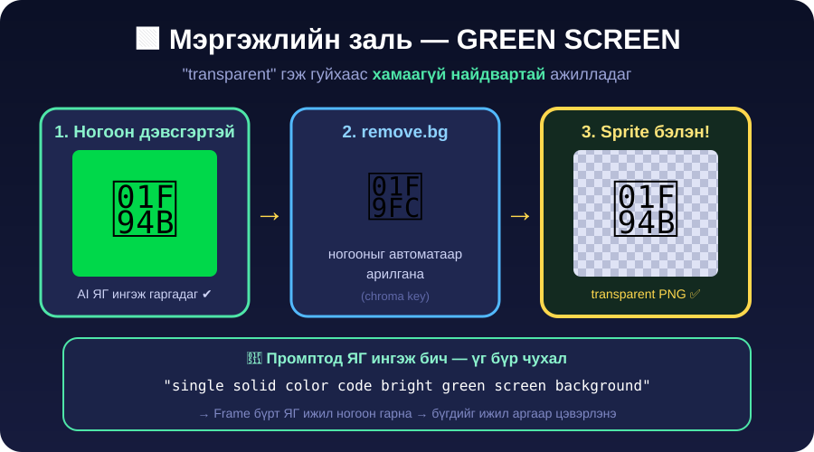
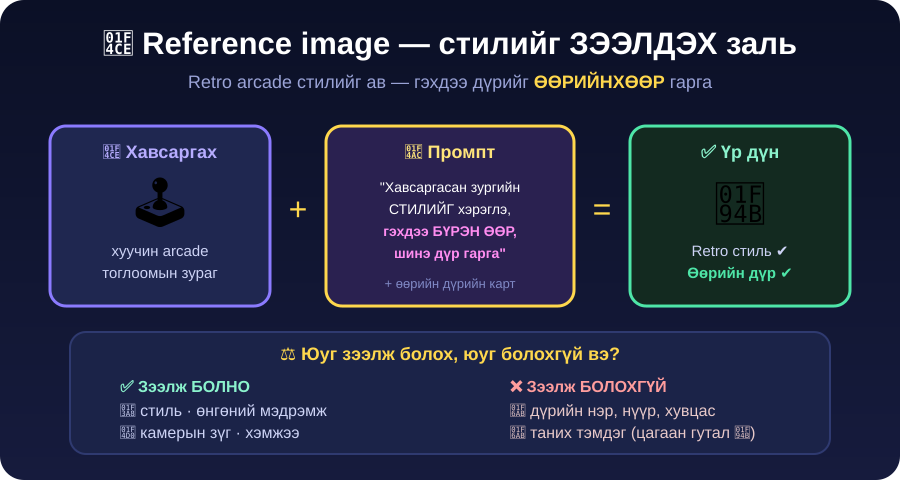

← **[Хичээл 7 руу буцах](../readme.md)**

# 🎨 ХЭСЭГ 3 — Sprite зураг AI-гаар үүсгэх · ⏱️ ~32 мин

> 🎯 **Зорилго:** Дүрээ **жинхэнэ тоглоомын зураг** болгох — retro arcade стильтэй, ногоон дэвсгэртэй, цэвэрлэсэн sprite.

> 🔑 **Өнөөдрийн хамгийн чухал ур чадвар яг ЭНД байна.** Промптын нэг үг өөрчлөхөд зураг тоглоомд хэрэглэгдэх/хэрэглэгдэхгүй болно.

---

<details open>
<summary>🖼️ <b>Дасгал 3.1 — Sprite гэж юу вэ?</b> · ⏱️ ~3 мин</summary>


**Sprite** = тоглоомд хэрэглэдэг **дэвсгэргүй** (transparent) нэг дүрсний зураг.

Тоглоомын sprite 4 шалгуур давах ёстой:

| #   | Шалгуур                         | Яагаад                                                  |
| --- | ------------------------------- | ------------------------------------------------------- |
| 1️⃣  | **Дэвсгэргүй** (transparent PNG) | Дэвсгэртэй бол арена дээр **дөрвөлжин** харагдана        |
| 2️⃣  | **Side view** (хажуугаас)       | Тулааны тоглоом хажуугаас харагддаг                      |
| 3️⃣  | **Full body** (толгойноос хөл)  | Хагас бие бол газар дээр зогсох боломжгүй                 |
| 4️⃣  | **Зөвхөн 1 дүр**, текстгүй      | 2 дүр эсвэл текст орвол тоглоомд хэрэглэх аргагүй        |

> 🚨 **Хамгийн түгээмэл алдаа:** AI-д "тулаанчин зур" гэхэд гоё **зурган зураг** (illustration) гаргаж өгдөг — дэвсгэртэй, нүүрээрээ харсан, хагас бие. Гоё ч гэсэн **тоглоомд хэрэглэх боломжгүй**.

</details>

---

<details>
<summary>🛠️ <b>Дасгал 3.2 — ХЭРЭГСЛҮҮД + алхам алхмаар заавар</b> · ⏱️ ~5 мин · 📌 лавлагаа</summary>

### 🧰 Өнөөдөр хэрэглэх 4 хэрэгсэл

| #   | Хэрэгсэл                                                | Юунд                            | Төлбөр      |
| --- | ------------------------------------------------------- | ------------------------------- | ----------- |
| 1️⃣  | **[Gemini](https://gemini.google.com)**                 | 🎨 Зураг **үүсгэх, ЗАСАХ**       | Үнэгүй ✅   |
| 2️⃣  | **[Google AI Studio](https://aistudio.google.com)**     | 🎨 Зураг (нөөц) · 🕹️ **Тоглоомын код** | Үнэгүй ✅   |
| 3️⃣  | **[remove.bg](https://www.remove.bg)**                  | 🧼 Ногоон дэвсгэр арилгах        | Үнэгүй ✅   |
| 4️⃣  | **[ezgif.com/maker](https://ezgif.com/maker)**          | 🎥 Анимацийг турших              | Үнэгүй ✅   |

> 💡 **1 ба 2-ыг хоёуланг нь өөр tab-д нээ.** Зураг = Gemini tab · Код = AI Studio tab. Хооронд нь сэлгэнэ.

---

### 1️⃣ Gemini — зураг үүсгэх (АЛХАМ АЛХМААР)

> 🥇 **Зураг үүсгэх, ЗАСАХАД хамгийн тохиромжтой.** Өмнөх зургаа "санаж" байдаг тул frame-үүд ижил дүртэй гарна.

```
АЛХАМ 1  👉 gemini.google.com руу ор
АЛХАМ 2  🔑 Google хаягаараа нэвтэр (өөрийн эсвэл сургуулийн)
АЛХАМ 3  📎 Доод талын бичих талбарын хажуугийн "+" эсвэл 📎 товчийг дар
         → "Upload files" сонго → reference зураг / selfie-гээ оруул
АЛХАМ 4  ⌨️ Промптоо бич (доор бэлэн промптууд бий) → Enter
АЛХАМ 5  ⏳ 10–30 секунд хүлээ → зураг гарч ирнэ
АЛХАМ 6  💾 Зураг дээр дар → ⬇️ Download товч
         (эсвэл зураг дээр баруун товч → "Save image as…")
АЛХАМ 7  ✏️ ЗАСАХ бол: ТЭР Л ярианд дараагийн мессежээ бич
         ⚠️ ШИНЭ chat нээж БОЛОХГҮЙ — дүр өөр хүн болно!
```

> 📐 **Зургийн хэлбэр (aspect ratio):** зүгээр л промптдоо бич — _"зургийн хэлбэр 16:9"_. Товч хайж цаг үрэх шаардлагагүй.

---

### 2️⃣ Google AI Studio — нөөц зам + КОД

> Gemini дээр limit дуусвал эсвэл ажиллахгүй бол энд ор. ХЭСЭГ 6-д тоглоомоо **энд** бүтээнэ.

```
АЛХАМ 1  👉 aistudio.google.com руу ор → Google хаягаараа нэвтэр
АЛХАМ 2  💬 Зүүн талаас "Chat" сонго
АЛХАМ 3  🤖 Баруун талын "Model" цэсийг дар
         → нэрэндээ "Image" гэсэн үгтэй загварыг сонго
         (Gemini-ийн зурган загвар — "Nano Banana" гэж ч нэрлэдэг 🍌)
АЛХАМ 4  📎 Бичих талбарын хажуугийн 📎 товчоор зургаа хавсарга
АЛХАМ 5  ⌨️ Промптоо бич → "Run" (эсвэл Ctrl+Enter)
АЛХАМ 6  💾 Гарсан зураг дээр баруун товч → "Save image as…"
```

---

### 3️⃣ remove.bg — дэвсгэр арилгах

```
АЛХАМ 1  👉 remove.bg руу ор (бүртгэл ХЭРЭГГҮЙ)
АЛХАМ 2  📤 "Upload Image" дар (эсвэл зургаа шууд чирж хая)
АЛХАМ 3  ⏳ 3–5 секунд → ногоон дэвсгэр алга болно
АЛХАМ 4  ⬇️ "Download" дар → PNG хадгал
         ⚠️ "Download HD" бол төлбөртэй — энгийн "Download" дар!
```

---

### 📁 Хаана хадгалах вэ? (заавал!)

Компьютер дээрээ **`sprites`** гэсэн шинэ фолдер үүсгээд бүх зургаа тэнд хадгал.

```
📁 sprites/
   ├── p1-idle-1.png
   ├── p1-idle-2.png
   ├── p1-punch-1.png
   ├── p1-hit-1.png
   └── arena-1.png
```

> 💾 **Нэрийн 3 дүрэм:** ① англи жижиг үсэг ② **зайгүй** ③ зураасаар салга.
> `p1-idle-1.png` ✅ · `Гайа зураг (1).png` ❌ — кирилл, зай орвол ХЭСЭГ 5-д линк ажиллахгүй!

---

---

### 🚦 LIMIT ХЭМНЭХ 3 дүрэм (Хичээл 4-ийг сана)

Зураг үүсгэх нь текстээс **хамаагүй их** зарцуулдаг. Тиймээс:

| ✅ Хий                                              | ❌ Бүү хий                          |
| --------------------------------------------------- | ----------------------------------- |
| Бүх шаардлагаа **1 мессежид нэгтгэж** бич            | 5 удаа жижиг зүйл нэмж гуйх          |
| Гарсан зургаа **тэр даруй Download** хий             | "Дараа хадгална" гэж орхих           |
| Болохоор нь **цааш яв**                              | "Дахин үзье" гэж 10 удаа дарах       |

> 🆘 **"Quota exceeded" гарвал:** (а) 1–2 минут хүлээ, (б) нөгөө хэрэгсэл рүү шилж (Gemini ⇄ AI Studio), (в) хосын **нөгөө хүний** хаягаар үргэлжлүүл, (г) багшаас **нөөц зургийн багц** ав.

---

> ⚠️ **Товчны нэр өөрчлөгдсөн байвал** сандрах хэрэггүй — AI хэрэгслүүдийн UI байнга шинэчлэгддэг. "Upload", "Image", "Download" гэсэн **утгатай** товчийг хай, эсвэл багшаас асуу.

</details>

---

<details>
<summary>🟩 <b>Дасгал 3.3 — Мэргэжлийн заль: GREEN SCREEN</b> · ⏱️ ~3 мин · ⭐ ЗААВАЛ УНШИХ</summary>



🤔 **Асуудал:** AI-д _"transparent background"_ гэж гуйхад **ойлгохгүй** байх нь их. Цагаан дэвсгэртэй гаргачихдаг.

✅ **Шийдэл:** Тоглоом хийгчид **transparent гуйдаггүй** — **ногоон дэвсгэр** гуйдаг, дараа нь ногооныг арилгадаг. Кино, YouTube-ийн green screen яг ижил зарчим!

```
"single solid color code bright green screen background"
```

> 🔑 **Яагаад ажилладаг вэ?** (а) "Ногоон дэвсгэр" бол AI-д ойлгомжтой ЗУРАГ, "дэвсгэр байхгүй" бол ойлгомжгүй ХООСОН. (б) Frame бүрт **ЯГ ижил ногоон** гарна — бүх зургийг ижил аргаар цэвэрлэнэ, дүр "мултрахгүй".

| Алхам | Юу                                     | Хэрэгсэл                              |
| ----- | -------------------------------------- | ------------------------------------- |
| 1️⃣    | 🟩 Ногоон дэвсгэртэй зураг гаргах       | Gemini                                 |
| 2️⃣    | 🧼 Ногооныг арилгах (chroma key)        | [remove.bg](https://www.remove.bg)     |
| 3️⃣    | ✅ transparent PNG хадгалах             | — бэлэн!                               |

> 💡 **Заль:** Бүх frame-ээ эхлээд гаргаад, **дараа нь бүгдийг зэрэг** цэвэрлэ. Ингэвэл remove.bg дээр 1 удаа орно, цаг хэмнэнэ.

</details>

---

<details>
<summary>📎 <b>Дасгал 3.4 — Reference image: стилийг ЗЭЭЛДЭХ</b> · ⏱️ ~4 мин · 🔑 гол заль</summary>



🤔 **Асуудал:** _"pixel art"_ гэж бичихэд AI янз бүрийн стиль гаргана — заримдаа хэт шинэ, заримдаа хэт бүдэг. 90-ээд оны arcade мэдрэмж **гарахгүй**.

✅ **Шийдэл:** Хуучин arcade тоглоомын **зургийг хавсаргаад** стилийг зээл.

**Яаж:**

1. Багшийн Discord-д тавьсан **reference зургийг** ав ⭐
   _(эсвэл өөрөө: Google → `Street Fighter 2 sprite sheet` → 1 зураг хадгал)_
2. Gemini-д **хавсарга** (📎 товч — Дасгал 3.2-ын АЛХАМ 3)
3. Промптдоо энэ мөрийг **үргэлж эхэнд нь** бич:

```text
Хавсаргасан зургийн АРТ СТИЛИЙГ (өнгө, шугам, retro arcade мэдрэмж)
хэрэглэ.
```

### ⚖️ Стиль vs Дүр — ялгааг ойлго

| ✅ Стиль зээлж БОЛНО         | 📌 Дүр бол ӨӨР асуудал                       |
| ---------------------------- | -------------------------------------------- |
| 🎨 Өнгө, шугам, pixel мэдрэмж | Naruto, Ryu гэх дүрүүд **эзэмшигчтэй**       |
| 📐 Камерын зүг, хэмжээ        | ЗАМ А сонгосон бол → ХЭСЭГ 2-ын дүрмийг сана  |
| 🕹️ Retro arcade төрх          | _"Fan-made"_ гэж бичих ёстой                  |

> 🧠 **Арт СТИЛЬ бол эзэмшигчгүй** — "pixel art"-ыг хэн ч эзэмшдэггүй. Тиймээс стилийг чөлөөтэй зээл. Дүрийн тухай дүрмийг ХЭСЭГ 2-т үзсэн.

</details>

---

<details>
<summary>🥋 <b>Дасгал 3.5 — P1-ийн ЭХ зургаа гаргах</b> · ⏱️ ~9 мин · 🔑 гол дасгал</summary>

**ЭХ зураг (base sprite)** = бүх бусад frame эндээс гарна. Тиймээс эндээ **цаг зарцуул**.

> 🚪 **ХЭСЭГ 2-т сонгосон замаараа** доорх табуудаас өөрийнхөө промптыг ол.

---

<details>
<summary>🥷 <b>ЗАМ А — Дуртай дүр (Naruto, Goku…)</b></summary>

```text
Хавсаргасан зургийн АРТ СТИЛИЙГ хэрэглэ.

2D тулааны тоглоомын дүрийн sprite үүсгэ.

ДҮР: [Naruto]
- Хувцас: [улбар шар–хар костюм, духны protector]
- Гол өнгө: [улбар шар + шар үс]
- Таних шинж: [хатгамал шар үс, хацрын 3 зураас]

СТИЛЬ:
- pixel art, 16-bit retro arcade fighting game sprite
- тод контур, өнгө бага (limited palette)

БАЙРЛАЛ: fighting stance (idle) — хоёр гараа өргөж бэлдсэн

ЗААВАЛ:
- single solid color code bright green screen background
- side view — хажуу тийш, баруун тийш харсан
- full body — толгойноос хөл хүртэл БҮТЭН
- no drop shadow
- зөвхөн НЭГ дүр, текст, хүрээ байхгүй
- дүр зургийн 90%-ийг эзэлнэ, хөл нь доод захад
- зургийн хэлбэр 4:3
```

</details>

<details>
<summary>🤳 <b>ЗАМ Б — ӨӨРӨӨ (selfie)</b></summary>

📎 **Өөрийн зургаа хавсарга** (reference зургийг ч зэрэг хавсаргаж болно):

```text
Хавсаргасан зураг дээрх хүнийг 2D тулааны тоглоомын дүр (game sprite)
болго.

ХАДГАЛАХ: үсний өнгө, засалт · арьсны өнгө · хувцасны өнгө · бие галбир
→ ангийнхан нь таних ёстой!

СТИЛЬ:
- pixel art, 16-bit retro arcade fighting game sprite
- ЖИНХЭНЭ зураг биш, ЗУРСАН дүр шиг

БАЙРЛАЛ: fighting stance (idle) — хоёр гараа өргөж бэлдсэн

ЗААВАЛ:
- single solid color code bright green screen background
- side view — хажуу тийш, баруун тийш харсан
- full body — толгойноос хөл хүртэл БҮТЭН
- no drop shadow
- зөвхөн НЭГ дүр, текст, хүрээ байхгүй
- зургийн хэлбэр 4:3
```

> 😅 **Танигдахгүй байвал:** _"Үс, хувцасны өнгийг хавсаргасан зурагтай ЯГ ижил болго"_ гэж засуул.

</details>

<details>
<summary>✏️ <b>ЗАМ В — Өөрийн зохиосон дүр</b></summary>

> 🎰 **Энэ зам дээр заль бий:** нэг дүр гаргаад "болно" гэж бүү тохироо. **4-ийг зэрэг** гаргаад хамгийн гоёг сонго! Зургийн хэлбэрийг **16:9** болгоход AI 4 дүрийг **эгнээнд** зэрэгцүүлнэ.

```text
Хавсаргасан зургийн АРТ СТИЛИЙГ хэрэглэ, гэхдээ дүрүүдийг хуулахгүй.

Дараах тайлбартай тулаанчны 4 ӨӨР хувилбарыг НЭГ эгнээнд гарга:
- Хэн: [Говь цөлийн залуу бөхчин]
- Хувцас: [хөх зодог, шуудаг, урт монгол гутал]
- Гол өнгө: [хөх + алт]
- Гартаа/биедээ: [буржгар бүс, гарын боолт]

ЗААВАЛ:
- 4 дүр бүгд combat stance (тулаанд бэлэн байрлал)
- full body · side view · no drop shadow
- single solid color code bright green screen background
- pixel art, 16-bit retro arcade fighting game стиль
- зургийн хэлбэр 16:9 (өргөн)
```

🎯 4 хувилбар гарна → **аль нь гоё вэ?** Хосоороо шийд. Дараа нь **тусгаарла**:

```text
Эдгээр дүрүүдээс [зүүнээс 2 дахийг] сонгож, ЗӨВХӨН тэр дүрийг
өөрийн зураг дээр дахин гарга.

ЗААВАЛ:
- зургийн хэлбэр 4:3 (дүрийн эргэн тойронд ЗАЙ үлдэнэ)
- дүр зургийн дунд, full body, side view
- single solid color code bright green screen background
- no drop shadow
```

</details>

---

### 🔍 Гарсан зургаа 4 шалгуураар шалга

```
[ ] Дэвсгэр нь тод НОГООН (эсвэл дэвсгэргүй) байна уу?
[ ] Хажуугаас харсан байна уу? (нүүрээрээ харсан бол ❌)
[ ] Толгойноос хөл хүртэл бүтэн байна уу?
[ ] Зөвхөн 1 дүр, текст байхгүй юу?
```

**Дор хаяж 1 ✖ байвал → шинээр биш, ЗАСУУЛ:**

```text
Сайн байна, гэхдээ засмаар байна:
1. дэвсгэрийг бүрэн ногоон болго (single solid bright green screen)
2. дүрийг хажуугаас харсан байдалд (side view) болго
3. хөлийг зургийн доод захад тавь, бүтэн биеийг харуул
Дүрийн хувцас, өнгө, стилийг ХЭВЭЭР байлга.
```

> 🔑 **Яагаад 4:3 хэлбэр вэ?** Дараа нь дүр **цохино, өшиглөнө** — сунгасан гар зургийн гадна гарвал **тайрагдана**! 4:3 нь эргэн тойронд зай үлдээнэ.

✅ Болсон бол **хадгал:** `p1-idle-1.png` (Дасгал 3.2-ын нэрийн 3 дүрмийг сана!)

</details>

---

<details>
<summary>🔑 <b>Дасгал 3.6 — АЛТАН ДҮРЭМ: "шинээр биш — ЗАС"</b> · ⏱️ ~3 мин · ⭐ ЗААВАЛ УНШИХ</summary>


AI-аар зураг үүсгэх ур чадварын **90%** нь энэ нэг дүрэм:

> ## 🚫 Frame бүрийг ШИНЭЭР бүү үүсгэ.
>
> ## ✅ ЭХ зургаа ЗАС (edit).

**Яагаад?** AI ижил промптоор ч гэсэн **тэр дуртай** дүр гаргадаг. "Naruto зур" гэж 3 удаа гуйвал 3 **өөр** Naruto гарна — өндөр, хувцасны нарийн ширийн, өнгө бүгд өөр. Тэднийг frame болгож сольвол дүр "мултарч" харагдана.

**Яаж засах вэ:** Gemini-ийн **тэр л ярианд** (шинэ chat БИШ) дараагийн мессежээ бич. AI өмнөх зургаа "хараад" зөвхөн хүссэн зүйлээ өөрчилнө.

### 📜 Засах промптын хэв маяг (үүнийг сана!)

```text
Яг ИЖИЛ дүр байлга — ижил хувцас, ижил өнгө, ижил стиль,
ижил өндөр, ижил ногоон дэвсгэр, ижил зургийн хэмжээ.

ЗӨВХӨН биеийн байрлалыг өөрчил: [ЭНД шинэ байрлалыг бич]
```

> 💡 **"Яг ижил ... ЗӨВХӨН ...":** Энэ 2 үг бол чиний хамгийн хүчтэй хэрэгсэл — Хичээл 8, 9-д ч, AI-аар зураг хийх бүрдээ хэрэглэнэ.

🧪 **1 минутын сорил:** Багш 2 зураг харуулна — аль нь "шинээр үүсгэсэн", аль нь "засаж гаргасан"? Яаж мэдэв?

</details>

---

<details>
<summary>🏟️ <b>Дасгал 3.7 — Арена дэвсгэр үүсгэх</b> · ⏱️ ~5 мин</summary>

Арена бол **ЦОРЫН ГАНЦ** дэвсгэртэй байх ёстой зураг 😄 (Sprite-ууд дэвсгэргүй, арена дэвсгэртэй.)

> 💡 **Заль:** Reference зургаа **дахин хавсарга** — арена нь дүртэй ижил стильтэй болно. Хэлбэрийг **21:9** болго — тулаан хажуу тийш явдаг учир **өргөн** дэвсгэр хэрэгтэй.

ХЭСЭГ 2.3-т сонгосон арена, цагаараа бөглө:

```text
Хавсаргасан зургийн АРТ СТИЛИЙГ хэрэглэ.

2D тулааны тоглоомын арены дэвсгэр (background) гарга.
ГАЗАР: [Наадмын талбай — 9 цагаан туг, харагчид]
ЦАГ: [нар шингэх үе, алтан гэрэл]

ЗААВАЛ:
- зургийн хэлбэр 21:9 — маш өргөн
- pixel art, 16-bit retro arcade стиль
- ГОЛ ДҮР БАЙХГҮЙ — тулаанчин зурахгүй (зөвхөн ХОЛЫН харагчид болно)
- доод 1/4 нь ТЭГШ ШАЛ — тулаанчид тэр дээр зогсоно
- шалны шугам тод харагдана
- текст, лого, хүрээ байхгүй
```

### 🔍 Шалга

```
[ ] Өргөн (landscape) байна уу?
[ ] Доод талд ТЭГШ шал байна уу? (бартаатай, налуу бол ❌)
[ ] Гол дүр байхгүй юу? (тулаанчин орсон бол засуул)
```

✅ Хадгал: `arena-1.png`

<details>
<summary>🆘 Арена дээр тулаанчин орж ирвэл</summary>

```text
Арена дээрх дүрүүдийг ав. Зөвхөн хоосон арена, шал, дэвсгэр байг.
Холын харагчид болно, гэхдээ гол дүр байж болохгүй.
```

</details>

<details>
<summary>🚀 Stretch — харагчдыг ТУСАД НЬ гаргах (Хичээл 8-д хөдөлгөнө!)</summary>

```text
Энэ зургаас 2 хувилбар гарга:
1. Зөвхөн ХАРАГЧИД — single solid color code bright green screen
   background дээр (дэвсгэрийг ав)
2. Зөвхөн ДЭВСГЭР — харагчдыг авсан, хоосон арена
```

→ `crowd.png` + `arena-1.png`. Хичээл 8-д харагчид **5 fps**-ээр хөдөлнө 🎉

</details>

</details>

---

<details>
<summary>🧼 <b>Дасгал 3.8 — Ногоон дэвсгэрийг арилгах</b> · ⏱️ ~3 мин</summary>

> ⏳ **Цаг хэмнэх:** Энэ дасгалыг **ХЭСЭГ 4-ийн дараа** хийвэл дээр — бүх frame-ээ гаргаад **бүгдийг зэрэг** цэвэрлэ.

Дасгал 3.2-ын **remove.bg-ийн 4 алхмыг** давт (Upload → хүлээ → Download).

🔍 **Арилсныг яаж мэдэх вэ?** Зургаа нээхэд ард **шалмаг дөрвөлжин** харагдвал transparent ✅. Цагаан/ногоон бол арилаагүй ❌.

<details>
<summary>🆘 Ногооны туяа (green edge) үлдвэл</summary>

Дүрийн эргэн тойронд нарийн ногоон шугам үлдэж болно.

- **Хамгийн хялбар:** зүгээр үлдээ — тоглоомд дүр жижиг харагдах учир бараг мэдэгдэхгүй
- **Гоё болгох:** [Photopea](https://www.photopea.com) → Magic Wand → ногоон захыг сонго → Delete
- **Урьдчилан сэргийлэх:** дараагийн зургаа гаргахдаа _"дүрийн эргэн тойронд тод хар контур (dark outline) байг"_ гэж нэм — хар контур ногооныг зааглана ⭐

</details>

### ✅ ХЭСЭГ 3-ийн checkpoint

- [ ] Reference зураг хавсаргаж **retro стиль** гаргасан
- [ ] `p1-idle-1.png` — 4 шалгуур ✅ (дэвсгэргүй · side view · full body · 1 дүр)
- [ ] `arena-1.png` — өргөн, доод талд тэгш шалтай, дүргүй
- [ ] Бүх зураг **`sprites` фолдерт**, нэр нь англи, зайгүй, зураастай
- [ ] "Шинээр биш — ЗАС" ба "green screen" зальнуудыг тайлбарлаж чадна ⭐

</details>

---

➡️ **Дараагийн хэсэг:** <a href="4-animaci-frame.md" target="_blank">🎞️ ХЭСЭГ 4 — Анимацийн frame-үүд 🔗</a>
