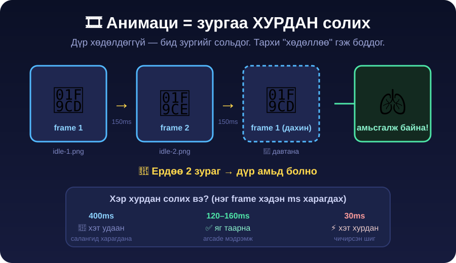

← **[Хичээл 7 руу буцах](../readme.md)**

# 🎞️ ХЭСЭГ 4 — Анимаци: frame-үүдээ гаргах · ⏱️ ~22 мин

> 🎯 **Зорилго:** ЭХ зургаа **засаж** frame-үүд гаргах (`idle-2`, `punch-1`, `hit-1`, `walk`) → дүр амьд болно.

> 🔑 **ХЭСЭГ 3.5-ийн алтан дүрэм ЭНД ажиллана:** шинээр биш — **ЗАС**. Бүх frame нэг ярианд, эх зургаас гарна.

---

<details open>
<summary>🎬 <b>Дасгал 4.1 — Анимаци гэж юу вэ?</b> · ⏱️ ~3 мин</summary>



**Анимаци = зургийг хурдан солих.** Дүр хөдөлдөггүй — бид зургийг сольдог, тархи "хөдөллөө" гэж боддог.

- 🖼️ **Frame** = нэг зураг
- ⏱️ Frame бүр хэдэн **ms** харагдана — 1000ms = 1 секунд
- 🔁 idle бол **давтагдана** (loop), punch бол **1 удаа** тоглож idle руу буцна

| Төлөв        | Frame | Frame тутам | Дараа нь            |
| ------------ | ----- | ----------- | ------------------- |
| 🧍 **idle**  | 2     | 150ms       | 🔁 үргэлж давтана    |
| 🚶 **walk**  | 2     | 130ms       | 🔁 явж байхад давтана |
| 👊 **punch** | 1     | 150ms       | → idle руу буцна     |
| 😵 **hit**   | 1     | 200ms       | → idle руу буцна     |

> 🔑 **Ердөө 2 зураг = амьд дүр.** Disney 24 frame зурдаг, arcade тоглоом 2–4-өөр л амьсгал гаргадаг. Бид arcade замаар явна.

🧪 **1 минутын сорил (компьютергүй):** Дэвтрийн 2 хуудсан дээр хүн зур — нэг дээр гар доор, нэг дээр гар дээр. Хуудсаа хурдан сольж хар. **Хөдөллөө!**

</details>

---

<details>
<summary>📜 <b>Дасгал 4.2 — Хөдөлгөөний промптын 4 дүрэм</b> · ⏱️ ~3 мин · 🔑 гол ойлголт</summary>

Хөдөлгөөн гуйхад **4 зүйлийг заавал** бичих ёстой. Байхгүй бол AI өөрөө "зохиочихно":

| #   | Дүрэм                       | Промптод бичих                                  | Байхгүй бол                                   |
| --- | --------------------------- | ----------------------------------------------- | --------------------------------------------- |
| 1️⃣  | **Ижил дүр байлга**         | _"Яг ижил дүр, ижил хувцас, ижил өнгө"_          | 🎭 Дүр өөр хүн болно                           |
| 2️⃣  | **Харах зүг**               | _"баруун тийш харсан"_ (`facing right`)          | 🔄 Дүр эргэлдэж, анимаци сална                 |
| 3️⃣  | **Эффект ХЭРЭГГҮЙ**         | _"no visual effects"_ — гэрэл, тоос, гал байхгүй | ✨ AI гоё эффект нэмнэ → sprite бохирдоно      |
| 4️⃣  | **Байрандаа зогсох**        | _"дүр яг тэр л зогсоо цэгтээ, хөл нь зөөгдөхгүй"_ | 🏃 Дүр хажуу тийш "гулсаж" анимаци чичирнэ    |

> 🚨 **№4 бол хамгийн дуулиантай.** AI дүрийг зурах болгондоо жаахан хажуу тийш зөөдөг. Тоглоомд frame солих үед дүр "гулсаж", "чичирч" харагдана. Тиймээс **байрандаа зогсох** гэдгийг үргэлж бич.

> 💡 **№3-ыг сана:** AI гоё харагдуулах гэж гал, гэрэл, тоос нэмэх дуртай. Илүү эффект = sprite-ын зах бохир = remove.bg дээр цэвэрлэхэд хэцүү. Эффектийг **кодоор** нэмнэ (Хичээл 8).

</details>

---

<details>
<summary>🫁 <b>Дасгал 4.3 — Frame 2: idle-2 (амьсгал)</b> · ⏱️ ~4 мин</summary>

ЭХ зургаа гаргасан **тэр л ярианд** бич:

```text
Яг ИЖИЛ дүр байлга — ижил хувцас, ижил өнгө, ижил стиль, ижил өндөр,
ижил ногоон дэвсгэр, ижил зургийн хэмжээ. Дүр яг тэр л цэгтээ зогсоно.
Баруун тийш харсан хэвээр. No visual effects.

ЗӨВХӨН нэг зүйл өөрчил: дүр амьсгалж байгаа шиг мөрөө БАГА ЗЭРЭГ
доошлуулж, биеэ жаахан бөхийлгө. Гар, хөлийн байрлал бараг ижил.
```

> ⚠️ **"БАГА ЗЭРЭГ" гэдэг үг чухал.** Хэт өөр байрлал гуйвал 2 frame нь "чичирсэн" мэт харагдана. idle бол зөөлөн хөдөлгөөн.

✅ Хадгал: `p1-idle-2.png`

🔍 **Шалга:** 2 зургаа хажуу хажууд тавь. **Ижил хүн** байна уу? Ижил бол ✅. Өөр хүн болсон бол дахин засуул (шинээр биш!).

</details>

---

<details>
<summary>👊 <b>Дасгал 4.4 — Frame 3: punch (цохилт)</b> · ⏱️ ~4 мин</summary>

```text
Яг ИЖИЛ дүр байлга — ижил хувцас, ижил өнгө, ижил стиль, ижил өндөр,
ижил ногоон дэвсгэр, ижил зургийн хэмжээ. Дүр яг тэр л цэгтээ зогсоно.
Баруун тийш харсан хэвээр. No visual effects.

ЗӨВХӨН биеийн байрлалыг өөрчил: дүр баруун гараа урагш ХҮЧТЭЙ
САНАЛАН цохиж байна (punch). Мутар нь чанга зангидсан, бие нь
цохилтын дагуу урагш эргэсэн. Сунгасан гар нь зургийн гадна
тайрагдахгүй байх.
```

> 💡 Сүүлийн мөр чухал — **сунгасан гар тайрагдвал** тоглоомд хагас гар харагдана. (Тиймээс ХЭСЭГ 3-т 4:3 хэлбэр авсан!)

✅ Хадгал: `p1-punch-1.png`

</details>

---

<details>
<summary>😵 <b>Дасгал 4.5 — Frame 4: hit (цохиулах)</b> · ⏱️ ~4 мин</summary>

```text
Яг ИЖИЛ дүр байлга — ижил хувцас, ижил өнгө, ижил стиль, ижил өндөр,
ижил ногоон дэвсгэр, ижил зургийн хэмжээ. Баруун тийш харсан хэвээр.
No visual effects — цус, шарх байхгүй.

ЗӨВХӨН биеийн байрлалыг өөрчил: дүр цохилт хүлээж авлаа — толгой
хойш цохигдож, бие хойш нугарч, хоёр гар хажуу тийш салсан.
Нүд аниастай.
```

✅ Хадгал: `p1-hit-1.png`

### 🚶 Хугацаа байвал — walk frame (маш их үнэ цэнэтэй!)

```text
Яг ИЖИЛ дүр байлга — [дээрхтэй ижил дүрмүүд].

ЗӨВХӨН биеийн байрлалыг өөрчил: дүр урагш нэг ХӨЛӨӨ гаргаж
алхаж байна. Хоёр гар нь хамгаалалтын байрлалд хэвээр.
```

✅ `p1-walk-1.png` → дараа нь _"нөгөө хөлөө гаргасан"_ хувилбар → `p1-walk-2.png`

> 💡 walk бол сурагчдын хамгийн их "мэдрэгддэг" гэж хэлдэг сайжруулалт. Амжвал заавал хий, амжихгүй бол **Silver quest**.

### 📁 Одоо чамд байх ёстой файлууд

```
p1-idle-1.png    🧍 бэлэн зогсоо (ЭХ зураг)
p1-idle-2.png    🫁 амьсгал
p1-punch-1.png   👊 цохилт
p1-hit-1.png     😵 цохиулах
p1-walk-1.png    🚶 алхаа (хугацаа байвал)
p1-walk-2.png    🚶 алхаа 2 (хугацаа байвал)
arena-1.png      🏟️ арена
```

> 🚨 **Файлын нэрсээ ЯГ ингэж бич.** ХЭСЭГ 6-д AI кодын агент **файлын нэрээр** ямар анимаци болохыг **өөрөө таамаглана** — `p1-punch-1.png` гэж бичвэл "аа, энэ punch анимаци" гэж мэдэх. Хачин нэртэй бол таахгүй.

🧼 **Одоо ХЭСЭГ 3.7-руу буцаж бүх зургаа [remove.bg](https://www.remove.bg)-ээр зэрэг цэвэрлэ!**

</details>

---

<details>
<summary>🎥 <b>Дасгал 4.6 — Анимацийг КОДГҮЙ турших</b> · ⏱️ ~3 мин · 🎉</summary>

Код бичихээс **ӨМНӨ** анимаци ажиллах эсэхийг шалгаж болно:

1. 👉 **[ezgif.com/maker](https://ezgif.com/maker)** нээ
2. **Choose files** → `p1-idle-1.png` ба `p1-idle-2.png` сонго
3. **Upload and make a GIF!**
4. **Delay time** = `15` (= 150ms) → **Make a GIF!**
5. Гарсан GIF-ээ хар 👀

🫁 Дүр чинь **амьсгалж** байна уу? Тэгвэл анимаци ажиллана — кодод найдвартай орж болно!

<details>
<summary>😬 GIF-д дүр "гулсаж / мултарч" харагдвал</summary>

Frame-үүд өөр хүн болсон, эсвэл дүр байраа зөөсөн (4.2-ын дүрэм №1, №4).

```text
Хоёр зургийг ЯГ ижил хэмжээтэй, дүрийг зургийн ЯГ ИЖИЛ ЦЭГТ
(ижил өндөр, ижил хэвтээ байрлал) байхаар дахин гарга.
Зөвхөн мөрний өндөр л өөр байна.
```

> 💡 Мэргэжлийн хүмүүс үүнийг **registration** гэдэг — frame бүрт дүр ижил цэгт байх ёстой. Жинхэнэ студид ч тулгардаг асуудал!

</details>

🚀 **Stretch:** `punch` frame-ээ нэмээд 3 зурагтай GIF хий.

</details>

---

<details>
<summary>🎬 <b>Дасгал 4.7 — PRO АРГА: видеогоор анимаци гаргах</b> · ⏱️ ~2 мин (багшийн демо)</summary>

> ⚠️ **Энэ бол ЗӨВХӨН ХАРАХ хэсэг** — видео үүсгэлт төлбөртэй / хязгаартай учир өнөөдөр бүгд хийхгүй. Гэхдээ **мэргэжлийн хүмүүс яг ингэж хийдэг** — мэдэж авах нь зүйтэй.

**Санаа:** Зураг засаж frame гаргахын оронд **1 секундын видео** үүсгээд, тэр видеоны **frame бүрийг сугалж** авна. Видео нь 20-30 frame гаргадаг учир анимаци хамаагүй **зөөлөн** болно.

| Алхам | Юу                                    | Хэрэгсэл                                       |
| ----- | ------------------------------------- | ---------------------------------------------- |
| 1️⃣    | Sprite зургаа хавсаргаж **видео** гуй | Veo (Gemini) / Grok Imagine · **1 сек, 480p**   |
| 2️⃣    | Видеоны frame-үүдийг сугалах          | [ezgif.com/video-to-jpg](https://ezgif.com/video-to-jpg) |
| 3️⃣    | Хэрэггүй frame-ийг хаях               | Зөвхөн 3–6 хамгийн гоё frame л ав               |
| 4️⃣    | Ногоон дэвсгэрийг арилгах             | remove.bg                                       |

### 📜 Видео промптын дүрмүүд (яг ижил 4 дүрэм + 1)

```text
[Sprite зургаа хавсарга]

Энэ дүр баруун тийш харсан хэвээр, martial arts style-аар өшиглөнө.
Дүр яг тэр л цэгтээ байна — камер хөдөлгөөнгүй, дүр хажуу тийш зөөгдөхгүй.
Ногоон дэвсгэр хэвээр. NO VISUAL EFFECTS.
```

### 🧠 Хамгийн ухаалаг заль — **төлөвөөс эхлүүлэх**

Хэрэв "агаарт байхад өшиглөх" гэх мэт **хэцүү** хөдөлгөөн хэрэгтэй бол шууд гуйхгүй. Эхлээд **төлөвт орж**, дараа нь **үйлдэл хийлгэ**:

```text
Дүр эхлээд бөхийж (crouch) хамгаалалтад орно, ДАРАА НЬ цохино.
```

→ Гарсан видеоноос **зөвхөн цохих хэсгийн** frame-ийг авна. Ингэвэл "бөхийсөн байрлалаас цохих" анимаци гарна!

> 🎓 **Видеоны багш хэлснээр:** агаарын цохилтыг шууд гуйхад ~50 удаа туршсан. "Төлөвөөс эхлүүлэх" аргаар **хэдхэн удаад** болсон. Хичээл 8-д combo хийхэд яг ийм анимаци хэрэгтэй болно!

### ✅ ХЭСЭГ 4-ийн checkpoint

- [ ] 4+ sprite frame + 1 арена хадгалагдсан
- [ ] Бүх зураг remove.bg-ээр **цэвэрлэгдсэн** (шалмаг дэвсгэр)
- [ ] Файлын нэрс яг заасан шиг (англи, зайгүй)
- [ ] Бүх frame-д **ижил дүр**, дүр **байраа зөөгөөгүй**
- [ ] ezgif дээр idle анимаци **хөдөлж** байгааг харсан ⭐
- [ ] Хөдөлгөөний промптын **4 дүрмийг** нэрлэж чадна ⭐

</details>

---

➡️ **Дараагийн хэсэг:** <a href="5-zurgaa-holboh.md" target="_blank">🔗 ХЭСЭГ 5 — Зургаа интернэтэд тавих 🔗</a>
