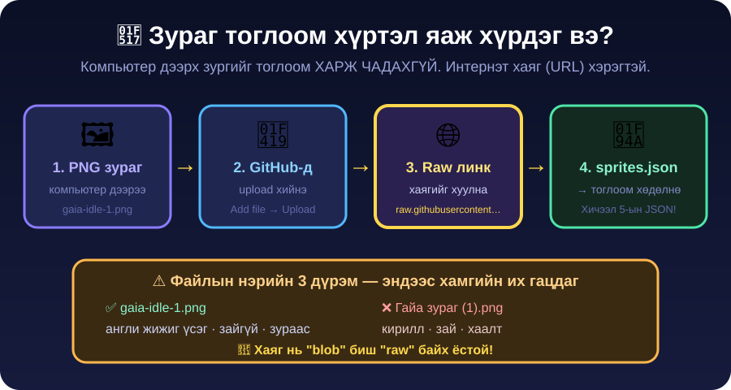

← **[Хичээл 7 руу буцах](../readme.md)**

# 🔗 ХЭСЭГ 5 — Зургаа интернэтэд тавьж JSON-д холбох · ⏱️ ~15 мин

> 🎯 **Зорилго:** 5 зургаа интернэтэд тавьж **хаяг (URL)** авах → `sprites.json` бэлдэх.

> 💡 Хичээл 5-д асуулт-хариултаа JSON болгосон. Одоо **зургийн хаягуудаа** JSON болгоно. Ижил ур чадвар — өөр агуулга.

---

<details open>
<summary>🤔 <b>Дасгал 5.1 — Яагаад зургаа интернэтэд тавих шаардлагатай вэ?</b> · ⏱️ ~2 мин</summary>



Тоглоом чинь **браузер дотор** ажиллана. Браузер чиний компьютерийн `Downloads` фолдер рүү **орж чадахгүй** (аюулгүй байдлын дүрэм).

Тиймээс зураг **интернэт хаягтай** болох ёстой:

```
❌ C:\Users\Bat\Downloads\p1-idle-1.png     ← браузер харахгүй
✅ https://raw.githubusercontent.com/.../p1-idle-1.png   ← харна ✔
```

> 💡 Хичээл 5-д Wikipedia-аас зургийн хаяг авсныг сана — яг ижил зарчим. Гэхдээ одоо зураг **өөрийнх** учир **өөрөө** интернэтэд тавина.

</details>

---

<details>
<summary>🐙 <b>Дасгал 5.2 — GitHub-д зургуудаа upload хийх</b> · ⏱️ ~6 мин · 🔑 гол дасгал</summary>

Хичээл 3-д GitHub repo үүсгэсэн — тэрийгээ хэрэглэнэ.

1. 👉 [github.com](https://github.com) → нэвтэр → **portfolio repo**-гоо нээ
2. **Add file** ▾ → **Upload files**
3. 5 зургаа **чирж** (drag) хая — 5-ыг зэрэг болно
4. Доош гүйлгээд **Commit changes** дар
5. Зураг бүр repo дотор гарч ирнэ ✅

### 🌐 Одоо RAW хаягийг ав (хамгийн чухал 3 товшилт)

1. Зургийн **нэр дээр дар** (`p1-idle-1.png`)
2. Баруун дээр **Raw** товч (эсвэл **Download raw file**) → **дар**
3. Браузерын **хаягийн мөрөөс** хаягийг **хуулж ав**

Зөв хаяг ингэж харагдана:

```
https://raw.githubusercontent.com/BAT/my-portfolio/main/p1-idle-1.png
                ↑ raw.githubusercontent.com байх ЁСТОЙ
```

| ✅ Зөв                       | ❌ Буруу                          |
| ---------------------------- | --------------------------------- |
| `raw.githubusercontent.com`  | `github.com/.../blob/...`         |
| `.png`-ээр дуусна            | `?raw=true` гэх зүйл нэмэгдсэн    |
| Дундаа **зайгүй**            | `%20` (= зай) орсон               |

🔍 **Тест:** Хаягаа шинэ tab-д буулгаад Enter дар. **Зөвхөн зураг** гарч ирвэл ✅. GitHub хуудас гарвал ❌ — `blob` хаяг авсан байна, дахин `Raw` дар.

<details>
<summary>🆘 GitHub ажиллахгүй / repo байхгүй бол — нөөц арга</summary>

👉 **[postimages.org](https://postimages.org)** — бүртгэлгүй:

1. **Choose images** → 5 зургаа сонго → **Upload**
2. Зураг бүрийн доор **Direct link** гэсэн хаягийг ав ⭐ (бусад линкүүд ажиллахгүй!)

> ⚠️ **Direct link** гэдгийг л ав. "Page link", "Thumbnail" зэрэг нь HTML хуудас — тоглоом зураг харахгүй.

</details>

<details>
<summary>🆘 Файлын нэрэнд кирилл / зай орсон бол</summary>

Хаягт `%20`, `%D0%93` гэх мэт хачин тэмдэгт гарч ирнэ → тоглоом гацна.

**Шийдэл:** Компьютер дээрх зургийн нэрийг зас (`p1-idle-1.png`) → GitHub дээрх хуучныг устга (файлыг нээ → 🗑️ товч) → шинээр upload хий.

</details>

</details>

---

<details>
<summary>📦 <b>Дасгал 5.3 — sprites.json бэлдэх</b> · ⏱️ ~5 мин</summary>

Одоо 5 хаягаа **нэг JSON** дотор цэгцэлнэ. Доорхийг хуулж, `[...]`-ийн оронд **өөрийн хаягуудаа** буулга:

```json
{
  "arena": "[ARENA ХАЯГ]",
  "p1": {
    "name": "[ГАЙА]",
    "idle": ["[IDLE-1 ХАЯГ]", "[IDLE-2 ХАЯГ]"],
    "walk": ["[WALK-1 ХАЯГ]", "[WALK-2 ХАЯГ]"],
    "punch": ["[PUNCH-1 ХАЯГ]"],
    "hit": ["[HIT-1 ХАЯГ]"],
    "kick": [],
    "block": []
  }
}
```

> 💡 **`walk` хийгээгүй бол** тэр мөрийг **бүрэн ав** (хагас үлдээвэл JSON эвдэрнэ). `kick`, `block` бол **хоосон array** `[]` — Хичээл 8-д дүүргэнэ.

<details>
<summary>💡 Бөглөсөн жишээ харах</summary>

```json
{
  "arena": "https://raw.githubusercontent.com/bat/my-portfolio/main/arena-1.png",
  "p1": {
    "name": "ГАЙА",
    "idle": [
      "https://raw.githubusercontent.com/bat/my-portfolio/main/p1-idle-1.png",
      "https://raw.githubusercontent.com/bat/my-portfolio/main/p1-idle-2.png"
    ],
    "punch": [
      "https://raw.githubusercontent.com/bat/my-portfolio/main/p1-punch-1.png"
    ],
    "hit": [
      "https://raw.githubusercontent.com/bat/my-portfolio/main/p1-hit-1.png"
    ]
  }
}
```

</details>

### 🧠 Бүтцийг ойлго (Хичээл 5-ын JSON!)

| Юу                    | Ямар хэлбэр      | Яагаад                                    |
| --------------------- | ---------------- | ----------------------------------------- |
| `p1`                  | `{ }` **object** | НЭГ тулаанчны бүх мэдээлэл                 |
| `idle` / `punch` / `hit` | `[ ]` **array**  | Frame-ийн **дараалал** — 1, 2, 3...        |
| Дотор нь              | 🪆 **nested**     | object дотор array — Boss Battle-ийн Үе 3! |

> 🔑 **Яагаад `punch` дотор ердөө 1 зураг байсан ч `[ ]` array вэ?** Хичээл 8-д punch-д 2-3 frame нэмнэ. Одооноос array байвал тэр үед **кодоо өөрчлөх шаардлагагүй** — зөвхөн дата нэмнэ. Энэ бол жинхэнэ програмчлагчийн бодох арга: 🧠 **"код = дүрэм, дата = агуулга"**.

> 🎓 **Мэргэжлийн хүмүүс ч яг ингэдэг:** тоглоомын бүх анимацийн тохиргоог (хэдэн frame, хэдэн ms, аль frame давтагдах, аль frame цохилт хийх) **нэг JSON файлд** хадгалдаг — тэгээд кодоо огт хөндөхгүйгээр тоглоомын мэдрэмжээ тааруулдаг. Чиний `sprites.json` бол яг тэр файлын **эхлэл** нь.

### 🟢 ЗААВАЛ шалга — JSONLint

1. 👉 **[jsonlint.com](https://jsonlint.com)** нээ
2. JSON-оо буулга → **Validate JSON**
3. 🟢 **Valid JSON** гартал зас

> 🚨 **Цаашаа явахгүй!** 🔴 байвал тоглоом ажиллахгүй. Хамгийн түгээмэл: хаягийн хооронд **таслал алга**, эсвэл **сүүлийн таслал илүү** (trailing comma). Хичээл 5-ын дасгалаа сана 😉

### ✅ ХЭСЭГ 5-ийн checkpoint

- [ ] 5 зураг GitHub (эсвэл postimages)-д тавигдсан
- [ ] Хаяг бүрийг шинэ tab-д туршиж, **зөвхөн зураг** гарч ирснийг харсан
- [ ] `sprites.json` бэлэн, JSONLint дээр 🟢 **Valid**
- [ ] object / array / nested-ийг тайлбарлаж чадна

</details>

---

➡️ **Дараагийн хэсэг:** <a href="6-arena-bosgoh.md" target="_blank">🕹️ ХЭСЭГ 6 — Арена бүтээх (AI Studio) 🔗</a>
