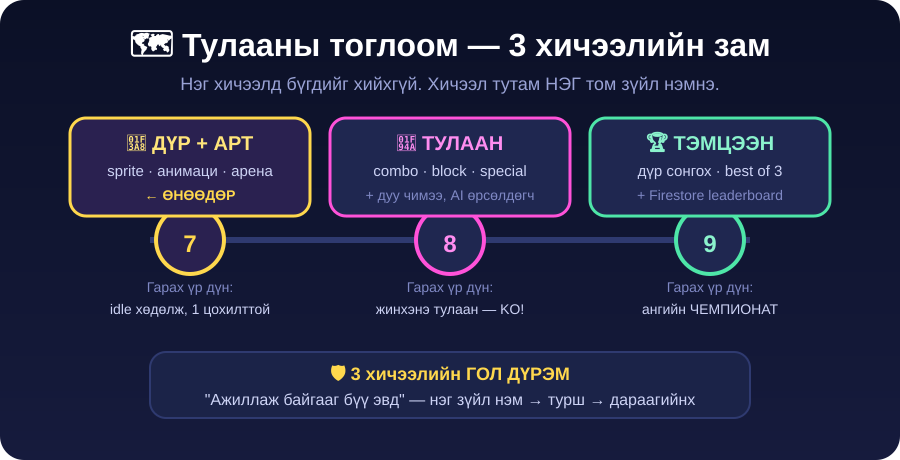

<!-- Kahoot: Хичээл 6 (Firestore, Leaderboard) давтлагын Kahoot-ийн линкийг доор солино -->
<!-- Слайд: slides.md-ийг Google Slides болгосны дараа линкийг доор солино -->

- 👉 **[🎮 Kahoot — өмнөх хичээл бататгах](https://play.kahoot.it)**
- 👉 **[🥊 Жишээ тоглоом үзэх](https://aistudio.google.com)** — чи иймэрхүүг хийнэ
- 👉 **[🖼️ Слайд](./slides.md)**

# Хичээл 7 — 🥊 Тулааны тоглоом #1: Дүр, Арт, Анимаци

> 🎯 **Өнөөдөр:** Өөрийн тулаанчныг **зохиож** → AI-гаар **зурж** → **хөдөлгөж** → аренадаа **тоглогддог** болгоно.

> 🎨 **Өнөөдөр код бол ердөө 30%.** 70% нь **АРТ** — жинхэнэ тоглоомын студид ч ингэж байдаг.

**🛠️ Хэрэгсэл:** [Gemini](https://gemini.google.com) · [AI Studio](https://aistudio.google.com) · [remove.bg](https://www.remove.bg) · [ezgif](https://ezgif.com/maker) · GitHub · [JSONLint](https://jsonlint.com)

---

## 🗺️ 3 хичээлийн зам — өнөөдөр бид эхнийхийг хийнэ

---

# 📋 Өнөөдрийн хичээл — 6 хэсэгтэй

> Хэсэг бүрийг дараад нээ 👇 Дараа нь **линк** дээр дарж дасгал руу ор.

🥊 <b>ХЭСЭГ 1 — Тулааны тоглоомын анатоми</b> · ⏱️ ~15 мин

Код бичихгүй. **Ажиглаж, ойлгож** эхэлнэ.

- 👀 Тоглоомыг тоглох биш — **ажиглах** (4 асуулт)
- 🧍 Дүр бол **ТӨЛӨВ-үүдийн жагсаалт**: idle · walk · punch · kick · block · hit · ko
- 🎭 Ангиар төлөвийг **биеэрээ** тоглох
- 🗺️ 3 хичээлийн зам

### ➡️ <a href="dasgal/1-tulaanii-anatomi.md" target="_blank">ХЭСЭГ 1-ийг нээх 🔗</a>

🧝 <b>ХЭСЭГ 2 — Баатраа зохиох</b> · ⏱️ ~15 мин

⚠️ Ryu, Goku — **болохгүй**. Өөрийн дүр зохионо.

- 🇲🇳 Санаа: бөх · харваач · бөө · хөөмийч · кибер номад
- 📋 **Дүрийн карт** бөглөх — P1 ба P2 (6 мөр)
- 🛡️ Хилийн дүрэм (жинхэнэ хүн ❌, цус ❌)
- 🏟️ Арена сонгох — Говь · Наадам · Кибер УБ

### ➡️ <a href="dasgal/2-baatraa-zohioh.md" target="_blank">ХЭСЭГ 2-ыг нээх 🔗</a>

🎨 <b>ХЭСЭГ 3 — Sprite зураг AI-гаар үүсгэх</b> · ⏱️ ~28 мин · 🔑 гол хэсэг

Картаа **жинхэнэ тоглоомын зураг** болгоно.

- 🖼️ Sprite-ын **4 шалгуур**: transparent · side view · full body · 1 дүр
- 🥋 P1-ийн **ЭХ зураг** (idle) — бүх frame эндээс гарна
- 🔑 **АЛТАН ДҮРЭМ:** _шинээр биш — **ЗАС** (edit)_
- 🏟️ Арена дэвсгэр · 🧼 дэвсгэр арилахгүй бол

### ➡️ <a href="dasgal/3-sprite-uusgeh.md" target="_blank">ХЭСЭГ 3-ыг нээх 🔗</a>

🎞️ <b>ХЭСЭГ 4 — Анимаци: frame-үүдээ гаргах</b> · ⏱️ ~22 мин

Ердөө **2 зураг** = амьд дүр 🫁

- 🎬 Анимаци = зургаа **150ms** тутам солих
- 🫁 `idle-2` (амьсгал) · 👊 `punch-1` · 😵 `hit-1`
- 🎥 **Кодгүй турших** — [ezgif](https://ezgif.com/maker) дээр GIF болгож хар!

### ➡️ <a href="dasgal/4-animaci-frame.md" target="_blank">ХЭСЭГ 4-ийг нээх 🔗</a>

🔗 <b>ХЭСЭГ 5 — Зургаа интернэтэд тавьж JSON-д холбох</b> · ⏱️ ~15 мин

Хичээл 5-ын **JSON ур чадвар** дахин ажиллана.

- 🐙 GitHub-д upload → **Raw хаяг** ав (`raw.githubusercontent.com`)
- ⚠️ Файлын нэр: **англи, зайгүй, зураастай**
- 📦 `sprites.json` — object дотор array 🪆
- 🟢 [JSONLint](https://jsonlint.com) дээр **Valid** болгох

### ➡️ <a href="dasgal/5-zurgaa-holboh.md" target="_blank">ХЭСЭГ 5-ыг нээх 🔗</a>

🕹️ <b>ХЭСЭГ 6 — Арена бүтээх + Publish</b> · ⏱️ ~30 мин

- 🪞 **Толин заль** — P2-ыг үнэгүй гаргах (`scaleX(-1)` + `hue-rotate`)
- 🚀 AI Studio-д арена гаргах (health bar, таймер, idle, A/D, J)
- ✅ **6 шалгуурын checkpoint** — давтал шинэ зүйл нэмэхгүй
- 🏅 Quest board 🥉🥈🥇 · 🎉 Ангийн ARCADE

### ➡️ <a href="dasgal/6-arena-bosgoh.md" target="_blank">ХЭСЭГ 6-ыг нээх 🔗</a>

---

🆘 <b>Гацвал — түгээмэл 5 асуудал</b>

**🎭 Дүр минь frame тутам ӨӨР ХҮН болчихлоо** → Шинээр үүсгэсэн байна. **Тэр л ярианд** засуул: _"Яг ижил дүр, ижил хувцас, ижил өнгө байлга. ЗӨВХӨН хөдөлгөөнийг өөрчил."_ (ХЭСЭГ 3.4)

**⬛ Sprite-ын ард цагаан дөрвөлжин** → Зураг transparent биш. Эхлээд _"дэвсгэрийг бүрэн ав, transparent PNG болго"_ гэж засуул. Болохгүй бол **[remove.bg](https://www.remove.bg)**.

**🖼️ Зураг тоглоомд гарахгүй** → Хаягаа шинэ tab-д турш. Зөвхөн зураг гарах ёстой. `github.com/.../blob/...` бол **буруу** — `Raw` дарж `raw.githubusercontent.com` хаяг ав. Файлын нэрэнд **кирилл эсвэл зай** байвал зас. (ХЭСЭГ 5.2)

**🎈 Тулаанчин агаарт хөвж байна** → AI-д: _"Тулаанчны хөлийг дэвсгэрийн шалны шугам дээр яг тааруулж байрлуул."_

**🚦 AI "limit" гэж байна** → Зураг үүсгэлт **их зарцуулдаг**. Хичээл 4-ийн дүрэм: шаардлагаа **1 мессежид нэгтгэ** · гарсан зургаа **тэр даруй хадгал** · "дахин үзье" 10 удаа дарахгүй.

🛡️ <b>AI Smart &amp; Safe</b>

- **🚫 Бусдын дүр биш** — Ryu, Chun-Li, Goku, Naruto бол **copyright**. Publish хийвэл зөрчил. Өөрийн дүр зохио — бас илүү гоё.
- **🚨 Жинхэнэ хүнийг тулаанчин болгож БОЛОХГҮЙ** — найз, багш, ангийнхны зураг ❌. Хөгжилтэй санагдаж болох ч тэр хүнд гомдол болдог, интернэтээс арилахгүй.
- **🩸 Цус, шарх, бэртэл байхгүй** — arcade эффект (⭐💥 од, гялбаа) хэрэглэ. Тоглоом хөгжилтэй байх ёстой, эмээх юм биш.
- **🎨 Кредит өг** — тоглоомын доод талд _"Sprites: AI (Gemini) + миний дизайн"_ гэж бич.
- **🇲🇳 Соёлыг хүндэтгэ** — бөх, бөө, дээл гоё сэдэв. Гэхдээ шоолсон биш, **хүндэтгэсэн** дүр байг.
- **🤖 AI эндүүрдэг** — "transparent" гэж хэлсэн ч цагаан дэвсгэр гаргаж мэднэ. **Өөрөө шалга.**

🏠 <b>Гэрийн даалгавар</b>

**1️⃣ 👹 Жинхэнэ P2 дүрээ үүсгэ** (→ Хичээл 8-ийн Алхам 1)

ХЭСЭГ 2-ын P2 картаараа: `p2-idle-1.png`, `p2-idle-2.png`, `p2-hit-1.png`
→ GitHub-д upload → `sprites.json`-д `"p2"` объект нэм

> 🔑 Дүрмээ сана: **эх зургаа гаргаад ЗАСАЖ** үлдсэнийг гарга.

**2️⃣ 🦵 kick frame нэм** (→ Хичээл 8-д combo болно)

`p1-kick-1.png` үүсгэ → `sprites.json`-д `"kick": [...]` нэм → JSONLint 🟢

**3️⃣ 🏅 Quest board** — 🥈 Silver-ээс дор хаяж **1 quest** дуусга.

**4️⃣ 🥊 Portfolio-д tab нэм** — Vercel линкээ portfolio сайтдаа tab болгож нэмээд **Discord**-д тавь.

📚 <b>Glossary — шинэ үгс</b>

| Үг                     | Тайлбар                                                    |
| ---------------------- | ---------------------------------------------------------- |
| **Sprite**             | Тоглоомд хэрэглэдэг дэвсгэргүй нэг дүрсний зураг            |
| **Transparent PNG**    | Дэвсгэргүй зураг — ард шалмаг дөрвөлжин харагдана           |
| **Frame**              | Анимацийн НЭГ зураг                                        |
| **ms (миллисекунд)**   | 1000ms = 1 секунд. Frame тутам ~150ms                       |
| **Төлөв (state)**      | Дүр одоо юу хийж байна: idle / punch / hit                   |
| **Idle**               | Юу ч дараагүй үеийн "бэлэн зогсоо" төлөв                     |
| **Side view**          | Хажуугаас харсан — тулааны тоглоомын үзэх зүг                 |
| **Asset**              | Тоглоомд хэрэглэх файл — зураг, дуу, дэвсгэр                  |
| **Raw линк**           | Зургийн жинхэнэ интернэт хаяг (HTML хуудас биш)               |
| **Mirror / flip**      | Зургийг толин ойлгох — `scaleX(-1)`                          |
| **Knockback**          | Цохиулсан дүр хойш түлхэгдэх                                 |
| **Screen shake**       | Цохилтын үед дэлгэц бага зэрэг чичрэх                        |
| **Character consistency** | Frame тутамд дүр **ижил хүн** байх (өнөөдрийн гол ур чадвар) |

> 💡 Алдаа гарвал AI-аас _"Энэ алдааг яаж засах вэ?"_ гэж шууд асуу. Амжилт! 🥊
