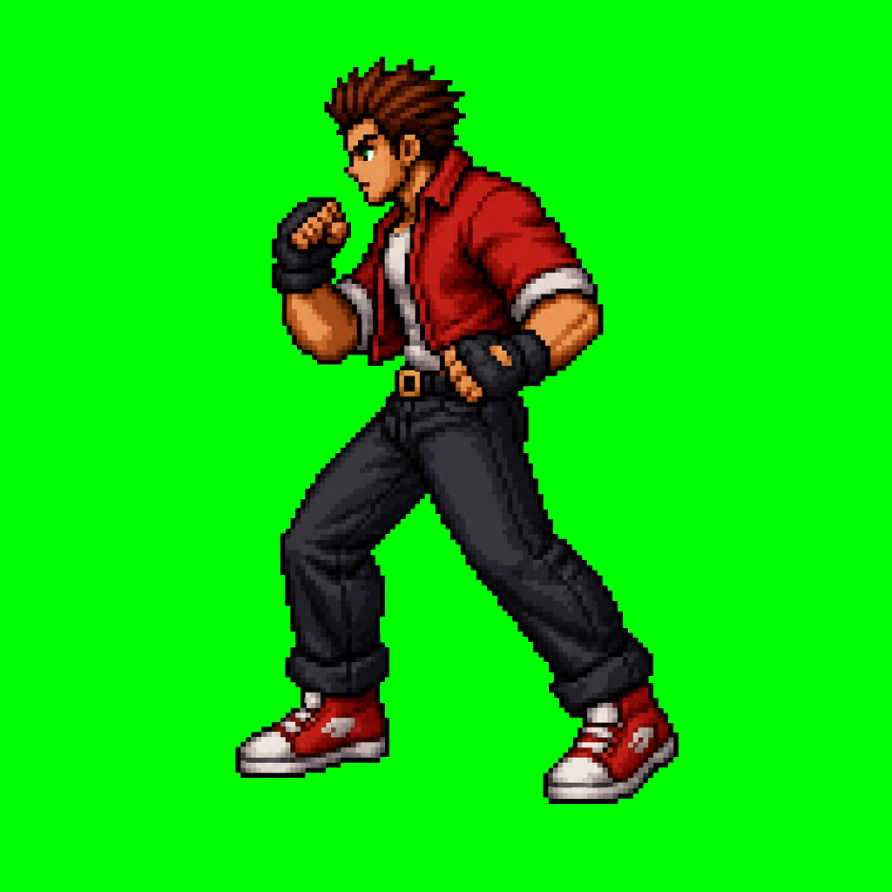
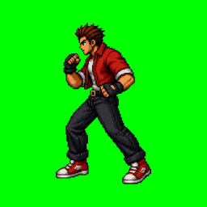

← **[Хичээл 8 руу буцах](../readme.md)**

# Алхам 1 — Шинэ хөдөлгөөний frame-үүд · ~28 мин

> **Зорилго:** kick, block (заавал) · crouch, jump (амжвал) frame-үүдийг гаргаж, бүгдийг **ижил хэмжээ, ижил дүртэй** болгох.

Хичээл 7-ын алтан дүрэм хэвээр: **шинээр биш — ЗАС**. Бүх frame эх зургаасаа, **нэг ярианд** гарна.

---

<details open>
<summary><b>1.1 — Эхлэхийн өмнө: хэмжээний дүрэм</b> · ~4 мин</summary>

Өнөөдөр frame-үүдийг нэг зурагт багцална. Тиймээс **хэмжээ таарахгүй бол анимаци эвдэрнэ**. Хичээл 7-д энэ тийм ч чухал биш байсан — өнөөдөр хамгийн чухал.

| Юу | Тоо | Яагаад |
| --- | --- | --- |
| Зургийн харьцаа | **1:1** (дөрвөлжин) | Sprite sheet-ийн нүд дөрвөлжин — Алхам 2 |
| Gemini-ээс гарах хэмжээ | ~**1024×1024** | 1:1 гэж хэлэхэд ойролцоогоор ийм гарна |
| Sprite sheet-ийн нүд | **256×256** | Алхам 2-т бүгдийг үүн рүү жижигрүүлнэ |
| Дүрийн өндөр | нүдний **80–85%** | Хөл доод захад, дээр талд үсрэх зай үлдэнэ |
| Харах зүг | **баруун тийш** | Бүх frame — P2-ыг `scaleX(-1)`-ээр толиндоно |
| Дэвсгэр | тод **ногоон** | Дараа нь chroma key-ээр арилгана |

**Ийм зураг гарах ёстой** (багшийн багцын `red-brawler/anchor-w.png`):



Ногоон дэвсгэр · хажуугаас · бүтэн бие · нэг дүр · сүүдэргүй · хөл доод хэсэгт.

> **Хичээл 7-д 4:3 хэлбэрээр гаргасан бол** дахин гаргах шаардлагагүй — Алхам 2.2-т доод талд нь зай нэмж дөрвөлжин болгоно.

> **Хамгийн түгээмэл алдаа:** нэг frame дээр дүр том, нөгөө дээр жижиг. Тоглоомд дүр "хөөрч, агшиж" харагдана. Тиймээс промпт бүрт _"ижил өндөр, ижил зургийн хэмжээ, дүр яг тэр л цэгтээ"_ гэж **үргэлж** бичнэ.

**Одоо чамд байгаа зүйл (Хичээл 7-оос):**

```
p1-idle-1.png · p1-idle-2.png · p1-punch-1.png · p1-hit-1.png · arena-1.png
p1-walk-1.png · p1-walk-2.png   (хийсэн бол)
```

<details>
<summary>Хичээл 7-ын зураг байхгүй / тоглоом ажиллахгүй бол</summary>

Багшаас **нөөц sprite багц** ав (Discord). Эсвэл үнэгүй бэлэн багц ав — Алхам 2.5-д сайтуудын жагсаалт бий. Багц авсан ч Алхам 2-оос цааш **бүх ажлыг өөрөө** хийнэ.

</details>

</details>

---

<details>
<summary><b>1.2 — kick (3 frame) · заавал</b> · ~8 мин</summary>

Хичээл 7-д punch-ыг **1 frame**-ээр хийсэн. Kick-ийг **3 frame**-ээр хийнэ — бэлдэх, цохих, буцах. Ингэснээр цохилт "жинтэй" мэдрэгдэнэ.

**Зорилтот үр дүн** (багшийн багц — 10 frame-тэй мэргэжлийн хувилбар):



Gemini дээр **эх зургаа гаргасан тэр ярианд** доорхийг ээлж ээлжээр бич. Гарсан бүрийг тэр даруй Download.

**Frame 1 — бэлдэлт:**

```text
Яг ИЖИЛ дүр байлга — ижил хувцас, ижил өнгө, ижил стиль, ижил өндөр,
ижил ногоон дэвсгэр, ижил зургийн хэмжээ. Дүр яг тэр л цэгтээ зогсоно.
Баруун тийш харсан хэвээр. No visual effects.

ЗӨВХӨН биеийн байрлалыг өөрчил: дүр өшиглөхөд бэлдэж жин нь хойд
хөл рүүгээ шилжсэн, урд өвдгөө бага зэрэг өргөсөн.
```

Хадгал: `p1-kick-1.png`

**Frame 2 — цохилт:**

```text
[дээрх ижил 3 мөрийг давт]

ЗӨВХӨН биеийн байрлалыг өөрчил: дүр урд хөлөө баруун тийш ХЭВТЭЭ
сунгаж өшиглөж байна (martial arts side kick). Хөл нь бэлхүүсийн
өндөрт. Сунгасан хөл зургийн гадна тайрагдахгүй байх.
```

Хадгал: `p1-kick-2.png`

**Frame 3 — буцалт:**

```text
[дээрх ижил 3 мөрийг давт]

ЗӨВХӨН биеийн байрлалыг өөрчил: дүр өшиглөсний дараа хөлөө буцааж
татаж байна — өвдөг хагас нугарсан, бие бага зэрэг тэнцвэрээ олж байна.
```

Хадгал: `p1-kick-3.png`

> **`martial arts` гэж бичих нь чухал.** Бичихгүй бол AI хөлбөмбөгийн өшиглөлт эсвэл бүжиг гаргадаг.

</details>

---

<details>
<summary><b>1.3 — block (2 frame) · заавал</b> · ~5 мин</summary>

Block бол **2 frame**: ① хамгаалалтад орох ② хамгаалалтад **зогсох**. Хоёр дахь frame нь товч дарж байх хугацаанд давтагдана (Алхам 3-т `hold` гэж нэрлэнэ).

| block-high (дээд) | block-low (суусан) |
| --- | --- |
|  |  |

> Багшийн багцад block **2 төрөлтэй** — дээд ба доод. Өнөөдөр нэгийг нь хийхэд хангалттай.

```text
[ижил 3 мөр]

ЗӨВХӨН биеийн байрлалыг өөрчил: дүр хоёр гараа өргөж нүүр, цээжээ
хамгаалж эхэлж байна. Тохой нугарсан, мөр жаахан татсан.
```

Хадгал: `p1-block-1.png`

```text
[ижил 3 мөр]

ЗӨВХӨН биеийн байрлалыг өөрчил: дүр бүрэн хамгаалалтын байрлалд
зогсож байна — хоёр гар нүүрний өмнө нягт, тохой биед наалдсан,
жин нь хойш татсан.
```

Хадгал: `p1-block-2.png`

</details>

---

<details>
<summary><b>1.4 — crouch, jump · амжвал</b> · ~7 мин</summary>

Заавал биш. Амжаагүй бол Алхам 2 руу яв — эдгээрийг **quest** болгож дараа нэмнэ.

| crouch | jump |
| --- | --- |
|  |  |

**crouch (2 frame)** — сууж цохилтоос мултрах:

```text
[ижил 3 мөр]

ЗӨВХӨН биеийн байрлалыг өөрчил: дүр өвдгөө нугалж хагас суусан,
толгой доошилсон, гар хамгаалалтад. Хөл нь газраас салахгүй.
```

`p1-crouch-1.png` → дараа нь _"бүрэн суусан, толгой хамгийн доор"_ → `p1-crouch-2.png`

**jump (3 frame)** — үсрэлт:

```text
[ижил 3 мөр]

ЗӨВХӨН биеийн байрлалыг өөрчил: дүр өвдгөө цээж рүүгээ татаж
үсэрч байна. Хоёр хөл газраас салсан, бие бага зэрэг бөхийсөн.
Дүр зургийн ижил цэгт хэвээр — доор эсвэл дээр зөөгдөхгүй.
```

`p1-jump-1.png` (үсрэх бэлдэлт) → `p1-jump-2.png` (агаарт, өвдөг татсан) → `p1-jump-3.png` (буух, өвдөг нугарсан)

> **Дүрийг frame дотор дээшлүүлэх ХЭРЭГГҮЙ.** Өндөрлөхийг код хийнэ — Алхам 4-т `jumpHeight` тоогоор. Зураг дотор дүр дээшилбэл хоёр удаа үсэрсэн мэт болно.

</details>

---

<details>
<summary><b>1.5 — "Төлөвөөс эхлүүлэх" заль</b> · ~4 мин</summary>

**Асуудал:** _"агаарт байхад өшиглөж байгаа дүр гарга"_ гэхэд AI бараг гаргадаггүй — газар дээр зогсоод өшиглөчихдөг.

**Шийдэл:** Хоёр үе шаг болгож гуй. Эхлээд **төлөвт оруул**, дараа нь **үйлдэл хийлгэ**:

```text
[ижил 3 мөр]

Дүр эхлээд агаарт үсэрсэн байрлалд байна (өвдөг татсан),
ТЭР БАЙРЛАЛААС баруун тийш өшиглөж байна.
```

Ижил заль бусад хэцүү хөдөлгөөнд ажиллана:

| Хүсэж буй frame | Ингэж гуй |
| --- | --- |
| Агаарын цохилт | "агаарт үсэрсэн байрлалаас цохино" |
| Суусан цохилт | "суусан байрлалаас нударгаа урагш шидэж байна" |
| Хамгаалалтаас эсрэг цохилт | "хамгаалалтын байрлалаас гараа тайлж цохино" |

> Энэ бол **Алхам 4-ийн төлөвийн машинтай** яг таардаг сэтгэлгээ: тоглоом ч дүрийг эхлээд төлөвт оруулаад дараа нь үйлдэл хийлгэдэг.

</details>

---

<details>
<summary><b>1.6 — Багшийн демо: видеогоор frame гаргах</b> · ~2 мин · зөвхөн харах</summary>

Хамгийн зөөлөн анимаци нь **видеоноос** гардаг: 1 секундын видео = 20–30 frame. Гэхдээ видео үүсгэлт төлбөртэй / хатуу хязгаартай учир өнөөдөр бүгд хийхгүй.

| Алхам | Хэрэгсэл |
| --- | --- |
| Sprite зургаа хавсаргаж 1 сек, 480p видео гуй | Veo (Gemini), Grok Imagine, Kling — бүгд хязгаартай |
| Видеог frame болгож задлах | [ezgif.com/video-to-jpg](https://ezgif.com/video-to-jpg) |
| 3–6 хамгийн гоё frame сонгох | — |
| Ногоон дэвсгэрийг арилгах | [unscreen.com](https://www.unscreen.com) (видеонд) эсвэл remove.bg (зурагт) |

Видео промптод ч ижил дүрмүүд: **баруун тийш харсан · дүр байрандаа · no visual effects · ногоон дэвсгэр хэвээр**.

</details>

---

### Алхам 1-ийн checkpoint

- [ ] `p1-kick-1/2/3.png` — 3 frame, өшиглөсөн хөл тайрагдаагүй
- [ ] `p1-block-1/2.png` — 2 frame
- [ ] Бүх шинэ frame дээр дүр **ижил хүн**, ижил өндөрт, баруун тийш харсан
- [ ] Файлын нэрс англи, зайгүй, зураастай
- [ ] (амжвал) crouch, jump frame-үүд

---

**Дараагийн алхам:** <a href="2-sprite-sheet.md" target="_blank">Алхам 2 — Sprite sheet угсрах</a>
