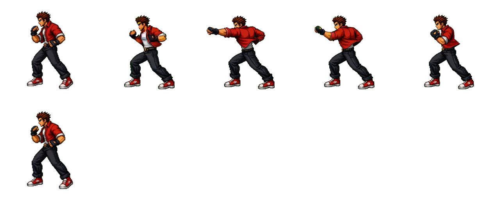

← **[Хичээл 8 руу буцах](../readme.md)**

# Алхам 2 — Sprite sheet угсрах · ~25 мин

> **Зорилго:** Тарсан PNG-үүдээ анимаци тус бүрээр **нэг sprite sheet** болгож, бүгдийг ижил хэмжээтэй болгох.

---

<details open>
<summary><b>2.1 — Sprite sheet гэж юу вэ</b> · ~5 мин</summary>


**Sprite sheet** = олон frame-ийг нэг зурагт эгнүүлж багцалсан файл.

**Жинхэнэ жишээ — багшийн багц дахь `red-brawler/light-punch.png`:**



Энэ файл **1280 × 512 px**. Дотроо **256×256** нүдтэй, **5 багана**, 2 мөр. Эхний 6 нүдэнд frame байна, үлдсэн 4 нь хоосон. Frame-үүд **зүүнээс баруун**, дараа нь **доод мөрөнд** үргэлжилнэ.

Хичээл 7-д frame бүр тусдаа PNG байсан — ажилладаг, гэхдээ:

| Тусдаа PNG | Sprite sheet |
| --- | --- |
| 8 анимаци × 6 frame = **48 файл, 48 хүсэлт** | **8 файл** |
| Эхний тоглуулалтад frame ачаалагдаж амжаагүй → анивчина | Бүх frame нэг дор ачаалагдана |
| Хэмжээ жигд эсэхийг хэн ч шалгахгүй | Нүд бүр **албан ёсоор ижил** |

### Дүрмүүд

| Дүрэм | Тоо |
| --- | --- |
| Нүдний хэмжээ | **256 × 256 px** (дөрвөлжин) |
| Багана (`cols`) | Багшийн багцад **5**. Өөрийн sheet-д **нэг мөр** — багана = frame-ийн тоо |
| Sheet-ийн өргөн | 256 × багана |
| Sheet-ийн өндөр | 256 × мөр |
| Зай (padding / spacing) | **0** — нүд хооронд зай ҮГҮЙ |
| Формат | **PNG**, дэвсгэр transparent |
| Дүрийн хөл | Нүдний **доод захад** — бүх frame-д ижил өндөрт |

> **Яагаад 0 padding вэ?** Код нүдийг ердөө `дугаар × 256` гэж тооцно. Зай орвол тэр тоо бүгд буруу болно.

> **Өөрийн sheet-ээ нэг мөрөөр хий.** Угсрахад амархан, тоолоход амархан. Код нь хоёуланг нь ойлгоно — `cols` тоог л зөв бичихэд хангалттай.

</details>

---

<details>
<summary><b>2.2 — Бэлтгэл: дэвсгэр цэвэрлэх + хэмжээ жигдлэх</b> · ~8 мин</summary>

Угсрахаас **өмнө** бүх зураг ① дэвсгэргүй ② яг **256×256** байх ёстой.

### а) Ногоон дэвсгэрийг арилгах

```
АЛХАМ 1  remove.bg руу ор (бүртгэл хэрэггүй)
АЛХАМ 2  "Upload Image" дар → нэг зургаа сонго
АЛХАМ 3  3–5 секунд хүлээ
АЛХАМ 4  энгийн "Download" дар (HD нь төлбөртэй)
АЛХАМ 5  бүх frame дээрээ давт
```

| Хэрэгсэл | Хаяг | Онцлог |
| --- | --- | --- |
| **remove.bg** | [remove.bg](https://www.remove.bg) | Бүртгэлгүй, хамгийн хурдан |
| **Photoroom** | [photoroom.com/tools/background-remover](https://www.photoroom.com/tools/background-remover) | remove.bg лимитдвэл |
| **Erase.bg** | [erase.bg](https://www.erase.bg) | Гуравдахь нөөц |
| **Photopea** | [photopea.com](https://www.photopea.com) | Гараар — Magic Wand → ногоон дээр дар → Delete |

### б) Бүгдийг 256×256 болгох

Хичээл 7-д зургаа **4:3** хэлбэрээр гаргасан бол өндөр нь дутуу байна (256×192). Дөрвөлжин нүдэнд оруулахдаа **сунгахгүй** — доор нь **зай нэмнэ**:

```
АЛХАМ 1  iloveimg.com/resize-image → бүх зургаа зэрэг сонго
АЛХАМ 2  "BY PIXELS" → Width = 256 (өндөр нь өөрөө 192 болно)
         → "Resize IMAGES" → ZIP татаж задал
АЛХАМ 3  photopea.com → зургаа нээ
АЛХАМ 4  Image → Canvas Size → Width 256, Height 256
         Anchor (сумтай дөрвөлжин) дээр ДООД ДУНД нүдийг дар
         → OK  (дүрийн хөл доод захад үлдэнэ)
АЛХАМ 5  File → Export as → PNG
```

**Хичээл 8-д шинээр гаргасан зургуудаа** эхнээс нь **1:1 дөрвөлжин** хэлбэрээр гаргасан бол (Алхам 1.1) энэ алхам хэрэггүй — шууд 256×256 болгож жижигрүүл.

| Хэрэгсэл | Хаяг | Онцлог |
| --- | --- | --- |
| **iLoveIMG** | [iloveimg.com/resize-image](https://www.iloveimg.com/resize-image) | Олон файл зэрэг, PNG-ийн transparent хадгална |
| **BIRME** | [birme.net](https://www.birme.net) | Олон файл + яг таг тайралт |
| **Photopea** | [photopea.com](https://www.photopea.com) | Canvas Size — дүрийг хөдөлгөхгүйгээр зай нэмэх цорын ганц арга |

> **Заавал шалга:** зураг бүрийн Properties (Windows) / Get Info (Mac) дээр **256 × 256** гэж бичсэн байх ёстой.

> **Яагаад ДООД ДУНД anchor вэ?** Тоглоом дүрийг **хөлөөр нь** газарт тавьдаг. Багшийн багцын метадатад ч `anchor: { x: 0.5, y: 0.996 }` гэж бичсэн байгаа — энэ нь "хэвтээгээр дунд, босоогоор бараг доод зах" гэсэн үг.

</details>

---

<details>
<summary><b>2.3 — Sheet угсрах (2 зам)</b> · ~9 мин · гол дасгал</summary>

Анимаци **тус бүрээр** нэг sheet. Frame-үүдийг **дараалалд нь** оруулна.

### ЗАМ А — онлайн генератор (хурдан)

```
АЛХАМ 1  codeshack.io/images-sprite-sheet-generator/ руу ор
АЛХАМ 2  "Choose Files" → НЭГ анимацийн frame-үүдийг сонго
         (жишээ: p1-kick-1.png, p1-kick-2.png, p1-kick-3.png)
АЛХАМ 3  Alignment = Horizontal, Padding = 0, Format = PNG
АЛХАМ 4  "Generate" → доор sheet харагдана
АЛХАМ 5  Download → p1-kick.png гэж нэрлэ
```

> Товчны нэр өөрчлөгдсөн байвал **утгатай** товчийг хай: файл сонгох · хэвтээ (horizontal) · padding 0 · татах.

### ЗАМ Б — Photopea дээр гараар (найдвартай)

```
АЛХАМ 1  photopea.com → File → New
АЛХАМ 2  Width = 256 × frame тоо (3 frame бол 768), Height = 256
         Background = Transparent  →  Create
АЛХАМ 3  File → Open & Place → frame 1
АЛХАМ 4  дээд талын X талбарт X = 0 гэж бич
АЛХАМ 5  frame 2 → X = 256 · frame 3 → X = 512 · frame 4 → X = 768
АЛХАМ 6  File → Export as → PNG
```

> Зураг оруулахад гарах сонголтын хүрээний **хэмжээг БҮҮ өөрчил** — 256×256 хэвээр байх ёстой. Зөвхөн X байрлалыг тааруул.

### Гарах ёстой файлууд

```
p1-idle.png     512 × 256   (2 frame, cols 2)
p1-walk.png     512 × 256   (2 frame, cols 2)
p1-punch.png    256 × 256   (1 frame, cols 1)
p1-kick.png     768 × 256   (3 frame, cols 3)
p1-block.png    512 × 256   (2 frame, cols 2)
p1-hit.png      256 × 256   (1 frame, cols 1)
p1-crouch.png   512 × 256   (амжвал)
p1-jump.png     768 × 256   (амжвал)
```

### Шалгах — 30 секундын тест

```
768 ÷ 3 = 256  ✅
770 ÷ 3 = 256.67  ❌  →  padding орсон, дахин угсар
```

</details>

---

<details>
<summary><b>2.4 — Кодгүй турших</b> · ~2 мин</summary>

```
АЛХАМ 1  ezgif.com/sprite-cutter руу ор
АЛХАМ 2  sheet-ээ upload
АЛХАМ 3  Columns = багана тоо, Rows = мөр тоо  →  "Cut"
АЛХАМ 4  Гарсан хэсэг бүр цэвэр НЭГ байрлал харуулж байна уу?
```

Хагас дүр, хоёр дүр орсон нүд гарвал угсралт буруу.

> **Хөдөлж байгааг харах:** [ezgif.com/maker](https://ezgif.com/maker) дээр тусдаа frame-үүдээ оруулаад delay = 8 (=80ms) тавьж GIF хий. Багшийн багц дахь `*-preview.gif` файлууд яг ингэж хийгдсэн.

</details>

---

<details>
<summary><b>2.5 — Бэлэн sprite sheet хаанаас авах вэ</b> · ~2 мин</summary>

**Хамгийн ойрхон нь — багшийн багц:** [`w3/assets/`](../../assets/readme.md). 3 бүрэн дүр (red-brawler, green-boxer, jiujitsu-fighter), 2 арена, UI. Бүгд 256×256, 5 багана.

Гаднаас авах бол:

| Сайт | Юу байдаг | Лиценз |
| --- | --- | --- |
| [itch.io/game-assets/free/tag-sprites](https://itch.io/game-assets/free/tag-sprites) | Хамгийн том сан — тулаанчид, дэвсгэр | Ихэвчлэн CC0/CC-BY — тус бүрд нь бичсэн |
| [opengameart.org](https://opengameart.org) | Хуучин, өргөн сан | CC0 / CC-BY / GPL — заавал шалга |
| [craftpix.net/freebies](https://craftpix.net/freebies/) | Цэвэрхэн 2D тулаанчны багцууд | Үнэгүй хэсэгт нь өөрийн лицензтэй |
| [kenney.nl/assets](https://kenney.nl/assets) | UI, эффект, дүрс | CC0 — бүрэн чөлөөтэй |

**Ашиглах ёсгүй:** The Spriters Resource гэх мэт тоглоомоос "сугалсан" зургийн сангууд — студийн өмч. Зөвхөн стиль харах зорилгоор нээ.

> **CC-BY** бол зохиогчийг нь бичих ёстой гэсэн үг.

</details>

---

### Алхам 2-ийн checkpoint

- [ ] Бүх frame дэвсгэргүй PNG
- [ ] Бүх frame яг **256×256**, дүрийн хөл доод захад
- [ ] Анимаци тус бүрд нэг sheet, padding 0
- [ ] Sheet-ийн өргөн ÷ багана = **яг 256**
- [ ] ezgif sprite-cutter дээр нүд бүр цэвэр гарсан

---

**Дараагийн алхам:** <a href="3-sprites-json.md" target="_blank">Алхам 3 — sprites.json v2</a>
