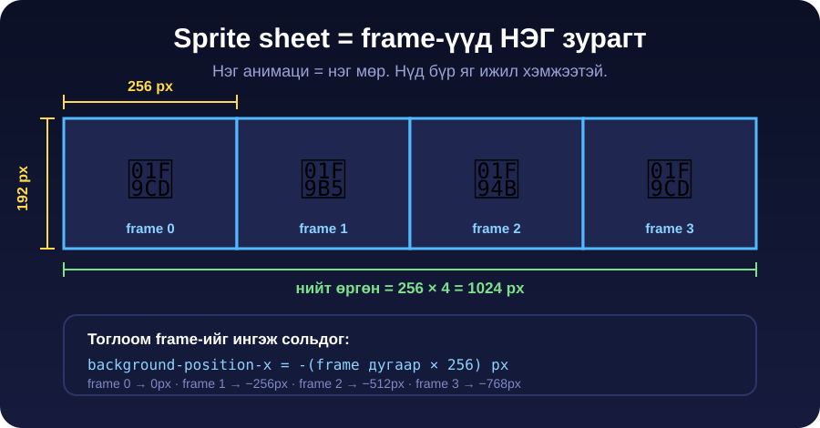

← **[Хичээл 8 руу буцах](../readme.md)**

# Алхам 2 — Sprite sheet угсрах · ~25 мин

> **Зорилго:** Тарсан PNG-үүдээ анимаци тус бүрээр **нэг мөр sprite sheet** болгож, бүгдийг ижил хэмжээтэй болгох.

---

<details open>
<summary><b>2.1 — Sprite sheet гэж юу вэ</b> · ~4 мин</summary>



**Sprite sheet** = олон frame-ийг нэг зурагт эгнүүлж багцалсан файл.

Хичээл 7-д frame бүр тусдаа PNG байсан — ``-ээ сольж анимаци хийсэн. Ажилладаг, гэхдээ:

| Тусдаа PNG | Sprite sheet |
| --- | --- |
| 8 анимаци × 3 frame = **24 файл, 24 хүсэлт** | **8 файл** |
| Эхний тоглуулалтад frame ачаалагдаж амжаагүй → анивчина | Бүх frame нэг дор ачаалагдана → анивчихгүй |
| Хэмжээ жигд эсэхийг хэн ч шалгахгүй | Нүд бүр **албан ёсоор ижил** |

**Бидний дүрэм — 1 анимаци = 1 файл = 1 мөр:**

```
p1-kick.png     →  [ frame0 ][ frame1 ][ frame2 ]        768 × 192
p1-block.png    →  [ frame0 ][ frame1 ]                  512 × 192
p1-idle.png     →  [ frame0 ][ frame1 ]                  512 × 192
```

| Дүрэм | Тоо |
| --- | --- |
| Нүдний хэмжээ | **256 × 192 px** (4:3) |
| Мөрийн тоо | **1** — бүх frame нэг эгнээнд |
| Sheet-ийн өргөн | 256 × (frame-ийн тоо) |
| Sheet-ийн өндөр | **192 px** үргэлж |
| Хамгийн их frame | **8** (өргөн 2048px-ээс хэтрэхгүй) |
| Формат | **PNG**, дэвсгэр нь transparent |
| Зай (padding) | **0** — нүд хооронд зай ҮГҮЙ |

> **Яагаад 0 padding вэ?** Код нүдийг ердөө `frame дугаар × 256` гэж тооцно. Зай орвол тэр тоо бүгд буруу болно.

</details>

---

<details>
<summary><b>2.2 — Бэлтгэл: дэвсгэр цэвэрлэх + хэмжээ жигдлэх</b> · ~8 мин</summary>

Угсрахаас **өмнө** бүх зураг ① дэвсгэргүй ② яг **256×192** байх ёстой.

### а) Ногоон дэвсгэрийг арилгах

```
АЛХАМ 1  remove.bg руу ор (бүртгэл хэрэггүй)
АЛХАМ 2  "Upload Image" дар → нэг зургаа сонго
АЛХАМ 3  3–5 секунд хүлээ
АЛХАМ 4  энгийн "Download" дар (HD нь төлбөртэй)
АЛХАМ 5  бүх frame дээрээ давт
```

| Хэрэгсэл | Хаяг | Онцлог |
| --- | --- | --- |
| **remove.bg** | [remove.bg](https://www.remove.bg) | Бүртгэлгүй, хамгийн хурдан |
| **Photoroom** | [photoroom.com/tools/background-remover](https://www.photoroom.com/tools/background-remover) | remove.bg лимитдвэл |
| **Erase.bg** | [erase.bg](https://www.erase.bg) | Гуравдахь нөөц |
| **Photopea** | [photopea.com](https://www.photopea.com) | Гараар — Magic Wand → ногоон дээр дар → Delete |

> **Ногооны туяа үлдвэл:** Photopea дээр Magic Wand-ийн Tolerance-ыг 40 болгож ногоон захыг сонгоод Delete. Эсвэл орхи — тоглоомд дүр жижиг харагдана.

### б) Бүгдийг 256×192 болгох

```
АЛХАМ 1  iloveimg.com/resize-image руу ор
АЛХАМ 2  "Select images" → цэвэрлэсэн зургуудаа БҮГДИЙГ зэрэг сонго
АЛХАМ 3  баруун талд "Resize options" → "BY PIXELS" таб сонго
АЛХАМ 4  Width = 256, Height = 192
         "Maintain aspect ratio" асаалттай байг (эх зураг 4:3 учир таарна)
АЛХАМ 5  "Resize IMAGES" дар → ZIP татагдана → задал
```

| Хэрэгсэл | Хаяг | Онцлог |
| --- | --- | --- |
| **iLoveIMG** | [iloveimg.com/resize-image](https://www.iloveimg.com/resize-image) | Олон файл зэрэг, PNG-ийн transparent хадгална |
| **BIRME** | [birme.net](https://www.birme.net) | Олон файл + яг таг тайралт, transparent сонголттой |
| **Photopea** | [photopea.com](https://www.photopea.com) | Image → Image Size → 256×192 |

> **Заавал шалга:** зураг бүрийн Properties (Windows) / Get Info (Mac) дээр **256 × 192** гэж бичсэн байх ёстой. Нэг ч зураг өөр бол анимаци үсэрнэ.

</details>

---

<details>
<summary><b>2.3 — Sheet угсрах (2 зам)</b> · ~9 мин · гол дасгал</summary>

Анимаци **тус бүрээр** нэг sheet. Frame-үүдийг **дараалалд нь** оруулах ёстой (1, 2, 3).

### ЗАМ А — онлайн генератор (хурдан)

```
АЛХАМ 1  codeshack.io/images-sprite-sheet-generator/ руу ор
АЛХАМ 2  "Choose Files" → НЭГ анимацийн frame-үүдийг сонго
         (жишээ: p1-kick-1.png, p1-kick-2.png, p1-kick-3.png)
АЛХАМ 3  Alignment = Horizontal, Padding = 0, Format = PNG
АЛХАМ 4  "Generate" → доор sheet харагдана
АЛХАМ 5  sheet-ийг Download → p1-kick.png гэж нэрлэ
АЛХАМ 6  дараагийн анимаци дээр давт
```

> Товчны нэр өөрчлөгдсөн байвал **утгатай** товчийг хай: файл сонгох · хэвтээ (horizontal) · padding 0 · татах.

### ЗАМ Б — Photopea дээр гараар (найдвартай, бүрэн хяналттай)

```
АЛХАМ 1  photopea.com → File → New
АЛХАМ 2  Width = 256 × frame-ийн тоо (3 frame бол 768), Height = 192
         Background = Transparent  →  Create
АЛХАМ 3  File → Open & Place → frame 1-ээ оруул
АЛХАМ 4  зүүн доод "Window → Info" эсвэл дээд талын X талбарт
         X = 0 гэж бич (frame 1)
АЛХАМ 5  frame 2 → X = 256 · frame 3 → X = 512 · frame 4 → X = 768
АЛХАМ 6  File → Export as → PNG → p1-kick.png
```

> **Photopea-д зураг оруулахад автоматаар сонголтын хүрээ гарна.** Хэмжээг нь БҮҮ өөрчил — 256×192 хэвээр байх ёстой. Зөвхөн X байрлалыг тааруул.

### Гарах ёстой файлууд

```
p1-idle.png     512 × 192   (2 frame)
p1-walk.png     512 × 192   (2 frame — хийсэн бол)
p1-punch.png    256 × 192   (1 frame — Хичээл 7-ынхаа хэвээр)
p1-kick.png     768 × 192   (3 frame)
p1-block.png    512 × 192   (2 frame)
p1-hit.png      256 × 192   (1 frame)
p1-crouch.png   512 × 192   (амжвал)
p1-jump.png     768 × 192   (амжвал)
arena-1.png     (өөрчлөгдөөгүй)
```

### Шалгах — 30 секундын тест

Sheet бүрийг нээгээд өргөнийг нь frame-ийн тоонд хуваа:

```
768 ÷ 3 = 256  ✅
770 ÷ 3 = 256.67  ❌  →  padding орсон, дахин угсар
```

</details>

---

<details>
<summary><b>2.4 — Кодгүй турших</b> · ~2 мин</summary>

Sheet зөв эсэхийг код бичихээс өмнө шалгаж болно:

```
АЛХАМ 1  ezgif.com/sprite-cutter руу ор
АЛХАМ 2  sheet-ээ upload
АЛХАМ 3  Columns = frame-ийн тоо, Rows = 1  →  "Cut"
АЛХАМ 4  Гарсан хэсгүүд яг frame-үүд байна уу?
```

Хэсэг бүр цэвэр нэг байрлал харуулж байвал sheet зөв. Хагас дүр, хоёр дүр орсон нүд гарвал угсралт буруу.

> **Хөдөлж байгааг харах:** [ezgif.com/maker](https://ezgif.com/maker) дээр тусдаа frame-үүдээ (sheet биш) оруулаад delay = 8 (=80ms) тавьж GIF хий.

</details>

---

<details>
<summary><b>2.5 — Бэлэн sprite sheet хаанаас авах вэ</b> · ~2 мин</summary>

Цаг хүрэхгүй бол, эсвэл P2-т хурдан дүр хэрэгтэй бол:

| Сайт | Юу байдаг | Лиценз |
| --- | --- | --- |
| [itch.io/game-assets/free/tag-sprites](https://itch.io/game-assets/free/tag-sprites) | Хамгийн том сан — тулаанчид, дэвсгэр | Ихэвчлэн CC0/CC-BY — **тус бүрд нь бичсэн байдаг** |
| [opengameart.org](https://opengameart.org) | Хуучин, өргөн сан | CC0 / CC-BY / GPL — заавал шалга |
| [craftpix.net/freebies](https://craftpix.net/freebies/) | Цэвэрхэн 2D тулаанчны багцууд | Үнэгүй хэсэгт нь өөрийн лицензтэй |
| [kenney.nl/assets](https://kenney.nl/assets) | UI, эффект, дүрс | CC0 — бүрэн чөлөөтэй |

**Ашиглах ёсгүй:** The Spriters Resource гэх мэт тоглоомоос "сугалсан" зургийн сангууд. Тэдгээр нь студийн өмч — **зөвхөн стиль харах** зорилгоор нээ, тоглоомдоо тавихгүй, publish хийхгүй.

> **CC-BY** бол зохиогчийг нь бичих ёстой гэсэн үг. Тоглоомынхоо доод талд _"[Дүрийн нэр] — [зохиогч], CC-BY"_ гэж нэм.

</details>

---

### Алхам 2-ийн checkpoint

- [ ] Бүх frame дэвсгэргүй PNG
- [ ] Бүх frame яг **256×192**
- [ ] Анимаци тус бүрд **нэг** sheet, нэг мөр, padding 0
- [ ] Sheet бүрийн өргөн ÷ frame тоо = **яг 256**
- [ ] ezgif sprite-cutter дээр нүд бүр цэвэр гарсан

---

**Дараагийн алхам:** <a href="3-sprites-json.md" target="_blank">Алхам 3 — sprites.json v2</a>
