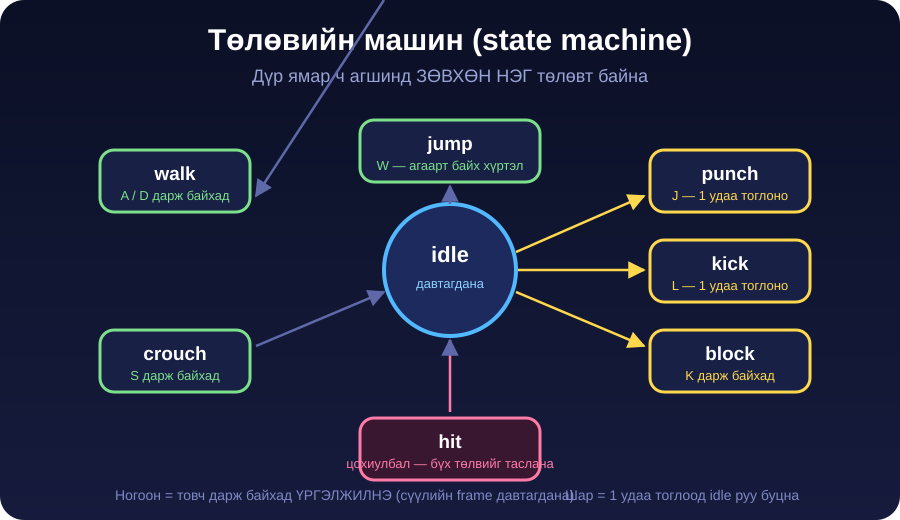
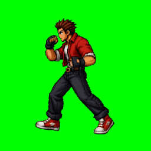
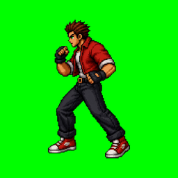

← **[Хичээл 8 руу буцах](../readme.md)**

# Алхам 4 — Төлөвийн машин · ~30 мин

> **Зорилго:** Хичээл 7-ын тоглоомоо sprite sheet уншдаг, 8 төлөвтэй болгож шинэчлэх.

---

<details open>
<summary><b>4.1 — Төлөв гэж юу вэ</b> · ~5 мин</summary>



**Дүр ямар ч агшинд ЗӨВХӨН НЭГ төлөвт байна.** Энэ бол тулааны тоглоомын гол дүрэм — зөрчигдвөл дүр цохиж, суугаад, үсэрч байгаа зэрэг хачин зүйл гарна.

| Төлөв | Товч | Хэрхэн дуусах | Анимаци |
| --- | --- | --- | --- |
| `idle` | — | Хэзээ ч дуусахгүй | Давтагдана |
| `walk` | A / D | Товч тавихад | Давтагдана |
| `crouch` | S | Товч тавихад | `hold` frame дээр зогсоно |
| `jump` | W | Газарт буухад | `hold` frame дээр зогсоно |
| `block` | K | Товч тавихад | `hold` frame дээр зогсоно |
| `punch` | J | Анимаци дуусахад | 1 удаа |
| `kick` | L | Анимаци дуусахад | 1 удаа |
| `hit` | (цохиулахад) | 250ms-ын дараа | 1 удаа |

**Төлөв бүр биеэрээ ямар харагдах вэ** — багшийн багцын жишээ:

| walk | crouch | jump | block | hit |
| --- | --- | --- | --- | --- |
|  |  |  |  |  |

### Дараалал (priority) — хэн хэнийг таслах вэ

```
hit  >  punch / kick  >  block  >  jump  >  crouch  >  walk  >  idle
```

- Цохиулбал юу ч хийж байсан **hit** төлөвт орно.
- `punch`, `kick` тоглож дуустал шинэ товч ажиллахгүй (arcade-ийн "commitment" дүрэм).
- `block` дарж байхад цохих боломжгүй — эхлээд K-г тавина.

> **Яагаад энэ дүрэм чухал вэ?** Тасалдал байхгүй бол тоглогч J-г 20 удаа дарж дайснаа хөдлөхийг зөвшөөрөхгүй. Anim дуустал хүлээх нь тулааныг **тактик** болгодог.

</details>

---

<details>
<summary><b>4.2 — Гол промпт</b> · ~14 мин · гол дасгал</summary>

Хичээл 7-д тоглоомоо бүтээсэн **тэр л AI Studio app-даа** ор (шинэ app биш). Доорхийг хуулж, доод талд `sprites.json`-оо **бүтнээр** буулгаад илгээ.

```text
Тоглоомоо шинэчилье. Одоо sprite-ууд нь тусдаа зураг биш, SPRITE SHEET
болсон бөгөөд дүр 8 төлөвтэй болно.

SPRITE SHEET УНШИХ:
- sprites.json дахь "cell" нь нэг frame-ийн хэмжээ: 256 × 256.
- Sheet бүр "cols" ширхэг баганатай тор. Frame-үүд зүүнээс баруун
  дүүрч, дараа нь дараагийн мөрөнд үргэлжилнэ. Зай (padding) байхгүй.
- N дугаартай frame-ийг харуулах (N нь 0-оос эхэлнэ):
    багана = N % cols
    мөр    = Math.floor(N / cols)
    background-position = -(багана × 256)px  -(мөр × 256)px
- Анимаци бүрийн frames, cols, fps, loop, hold-ыг sprites.json-оос УНШ.
  Эдгээр тоог кодод бүү бич.
- Дүрийн "facing" нь "left" бол зургийг scaleX(-1)-ээр толиндож
  баруун тийш харуул. "right" бол шууд хэрэглэ.
- image-rendering: pixelated хэвээр байг.

ТӨЛӨВИЙН МАШИН (P1):
- Дүр ямар ч үед ЗӨВХӨН НЭГ төлөвт байна: idle, walk, crouch, jump,
  block, punch, kick, hit.
- Дараалал: hit > punch/kick > block > jump > crouch > walk > idle.
- punch, kick анимаци дуустал өөр товч хүлээж авахгүй.
- block, crouch, jump дээр анимаци сүүлийн frame хүртэл тоглоод
  "hold" гэсэн дугаартай frame дээр зогсоно (эсвэл түүнийг давтана),
  товчийг тавих / газарт буух хүртэл.
- Ямар ч төлөвт байхад цохиулбал шууд hit төлөвт орж, 250ms-ын дараа
  idle руу буцна.

ТОВЧНУУД (P1):
- A = зүүн, D = баруун (арены хилээс гарахгүй)
- S = crouch (дарж байх хугацаанд)
- W = jump — код нь дүрийг дээш өргөж, буулгана (нум хэлбэрээр).
  Анимацийн зураг дотор дүр дээшилдэггүй, зөвхөн код өргөнө.
- J = punch, L = kick
- K = block (дарж байх хугацаанд)
- Агаарт байхад J эсвэл L дарвал punch/kick анимаци тоглоно, гэхдээ
  дүр агаарт хэвээр байна.
- Товч дарахад хуудас доош гүйхгүй байг.

ЦОХИЛТ (одоохондоо энгийн):
- punch → 8 damage, kick → 12 damage, зай 130px-ээс бага бол хүрнэ.
- P2 block төлөвт байвал damage-ийн ЗӨВХӨН 20% нь орно, knockback байхгүй.
- P2 crouch төлөвт байвал punch дээгүүр нь өнгөрнө (хүрэхгүй), kick хүрнэ.
- Цохилт хүрэхэд: P2 hit төлөвт орно, бага зэрэг хойш түлхэгдэнэ,
  дэлгэц 100ms маш бага чичирнэ.
- P2-ийн health 0 болбол дунд "K.O.!" гарч, товчнууд түгжигдэнэ.

ТОХИРУУЛГЫН ФАЙЛ (ЗААВАЛ):
- Тоглоомын мэдрэмжийг тохируулдаг БҮХ тоог "tuning.js" гэсэн тусдаа
  жижиг файлд гарга: алхах хурд, үсрэлтийн өндөр, үсрэлтийн хугацаа,
  таталцал, punch/kick damage, цохилтын зай, knockback, hit төлөвт
  байх хугацаа, block-ийн damage хувь, screen shake хүч.
- Файл нь мөр тус бүрдээ монгол тайлбартай байг. Би тоонуудыг
  гараар засаж тохируулна.
- Хичээл 7-д гаргасан positions.js файлыг хэвээр үлдээ.

ФАЙЛ: index.html, style.css, script.js, tuning.js, positions.js,
sprites.json гэж САЛГА.

sprites.json-ий агуулга:
[ЭНД sprites.json-ОО БУУЛГА]
```

> **Промпт яагаад ийм тодорхой вэ?** "Sprite sheet ашигла" гэж бичвэл AI хэдэн ч янзаар ойлгоно. `-(N × 256)` гэж бичвэл нэг л утга гарна. Тодорхой тоо = 1 удаад ажиллах магадлал өндөр.

</details>

---

<details>
<summary><b>4.3 — tuning.js-ийг өөрөө засах</b> · ~6 мин</summary>

Хичээл 7-ын хамгийн үнэ цэнэтэй заль: **AI-тай тэмцэхгүй, тоог өөрөө засна.**

`tuning.js` иймэрхүү харагдана:

```js
export const TUNE = {
  walkSpeed: 4,       // алхах хурд (px / frame)
  jumpHeight: 120,    // үсрэлтийн өндөр (px)
  jumpTime: 600,      // үсрэлт хэдэн ms үргэлжлэх
  punchDamage: 8,
  kickDamage: 12,
  hitRange: 130,      // цохилт хүрэх зай (px)
  knockback: 18,      // цохиулсан дүр хэдэн px хойшлох
  hitStun: 250,       // hit төлөвт хэдэн ms байх
  blockReduce: 0.2,   // block үед орох damage-ийн хувь
  shakePower: 4,      // дэлгэц чичрэх хүч
};
```

| Мэдрэмж | Ямар тоог өөрчлөх |
| --- | --- |
| Тулаан хэт хурдан / удаан | `walkSpeed` 3–6 |
| Үсрэлт хэт бага / өндөр | `jumpHeight` 90–160 |
| Үсрэлт "сарны хүндийн хүчтэй" | `jumpTime` багасга (600 → 450) |
| Тулаан хэт хурдан дуусна | `punchDamage`, `kickDamage` багасга |
| Цохилт хол зайнаас хүрнэ | `hitRange` 130 → 100 |
| Цохилт "жингүй" | `knockback`, `shakePower` ихэсгэ |
| Block хэтэрхий хүчтэй | `blockReduce` 0.2 → 0.4 |

> **Дүрэм:** нэг удаад **нэг тоо**, дараа нь тогло. 3 тоог зэрэг өөрчилвөл алийг нь болсныг мэдэхгүй.

</details>

---

<details>
<summary><b>4.4 — CHECKPOINT · цаашаа явахгүй</b> · ~5 мин</summary>

8 зүйл бүгд ажиллатал шинэ зүйл нэмэхгүй:

```
[ ] 1. Sprite sheet-ээс анимаци тоглож байна (хагас дүр харагдахгүй)
[ ] 2. A / D — явна, walk анимаци хөдөлнө
[ ] 3. J — punch, дуусаад idle руу буцна
[ ] 4. L — kick, 3 frame бүгд харагдана
[ ] 5. K дарж БАЙХАД хамгаалалтын байрлалд зогсоно, тавихад гарна
[ ] 6. Цохиход P2-ийн health буурна, block үед бага буурна
[ ] 7. W — үсэрч, буугаад idle руу буцна (crouch/jump хийсэн бол)
[ ] 8. Дүр frame солиход хажуу тийш үсрэхгүй
```

<details>
<summary>Гацвал — 6 түгээмэл асуудал</summary>

| Асуудал | Шийдэл |
| --- | --- |
| **Хагас дүр / хоёр дүр нэг нүдэнд** | Sheet-ийн нүд 256×256 биш, эсвэл `cols` буруу. Алхам 2.2-т буц. |
| **Frame-үүд дараалалгүй үсэрнэ** | `cols` буруу — sheet-ийн өргөнийг 256-д хуваасан тоо байх ёстой. |
| **Анимаци сүүлийн frame дээр хоосон гарна** | JSON дахь `frames` тоо sheet-д байгаагаас их байна. |
| **Дүр буруу тийш харна** | JSON-ий `facing` талбарыг "left" ↔ "right" болгож сольж үз. |
| **Block тавьсны дараа ч хамгаалалтад үлдэнэ** | _"K товчийг тавихад block төлвөөс шууд idle руу гар."_ |
| **punch дарахад анимаци тасарч дахин эхэлнэ** | _"punch анимаци дуустал шинэ товч хүлээж авахгүй болго."_ |
| **Үсрэхэд дүр дэлгэцээс гарна** | `tuning.js`-ийн `jumpHeight`-ыг өөрөө багасга. |
| **Дүр агаарт хөвнө / хэт том** | `positions.js`-ийн `groundLine`, `fighterHeight` — өөрөө зас (AI-д хэлэхгүй). |

**Дүрэм:** нэг мессежээр **нэг** асуудал. 3-ыг зэрэг гуйвал ажиллаж байсан зүйл эвдэрнэ.

</details>

</details>

---

**Дараагийн алхам:** <a href="5-hitbox.md" target="_blank">Алхам 5 — Хитбокс</a>
