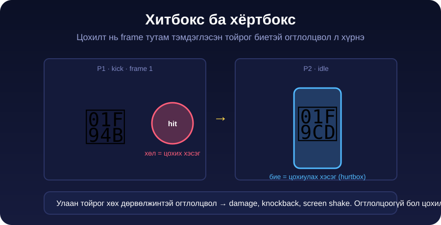

← **[Хичээл 8 руу буцах](../readme.md)**

# Алхам 5 — Хитбокс: цохилт хаана хүрэх вэ · ~25 мин

> **Зорилго:** "Зай 130px-ээс бага бол хүрнэ" гэсэн барагцаа дүрмийг **frame тутмын жинхэнэ цохилтын бүс**-ээр солих.

---

<details open>
<summary><b>5.1 — Асуудал</b> · ~4 мин</summary>



Алхам 4-т цохилт ингэж ажилладаг: **хоёр дүрийн хоорондын зай 130px-ээс бага бол хүрнэ**. Энэ нь буруу:

- Цохилт **эхлэх** агшинд ч хүрнэ — нударга хараахан хөдлөөгүй байхад
- Хөл сунгасан эсэх нь хамаагүй — kick, punch ижил хол хүрнэ
- Дүр сууж мултарсан ч цохилт хүрнэ

**Жинхэнэ тулааны тоглоом** 2 бүсийг харьцуулдаг:

| Нэр | Юу | Хэзээ өөрчлөгдөх |
| --- | --- | --- |
| **Хитбокс** | Цохих хэсэг — нударга, хөл | Frame бүрт өөр. Ихэнх frame-д огт **байхгүй** |
| **Хёртбокс** | Цохиулах хэсэг — бие | Бараг тогтмол (сууход намхардаг) |

Хоёр нь огтлолцвол л цохилт бүртгэгдэнэ.

> **Гол ойлголт:** kick анимацийн 3 frame-ээс **зөвхөн frame 1** цохино. Frame 0 бол бэлдэлт, frame 2 бол буцалт. Иймээс тоглогч цохилтоо **зөв агшинд** гаргаж сурна — тулаан ур чадвар шаардана.

</details>

---

<details>
<summary><b>5.2 — Хитбокс засварлагч хуудсыг бүтээх</b> · ~9 мин</summary>

Frame бүрт тойргийн байрлалыг гараар тоолж бичих боломжгүй. Тиймээс **өөртөө хэрэгсэл бүтээнэ** — тоглоомоо хийж байгаа AI Studio app-даа шинэ хуудас гаргуулна.

```text
Тоглоомын хажууд "hitbox.html" гэсэн ТУСДАА хуудас нэмээч. Энэ бол
тоглоом биш — надад зориулсан засварлагч хэрэгсэл.

ЮУ ХИЙХ ВЭ:
- sprites.json-ыг уншиж, дээд талд анимаци сонгох цэс гаргана
  (idle, walk, punch, kick, block, hit, crouch, jump).
- Сонгосон анимацийн frame-үүдийг НЭГ НЭГЭЭР харуулна, доор нь
  "◀ өмнөх / дараах ▶" товч ба frame дугаар (жишээ: 1 / 3).
- Frame-ийг 2 дахин томруулж (512×384) харуул, image-rendering: pixelated.

ТЭМДЭГЛЭХ:
- Зураг дээр дарахад тэр цэгт УЛААН тойрог үүснэ — энэ бол хитбокс.
- Тойргийг чирж зөөж болно. Радиусыг slider-ээр (0.03–0.25) өөрчилнө.
- damage-ийг оруулах жижиг талбар байна (анхдагч 10).
- "Устгах" товч — энэ frame-ийн хитбоксыг авна.
- Frame бүрт ЗӨВХӨН НЭГ хитбокс байна. Тэмдэглээгүй frame бол null.

ХАДГАЛАХ:
- Байрлалыг ХАРЬЦАНГУЙ тоогоор хадгал: x, y нь 0-оос 1 хүртэл
  (нүдний өргөн, өндөрт харьцуулсан), r нь нүдний өргөнд харьцуулсан.
  Ингэснээр тоглоомд ямар ч хэмжээгээр томорсон ажиллана.
- Доод талд гарах JSON-г шууд харуулна, "Copy JSON" товчтой.
- JSON-ий бүтэц яг ийм байна:

{
  "p1": {
    "kick":  [null, { "x": 0.80, "y": 0.62, "r": 0.11, "dmg": 12 }, null],
    "punch": [{ "x": 0.76, "y": 0.42, "r": 0.09, "dmg": 8 }]
  },
  "hurtbox": { "x": 0.5, "y": 0.55, "w": 0.22, "h": 0.75 },
  "hurtboxCrouch": { "x": 0.5, "y": 0.72, "w": 0.24, "h": 0.42 }
}

- Массивын урт нь тухайн анимацийн frame тоотой ЯГ тэнцүү байна.
- Хуудсыг нээхэд өмнө хуулсан JSON-оо буулгаад үргэлжлүүлж
  засах талбар бас байг.
```

> **Яагаад 0–1 харьцангуй тоо вэ?** Тоглоом дэлгэц бүр дээр өөр хэмжээтэй харагдана. Пикселээр бичвэл зөвхөн нэг дэлгэцэн дээр зөв болно. Харьцаагаар бичвэл **хаана ч** зөв.

</details>

---

<details>
<summary><b>5.3 — Хитбоксуудаа тэмдэглэх</b> · ~7 мин</summary>

hitbox.html-ээ нээгээд анимаци бүрийг үз.

**Дүрэм:**

| Анимаци | Аль frame цохих вэ | Тойрог хаана |
| --- | --- | --- |
| punch | Гар бүрэн сунгасан frame | Нударган дээр |
| kick | Хөл бүрэн сунгасан frame (голдуу frame 1) | Хөлийн ул / шилбэн дээр |
| idle, walk, block, hit, crouch, jump | **Аль нь ч биш** — бүгд `null` | — |

**Радиусын санал:** punch `0.08–0.10` · kick `0.10–0.13`. Хэт том бол цохилт "агаарт" хүрнэ, хэт жижиг бол хэзээ ч хүрэхгүй.

> **Бэлдэлт, буцалтын frame-ийг БҮҮ тэмдэглэ.** Тэмдэглэвэл дүр гараа өргөхөд л дайсан цохиулна — тулаан утгагүй болно.

Дуусаад **Copy JSON** → GitHub repo-даа `hitboxes.json` нэрээр шинэ файл болгож хадгал → [jsonlint.com](https://jsonlint.com) дээр Valid эсэхийг шалга → raw хаягийг ав.

</details>

---

<details>
<summary><b>5.4 — Тоглоомд холбох</b> · ~5 мин</summary>

Тоглоомынхоо app-д буц:

```text
hitboxes.json нэртэй шинэ файл нэмлээ — доор агуулгыг нь өгье.
Одооноос цохилтыг ЗАЙГААР БИШ, энэ файлаар шалга.

ДҮРЭМ:
- Анимаци тоглох үед ОДООГИЙН frame-ийн хитбоксыг хар.
  null бол тэр frame цохихгүй — юу ч болохгүй.
- x, y, r нь 0–1 харьцангуй тоо. Тэднийг дүрийн дэлгэц дээрх
  бодит өргөн, өндрөөр үржүүлж жинхэнэ байрлалыг ол.
- Дүр зүүн тийш харсан (scaleX(-1)) үед x-ийг толиндо: x → 1 - x.
- Хитбоксын тойрог нөгөө дүрийн hurtbox дөрвөлжинтэй огтлолцвол
  цохилт бүртгэгдэнэ. Нөгөө дүр crouch төлөвт байвал hurtboxCrouch-ыг
  хэрэглэ.
- Нэг анимацид ЗӨВХӨН НЭГ УДАА цохино — олон frame огтлолцсон ч
  давхар damage орохгүй.
- damage нь хитбоксын "dmg" талбараас ирнэ (tuning.js-ийн тоо биш).

ТУРШИХ ГОРИМ:
- H товч дарахад хитбокс (улаан тойрог), hurtbox (хөх дөрвөлжин)
  дэлгэц дээр харагдана, дахин дарахад алга болно.

hitboxes.json-ий агуулга:
[ЭНД hitboxes.json-ОО БУУЛГА]
```

### Шалгах

```
[ ] H дарахад улаан тойрог, хөх дөрвөлжин харагдана
[ ] kick-ийн эхний frame дээр тойрог БАЙХГҮЙ
[ ] Хол зогсоод цохиход юу ч болохгүй
[ ] Дэргэд зогсоод цохиход тойрог биед хүрэх агшинд л health буурна
[ ] P2 суусан үед punch дээгүүр нь өнгөрнө
[ ] H дахин дарахад бүх туслах дүрс алга болно
```

> Дуусаад **H горимыг унтраа** — publish хийхдээ улаан тойрог харагдах ёсгүй.

</details>

---

**Дараагийн алхам:** <a href="6-duu-hogjim.md" target="_blank">Алхам 6 — Дуу чимээ, хөгжим</a>
