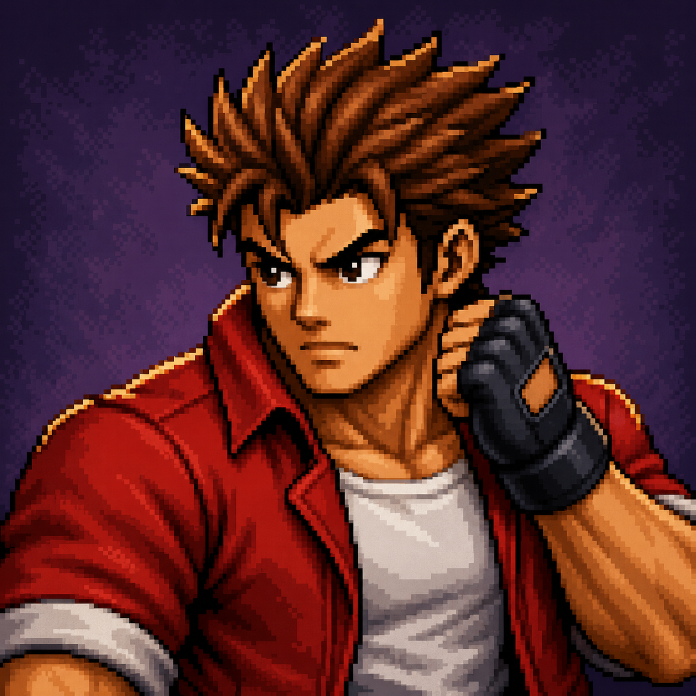
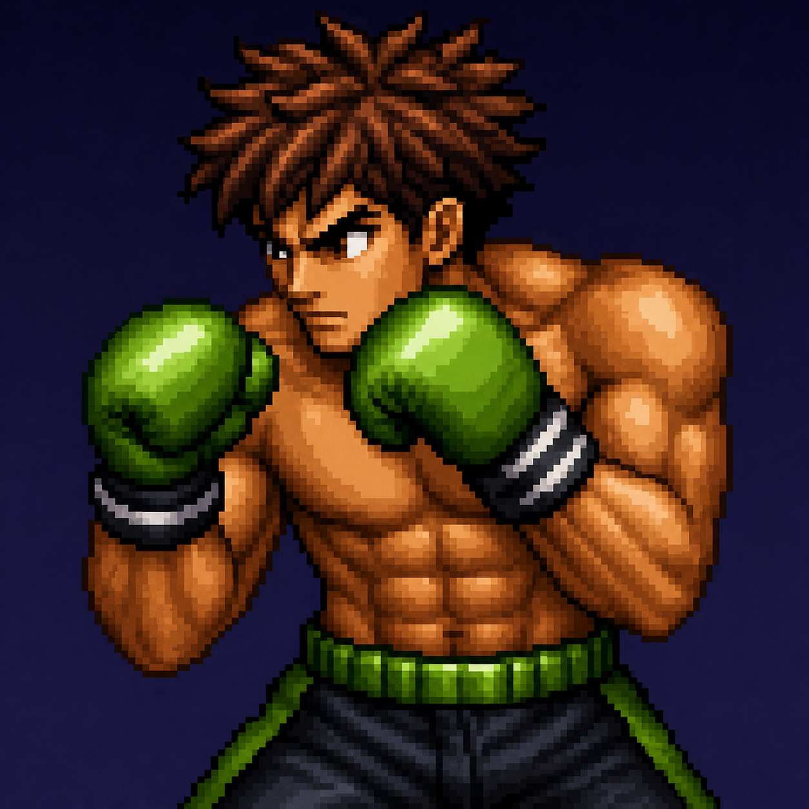
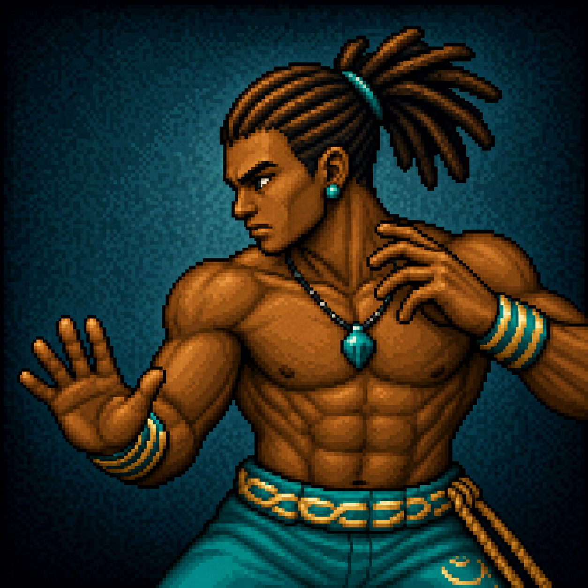

# Хичээл 8 — Тулааны тоглоом #2: Sprite sheet, төлөв, хитбокс, дуу

> **Өнөөдөр:** Хичээл 7-ын аренаг **жинхэнэ тулаан** болгоно — kick, block, суулт, үсрэлт, frame тутмын цохилтын бүс, дуу чимээ, хөгжим.

**Урьдчилсан нөхцөл:** Хичээл 7-ын тоглоом ажиллаж байх ёстой (idle · walk · punch · hit · арена). Ажиллахгүй бол Алхам 1-д багшийн нөөц багцыг ав.

**Хэрэгсэл (бүгд үнэгүй):** [Gemini](https://gemini.google.com) · [AI Studio](https://aistudio.google.com) · [remove.bg](https://www.remove.bg) · [iLoveIMG Resize](https://www.iloveimg.com/resize-image) · [Leshy SpriteSheet Tool](https://www.leshylabs.com/apps/sstool/) · [jsfxr](https://sfxr.me) · [BeepBox](https://www.beepbox.co) · GitHub · [JSONLint](https://jsonlint.com)

> Хичээл 7-д frame бүр **тусдаа PNG** байсан. Өнөөдөр тэднийг **sprite sheet** болгоно — жинхэнэ тоглоомууд ингэдэг.

**Багшийн жишээ багц:** [`w3/assets/`](../assets/readme.md) — 3 бүрэн дүр, 2 арена, UI. Бүх алхамд жишээ болгон харагдана. Өөрийн зураг бэлэн болоогүй бол эндээс ав.

|  |  |  |
| --- | --- | --- |
| red-brawler | green-boxer | jiujitsu-fighter |

---

## Өнөөдрийн 6 алхам

<b>Алхам 1 — Шинэ хөдөлгөөний frame-үүд</b> · ~28 мин

- kick (3 frame) · block (2 frame) — заавал
- crouch (2 frame) · jump (3 frame) — амжвал
- "Төлөвөөс эхлүүлэх" заль — суусан байрлалаас цохих frame гаргах арга
- Frame бүрийн **яг таг хэмжээ**: 1:1, эх зураг 1024×1024, дараа нь 256×256

### <a href="dasgal/1-shine-hodolgoon.md" target="_blank">Алхам 1-ийг нээх</a>

<b>Алхам 2 — Sprite sheet угсрах</b> · ~25 мин · гол хэсэг

- Sprite sheet-ийн анатоми: нүдний хэмжээ, мөр, frame дугаар
- Дэвсгэр цэвэрлэх → бүгдийг **256×256** болгож жигдлэх → нэг мөрөнд угсрах
- Хэрэгсэл: remove.bg / Photoroom · iLoveIMG · Leshy SpriteSheet Tool · ezgif
- Бэлэн sprite sheet татах сайтууд (гацсан хосуудад)

### <a href="dasgal/2-sprite-sheet.md" target="_blank">Алхам 2-ыг нээх</a>

<b>Алхам 3 — sprites.json v2</b> · ~15 мин

- Хуучин JSON → шинэ бүтэц: `sheet` · `frames` · `cols` · `fps` · `loop` · `hold`
- `hold` гэж юу вэ — block дарж байхад сүүлийн frame яагаад давтагдах ёстой вэ
- GitHub-д upload → raw хаяг → JSONLint

### <a href="dasgal/3-sprites-json.md" target="_blank">Алхам 3-ыг нээх</a>

<b>Алхам 4 — Төлөвийн машин</b> · ~30 мин · гол хэсэг

- Дүр нэг агшинд зөвхөн **нэг** төлөвт байна
- 8 төлөв, 7 товч, дараалал (аль төлөв алийг таслах вэ)
- AI Studio-ийн гол промпт + `tuning.js` (тоог өөрөө засах)

### <a href="dasgal/4-toluviin-mashin.md" target="_blank">Алхам 4-ийг нээх</a>

<b>Алхам 5 — Хитбокс: цохилт хаана хүрэх вэ</b> · ~25 мин

- 120px зайн шалгалтыг **frame тутмын хитбокс**-оор солино
- Хитбокс засварлагч хуудсыг AI Studio-гаар бүтээх
- `hitboxes.json` — frame тутам нэг тойрог, эсвэл `null`

### <a href="dasgal/5-hitbox.md" target="_blank">Алхам 5-ыг нээх</a>

<b>Алхам 6 — Дуу чимээ, хөгжим, publish</b> · ~20 мин

- jsfxr дээр retro цохилтын дуу үүсгэх (~2 мин)
- BeepBox / Pixabay дээр арены хөгжим
- Браузер яагаад дууг эхэнд нь хаадаг вэ — first-key заль
- Checkpoint · quest · publish

### <a href="dasgal/6-duu-hogjim.md" target="_blank">Алхам 6-ыг нээх</a>

---

<b>Гацвал — түгээмэл 6 асуудал</b>

**Анимаци гацна / хагас frame харагдана** → Sheet-ийн нүд JSON дахь `cell`, `cols`-той таарахгүй байна. Sheet-ийн өргөнийг `cols`-д хуваа: `1280 ÷ 5 = 256` ✅. Бутархай гарвал sheet буруу угсарсан (Алхам 2.3).

**Дүр frame солиход хажуу тийш үсэрнэ** → Эх зургууд өөр өөр хэмжээтэй байна. Бүгдийг **256×256** болгож жигдлэ (Алхам 2.2).

**Block дарахад анимаци дуусаад idle руу буцна** → `hold` тоо JSON-д алга. `"hold": 1` нэм (Алхам 3.2).

**Цохилт хүрэхгүй / хол байхад хүрнэ** → `hitboxes.json`-д тэр frame `null` байна, эсвэл радиус хэт жижиг/том. Засварлагч дээр дахин тэмдэглэ (Алхам 5.3).

**Дуу гарахгүй** → Браузер эхний товшилт хүртэл дуу тоглуулахыг хаадаг. Тоглоом эхлүүлэх товч эсвэл эхний товч дарахад `audio.play()` дуудагдах ёстой (Алхам 6.3).

**AI limit дуусав** → Хичээл 7-ын дүрэм: шаардлагаа 1 мессежид нэгтгэ · гарсан зургаа тэр даруй хадгал · Gemini ⇄ AI Studio сэлгэ · хосын нөгөө хаягаар үргэлжлүүл.

<b>AI Smart &amp; Safe</b>

- **Бэлэн sprite sheet татахдаа лицензээ шалга.** itch.io, OpenGameArt, CraftPix дээрх үнэгүй багцууд ихэвчлэн CC0 / CC-BY — ашиглаж болно, зохиогчийг нь бич. The Spriters Resource дээрх зургууд бол **студийн өмч** — зөвхөн харах, publish хийхгүй.
- **Дууны файл ч гэсэн эзэнтэй.** Pixabay, Freesound (CC0) авч болно. YouTube-аас дуу татаж тоглоомдоо тавихгүй.
- **Цус, шарх байхгүй** — хитбокс тэмдэглэхдээ ч, hit анимацид ч. Arcade эффект хэрэглэ.
- **Дууны түвшин** — хөгжмөө 30%, эффектээ 60% орчим тавь, mute товч (M) заавал нэм. Ангид 20 компьютер зэрэг тоглоно.
- **Кредит бич** — тоглоомын доод талд: _"Sprites: AI (Gemini) + миний дизайн · SFX: jsfxr · Music: [эх сурвалж]"_.

<b>Гэрийн даалгавар</b>

1. **Жинхэнэ P2** — P1-ийн sheet-ийг reference болгож хавсаргаад P2-ынхаа idle, punch, kick, hit sheet-ийг гарга. `sprites.json`-д `"p2"` объект нэм.
2. **Combo** — J → J → L дарааллыг 400ms дотор амжвал 3 дахь цохилт 1.5 дахин хүчтэй болно. (Хичээл 9-д ашиглана.)
3. **AI өрсөлдөгч** — P2-т "тархи" нэм: **эхний удаа цохиулах хүртэл довтлохгүй**, дараа нь ойрхон бол цохино, цохиулах гэж байвал заримдаа block хийнэ.
4. Vercel линкээ шинэчлээд Discord-д тавь.

<b>Glossary</b>

| Үг | Тайлбар |
| --- | --- |
| **Sprite sheet** | Олон frame-ийг нэг зурагт эгнүүлж багцалсан файл |
| **Cell / нүд** | Sheet доторх нэг frame-ийн талбай (бидэнд 256×256) |
| **cols** | Sheet-ийн багана тоо — frame-ийн байрлалыг олоход хэрэгтэй |
| **fps** | Секундэд хэдэн frame солих (12 fps = 83ms тутам) |
| **State machine** | Дүр ямар төлөвт байх, хаанаас хаашаа шилжихийг тодорхойлсон дүрэм |
| **Hold frame** | Товч дарж байх хугацаанд давтагдаж байх сүүлийн frame |
| **Hitbox** | Цохих хэсэг (нударга, хөл) — frame тутам өөр |
| **Hurtbox** | Цохиулах хэсэг (бие) |
| **Chroma key** | Ногоон дэвсгэрийг арилгах арга |
| **Frame data** | Анимацийн frame тоо, хугацаа, цохилтын мэдээллийн цуглуулга |
| **CC0 / CC-BY** | Үнэгүй ашиглах лиценз — CC-BY бол зохиогчийг нь бичих ёстой |

---

**Дараагийн хичээл:** Хичээл 9 — 2 тоглогч, чемпионат, leaderboard (Хичээл 6-ын Firestore).
